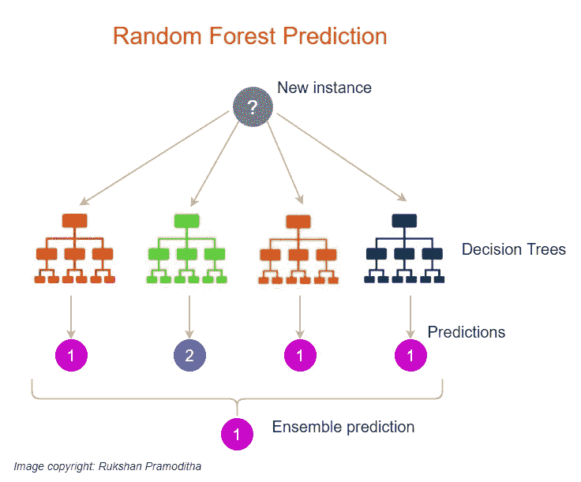
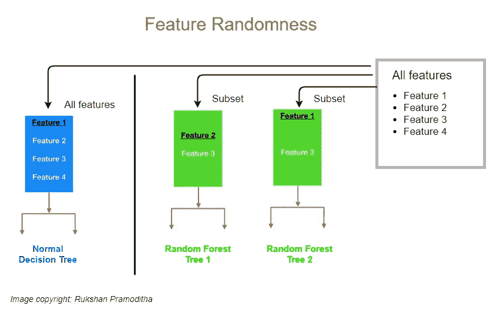
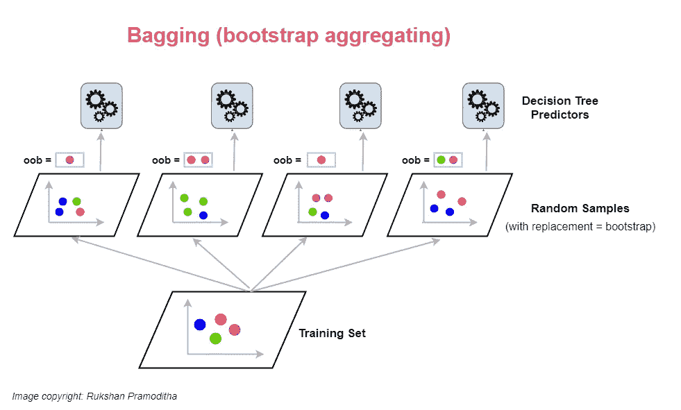
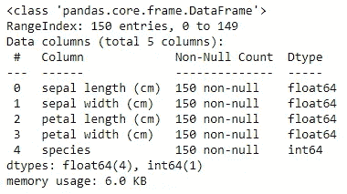
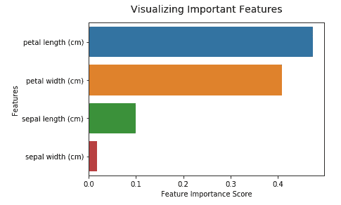

# 随机森林——决策树的集合

> 原文：<https://towardsdatascience.com/random-forests-an-ensemble-of-decision-trees-37a003084c6c?source=collection_archive---------10----------------------->

## 这就是决策树组合成随机森林的方式

菲利普·兹恩泽维奇在 [Unsplash](https://unsplash.com/?utm_source=unsplash&utm_medium=referral&utm_content=creditCopyText) 上的照片

***随机森林*** 是当今最强大的机器学习算法之一。它是一种*监督的*机器学习算法，可用于**分类**(预测离散值输出，即一个类)和**回归**(预测连续值输出)任务。在本文中，我描述了如何使用流行的 Iris 数据集将它用于分类任务。

# 随机森林的动机

首先，我们讨论决策树算法的一些缺点。这将激励你使用随机森林。

*   对训练数据的微小更改会导致树结构的显著变化。
*   它可能会有过度拟合的问题(模型非常适合训练数据，但无法对新的输入数据进行推广)，除非您调整 ***max_depth*** 的模型超参数。

因此，与其训练单个决策树，不如训练一组决策树，它们一起构成一个随机森林。

# 随机森林如何在幕后工作

随机森林背后的两个主要概念是:

*   群体的智慧——一大群人集体起来比单个专家更聪明
*   **多元化**——一组*不相关的*树

随机森林由一组单独的决策树组成。因此，该技术被称为*集成学习*。一大群*不相关的*决策树可以产生比任何单个决策树更准确和稳定的结果。

当您为分类任务训练随机森林时，您实际上训练了一组决策树。然后，您获得所有单个树的预测，并预测获得最多投票的类。尽管一些单独的树产生错误的预测，但是许多树可以产生准确的预测。作为一个群体，他们可以走向准确的预测。这就叫群众的智慧。下图显示了幕后实际发生的情况。

作者图片

为了保持单棵树之间的低相关性(高多样化)，算法会自动考虑以下事项。

*   特征随机性
*   打包(引导汇总)

## 特征随机性

在一个普通的决策树中，当它想要分割一个节点时，该算法从所有特征中的*中搜索最佳特征。相比之下，随机森林中的每棵树都从*随机特征子集*中搜索最佳特征。当在随机森林中种植树木时，这会产生额外的随机性。由于特征的随机性，随机森林中的决策树是不相关的。*

作者图片

## 打包(引导汇总)

在随机森林中，每个决策树都在训练集的不同随机样本上进行训练。当用替换完成采样时，该方法被称为**打包**(自举聚集)。在统计学中，带替换的重采样被称为*自举*。bootstrap 方法减少了决策树之间的相关性。在决策树中，对训练数据的微小更改会导致树结构的显著变化。bootstrap 方法利用这一点来生成不相关的树。我们可以用下面的简单例子来演示自举方法。同样的事情也适用于随机森林。

假设我们有一个由 10 个观察值组成的训练集，从 1 到 10 进行编号。在这些观察结果中，我们使用 bootstrap 方法进行采样。我们想考虑:

*   **样本大小** —在机器学习中，通常使用与训练集相同的样本大小。在本例中，样本量为 10。
*   **样本数量** —等于随机森林中决策树的数量。

为了创建第一个样本，我们从训练集中随机选择一个观察值。假设这是第五次观察。这个观察结果被返回到训练数据集中，我们重复这个过程，直到我们得到整个样本。在整个过程之后，想象我们用下面的观察制作第一个样本。

**样本 _1 = [5，4，6，6，5，1，3，2，10，9]**

然后我们用这个样本训练一个决策树。由于替换，一些观察值可能在样本中出现更多次。另外，请注意，有些观察值在样本中至少不会出现一次。这些观察结果被称为***【OOB】***观察结果。第一个样本的 ***oob*** 观测值为:

**oob_1 = [7，8]**

样本 1 对应的决策树在训练过程中从来看不到那些 ***oob*** 的观测值。因此，这组 ***oob*** 观察值可以用作该决策树的验证集。我们可以通过平均每个决策树的 ***oob*** 评估来评估整个集合。这被称为 ***非现金评估*** ，它是*交叉验证*的替代方案。

让我们创建另一个示例。

**Sample_2 = [5，4，4，5，5，1，3，2，10，9]**

**OOB _ 2 =【6，7，8】**

同样，我们创建的样本数量等于随机森林中决策树的数量。

作者图片

## 随机森林中的要素重要性

随机森林的另一个巨大优势是，它允许您根据在训练阶段计算的分数，了解每个特性的相对重要性。为此，he Scikit-learn**RandomForestClassifier**提供了一个名为***feature _ importances _***的属性。这将返回总和为 1 的值的数组。分数越高，特性越重要。分数是根据基尼系数计算的，基尼系数衡量的是分割的质量(基尼系数越低，分割越好)。基尼系数平均下降幅度较大的分割特征被认为更重要。

通过查看要素的重要性，您可以决定删除哪些要素，因为它们对构建模型的贡献不足。这很重要，原因如下。

*   移除最不重要的特征将增加模型的准确性。这是因为我们通过移除不必要的特征来移除噪声
*   通过删除不必要的功能，您将避免过度拟合的问题。
*   较少的功能也减少了训练时间。

理论够了！让我们动手编写一些 Python 代码，为 Iris 数据集训练一个随机森林。

# 关于虹膜数据集

Iris 数据集([此处下载](https://drive.google.com/file/d/1Q6wDxtB7ylxGhWNRvjcB3Y4K0B4E69xk/view?usp=sharing))有 150 个观察值和 4 个数字属性。目标列(物种)由每个观察的类组成。有 3 类(0-setosa，1-versicolor，2-virginica)。

虹膜数据集的前 5 行(图片由作者提供)

数据集没有缺失值，所有要素都是数值型的。这意味着数据集无需任何预处理即可使用！

虹膜数据集信息(图片由作者提供)

# 为 Iris 数据集训练随机森林分类器

运行以下代码后，您将获得 0.97 的模型准确性分数。

我们的随机森林里有 100 棵树。这是因为我们设置了 **n_estimators=100** 。因此，自举样本的数量也是 100。

# 开箱(oob)评估

在随机森林中，每个决策树都是使用观察值的自举子集来训练的。因此，每棵树都有一个单独的子集***【OOB】***观察值。我们可以使用 ***oob*** 观察值作为验证集来评估我们的随机森林的性能。

该值接近模型准确度分数 0.97。

# 可视化特征重要性

通过查看特征重要性，我们可以决定删除 ***【萼片宽度(cm)】***特征，因为它对制作模型的贡献不足。

# 最后的想法

决策树分类器和 RandomForestClassifier 等基于树的模型是分类任务中最常用的机器学习算法。如果要将模型解释为“为什么模型预测的是那种类”，最好使用普通的决策树算法，而不是随机森林。这是因为单个决策树很容易解释。但是请记住，正如我们前面讨论的，决策树算法有一些缺点。

使用随机森林算法时，请按照指定的顺序执行下列操作。

1.  首先，通过处理缺失值并将分类值转换为数值来预处理数据。
2.  然后，将数据集分为训练测试和测试测试，不要将相同的数据用于训练和测试。这样做可以让模型记住数据，而不是学习任何模式。
3.  如下所述，在 RandomForestClassifier 中设置模型超参数。永远要考虑算法的性能和训练速度之间的平衡。例如，如果您在森林中包含更多的树，则性能较高，速度较慢。
4.  然后训练您的模型并可视化特征重要性。
5.  移除不太重要的特征(如果有)，并使用所选特征重新训练模型。
6.  使用测试集测试您的模型，并获得准确性分数。

## 选择模型超参数

*   **n_estimators:** 森林中树木的数量。默认为 100。您可以使用与训练集中的观察次数相等的数字。
*   **max_depth:** 树的最大深度。默认值为无。您可以首先训练一个决策树分类器，并为 ***max_depth*** 执行超参数调整。通过交叉验证和网格搜索获得最佳值后(我已经这样做了，并获得了值 3)，可以将该值用于 RandomForestClassifier 的中的 ***max_depth*** 。
*   **bootstrap:** 默认为真。使用此默认值执行引导抽样以获得不相关的树。
*   **oob_score:** 默认为 False。如果您要执行袋外(oob)评估(交叉验证的替代方法),请将此项设置为 True。

要访问 RandomForestClassifier 的 Scikit-learn 官方文档，只需在从 sklearn . ensemble import RandomForestClassifier 导入类 ***后执行***help(RandomForestClassifier)***。***

感谢阅读！

本教程由[*Rukshan Pramoditha*](https://www.linkedin.com/in/rukshan-manorathna-700a3916b/)*，*数据科学 365 博客作者设计创作。

## 本教程中使用的技术

*   **Python** (高级编程语言)
*   **熊猫** (Python 数据分析与操纵库)
*   **matplotlib** (Python 数据可视化库)
*   **seaborn** (Python 高级数据可视化库)
*   **Scikit-learn** (Python 机器学习库)
*   **Jupyter 笔记本**(集成开发环境)

## 本教程中使用的机器学习

*   **随机森林分类器**

2020–10–29