# 随机漫步、布朗运动和随机微分方程——直觉

> 原文：<https://towardsdatascience.com/random-walk-brownian-motion-and-stochastic-differential-equations-the-intuition-3484413503e0?source=collection_archive---------8----------------------->

马库斯·温克勒在 [Unsplash](/s/photos/chance?utm_source=unsplash&utm_medium=referral&utm_content=creditCopyText) 上的照片

最近我一直在考虑将我的研究工作从常微分方程扩展到随机微分方程。最初我认为这两者不应该太不一样，但事实证明我错了。甚至使用的微积分也不一样。

在读了格雷戈里·s·奇里基安的《随机模型 [*、信息论和李群*](https://www.springer.com/gp/book/9780817648022) 这本书的几章后，我仍然无法理解其中的概念，因为毕竟我不是一个数学人。幸运的是，[麻省理工学院开放式课程](https://ocw.mit.edu/courses/sloan-school-of-management/15-070j-advanced-stochastic-processes-fall-2013/lecture-notes/)拯救了我，因为讲师 Choongbum Lee 很好地解释了用于处理 SDE 的数学背后的直觉。这篇博客文章不会是一个数学教程，而是一个从简单的随机漫步到随机微分方程的直观演练，借用麻省理工学院开放课程的见解和我自己的直觉。为了真正掌握这个主题，人们仍然需要通过推导和问题来工作，但我希望这篇文章能让人们有一个轻松的开始。

# 1.简单随机漫步

让我们从一个简单的离散时间的整数**的 1D 随机漫步开始。**

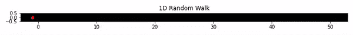

图 1:作者制作的 1D 随机漫步

让移动点在时间 *t* 的位置为 *Xt* 。由于点在离散时间内移动， *t* 只能取整数值(即 0，1，2，…)。整数行上一个点的随机游走从 *X0* = 0 开始。在迈出每一步之前，为了决定向左还是向右移动，我们抛一枚公平硬币(两边落地的概率相等)。如果它给我们正面，那么点向右移动，否则，它向左移动。

形式上，我们可以把点在 *t=k* 的位置写成:

等式。1:随机漫步中的位置

其中*易*可视为第*步到第*步之前抛硬币的结果，只能取+1 或-1 的值。我们假设所有的抛硬币都是独立的事件。

我们感兴趣的是找到点在时间 *t* 的位置。很明显，不可能精确定位圆点的确切位置，因为每一次移动都是由概率事件决定的(圆点的轨迹是不确定的)，因此使用概率分布来描述圆点在时间 *t.* 的位置更加自然

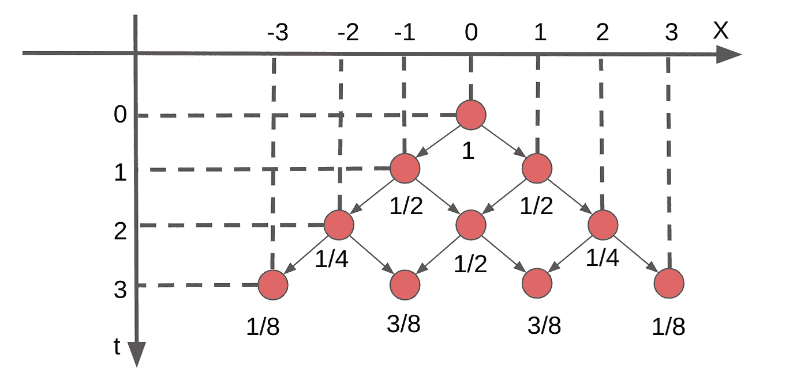

图 2:作者制作的随机漫步树

我们可以用一棵树来想象这个运动。图 2 中的树应该很容易解释，但如果不是这样，横轴是点移动的整数线，纵轴是离散时间线，每个红点下面的数字是点在特定位置和时间的概率。在 *t=* 0 点是 0，因此它的概率是 1。剩下的概率应该很容易算出来。不难看出，如果我们将每一行(每一时间步)上的概率的分母分解出来，剩下的数就形成了帕斯卡三角形，即对于 *t=* 0，我们有 1，对于 *t* =1，我们有 1，1，对于 *t* =2，我们有 1，2，1，对于 *t* =3，我们有 1，3，3，1，等等。并且由于帕斯卡三角形确定了二项式展开的系数，并且在每个时间步长上所有概率的总和是 1，所以应该直观的是，点的位置的概率分布应该在一定程度上遵循每个时间步长上的二项式分布。

数学上，对于 *t=n* ，点位于 *X=k* 的概率为:

这简化为:

等式。2:随机漫步的概率分布

其中第一个乘法项只是为了强调这样一个事实，即当 *n* 和 *k* 具有不同的*奇偶性*时，概率为零(这可以从图 2 中容易地验证。)

这实际上是二项分布的一种特殊情况，其形式为

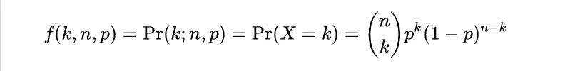

等式。3:二项式分布

在我们的例子中，p = 0.5。我们的分布与一般二项式分布之间的唯一区别是:( 1)在从 *n* 中进行选择时，我们通过使用( *n-k* )/2 来加强围绕 *k=* 0 的对称性，以及(2)通过考虑奇偶性，总概率被“标准化”为 1。我用引号表示“正常化”,因为总概率为 1 是随机漫步的自然结果，而不是人为构造的。

我对 300 个时间步长的概率分布的演变进行了可视化:

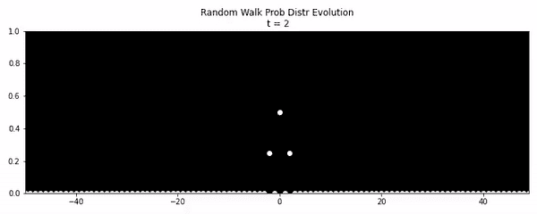

图 3:作者制作的随机游走概率分布的演变

这一切都说得通。当 *t* =0 时，分布在位置 0 处只有概率 1。随着时间的推移，概率分布越来越分散。基于可视化，有几点需要注意:

**(1)** 很明显，这个点在任何时候最可能的位置还是在中心(如果 *t* 是偶数则为 0，如果 *t* 是奇数则为 1 和-1)。结合分布对称的事实，点在任意时刻的期望位置为 0。方程描述的典型二项式分布的方差。3 是 *np(1-p)* ，如果直接应用到我们的分布中，就会得到 *n/4* 。然而，这是不正确的，因为我们的分布是在区间[ *-n，n* ]上定义的，因此它被拉伸了 2 倍。**因此它的方差是***n。*这非常重要，因为我们现在知道分布的方差等于点移动的时间。这种认识自然会引出下一个关于布朗运动的讨论。

**(2)** 这是**而不是**一种概率密度分布，因为状态空间(整数)是离散的而不是连续的。然而，这种概率分布的形状非常类似于高斯分布。我们很快就会看到，高斯分布实际上是二项式分布的“极限”。

**(3)** 如果进行点移动 *n* 步的实际实验(例如图 1 中的实验。是点移动 1000 步的位置)结果可能很难符合我们的概率分布。然而，如果相同的实验重复进行 *m* 次，其中 *m* 非常大，那么根据大数定律，点的位置的统计特性被我们的概率分布很好地捕获。

但是我仍然不认为我的解释是“直观的”，尽管有非严格的数学限制，但仍然不清楚简单的随机漫步意味着什么，所以我决定**通过更好的可视化再尝试一次**:

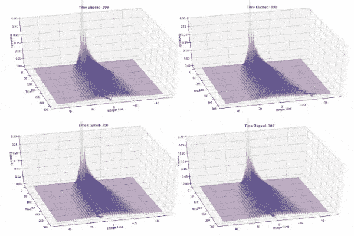

图 4:作者制作的随机漫步取样

概率分布在图 4 中显示为表面图(由于奇偶性，我没有去除 0 概率，因此表面看起来粗糙),红线是简单随机行走的轨迹。图 3 可以被认为是这些图在时间上切片的横截面，而图 1 可以被认为是只看整数线上的点而忽略其余部分。我模拟了四次，我们可以看到，概率分布总是以相同的方式随时间推移，但轨迹在所有四种情况下都是不同的。

这就是简单随机行走的酷之处，轨迹的统计属性总是及时保留，但要获得实际的轨迹，需要在每个时间步对某个位置进行采样。换句话说，当我们进行观察时，概率分布坍缩成一条单一的轨迹(我喜欢把这想象成宏观世界中[海森堡的不确定性原理](https://en.wikipedia.org/wiki/Uncertainty_principle))。随着我们观察到越来越多的轨迹，根据大数定律，这些轨迹的统计特性将收敛到真实概率分布。

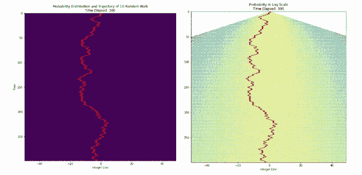

图 5:作者制作的图 4 的俯视图

如果我们从 z 轴俯视图 4，我们将看到图 5 中左侧的动画。右手边的动画绘制了概率的*对数*，这样更容易看到。所有空格的概率都是 0，很明显最大概率总是在整数行上的 0。

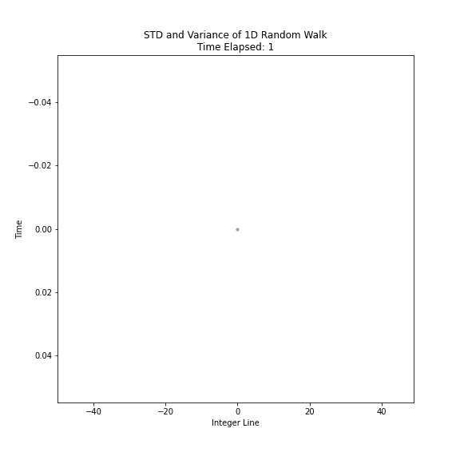

图 6:橙色线是标准差；白线是作者制作的方差

图 6 显示了另一个重要的含义。既然我们知道时间 *t* 的方差是 *t* ，那么时间 *t* 的标准差就是 *sqrt(t)* 。换句话说，我们知道轨迹不会偏离中心 1 个标准差太远，因为这个范围覆盖了大约 68.2%的可能轨迹。这在图 6 中是显而易见的，因为轨迹(红线)没有远离由标准偏差(橙线)包围的集合。这个例子展示了随机漫步模型预测能力的一个方面。

# 2.布朗运动

简单随机行走是一个**离散空间**(整数)和**离散时间**模型，而布朗运动是一个**连续空间**和**连续时间**模型，简单随机行走可以很好地激发布朗运动。我将解释空间和时间是如何从离散变为连续的，这基本上将简单的随机行走变成了布朗运动。前面描述的二项式分布 *p(k，n)* 会变成高斯分布，这个分布的时间演化会变成非常有趣的东西。

**离散空间到连续空间**

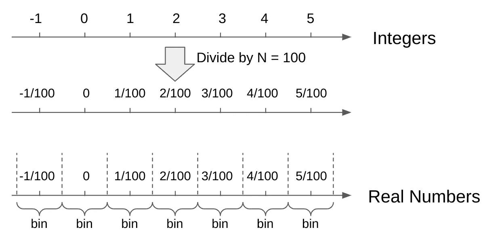

图 7。离散空间到连续空间，由作者制作

取整数行，将每个整数值 *k* 除以一个固定的数 *N.* ，然后我们将实数放入以每个 *k/N、*为中心的仓中，每个仓的宽度相等。随着 *N* 趋近于无穷大，离散概率分布 *p(k，n)* 变成了概率密度函数，任意时刻点的位置变成了连续的随机变量。换句话说，如果我们让点每次移动时都走很小的步，当它的步长接近 0 时，我们得到一个连续的概率分布(即，我们现在有一个与实数线上的所有点在合理的时间间隔内相关联的概率)。

此外，如果 *n，*点所走的总步数很大，则二项式分布可以很好地近似为均值和方差为 0 的正态分布 *n/N* 。分母 *N* 是将空间除以因子 *N* 的结果，这实质上减少了每移动一步的方差增加。这里是用*斯特林公式*的一个[证明。](https://people.bath.ac.uk/pam28/Paul_Milewski,_Professor_of_Mathematics,_University_of_Bath/Past_Teaching_files/stirling.pdf)事实上，当 *n* 接近无穷大时，正态分布是二项式分布的“极限”。在这个极限下，概率分布将被“压扁”(想象图 3 中有一个非常大的 *t* 。)密度函数将简单地变成范围[- *n* ， *n* 内的均匀分布。

**离散时间到连续时间**

如果我们使用相同的技巧，将离散时间 *n* 除以固定的数 *N* ，将离散时间步长 *n* 替换为 *t=n/N* ，随着 *N* 接近无穷大，离散时间变成连续时间。正态分布的方差简单来说就是 *t* ，它是一个实数。

现在，希望从随机漫步到布朗运动的转变是有意义的。我解释了简单的随机行走如何在空间和时间上被无限分割成布朗运动，这也是大多数教科书的做法。

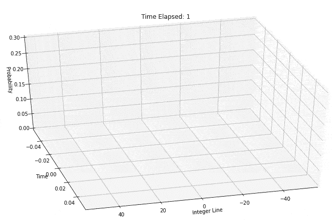

图 8:作者制作的随机行走时间表达式

然而，我也喜欢反过来想:如果我们无限放大布朗运动，我们看到的是随机行走。如果我们重新观察如图 8 所示的简单随机行走的时间进程，随着时间和空间尺度都变得非常大，人们可以很容易地将离散路径(显示为红线)想象为连续路径，因为每个增量都非常小，以至于当与整个时间和空间相比时，人们可以说在任何时间轨迹上的每个点都被定义在真实的线上。概率分布也会变得平滑。假设钟形离散分布变得平滑，这将给出高斯分布。

植物学家罗伯特·布朗于 1827 年首次描述了布朗运动。在显微镜下，他观察到浸入水中的花粉看似随机的运动。直到将近 80 年后，阿尔伯特·爱因斯坦发表了一篇论文，建立了布朗运动背后的理论。爱因斯坦将花粉描述为不断受到水分子的轰击。每一次撞击都发生在很短的时间内，并使花粉发生微小的移动。在这个意义上，花粉在分子尺度上的运动可以被认为是发生在离散时间(每次花粉被水分子击中)和离散空间(花粉每次被击中时移动一些微小的固定距离)。

版权所有远藤越修

**形式化布朗运动**

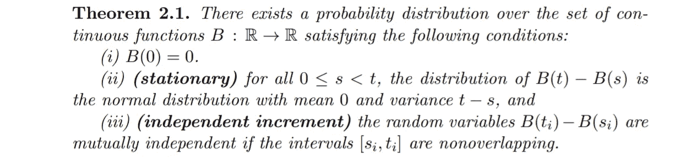

布朗运动，麻省理工学院开放式课程

定理 2.1 形式化了我们已经讨论过的关于布朗运动的内容:(I)表示点总是从 0 开始它的路径。(ii)表示给定点在时间 *s* 和 *t，0≤s < t.* 的两个位置，这两个位置之间的差的分布遵循均值和方差为 0 的正态分布 *t-s.* (iii)是不言自明的。

这个定义其实**一点都不直观**。通常“好的”函数是在确定性意义上定义的，或者可以说那些函数只定义了均值，均值由函数输入参数化，其方差假定为 0。但布朗运动有点相反:我们让均值为 0，只定义它的方差，它是随时间参数化的。因为布朗运动在时间上是连续的，所以我们可以在无限小的时间或空间片段上观察到它的行为。通过构造，这些微小的片段不是一个单一的值，而是一个概率分布。这种构造将赋予布朗运动许多有趣但怪异的事实和性质，其中许多是非常反直觉的。为此，我将向读者推荐[麻省理工学院的开放式课程](https://ocw.mit.edu/courses/mathematics/18-s096-topics-in-mathematics-with-applications-in-finance-fall-2013/lecture-notes/)。我将只列出继续讨论 SDEs 所需的几个例子。

*   布朗运动 *B(t)* 是一个定义明确的连续函数，但它**无处可微** ( [证明](http://www.math.uchicago.edu/~may/VIGRE/VIGRE2009/REUPapers/McKnight.pdf))。直觉上，这是因为布朗运动的任何样本路径都随时间变化太多，或者换句话说，对于该函数的任何无穷小的片段，其方差都不会收敛到 0。直接结果就是，我们不能在 *B(t)* 上使用经典微积分。dB(t)/dt 这样的表达式毫无意义！

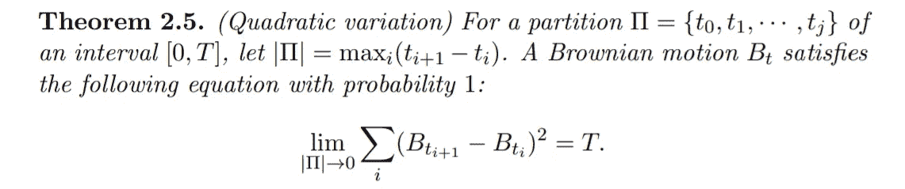

麻省理工学院开放式课程的二次变异

*   布朗运动有**二次变差**。这一点非常重要，并促成了一种称为**it——微积分**的解决方法，用于对布朗运动进行微积分运算。直观地说，这意味着给定某个时间间隔[0， *T* ，如果我们把它分成许多不重叠的段。当最大的时间段接近 0 时，对应于这些时间段的路径增量的方差的极限是 *T* 。二次变分的一个重要结果是 *(dB)* = *dt。这里有一些很好的证明。*

等式。4:微积分中的微分

等式。5:微积分中的积分

*   伊藤清发明的微积分提供了一种用布朗运动做微积分的方法。**微积分中的微分**:将布朗运动包裹在另一个可微分的函数中，可以执行稍微修改的微积分版本。它是这样工作的:给定一个可微函数 *f(x)* ，如果它把 *B(t)* 作为它的输入 *x* ，那么我们可以根据方程写出 *df* 。4，这被称为 its 的引理(据称是历史上被引用最多的引理)。对于经典微积分，我们有 *df = (∂f/∂x)dx* )，所以它的引理实际上只有一项不同。这实际上是[在泰勒级数展开](https://ocw.mit.edu/courses/mathematics/18-s096-topics-in-mathematics-with-applications-in-finance-fall-2013/lecture-notes/MIT18_S096F13_lecnote18.pdf)中保留第 2 *和第*阶项的结果，以便说明布朗运动的高方差。最后一项 *dt* 其实是来自 *(dB)。***it \u Calculus 中的积分:**关于 dB 的积分与经典微积分的不同之处在于，当写成黎曼和时，Itō integral 取每一段中最左边的值(如方程式中 Ht(i-1)所示)。5)而经典积分可以在每个区间内选择任意值。

我在这里的笔记是非常草书的，所以我强烈建议读者观看[这个讲座](https://www.youtube.com/watch?v=Z5yRMMVUC5w)来看看一些微积分的例子用法。

# 3.随机微分方程

现在有了**微积分**，我们可以解含有**布朗运动**的微分方程吗？

首先，有人可能会问这样一个微分方程看起来如何，因为表达式 *dB(t)/dt* 被禁止了。我们知道 ODEs 可能具有以下形式:

等式。6:颂歌

其中 *X* 的时间变化率由函数 *f(.,.)*。如果我们让布朗运动中的每个微小增量 *dB* 增加到沿着 *X，*的轨迹的微小变化 *dX* 上，我们可以得到:

我们可以通过将布朗运动乘以另一个函数来增加其复杂性:

等式 7。SDE

等式。7 给出了 SDEs 的形式。 *dB* 这里通常指的是高斯白噪声。使用符号 *μ* 和 *σ* 并不是没有原因的。 *μ(t，X)dt* 通常被称为*漂移项*，它可以被视为 *X* 在任意时刻的期望位置，而 *σ(t，X)dB* 通常被称为扩散项，它可以被视为 *X* 在任意时刻的位置的方差(随着时间的推移，这个项在所谓的扩散过程中展开了类似于图 3 的概率分布)。

*   如果 *μ* (。,.)始终为 0 且 *σ* (。,.)总是 1，那么 *X* 本身遵循布朗运动。
*   如果 *σ* (。,.)是 0，那么方程 7。成为方程中的颂歌。6.换句话说，没有添加布朗运动，X 只是根据其动态 *μ* 漂移，方差为 0。

ODEs 和 SDE 在很多方面都很相似，好在[SDE 也有存在唯一性](https://ocw.mit.edu/courses/mathematics/18-s096-topics-in-mathematics-with-applications-in-finance-fall-2013/lecture-notes/MIT18_S096F13_lecnote21.pdf)只要 *μ* (。,.)和 *σ* (。,.)是“好”的函数。

求解一个常微分方程意味着描述一个随时间变化的轨迹，而求解一个 SDE 意味着描述一个随时间变化的轨迹的统计特性。换句话说，前者仅求解方差始终为 0 的轨迹的期望值，而后者需要描述作为漂移结果的均值和作为扩散结果的方差。不幸的是，SDE 大多数时候没有解析解，就像(也许比)ODEs 一样。[这里有两个求解解析解的 SDE 的例子。](https://ocw.mit.edu/courses/mathematics/18-s096-topics-in-mathematics-with-applications-in-finance-fall-2013/lecture-notes/MIT18_S096F13_lecnote21.pdf)

更多的时候采用数值方法来求解随机微分方程。但是与数值求解微分方程的方式有一些主要的不同:

*   [**有限差分法**](https://en.wikipedia.org/wiki/Finite_difference_method) **:** 通过将时间离散成大小为 *h* 的小步长，将步长和 *dX* 的乘积依次加到初始条件上，可以近似得到 *X* 的轨迹。最简单的例子就是欧拉法。通过从一些初始条件近似一个轨迹，我们本质上是用 SDE 采样一个路径。
*   [**蒙特卡洛模拟**](https://en.wikipedia.org/wiki/Monte_Carlo_method) :由于 SDE 的概率性质，大多数时候只对其一条路径进行采样并不能告诉我们太多关于该系统的信息。利用蒙特卡罗模拟，我们从一些初始条件重复采样 SDE 的路径，并且根据大数定律，采样轨迹的统计特性(例如，均值和方差)将收敛到真实特性。蒙特卡罗模拟通常与有限差分法结合使用，后者模拟每次采样时的轨迹。
*   **树形图**:由于布朗运动是简单随机行走的极限。如果我们把布朗运动的时间分割成微小的片段，我们可以让这个点在每一个时间片段中以适当选择的步长做微小的随机行走。与前两种方法相比，这种方法的使用频率较低，但通常很容易通过手工操作来了解 SDE 的统计特性。

布朗运动导致许多反直觉的结果，常微分方程也是如此(例如，当混沌时，可以生成位于分形上的轨迹)。毫不奇怪，这两者的融合会产生更奇怪、更难以理解的东西。因此，更应该为这些概念建立直觉。浏览定义、引理、证明和命题是最重要的，但我个人认为直觉使它成为一个更快的过程。

附注:我仍在对一些 SDE 进行实验。如果我得到任何酷的东西，我会更新 GIFs 图片。

我的动画的所有代码可以在[我的 GitHub](https://github.com/TomJZ/RandomWalk2SDEs/blob/master/RandomWalk_to_SDEs.ipynb) 中找到。

**参考文献**

[1]麻省理工学院开放式课程。*“数学中的主题及其在金融中的应用”*[https://OCW . MIT . edu/courses/Mathematics/18-s096-Topics-in-Mathematics-with-application-in-Finance-fall-2013/index . htm](https://ocw.mit.edu/courses/mathematics/18-s096-topics-in-mathematics-with-applications-in-finance-fall-2013/index.htm)

[2]奇里基安，格雷戈里 S. *《随机模型，信息论和李群，第 1 卷》*施普林格，2009