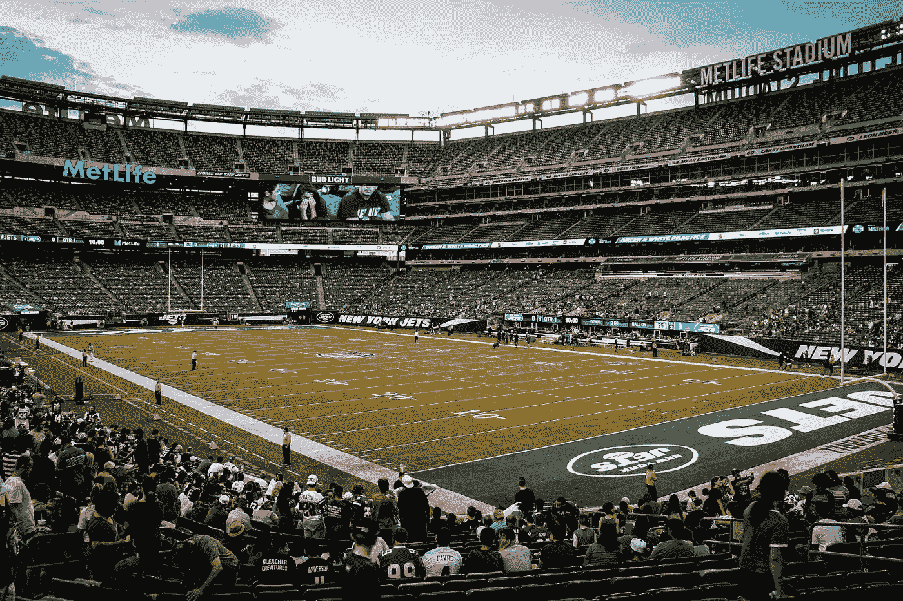
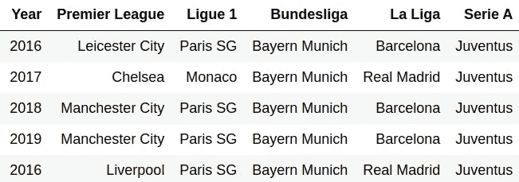
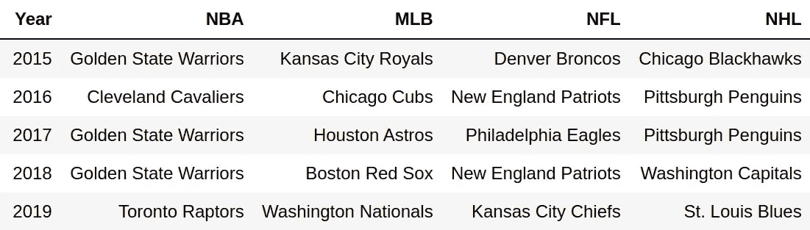

# 运动中的随机性

> 原文：<https://towardsdatascience.com/randomness-in-sport-6e60c6132838?source=collection_archive---------58----------------------->

## 为什么赢得超级碗的球队比英超多？

有些人比其他人幸运。Izaac Crayton ( [@icrayton](https://unsplash.com/@icrayton) )在 [Unsplash](https://unsplash.com/photos/ShDJMeadsfA) 上的照片

# 被诅咒的

让我们从 2012 年元旦英超联赛的 Wearside 开始。桑德兰在对阵曼城的比赛中，大部分时间都在自己的禁区外安营扎寨，抵御曼城的猛烈进攻。与对手的 11 次射门相比，他们只有 3 次射门命中目标，并且在整个 90 分钟内控球率只有可怜的 41%。他们的后卫一直在追逐影子——要不是蓝军前锋埃丁·哲科挥霍无度，他们早就消失不见了。

然而，不知何故，比分一直保持到第 93 分钟。桑德兰从一次失败的城市进攻中夺回了控球权，他们的中场突破了中线，这似乎是比赛中的第一次。在这场可能是有史以来最慢的英超联赛反击中，夏羽·塞斯格农和智东元交换了几个快速传球，韩国前锋最终绕过守门员乔·哈特射门得分。在你的比赛中进球，最终比分 1-0 桑德兰。

不要介意创造的机会或投篮的缺乏。或者说，那座城市控制了控球权，与桑德兰的一个角球相差 10 个角球。蓝军空手而归，而桑德兰全取三分。

尽管赛后回放显示嵇的进球尽管越位但仍被误判。

# 由随机性推动

开篇描述了一个被所有运动爱好者又爱又恨的概念——***随机性*** 。在体育运动中，没有什么是确定的——如果是，最好的球员和球队将赢得每一场比赛，它将很快失去作为奇观的吸引力。随机性是节目继续下去的动力。但这意味着什么呢？

简单来说，随机性是一种缺乏组织性或可预测性的状态或模式。一个例子是在一个高度危险的地区，也许是在一条有急转弯的路上，或者在一个繁忙的路口，对车祸数量进行抽样。你知道这些地区发生事故的比例比其他地区高，但是你知道下一次事故发生的确切时间吗？事故发生在每天早上 9 点 17 分，还是在钟敲 12 点的时候？谁也说不准。事故在*随机发生。*

同样，这种不可预测性导致全球数百万球迷收看并付费观看职业体育比赛。体育运动中的大多数得分事件都是随机的——NFL 触地得分是随机的。橄榄球中的尝试，或者足球和冰球中的进球也是如此。所有上述情况(以及许多其他情况)都是在比赛中发生的罕见事件，通常发生在个人技能、糟糕的决策甚至纯粹的运气之前。此外，这些随机事件在比赛中的任何时候都可能对某个球队不利或有利。

# 不间断的

尽管如此，足球中进球的随机性并不能阻止更好的球队比其他球队得分更多，赢得更多比赛。从长远来看，技术胜过运气。这就是为什么最好的球队几乎总能赢得联赛冠军——用一句流行的“足球人”的话来说，这种形式的比赛足够让运气“在一个赛季的过程中达到平衡”。基本上，如果你有世界上最多的钱和最好的球员，你更有可能在 30 场左右的比赛中积累最多的分数。

为了说明这一点，让我们来看看 2016-2020 年间欧洲五大联赛的独特联赛冠军数量:

2016-2020 年欧洲足球联赛顶级冠军。作者图片

你不需要成为火箭科学家就能推断出英超是唯一一个总共产生超过 2 个冠军的比赛(他们有 4 个)。法甲和西甲在 5 年内恰好有 2 个冠军，而德甲和意甲则完全由一支球队主宰。

现在让我们将这张表与北美体育的获胜者进行比较:

2015–2019 年北美体育冠军。作者图片

除了 NBA，所有其他运动在过去 5 年里都产生了 4 个或更多的冠军。事实上，MLB 和 NFL 有 5 个独特的赢家！

# 你觉得幸运吗，废物？

超级猫头鹰。Geronimo Giqueax([@ ggiqueaux](https://unsplash.com/@ggiqueaux))在 [Unsplash](https://unsplash.com/photos/w2WUqRvTmtg) 上的照片

那么，这是什么原因呢？足球和北美的其他运动有本质的不同吗？不太可能-我们已经建立了相似性，进球、触地得分和尝试都是随机事件。

北美体育产生更多赢家的原因之一是由于在常规赛结束后加入了季后赛的形式。除了增加比赛的刺激，季后赛本身就是随机的。当然，有时候常规赛表现最好的球员会在前几轮被淘汰，但他们要么必须在一次性比赛中击败其他球队，要么经过一系列比赛，才能进入下一轮并最终赢得比赛。

记住我们之前已经确立的事实——运气在短期内比在长期内起着更大的作用。糟糕的裁判决定，对手激发技巧的时刻，和/或错过的机会，在一场比赛中(或在季后赛中)对一支球队的伤害远远超过整个赛季。就这样，桑德兰 vs 曼城又来了！所有这些加在一起意味着“最好的”球队不一定比其他球队更容易成为冠军。

# 笔诛胜于剑伐

最后一件事——有没有想过为什么弱队在淘汰赛中对强队进行点球，让观众经历 120 分钟的无聊比赛？这又和随机性有关了。在比赛开始时，较弱的球队与较强的球队相比取得胜利的机会较小，但比赛进行得越久，比分保持不变的时间越长，点球就决定了结果。

除了在 Microsoft Excel 中创建一个随机数生成器来选择获胜者之外，点球可能是足球比赛中最接近 50/50 的决胜局。想想所有可能决定结果的随机事件——射门偏出，击中门柱，进入顶角，被守门员扑出。认为这是区分整场比赛不分胜负的两支球队的最佳方式是非常荒谬的，但在有人提出更好的想法之前，淘汰赛将继续因随机性而受到祝福和诅咒。

# 其他文章

 [## 创造机会

### 英国博彩业繁荣简史，从贝叶斯到必发

towardsdatascience.com](/making-up-the-odds-73fbc509ee7f)  [## 利物浦值得赢得英超冠军吗？

### 使用 Python、R 和预期目标的英超联赛 2019/20 回顾

towardsdatascience.com](/did-liverpool-deserve-to-win-the-premier-league-eda7a4e1b9ca)