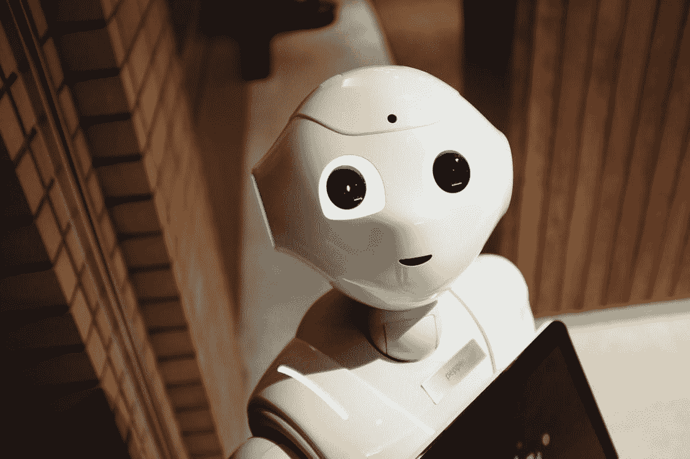
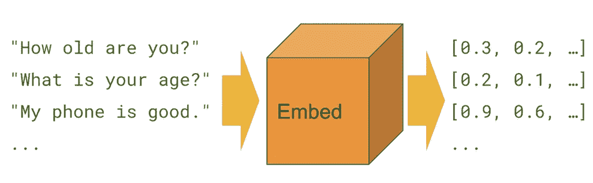
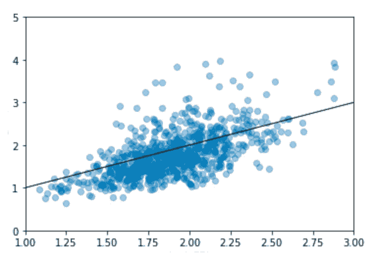

# 排列你的东西…一个 AES 的故事

> 原文：<https://towardsdatascience.com/rank-your-things-an-aes-story-1edf0e6d7ea8?source=collection_archive---------35----------------------->

## 自动论文评分(AES)是使用专门的计算机程序给在教育环境中撰写的论文打分。它的目标是将大量的文本实体分类到少量的离散类别中，对应于可能的等级。但是在这里，让我们从工业问题的角度来看。



来源:[链接](https://www.pexels.com/photo/high-angle-photo-of-robot-2599244/)

你是篮球教练。你手下有 40 个想打球的孩子。你被要求选择一个由 5 个最高的孩子组成的团队。相当简单！你让他们按照身高的降序排列，然后你选出前 5 个。

现在说你是漫画作家。不是一个真正的作家，但你是那个能决定恶棍名字的人。你手下有很多实习生，他们为你创造反派角色的描述，并为你命名反派角色。他们为你的漫画创造了数百个这样的潜在反派角色，现在你必须在他们中选择你应该为你的漫画考虑的角色。棘手的是，你可能也想根据读者的喜好来选择。

从技术上来说，你要给你的每一个潜在的坏人打分，然后**按照读者亲和力得分(或评级)的降序给他们排名**。

(忽略你如何吸引读者的细节。假设漫画**神**给了你这些。)

所以，你有你所有的反派(最终进入漫画)和他们各自的读者亲和力得分。现在你的任务是利用这些信息(不知何故，咄),对你的实习生创造的未来恶棍进行排名或评分。

在文献中，这被称为 [**自动作文评分**](https://en.wikipedia.org/wiki/Automated_essay_scoring) 或**自动文本评分**问题。

# 方法

这是一个在研究领域不断发展的领域。所以，你会找到很多解决方法。让我们专注于一个能完成工作的解决方案。

一种方法是将其视为一个预测问题，并尝试预测读者亲和力得分。但是有一个小问题，它可能无助于解决我们的问题。读者亲和力得分是针对整个漫画的，而不仅仅是针对反派。一个人喜欢剧情但讨厌反派还是可以给个好分数的。如果我们试图预测这个分数，我们将需要使用更多的信息(如漫画类别、发行月份、目标年龄组等)，而不仅仅是反派信息(如名字、描述等)。

我们还要注意一个事实，一个反派的预测分数对我们来说并没有真正的用处，因为我们的工作是从一群反派中找出最好的反派。就个人而言，分数可能没有相对考虑时那么有意义。如果我们有 100 分，我们可以很容易地知道哪个恶棍可能比其他人表现得更好。

因此，我们仍然可以继续我们的预测逻辑，但不是客观地看预测的分数，我们只需要确保它们与实际分数相关。这意味着，如果一个反面角色 *X* 的得分高于反面角色 *Y* 的得分，不管我们的预测有多好或多坏，如果实际得分也遵循相同的顺序或等级，那么它就是赢了。

# 解决方案



来源:[链接](https://tfhub.dev/google/universal-sentence-encoder/1)

直接找到一个解决方案(在许多解决方案中，就像我说的，文献资料非常丰富🔥)，我们使用两种特定类型的模型。因为对文本进行评分是一项任务，所以我们需要某种文本嵌入技术来将我们的文本表示为向量。任何文本嵌入技术都可以选择，但我选择了 [**通用句子编码器**](https://arxiv.org/abs/1803.11175) 。

```
usemodel = **hub.Module**('models/sentence_encoder')**def** get_use_vectors**(list_text)**:
'''
    Computing the USE vector representation of list of sentences
    @param  list_text  :   list of sentences
'''
    messages = list_text   
    num_batches = **math.ceil**(len(messages) / BATCH_SIZE)             message_embeddings = []
    **with** tf.Session() **as** session:
        session.**run**([tf.global_variables_initializer(),
             tf.tables_initializer()])    
        **for** batch **in** range(num_batches):
            **print**(batch * batch_size, batch * batch_size + batch_size)
            batch_msgs = messages[batch * batch_size: batch * batch_size + batch_size]

            message_embeddings_temp = session.run([model_use(batch_msgs)])      

             message_embeddings.append(message_embeddings_temp)

    all_embedding = np.concatenate(tuple(message_embeddings))
    **return** all_embedding1, all_embedding2
```

该模型用于将恶棍的名字和他们的描述转换成向量，并且我们在预测模型中使用这些向量作为特征(连同其他特征)。其他特征可以是分类特征，例如漫画的类别、作者姓名等，或者是顺序特征，例如购买数量、价格等。

这些可以是一个热编码，并附加到我们的功能列表。

预测模型是一个简单的 [**随机森林回归器**](https://scikit-learn.org/stable/modules/generated/sklearn.ensemble.RandomForestRegressor.html) 模型，直接取自 **sklearn** 教程部分。

```
**import** pickle
**from** sklearn.ensemble **import** RandomForestRegressor

params = {'n_estimators':[20, 50, 100], 'max_depth':[2, 4, 6, 8, None], 'min_samples_split': [2, 4, 6, 8],
          'n_jobs': [10]}

rf = **RandomForestRegressor**(n_estimators = 250, random_state = 42)

grid = **GridSearchCV**(rf, params)

grid.**fit**(X_train, y_train)

predictions = grid.**predict**(X_test)

errors = abs(predictions - y_test)

**print**(grid.best_score_)
**print**(grid.best_estimator_)
```

这给了我们一个模型，这个模型是根据我们过去的历史数据训练出来的，可以预测一个恶棍的名字/描述会有多好。从技术上来说，这是一个用户亲和力得分预测器。但是，正如我们所讨论的，由于我们没有使用所有可能和可用的特征来预测这个分数，并且由于我们没有将它作为用户亲密度分数预测模型，所以我们得到的最终预测将是不准确的。但是如果分数给了我们两个或更多恶棍的表现的相对指示，它将帮助我们挑选出头号恶棍。

# 衡量标准

[**科恩的 Kappa 评分**](https://en.wikipedia.org/wiki/Cohen%27s_kappa) 通常被用作一种衡量标准，以确定我们的预测排名或排序与实际排序相比有多接近。但是，该指标假设预测是诸如分数(0 到 5)之类的类别。我们有一个更连续的预测，因此这个指标对我们来说不太适用。

为此，我们可以用简单的 [**斯皮尔曼**](https://en.wikipedia.org/wiki/Spearman%27s_rank_correlation_coefficient) 和 [**皮尔森**](https://en.wikipedia.org/wiki/Pearson_correlation_coefficient) 关联式。



绘制实际分数与预测分数的对比图可以很好地说明我们的预测是否符合正确的趋势。

对应于左侧预测的相关系数为:

> 皮尔森:0.65，p 值= 2.14 e-92 | **斯皮尔曼:0.60，p 值=8.13 e-123**

因此，通过这种方法，你可以使用预测的分数来排列或排序你的恶棍，并选择顶部的 *X* ，前提是你的相关性和上面的情节看起来不错。别让实习生毁了你的漫画事业:)