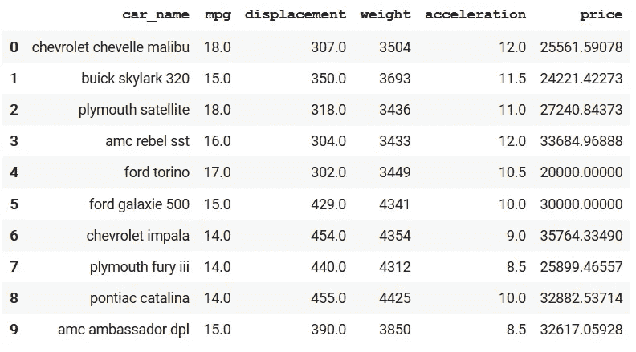
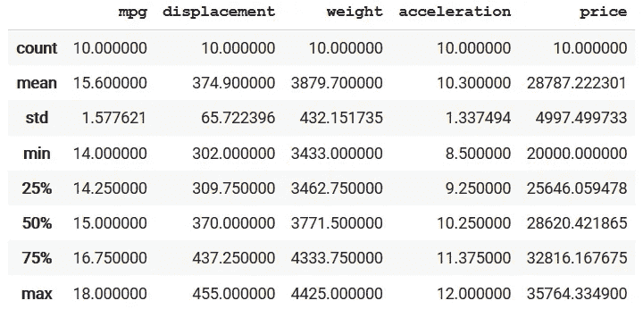
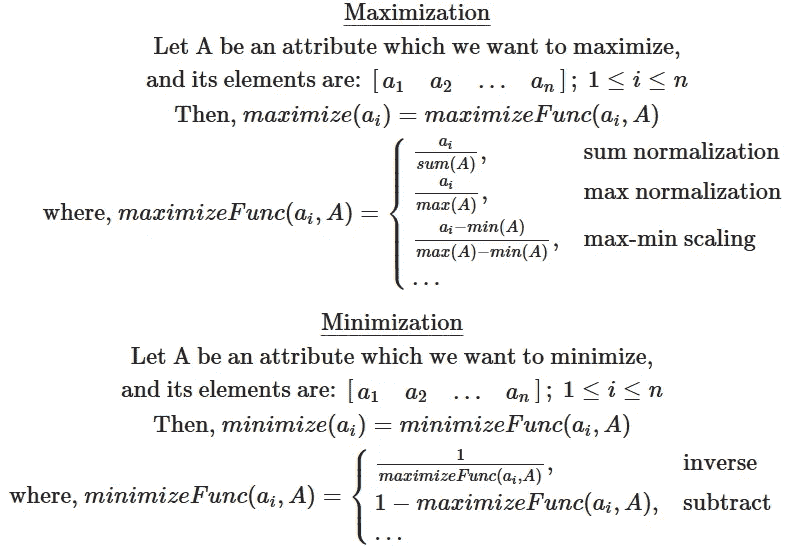
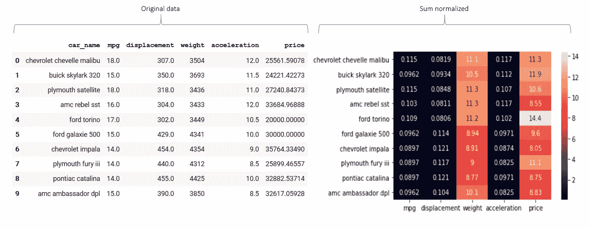
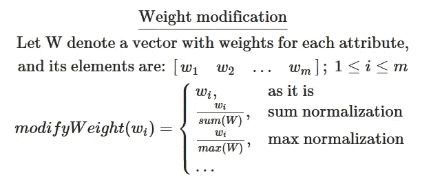
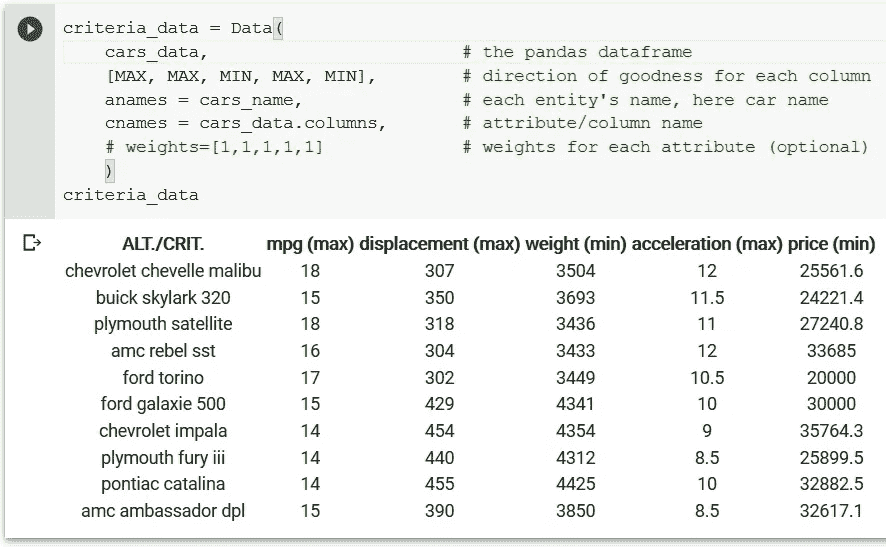
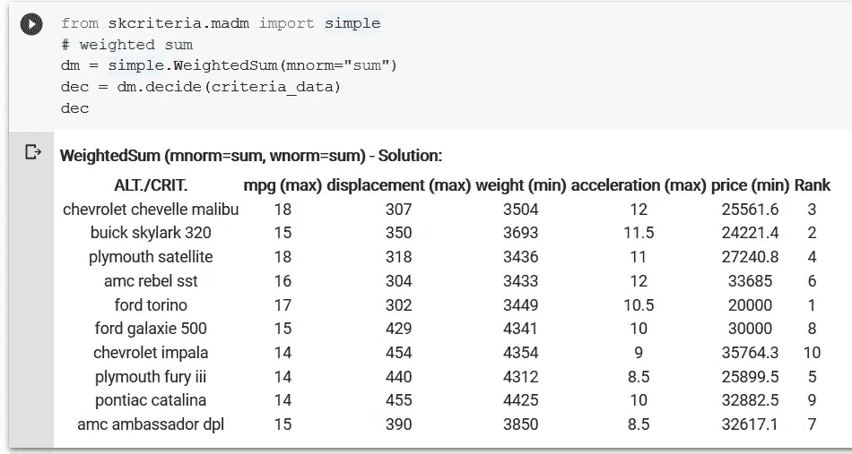
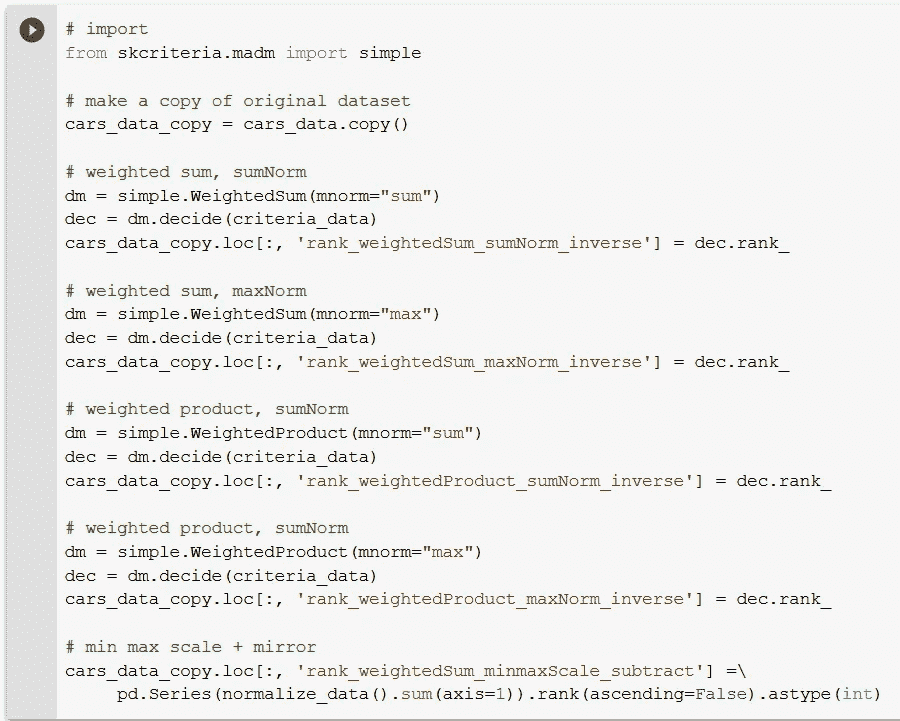
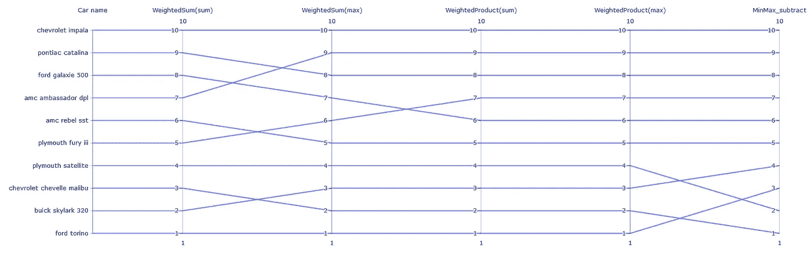
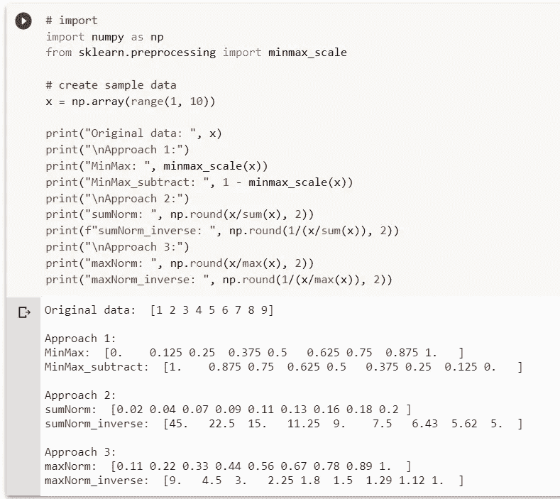

# 排名算法—了解您的多标准决策解决技术！

> 原文：<https://towardsdatascience.com/ranking-algorithms-know-your-multi-criteria-decision-solving-techniques-20949198f23e?source=collection_archive---------4----------------------->

## 让我们通过一些基本算法来解决受多个标准影响的复杂决策问题。我们将讨论为什么我们需要这样的技术，并在很酷的 skcriteria python 包中探索可用的算法

来自 Unsplash[的](https://unsplash.com/photos/qIu77BsFdds) [Joshua Golde](https://unsplash.com/@joshgmit) 的照片

> **更新-2022 年 3 月:**由于 scikit-criteria 最新版本中的代码破坏更改，建议对文中讨论的代码使用该包的 v0.2.11。这里的[是](https://github.com/imohitmayank/ranking_algorithm_intro)的代码库。

# 介绍

假设你要做一个决定——比如买一栋房子，或者一辆车，甚至一把吉他。你不想随机选择或因某人的建议而产生偏见，而是想做出明智的决定。为此，您收集了一些关于您想要购买的实体的信息(假设是一辆汽车)。因此，您有一个包含价格信息的`N` 汽车列表。像往常一样，我们不会想花更多的钱，我们可以按照价格(升序)对汽车进行排序，然后选择最上面的一辆(价格最低)，我们就大功告成了！这是一个只有一个标准的决策。但是，唉，如果生活是如此容易:)我们也希望汽车有良好的里程，更好的发动机，更快的加速度(如果你想比赛)，等等。在这里，你要选择价格最小，但里程和加速最高的车，等等。这个问题不是简单排序就能这么容易解决的。输入多准则决策算法！

# 资料组

让我们选择一个数据集，以便更容易地可视化结果，了解幕后真正发生的事情，并最终建立直觉。为此，我选择了汽车数据集。对于每辆车，我们将关注属性的子集，并且只挑选 10 行(独特的车)来使我们的生活更容易。查看选中的数据，

汽车数据集中的 10 行

解释一些属性，

*   mpg:衡量一辆汽车在油箱中加入一加仑汽油或柴油后能行驶多远的指标(里程)。
*   *排量:*发动机排量是活塞发动机所有活塞扫过的气缸容积的量度。更大的排量意味着更大的动力。
*   *加速度:一个*测量汽车从 0 加速到 1.5 公里所需时间的指标。加速度越高，赛车越适合飙车:)

这里请注意一些要点，

1.  属性的单位和分布不一样。价格以千美元玩，加速以几十秒等。

描述所选数据的每个数字列(属性)

2.每个属性的最佳逻辑也各不相同。在这里，我们想找一款 mpg、排量、加速值都很高的车。同时，低价值的重量和价格。这种高和低的概念可以分别推断为最大化和最小化属性。

3.可能有一个额外的要求，我们不认为每个属性都是平等的。比如我想要一辆赛车，说我是亿万富翁赞助的，那我就不会那么在意 mpg 和价格了。我想要尽可能最快最轻的车。但是，如果我是一名学生(因此很可能预算严格)并且经常旅行，那么突然 mpg 和价格成为最重要的属性，我对排量一点也不在乎。这些重要属性的概念可以被推断为分配给每个属性的权重。比如说，价格 30%重要，排量只有 10%等等。

清楚了需求之后，让我们试着看看如何解决这类问题。

# 通用方法

大多数基本的多准则决策求解器都有一个通用的方法，

1.  一次考虑一个属性，并尝试最大化或最小化它(根据要求)以生成优化的分数。
2.  为每个属性引入权重以获得优化的加权分数。
3.  合并(每个属性的)加权分数，以创建实体(此处为汽车)的最终分数。

在此之后，我们将需求转化为一个单一的数字属性(最终得分)，并且像前面所做的那样，我们可以对其进行排序以获得最佳汽车(这一次我们通过降序排序，因为我们希望选择一个得分最高的汽车)。让我们用例子来探究每一步。

## 最大化和最小化

记住数据集部分的第一点，属性有非常不同的单位和分布，这是我们需要处理的。一种可能的解决方案是在相同的范围内对每个属性进行标准化。而我们也希望善的方向是相似的(不考虑逻辑)。因此，在标准化之后，接近范围最大值(比如 1)的值应该意味着汽车在该属性上是好的，较低值(比如接近 0)意味着它们是坏的。我们用下面的公式来做这件事，

用于最大化和最小化属性值的规范化逻辑

看看最大化的第一个等式，一个例子是通过除以所有汽车的 mpg 之和(总和归一化)来更新每辆汽车的 mpg。我们可以通过仅仅考虑 mpg 或其他公式本身的最大值来修改逻辑。目的是，在将此应用于每个属性之后，每个属性的范围将是相同的，并且我们可以推断值接近 1 意味着好。

最小化的公式与最大化的公式几乎相同，我们只是将其反转(1 除以最大化)或镜像(从 1 中减去它)以实际反转好的方向(否则 1 意味着坏，0 意味着好)。让我们看看它在实践中是怎样的，

原始数据的总和标准化热图示例。检查“福特都灵”的“mpg”值。最初是 17，但经过求和归一化后，应该是 17/156=0.109。同样,“价格”是 20k，反算后将是 1/(20k/287872) = 14.4

## 应用权重

我们只需要将权重叠加到优化的分数上，这可以通过将权重乘以优化的分数来轻松完成。这里我们也可以引入不同类型的标准化，

*   *因为是*:直接乘以权重得到优化分数
*   *求和*:通过求和逻辑(如上所述)归一化权重，然后相乘。
*   *max* :用 max 逻辑归一化，然后相乘。

权重修改逻辑

## 合并分数

最后，我们将分数合并为一。这可以通过两种不同的逻辑来完成，

*   *求和*:将所有单项得分相加
*   *乘积*:将所有单项得分相乘。事实上，许多实现都是将数值的对数相加，而不是取乘积，这样做是为了在乘以小值时处理非常小的结果。

# 履行

有一个非常好的 python 包叫做 [skcriteria](https://scikit-criteria.readthedocs.io/en/latest/index.html) ，它为多准则决策问题提供了许多算法。实际上，`skcriteria.madm.simple`模块中有两个算法，

*   `WeightedSum`—单项得分组合逻辑为总和
*   `WeightedProduct` —个人得分组合逻辑为乘积(对数之和)

这两种方法都采用两个参数作为输入，

*   `mnorm` —定义值最大化规范化逻辑(最小化总是相同的最大化逻辑的逆)。
*   `wnorm` —定义权重标准化逻辑

为了对我们的数据进行排序，首先，我们需要通过，

将数据加载到数据对象

加载完数据后，我们需要做的就是用数据对象和参数设置调用适当的决策函数。输出中有一个额外的 rank 列，显示考虑了所有提到的标准后的最终排名。

值的和归一化的`weightedSum`逻辑示例

我们甚至可以通过`dec.e_.points`导出最终分数，通过`dec.rank_`导出排名。

# 比较

让我们在数据集上比较不同决策算法(使用不同参数)的结果。为此，我使用了`weightedSum`和`weightedProduct`实现(一次使用`max`，然后使用`sum`值规范化)。我还实现了一个`normalize_data`函数，默认情况下它执行最小最大和减去归一化。然后，我对输出进行求和合并。

5 种不同的多标准求解器

最后，我绘制了一个[平行坐标](https://datavizcatalogue.com/methods/parallel_coordinates.html)图，其中每个轴(垂直线)表示一个解算器类型，值表示该解算器的汽车等级。每条线代表一辆车，从左到右，它显示了旅程——当你在不同的解算器之间切换时，一辆车的等级如何变化。

当我们切换决策求解器时汽车的旅程

有些点，

*   福特都灵在 4/5 的解决者中排名第一(得分最高的汽车)。明麦克斯青睐雪佛兰迈锐宝。
*   黑斑羚是普遍的低级动物:(
*   `weightedProduct`的两个实现都给所有汽车相同的排名。这里没什么有趣的。
*   两个`weightedSum`实现的排名差异很大。
*   MinMax 给出了前 4 名男生最多样化的排名。

当改变归一化(从 sum 到 max)时，结果变化背后的主要原因是由于对原始数据进行的转换。这种转换改变了数据的范围(如缩放`x`和`y`之间的所有内容)，并且在相反的情况下也修改了线性度(例如，原始数据中 1 的相等步长在转换后的数据中不一致)。这将通过以下结果变得更加清楚，

不同的标准化方法和转换后的数据

这里，输入数据由数字 1 至 9 组成(注意，任何两个连续数字之间的差值为 1，即步骤相同)。方法一(最小最大)在 0 和 1 之间转换数据，步长不变。现在看看方法 2 和 3 的最小化逻辑(`_inverse`)。这里，在开始处(低原始值),步长几乎是最后一个元素的一半，但是在接近结束处(高原始值),步长非常小，即使在原始数据中，我们以相同的步长 1 移动。

因此，在最小化的情况下,“好”车(低值)甚至是少量杂质(当最小化时，高值=低分)会得到很高的分数，导致分数急剧下降。就好像我们很挑剔，要么你是最好的，要么你拿一半的分数:)另一方面，对于更高的数值，小杂质无所谓。如果这辆车的这个属性已经很差了，那么我们就不在乎它的值是 7 还是 8 还是 9，分数的减少也少得多！我们可以利用这种理解，根据我们的需要选择带有正确参数的正确决策求解器。

# 结论

这篇文章只是触及了多标准决策领域的表面。甚至在`skcriteria`包中还有更多像 TOPSIS 和 MOORA 这样的算法，它们有完全不同的直觉来解决这些问题。但即便如此，善良的概念和处理个体属性最终将它们结合在一起的想法仍在许多书中使用。所以也许我们会在另一篇文章中探讨更多的算法。

但是这篇文章的主要收获应该是理解决策者的原因和目的。每个这样的决定都可以被多种标准所操纵。我们可能对每一个标准都有不同的善和重要性的概念。最后，我们有不同种类的解算器，可以通过逻辑和参数的排列来构建，几乎所有的解算器都会根据我们的需要给出不同的有趣的结果！

# 参考

[1] [Skcriteria python 包](https://scikit-criteria.readthedocs.io/en/latest/index.html)

本文的代码和数据可在此处[获得。](https://github.com/imohitmayank/ranking_algorithm_intro)

要阅读更多这样的文章，请在 [LinkedIn](https://www.linkedin.com/in/imohitmayank) 上关注我或访问我的[网站](http://mohitmayank.com)。

干杯。