# 使用 Power BI 对类别进行排名

> 原文：<https://towardsdatascience.com/ranking-categories-with-power-bi-846fbe88ced0?source=collection_archive---------5----------------------->

## 如何使用 MS Power BI 可视化前 n 个类别和其他类别

我最近开始更频繁地使用 Power BI，并且我已经从这个工具中学到了很多东西。

我原以为从一个更加面向代码的角度出发会让我更容易处理像 Power BI 这样的工具，但是无论如何，改变总是令人不舒服的。


[插图](https://pixabay.com/illustrations/brain-heart-balance-emotion-3017071/)来自[达米安尼奥莱](https://pixabay.com/users/DamianNiolet-7379422/)

如果你习惯于面向业务的解决方案，那么学习如何编码以及必须对你的可视化的几乎每个方面负责将是一件痛苦的事情。如果您来自代码领域，您将不得不习惯新工具的局限性，不得不适应最初的想法，并创建变通方法。

在本文中，我将分享我最近面临的一个挑战，以及我找到的表示分组和排序数据的解决方案。

如果你是 Power BI 的新手，我希望你能从我这里学到一些东西，如果你是这个工具的专家，也许你可以嘲笑我的错误，并为我的下一个项目提供一些指导。

## 请求

最初的任务听起来很简单。客户希望按类别查看计数。


问题是，他们有太多的类别，他们只想看到 n 个类，所有其他的值都归在一个类别中。

## 计算排名

对于这个例子，我将使用来自 Kaggle 的 [Chipotle 位置数据集](https://www.kaggle.com/jeffreybraun/chipotle-locations)。由于它与我处理的数据集有相似的字段，我想我可以用它来说明我所面临的问题。

加载数据集后，我做的第一件事是获取计数，我将使用位置作为我们想要可视化的类别。

```
Count = COUNT(chipotle_stores[location])
```

用我的领域和措施，我得到了类似的东西。

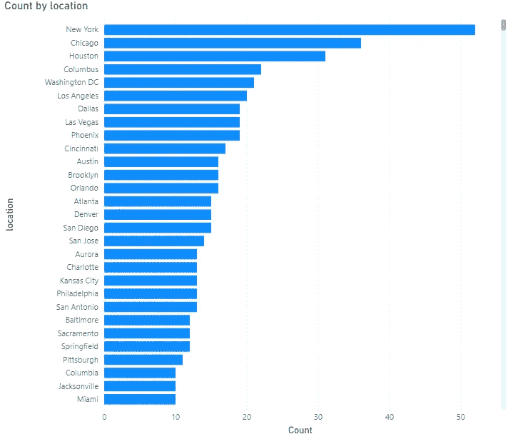

因此，太多的类别在我们的数据集中只有一个外观。

接下来，我添加了一个对值进行排序的度量。

```
rank = RANKX(ALLSELECTED(chipotle_stores[location]),[Count],,DESC)
```

然后，我将新的度量作为工具提示添加到图表中，并能够控制使用过滤器显示多少类别。

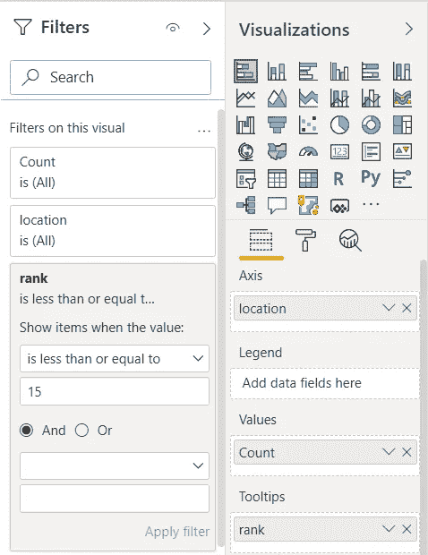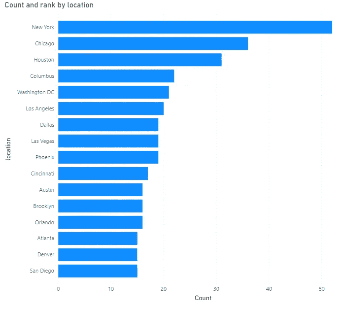

太好了，我们可以可视化排名值，并在我们的 viz 中选择我们想要的前 n 个类别。

剩下要做的就是找出一种方法，将列表之外的所有内容进行分组，并显示为另一个条形。

## 情况

一旦我们有了排名的计算，我们可以添加一个条件。

所以我创建了下面的方法，想法是如果等级低于 n，它应该返回各自的名称，否则它应该带标题“其他类别”

```
top_n_others =var ranked = RANKX(ALLSELECTED(chipotle_stores[location]),[Count],,DESC)return if(ranked <= 10, SELECTEDVALUE(chipotle_stores[location]), "Other Categories")
```

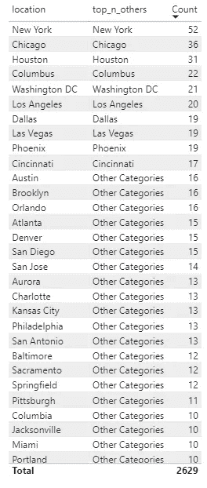

厉害！问题是。

我们不能用度量作为条形图的轴——所以，是的——那是一种浪费。

如果我们使用计算列而不是度量值会怎么样？

那是我的下一次尝试。我创建了一个维度来保存该位置的不同值，并应用了与之前相同的计算。

```
top_n_others =var ranked = RANKX(ALL(location[location]),[Count],,DESC)return if(ranked <= 10, location[location], "Other Categories")
```

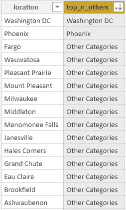

它起作用了，我们可以把它用在条形图上。

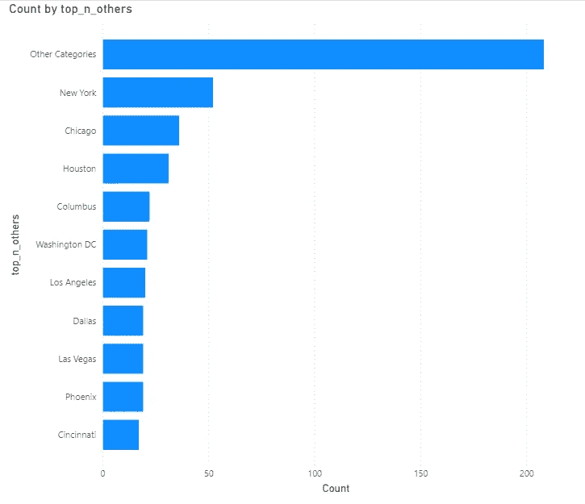

太好了，还有一件事。

我不得不添加更多的过滤器到我的可视化中；让我们看看当我们挑选一些州来测试它时会发生什么。

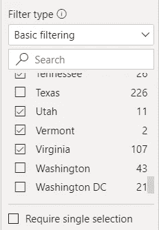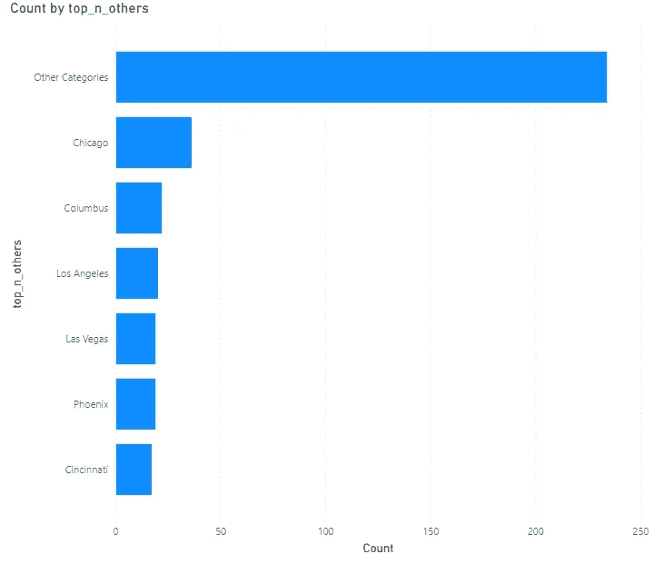

它不起作用。如果我们用过滤器移除一个状态，该状态中的顶部位置将会消失并且不会被替换。

这里发生的情况是，计算不再是动态的，因为我们直接以列的形式计算排名，所以结果对于整个列表是静态的。

## 无关表

好吧，我们需要重新考虑解决方案。

让我们尝试调整位置维度，这一次，我们将构建一个表，不仅保存位置的不同值，还保存“其他类别”的一行。

```
Unrelated location =
UNION(
    VALUES('chipotle_stores'[location]),
    ROW("location","Other Categories"))
```

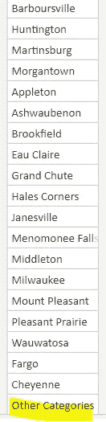

现在让我们创建一个参数，这样我们就能够选择动态显示的类别数量。

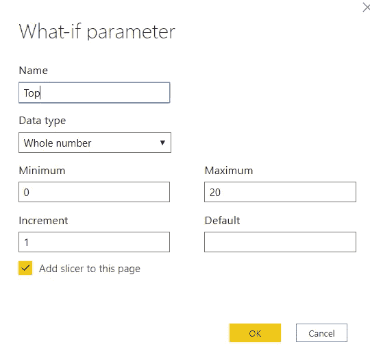

我们参数的度量应该是这样的。

```
Top Value = SELECTEDVALUE('Top'[Top], 1)
```

最后，我们将创建一个对类别进行排名和分组的方法。

```
topn_others =var n = CALCULATETABLE(TOPN([Top Value],VALUES(chipotle_stores[location]),CALCULATE( [Count] )))var other = ROW("location", "Other Categories")var other_val = CALCULATE([Count], EXCEPT(VALUES(chipotle_stores[location]),n))var myUnion = UNION(n,other)returnSUMX( INTERSECT('Unrelated location',myUnion),
      var currentIterator = 'Unrelated location'[location]
      return 
        IF('Unrelated location'[location] <> "Other Categories",
        CALCULATE([Count], 
        chipotle_stores[location] = currentIterator)
      ,other_val)
)
```

好吧，那上面的魔法会让我们的图表活起来。

这个想法是有一个“不相关”的表，它将使用主表中的值来填充它自己并计算它的度量。但是在其他表中没有创建实际的关系。

我发现并改编了这个解决方案，从 [Power BI 社区](https://community.powerbi.com/t5/Desktop/Top-N-and-others-at-the-same-time/td-p/493040)、【大喊】到 [TomMartens](https://community.powerbi.com/t5/user/viewprofilepage/user-id/31) 来解决这个问题。

现在让我们看看它在图表中的样子。

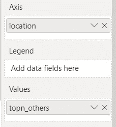

条形图

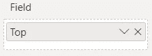

斯莱伊萨

我们将使用“无关位置”作为轴，“topn_values”作为值，然后我们可以为刚刚构建的参数创建一个切片器。

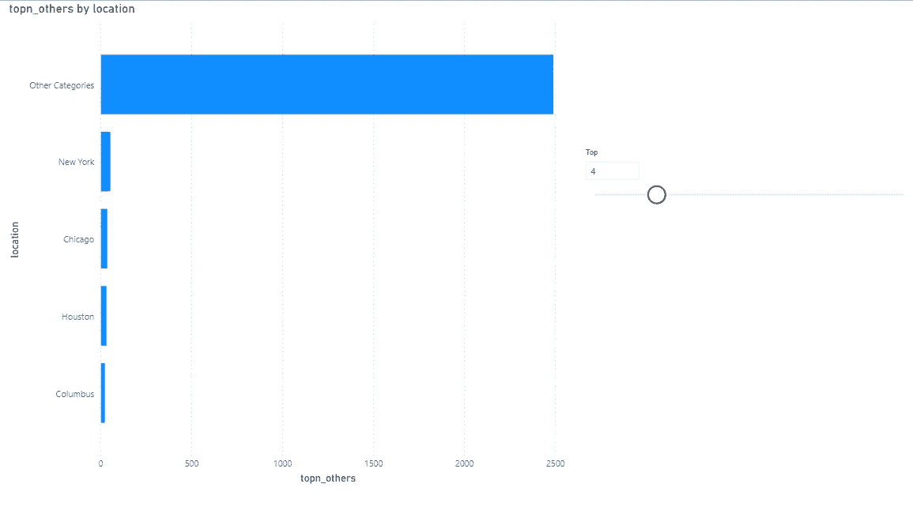

哒哒！我们有图表。

现在，我们可以更改标题、x 和 y 标签，为“其他”赋予不同的颜色，并修正我们的情节的所有细节。

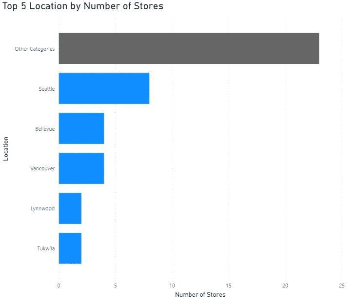

华盛顿州排名前五的位置

## 探索其他解决方案

很酷，在一些工具中可能很容易解决的问题在其他工具中可能很有挑战性。

当然，这个问题有很多解决方案，这只是其中之一。

最后，这将取决于你如何带来数据，你的模型是如何设计的，你能在多大程度上转换它，以及你在哪里这样做更舒服。

一位朋友发给我的另一个解决方案也是从创建一个包含所有类别的表格和一个包含其他类别的行开始的。

```
mylocation =UNION(VALUES('chipotle_stores'[location]),ROW("location","Other Categories"))
```

这种方法的不同之处在于创建了一个关系。

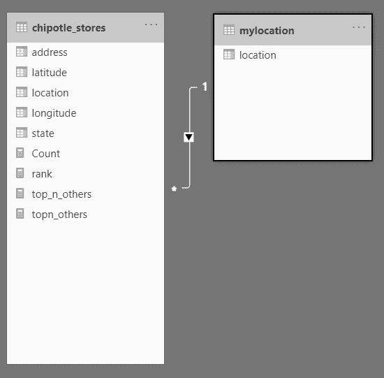

我们还需要一个衡量排名的标准，就像这样。

```
rank = RANKX(ALL(chipotle_stores[location]),[Count],,DESC)
```

以及用于计算顶级类别和其他类别的度量。

```
top with others =IF( [rank] <= 10,[Count],IF( SELECTEDVALUE(mylocation[location]) = "Others",SUMX( FILTER( ALL(mylocation[location]), [rank] > 10), [Count])))
```

## 结论

尽管这可能需要大量的工作，但是对类别进行分组可以让我们使用许多可视化工具，而这些工具在早期会有太多的干扰，在很多情况下是值得的。

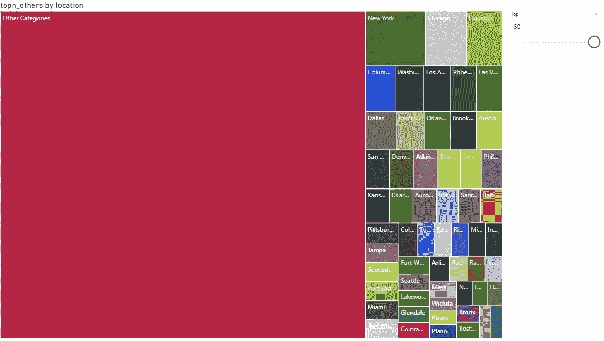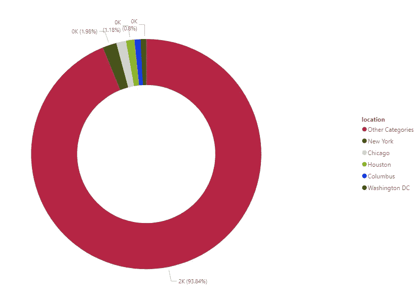

感谢阅读我的文章。我希望你喜欢它。