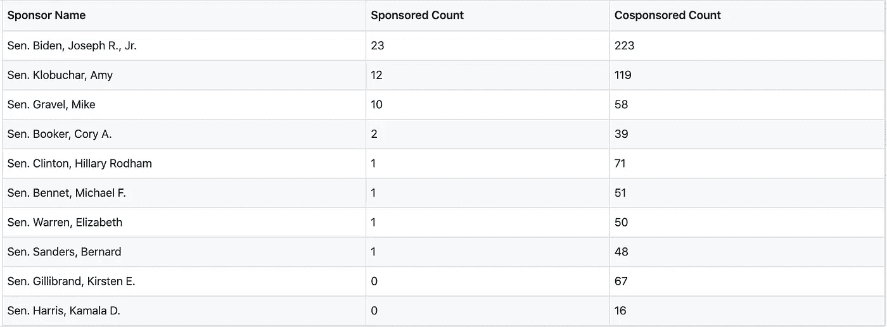
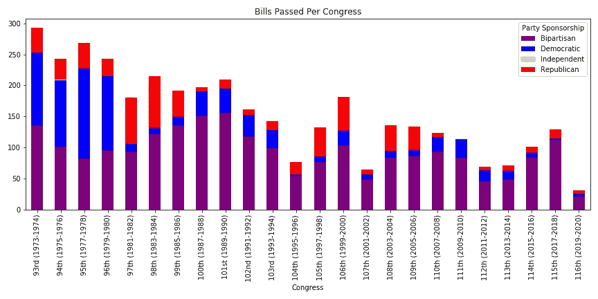
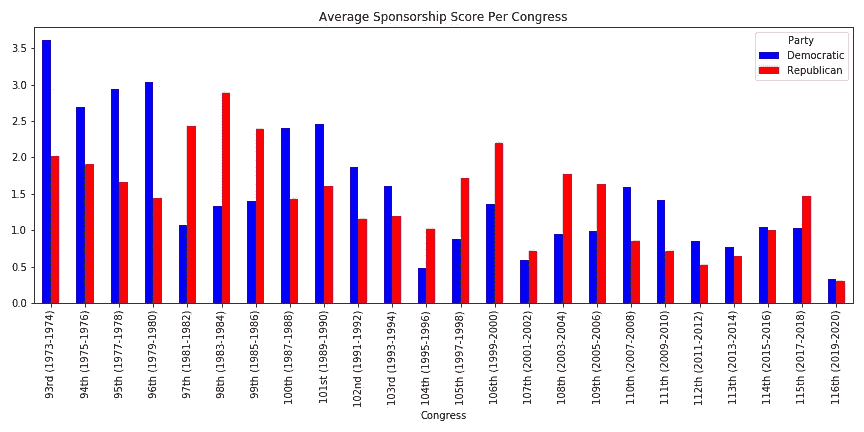

# 根据法案通过的有效性对总统候选人进行排名

> 原文：<https://towardsdatascience.com/ranking-presidential-candidates-by-effectiveness-at-getting-bills-enacted-54d306ba6014?source=collection_archive---------7----------------------->

我根据 1973 年以来所有参议员对最终成为法律的法案的支持程度对他们进行了排名，并根据历史时代的差异进行了调整。艾米·克洛布查尔在目前的总统候选人中排名最高，在 397 名参议员中排名第 60。伊丽莎白·沃伦排名第 216 位。尽管提出了最多的法案，乔·拜登在任期调整后排名第 222 位。伯尼·桑德斯排名第 351 位，对已颁布的法律影响相对较小。

## 原始数据

要量化各候选人对立法的影响，显而易见的是从他们发起或共同发起的法案的原始计数开始。为此，我调出了自 1973 年第 93 届国会开始以来参议院提出的所有 4321 项法案(这些法案都可以在 congress.gov 获得)。虽然有些法案总是比其他法案更有影响力，但我想把重点放在至少有点重要的法案上。因此，我排除了国会最喜欢的琐碎法案；以某人的名字命名某物的人。事实证明，基本上每个参议员和众议员都发起了一项法案，将[命名为邮局](https://www.congress.gov/bill/116th-congress/house-bill/3314?s=2&r=11)、[命名为联邦大楼](https://www.congress.gov/bill/116th-congress/house-bill/718?q=%7B%22search%22%3A%5B%22designate+federal+building%22%5D%7D&s=3&r=1)、[命名为一段高速公路](https://www.congress.gov/bill/114th-congress/house-bill/2559?q=%7B%22search%22%3A%5B%22designate+highway%22%5D%7D&s=5&r=36)等等。除去这些账单，我们还剩下 3722 张账单。

在这个集合中，我们可以统计出哪些候选人发起或共同发起的最多(包括以前的候选人以供比较)

乔·拜登的赞助和共同赞助远远多于其他人，而卡玛拉·哈里斯的赞助和共同赞助最少；这并不令人惊讶；乔·拜登在参议院呆了 36 年，而卡玛拉·哈里斯刚刚进入第四个任期。即使没有这种巨大的时间差异，比较其他人仍然很难。例如，科里·布克提出了两项法案，而希拉里只提出了一项，但她共同提出的法案几乎是他的两倍。我们需要一种方法来权衡这些因素。

## 赞助与联合赞助

虽然一项法案的提案人在通过该法案的过程中发挥了很大的作用，但每个共同提案人对该过程的重要性却不太清楚。一项法案由参议院的大多数人发起是很常见的，这表明任何特定的共同发起者的贡献都是最小的。例如， [Pallone-Thune 电话 Robocall 滥用刑事执法和威慑法案](https://www.congress.gov/bill/116th-congress/senate-bill/151?s=2&r=29)是由 84 名参议员联合发起的，此外还有其发起人 John Thune 每个参议员都希望能够在阻止机器人电话方面获得一些荣誉。另一方面，有很多法案都有一小群集中的联署人，每个人都可能为法案的起草和通过做出贡献。

为了想出一个分配积分的启发式方法，我做了以下工作:

*   当只有一个赞助者而没有共同赞助者时，赞助者获得整个法案的信用。
*   当至少有一个共同发起人时，发起人获得一半的信用，剩余的信用在所有共同发起人之间平均分配。

因此，举例来说，在只有一个共同发起人的情况下，他们和发起人将各自获得 1/2 的赞助法案的信用。在上面的例子中，虽然有 84 个共同发起人，但每个共同发起人只得到 1/168 的赞助法案的信用，而约翰·图恩仍然得到 1/2 的赞助法案的信用。将所有法案中对每位参议员的总积分相加，将得到每位参议员的加权赞助分数。

虽然这并不严格，可能会低估一些重要的共同赞助者，而高估小团队中的其他人，但感觉大致合适。

## 时代很重要

为了恰当地比较卡玛拉·哈里斯和乔·拜登，我们需要做的不仅仅是调整他们在参议院的年数。我们还需要调整他们在参议院的具体年份。

为了了解这一点有多重要，我绘制了每次国会期间成为法律的法案数量，并根据提案人所属的政党进一步细分，如果提案至少由另一个政党的一名成员共同提案，则标记为两党共同提案:

从中可以看出几件事:

*   一些国会比其他国会通过更多的法案。
*   在过去的 20-25 年中，国会通过的法案比之前少了很多，这是一个很大的趋势。
*   尽管总是有大量的法案得到两党的支持，但国会之间通过党派立法的能力却大相径庭。例如，在 2005—2006 年的第 109 届国会中，当共和党控制了众议院和国会时，几乎没有任何立法是仅由民主党参议员提出的，也有一些是仅由共和党人提出的。在 2007 年至 2009 年的第 110 届国会中，在民主党翻转两院后，这一趋势发生了转变。

虽然乔·拜登发起和共同发起了许多成为法律的法案，但他也是在一个更为规范的时代这样做的。具体来说，从 1973 年到 1980 年，他参加的前四次国会都通过了比此后任何一次国会都多的法案，对民主党人来说尤其有成效。相比之下，卡玛拉·哈里斯参加的最近两次国会对一名民主党参议员来说并不是很有收获。

为了调整我们对每个参议员的期望，我计算了我上面描述的每个政党和国会所有参议员的加权支持得分的平均值。结果如下:

正如你所看到的，国会的赞助效率差异很大。例如，从第 109 届国会到第 110 届国会，共和党的平均赞助分数减半，而民主党的平均赞助分数翻倍。

这允许我们计算一个基线来比较每个参议员的赞助分数:我们将他们所在的政党在他们参加的所有国会中的平均赞助分数相加。

## 最终排名

做了以上所有的事情，我已经生成了候选人的最终排名。我已经计算了上面描述的加权赞助分数，然后计算了他们的分数与他们所参加的大会的预期分数之比。此外，我还提供了他们在我的数据集中包含的 397 名参议员中的排名。

*   正如已经叙述的那样，艾米·克洛布查尔作为参议员脱颖而出，她最有成效地使法案通过成为法律；在我们的数据库中，她在所有参议员中排名第 60 位，在现任参议员中排名第 16 位，在获得法案方面的生产率是平均水平的 1.4 倍。
*   乔·拜登和伊丽莎白·沃伦在调整了各自的任期后，被评为中等或中等以下的参议员。正如我们所预期的那样，他们两个都是 3/4 的富有成效的立法提案者。
*   卡玛拉·哈里斯排名最低，排在第 352 位，即使在一个对民主党参议员期望很低的时代也是如此
*   不过，伯尼·桑德斯在立法方面仅领先她一位，在 397 个国家中排名第 351 位，其生产率只有我们对民主党人预期的十分之三。诚然，他不是民主党人，但他与他们一起参加党团会议，目前正在争取他们的提名，所以这似乎是一个公平的比较。

这个数据集对于不竞选总统的参议员来说也很有趣。无论是[现任参议员](https://github.com/ajmaurer/senate_effectivness/blob/master/current_senator_scores.csv)还是[所有参议员，过去的和现在的](https://github.com/ajmaurer/senate_effectivness/blob/master/all_senator_scores.csv)都被计算在内。一些突出的例子:

*   Kyrsten Sinema [D-AZ]在活跃的参议员中排名第一，仅从当前非常低效的国会获得的支持得分为 1.09。鉴于她在国会的时间，她获得的赞助分数是人们预期的 3.3 倍。
*   Ben Sasse [R-NE]不仅仅是目前效率最低的参议员，基本上也是我们数据集中效率最低的。他在 397 人中排名第 393 位，赞助得分为 0.06，是我们预期的 1/50。他“超过”的 4 位历史上的参议员都是临时任命的，任期只有几个月。
*   帕特里克·莱希(D-VT)在参议院的 45 年中一直卓有成效，他的支持得分为 61.2，是我们预期的 1.9 倍，以此衡量，他在活跃的参议员中排名第八，在总产量中排名第一。
*   最近退休的奥林·哈奇(R-UT)在他 42 年的参议员生涯中获得了最高的赞助分数，高达 83.5 分，是我们预期的 2.7 倍，在我们的名单中排名第七。
*   兰德·保罗[R-KY]在通过法律方面效率很低，获得了 0.4 的赞助分数，是我们预期的十分之一，在我们名单上的 397 个国家中排名第 382 位。
*   令人惊讶的是，马尔科·卢比奥[R-FL]是第十位最活跃的参议员，他的支持得分为 6.7，是我们预期的 1.7 倍。

## 进一步的工作

这一分析忽略了对已颁布立法的一种重要影响，即修正案。即使一名参议员不支持一项已颁布的法案，如果他们提出并通过了对该法案的修正案，他们肯定会对最终结果做出贡献。尤其是伯尼[对修正案](https://www.politifact.com/factchecks/2016/mar/24/bernie-sanders/bernie-sanders-was-roll-call-amendment-king-1995-2/)相对积极，因此这一遗漏可能低估了他的贡献。

另一个感兴趣的领域是将更多的细微差别融入到每条法律的重要性中。虽然很难对 3722 项法案进行系统化的分析，但是很容易就能看出某个特定的参议员发起了什么，例如，[这些由艾米·克洛布查尔](https://www.congress.gov/search?searchResultViewType=expanded&KWICView=false&q=%7B%22source%22%3A%22legislation%22%2C%22senate-sponsor%22%3A%22Klobuchar%2C+Amy+%5BD-MN%5D%22%2C%22bill-status%22%3A%22law%22%7D)发起的法案。

## 笔记

*   你可以在我的 [GitHub 库](https://github.com/ajmaurer/senate_effectivness/blob/master/candidate_sponsors.csv)中看到我的代码和数据。
*   我通过剔除标题中带有“指定”一词的法案来排除指名法案。这些账单非常公式化，所以这个简单的规则似乎奏效了，但是很有可能我漏掉了一些和/或过滤掉了一些我不应该有的账单。
*   为了设定一个底线，我指派了独立的参议员到他们参加党团会议的政党。因此，举例来说，伯尼·桑德斯被包括在民主党内，就像乔·利伯曼作为无党派人士时一样。我没有支持的一位参议员是迪安·巴克利，他是在保罗·威尔斯通死后由杰西·文图拉任命的，因为他似乎没有和任何一个主要政党进行过党团会议。
*   我对改变党派的参议员并不十分小心；他们大多被视为他们所属的最后一个政党的成员(或在无党派人士的情况下被分配到该政党)。总的来说，这种情况很少，但是从共和党转投民主党的[阿尔伦·斯佩克特](https://en.wikipedia.org/wiki/Arlen_Specter)和从共和党转投民主党的[吉姆·杰福兹](https://en.wikipedia.org/wiki/Jim_Jeffords)这两个独立党团会议成员是处理最不恰当的。