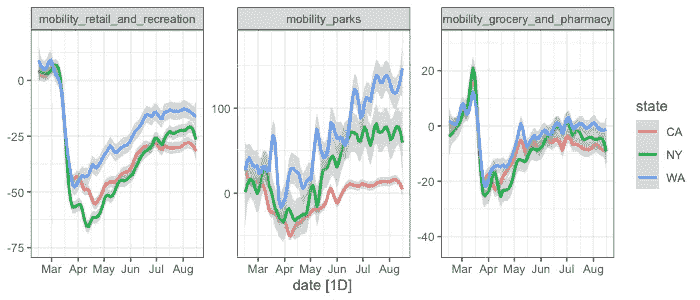
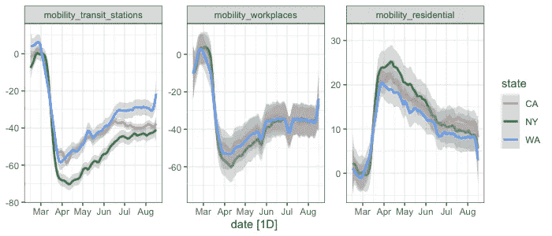
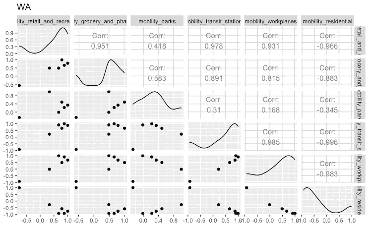
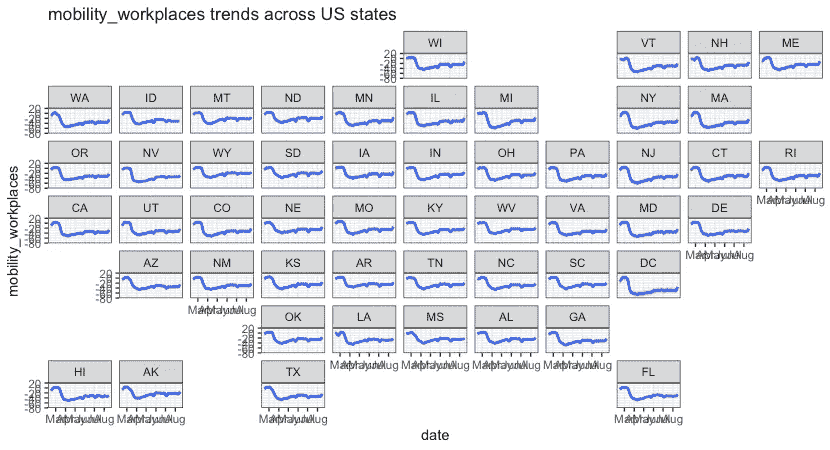
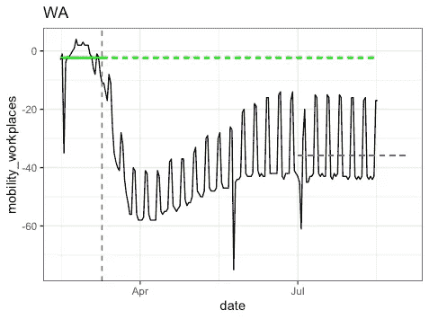
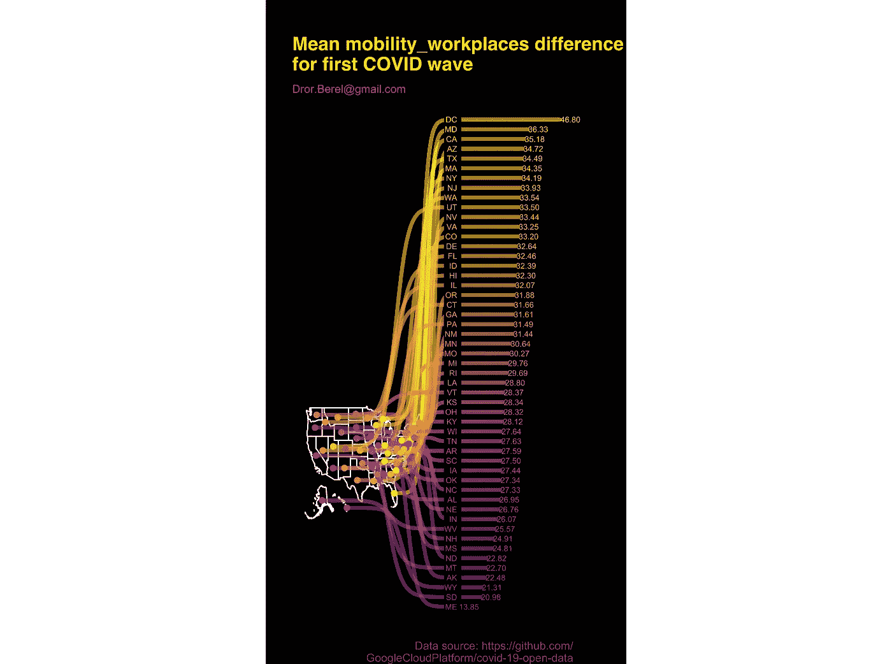

# 使用谷歌移动数据，新冠肺炎第一波后美国各州排名恢复

> 原文：<https://towardsdatascience.com/ranking-recovery-of-us-states-after-covid-19-first-wave-using-google-mobility-data-fec9df6f1864?source=collection_archive---------50----------------------->

## *可视化*移动数据趋势*萨克斯形状图*

有传言说，新冠肺炎是一个展示你的数据科学/分析技能的好机会，你不必成为流行病学家，就可以与世界分享你的 2 美分。嗯…这是我的尝试。

从 2020 年 2 月 15 日开始，谷歌分享了新冠肺炎第一波之前、期间和之后世界各地日常流动性的公共数据集。我的版本有 6 种类型的移动性测量:

> 移动零售和娱乐
> 
> 流动杂货店和药房
> 
> 移动公园
> 
> 移动中转站
> 
> 移动工作场所
> 
> 移动住宅

在这篇文章中，我关注的是美国 51 个州的整体水平分析。但是，数据源还包含州内几个地区以及其他国家/地区的信息。

**分析目标**:对流动性趋势第一次下降之间的状态恢复进行衡量和排序，直至恢复正常阶段(分析时)。

**免责声明**:以下分析的目的是演示数据可视化技术，分析推理，大部分是满足自己的好奇心。出于关注高层次洞察力的目的，可能已经采用了一些特定的快速启发式(假设)。当然，有多种可能的偏差可以更好地解释这些数据，这将在最后讨论。

**数据**:我真的不知道 Google [是如何测量移动性](https://www.google.com/covid19/mobility/)的，尽管如此，我也不知道他们的样本量、实验单位、数据收集程序和汇总以及验证。然而，从国家层面的流动性数据的时间序列趋势来看，似乎与明确的信号趋势非常一致。

图 1:每日移动数据趋势(平滑)。功劳:自己。

图 2:每日移动数据趋势(平滑)。功劳:自己。

人们很容易观察到零售和娱乐、公园、杂货店和药店、中转站和工作场所的流动性下降。然而，在住宅流动性方面却出现了相反的趋势。嗯……如果人们不再开车去某个地方，并且在大部分时间呆在家里之后，他们开始做一些别的事情……最有可能的是，在他们的房子周围走动，了解他们的邻居，否则他们很少说话。(至少以我 size =1 的经验)。

[相关图](https://www.r-graph-gallery.com/correlogram.html)图为上述 5 个流动性指标之间的相互关系，支持之前假设的正相关，以及与住宅流动性的负相关。偏离这种相关性趋势的州可能表明不同的行为，可能是天气季节性的强烈影响，或者是农村地区不同的人口密度。

图 3:WA 的相关图。功劳:自己。

图 4:每个州的工作场所流动性。功劳:自己。

**公制定义:**

*第一个大降日期*:流动性日期低于-10 的第一个日期。(垂直虚线)。

*‘预降’期间的平均流动性*:从 2020 年 2 月 15 日到上述日期的平均值。(左侧的水平全绿线)。假设没有其他季节性影响或其他趋势(绿色虚线)，这也用作第一次下降后的假定“恢复正常”水平。

*“恢复正常”期间的平均迁移率:2020 年 7 月 1 日至 2020 年 8 月 16 日之间的平均信号，最后一次收集信号时进行分析。(右侧的蓝色虚线)。*

蓝线和绿线之间的间隙用于表示状态是否能够恢复到跌落前的移动性水平。

图 5:西澳大利亚州工作场所流动性数据，包括前后平均水平。第一滴是假期(总统日)。功劳:自己。

图 6:西澳大利亚州零售和娱乐流动性数据，以及前后平均水平。功劳:自己。

**跨状态恢复比较:**

计算每个州的上述情况，以下是基于工作场所流动性恢复差距的州排名。

也可以使用任何其他移动性指标，但是，为了避免地理天气或其他社会人口特征的可能偏差，我假设工作场所移动性是偏差最小的。

另一种选择是创建 6 个流动性指标的平均值(在逆转与住宅流动性的负相关性之后)。

图 7:基于工作场所流动性的状态恢复排名。功劳:自己。

受影响最大的州是 DC，其次是马里兰州、加利福尼亚州、亚利桑那州、德克萨斯州和纽约州。受影响最小的州是 me、SD、WY 和 AK，但仍有一些差距需要填补。

图 8:基于娱乐流动性的状态恢复等级。功劳:自己。

娱乐流动性与上述工作场所流动性的模式相似，但在底部，有几个州能够缩小差距，甚至达到比下降前更高的水平(怀俄明州、SD、AK、ME、MT)。

**可能的偏差:**

除了已经提到的问题之外，下面的问题可能更好处理。

*时间序列*:季节性，去除各州不平等的节假日。

可能的原因:社会人口特征，如农村与城市、失业水平、人口年龄、疫情/污染水平、人口密度、政治派别、病毒变异、卫生系统等等。

[开放数据集](https://github.com/GoogleCloudPlatform/covid-19-open-data)也有额外的注释良好的信息，这些信息肯定会对上述内容有所帮助，但这超出了本文的范围。

**下一步是什么？**

嗯，除了一些简单的粗略假设来估计第一次重大下跌的日期之外，这种分析只是*描述性的*，即没有任何花哨的推断(预测)估计。

本系列的后续文章将尝试演示一些统计建模，如时间序列(预测)、机器学习和因果推理。敬请期待！

**代码在哪里？**

将很高兴应要求分享它。使用的 r 包有:tidyverse、 [tidyverts](https://tidyverts.org/) 、jsonlite、 [geofacet](https://hafen.github.io/geofacet/) 、gt、GGally、 [urbnmapr](https://urbaninstitute.github.io/urbnmapr/) 、sf 和 rnaturalearthdata。

灵感来源于我[朋友的博文](https://medium.com/@jonathan.g.mcwilliams/covid-19-mortality-study-27cec48c2d72)。

查看我的其他[博客文章](https://medium.com/@drorberel)和我的 [GitHub 页面](https://drorberel.github.io/)获得更多有趣的阅读。[领英](https://www.linkedin.com/in/dror-berel-1848496/)。