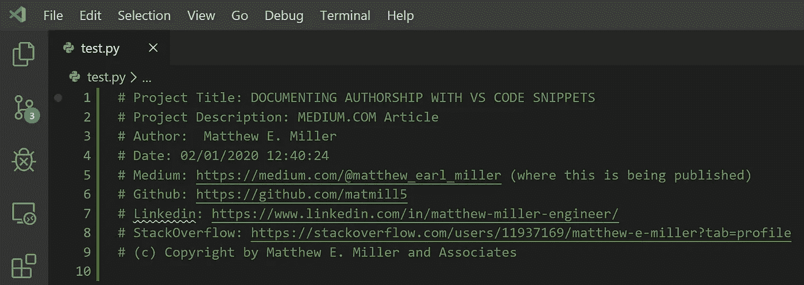
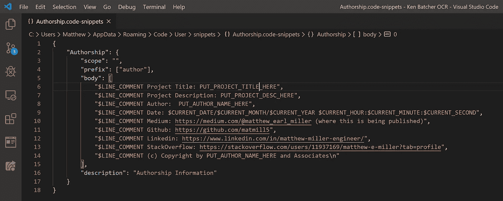
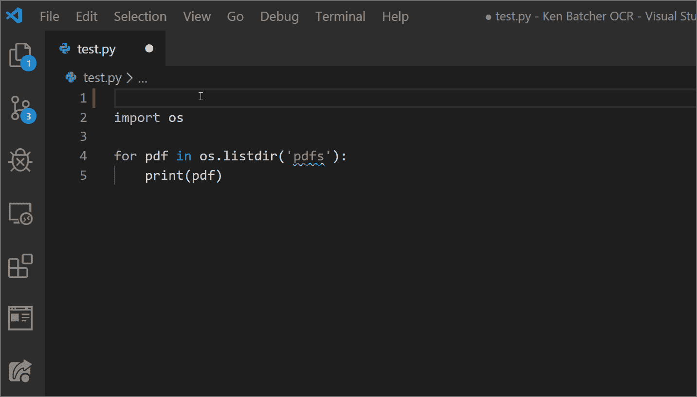

# 使用 VS 代码片段快速记录作者身份

> 原文：<https://towardsdatascience.com/rapidly-document-authorship-with-vs-code-snippets-fa98a647085d?source=collection_archive---------51----------------------->

## 相信你的工作会得到好评。

记录作者身份

## 简介:

在一个版本控制的世界里，你是否应该在你的文件头部分记录作者信息还没有定论，但尽管如此，这就是我们今天要做的。

在我看来，记录你的作者身份是一件非常有价值的事情。如果你努力创造了一些东西，你的工作应该得到认可。记录作者身份可以让你为自己的成就打上商标，它告诉其他人你可能要承担责任，它让这个世界(你的社区)成为一个更有见识(更好)的地方。

毫无疑问，我们能够认可彼此的工作是很重要的，这样我们就可以更好地决定雇佣谁、与谁合作、支持谁等等

说白了，**记录作者身份是好的**。

## **问题:**

所以，很好，记录作者身份是好的…

但是，我们如何避免在文件头中一遍又一遍地重复输入相同的作者信息的单调？

也许，我们使用文件模板？当然，文件模板在某些情况下可能是一个很好的解决方案，但是，在这种情况下，不，我们使用 [**VS 代码片段**](https://code.visualstudio.com/docs/editor/userdefinedsnippets) 和它们的模板能力。

## 解决方案是:

VS 代码片段，类似于文件模板，也有一个模板元素。然而，片段在本质上更加具体，在范围上更加动态。

对于那些使用过 [**智能感知**](https://docs.microsoft.com/en-us/visualstudio/ide/using-intellisense?view=vs-2019) 的人来说，你已经熟悉 snippet 的功能了。当 VS 代码检测到您已经输入了在 snippet-config 文件中定义的前缀词的开头时，snippet 通过建议文本插入来工作。

这些文本插入、前缀词和其他片段属性由一个 JSON 文件(snippet-config-file)定义，该文件可以通过以下步骤创建和修改【T14:

代码片段说明

## **生成的代码片段文件:**

代码片段配置。文件

## **运行中的代码片段:**

使用 VS 代码片段的快速文档

## 结论:

就这样，很简单，但是让我们反思一下我们在这里完成了什么。

*   熟悉 VS 代码片段(一个强大的开发工具)
*   确保我们有公平的机会获得工作上的荣誉
*   为我们未来的自己节省了一些时间
*   让我们对同事更加负责(通过记录责任)

所以，如果你今天什么也没做，你已经赢了。