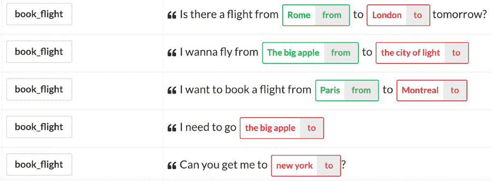
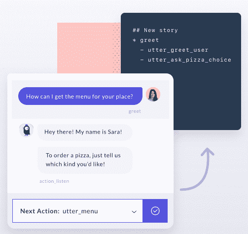
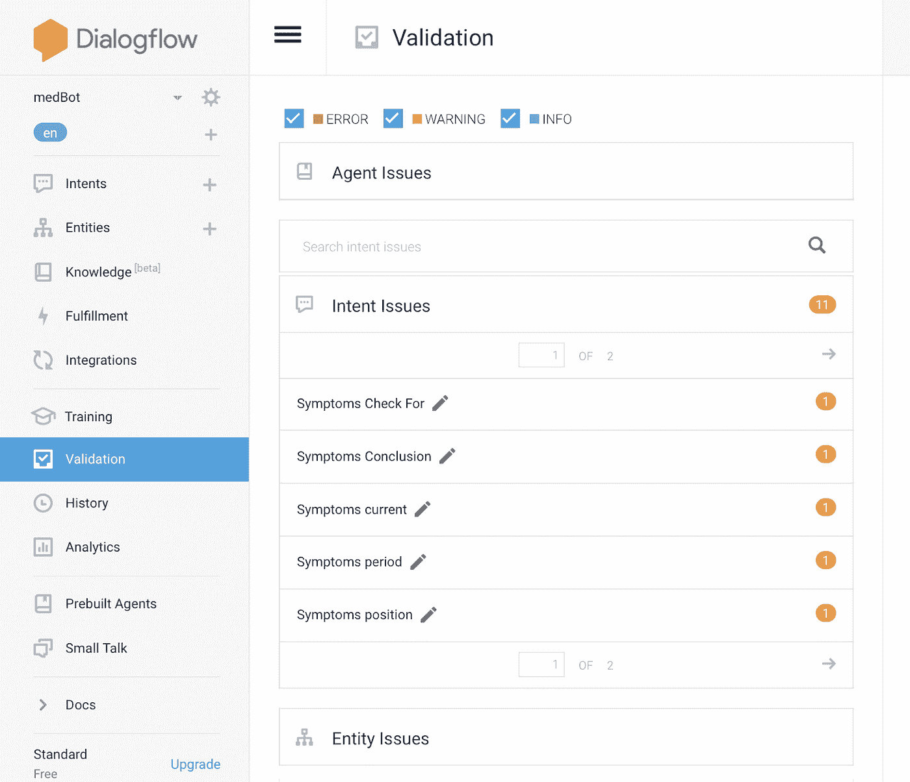
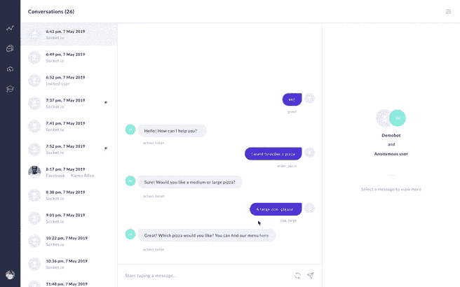

# Rasa 与 Dialogflow -Faceoff(开发者的视角)

> 原文：<https://towardsdatascience.com/rasa-vs-dialogflow-faceoff-part-2-6a4692b25b71?source=collection_archive---------6----------------------->

## 独一无二的比较博客

诺德伍德主题公司在 [Unsplash](https://unsplash.com?utm_source=medium&utm_medium=referral) 上拍摄的照片

> *你是一个想知道在选择虚拟助手平台时如何比较和比较什么的开发者吗？那么你来对地方了。*

在这篇博客中，我们将从开发者的角度来介绍平台的特性。以防万一，如果你错过了我们的第 1 部分 对话流与 Rasa，或者如果你是一个企业主，请检查一下。我们还讨论了在比较平台时需要考虑的核心组件，并深入探讨了企业所有者在选择平台之前需要考虑的特性。

# 3.开发商

# 基于关键字的 bot 构建(无 NLP):

当人工智能不在的时候，这是最古老的建立虚拟助手的方法。尽管这种方法不再是优选的。

是的，在基于关键字的 Dialogflow 中，有一些方法可以基于一个基于按钮的机器人来构建一个完全公正的流程。

在 Rasa 中，我们可以使用[关键字意图分类器](https://bit.ly/rasa-keywordintentclassifier)来构建。该分类器仅适用于小型项目或初学者。

# 机器人的类型:常见问题助手|上下文助手|个性化助手

FAQ assistant 是目前最常见的助手类型，可以用大多数 bot 框架轻松构建。

构建上下文助手需要真实的对话人工智能元素。即使在 FAQ 助手中，我们也可以通过多步骤的方法获得上下文。问题是——这会提供良好的对话体验吗？不，这只会增加开发者在管理意图和评估对话流方面的时间和精力。但要做到这一点，我们需要管理对话中的上下文，以确保我们处理任何事情和一切。根据我们对这两个平台的经验，与 Dialogflow 相比，Rasa 在为开发人员提供管理复杂对话中的上下文的灵活性方面占据优势。

如果开发人员必须通过 Dialogflow 上下文来更改或更新对话流，那么对话管理就更加棘手。带有流动可视化的工具会非常有帮助。

在 Rasa 中，对话由故事管理，再次浏览所有故事并直接在源文件*中更新或更改更加棘手，因为它*可能会破坏之前的工作行为(因为它是基于 ML 的实现)。但总的来说，Rasa 更擅长处理这种情况，因为它有其他功能来评估[冗余检查](https://bit.ly/rasa-validate-files)。Rasa X 有一个功能，我们可以很容易地将正确的对话保存为测试，这样我们就不用自己写出来了。数据验证和测试都应该在一个连续的集成管道中运行，每当我们更新项目的范围时就会触发这个管道。

个性化助理是随着时间的推移了解你的东西。也许这种助手将在未来几年内成为现实。

Ref: [对话式人工智能:你的企业人工智能助手五级指南](https://bit.ly/5-level-ai-assistant)

# 定制:

我们认为没有一个平台是完美的，可以解决所有的业务需求，因此需要一些定制的功能来验证项目的平台。可能会有黑客攻击或解决方法，但平台必须提供这种灵活性。

Rasa 可以完全自由地配置 NLU、核心、集成、部署等。更多信息，请参考 [Rasa 文档](https://bit.ly/rasa-docs)。

另一方面，Dialogflow 不允许对其代码进行任何定制，但您只能在实现中进行定制。

# 上下文管理:

因为我们的大多数对话都是上下文相关的，这就是虚拟助手对话由人工智能驱动的原因。上下文管理是对话管理模块的核心。

Rasa 和 Dialogflow 都使用槽来管理上下文。槽点不过是助理的回忆。Rasa 的基于 LSTM/变压器的核心采用插槽、当前意图和实体来预测机器人的下一步行动。在对话流管理中，上下文有点棘手，但一旦你掌握了它的工作原理，你就可以开发出很好的对话助手，但当你与上百个意图和实体进行复杂的对话时，管理它就变得很困难。

# 对话管理:

我们非常清楚，编写大量基于 if-else 语句的会话流是不可行的。因此，这个特性是至关重要的，同时要记住真正基于 ML 的虚拟助手。

Rasa 的对话是用[个故事](https://bit.ly/rasa-core-stories)设计和训练的。这是有史以来第一个基于 ML 的对话管理方法与基于规则的方法相结合，包括使用定制的动作文件来创建对流程的更紧密的控制。Rasa 提供的交互式学习选项可以让故事的创作变得自然。与传统方式相比，这种方式构建聊天机器人更加自然。在这里阅读更多关于对话管理的信息:[Rasa 核心对话引擎](https://bit.ly/rasa-core-about)

Dialogflow 更多地使用基于规则的方法，并通过上下文本身管理对话。

# SDK 和 API:

[Rasa SDK](https://bit.ly/rasa-sdk) 提供了用 python 编写定制逻辑所需的工具。

Dialogflow 有自己的不同语言的[SDK](https://bit.ly/df-sdk)。

# 4.易于开发、部署和调试

这是选择平台时的重要特征之一。因为每个人都想让自己的生活更轻松。尤其是开发者:P

# 发展

# 平台架构:

知道如何使用平台是一回事，但知道平台如何工作是另一回事。为了利用平台的功能，理解平台本身的架构是很重要的。

阅读以下资源，了解有关各自平台架构的更多信息。

Rasa: [Rasa 文档](https://bit.ly/rasa-docs)和[共同学习休息室 Rasa 教程](http://bit.ly/pyconf-rasa-restaurantbot)

对话流:[合作学习休息室对话流教程](https://bit.ly/cll-chatbot-df)

# 易于学习:

大多数职场人士都有需要在昨天完成的事情的问题。获得更多的技能和更短的学习曲线是我们大多数时候更喜欢的。就功能而言，工具有多好并不重要，但对于我们开发人员来说，更重要的是拥有良好的资源，如平台文档和自助服务平台。

Rasa 文档易于理解和浏览，即使后端的架构可能很复杂。它的互动 g[getting 开始引导](https://bit.ly/rasa-gettting-started-tutorial)将轻松搭载新用户。如果你喜欢深入了解这个平台，你可以从 [Rasa 大师班](https://bit.ly/rasa-yt-masterclass)、[算法白板](https://bit.ly/rasa-algorithm-whiteboard)和[面向开发者的 NLP](https://bit.ly/rasa-nlp-developer)视频开始，这些视频是你深入了解的绝佳方式。

对于新手来说，通过大量可用的学习资源学习 Rasa 应该很容易，但考虑到 Rasa 的架构，与 Dialogflow 相比就不那么容易了。

Dialogflow 是在考虑编码人员和非编码人员的情况下构建的，因此与 Rasa 中的学习曲线相比，该平台的可用性非常容易。

# 易用性或开发的便利性:

开发时间和工作完全取决于项目需求、资源和平台专业知识。但是对平台的期望是，它们有助于减少端到端开发的时间，但不损害质量和最终产品。

因为 Rasa 主要是一个内部部署平台，开源意味着开发者可以完全控制工程。开始之前，需要对平台进行设置和了解。虽然 Rasa 非常积极地将新功能添加到 Rasa 堆栈中，但那些不受支持的功能需要额外的工程来设置。

与 Rasa 相比，Dialogflow 提供了一个易于使用的平台和几个通道的简单集成过程，从而减少了大部分开发时间。

# 设置和配置:

一个人能以多快的速度开始使用该平台进行开发工作对于一些人(如果不是很多人的话)来说也很重要。Dialogflow 没有任何安装步骤，因此除了通常需要一两分钟的 webhook 部分之外，不需要任何基础设施设置。主要的优点是你不需要使用服务器来部署 Dialogflow 或 webhooks。如果您熟悉 Firebase 函数/Lamdba 函数，那么您可以选择无服务器架构。

Rasa 确实需要安装，因为它是一个 python 库。此外，虚拟助手的开发需要必要的配置，通常需要 15-30 分钟或更长时间，这取决于您是否会面临任何依赖问题。但是在开始生产部署之前，请务必阅读 [Rasa 部署指南](https://bit.ly/rasa-deployment-guide)。

# 内置支持:

拥有内置特性，如小型会谈、基本实体支持和后续机制，支持开发人员减少一些冗余和基本的活动。而 Dialoglow 内置了其中的大部分功能，其中一些功能和流程可以通过下载 JSON 格式的功能来重用。

在 Rasa 的例子中，没有像闲聊这样的内置意图，但是这样一组意图一旦定义，就可以很容易地在多个项目中重用。使用 Duckling 和 Spacy 的系统实体可以很容易地配置在 Rasa NLU 管道。Rasa 具有一种配置，其中如果意图分类和动作预测置信度低于指定阈值，则可以触发[回退响应](https://bit.ly/rasa-fallback-action)。Rasa 不像 Dialogflow 那样有任何内置的默认、欢迎和回退意图。

# 培训形式:

虚拟助手旨在模仿人类行为。正如我们人类通过对话和讨论随着时间的推移了解更多一样，对虚拟助手的期望也是一样的。平台需要足够先进，以协助开发人员更直观、更自然地训练机器人。在这种情况下，两个平台 NLU 都用自然用户话语进行训练，这些自然用户话语用如下所示的实体进行标记。

[培训意图和实体](https://botfront.io/docs/rasa/nlu/training/)

痛苦是当开发人员不得不开发对话流时。如上所述，Rasa 的方法比 Dialogflow 更自然，因为它是基于故事的方法。Rasa 的交互式学习让开发人员在开发对话流时变得轻松。

[作为现有 Rasa 用户开始使用 Rasa X](https://bit.ly/rasax-getting-started)

# 配额和限额:

当我们的流程非常复杂和漫长时，这一点非常重要。由于配额和限制可能会给开发者造成障碍，因此对话设计者和语音助手开发者将不得不相应地合作理解平台和开发者的限制。

Dialogflow 在很多方面都有限制,涉及到意图、实体的数量，以及动作名称中允许的字符数量等等。Google 一定是在进行了基准测试并牢记最佳实践之后决定限制的。

由于 Rasa 没有这样的限制，但是，如果任何班级的人数相当多，它可能会导致训练/测试数据不平衡的问题。因此，像 Dialogflow 一样，如果任何类都达到了极限，那么就应该重新访问数据，并进行必要的更改来平衡类。

# 内置 bot 模板或市场:

为了让开发人员对工作流有一个基本的了解，并建立在现有流程的基础上，一些平台提供了聊天机器人模板和市场，如 Chatfuel。

因此，Rasa 没有专门的现成的机器人模板，但它有样本机器人开始。 [Rasa 示例(GitHub)](https://bit.ly/rasa-github-example)

Dialogflow 提供了一组模板，确切地说，它们提供了 45 个模板，帮助许多开发人员理解流程需要和设计，并使用它们来开始使用平台。

# 从其他平台迁移:

Rasa 支持从 Dialogflow、wit.ai、Luis、IBM Watson 等平台轻松迁移。

Dialogflow 只提供到两个平台的迁移，即亚马逊 Alexa 和谷歌动作(尽管谷歌助手作为 Dialogflow 本身的一部分工作)，但它不允许或接受其他平台的直接集成。

# 模型评估:

因为 Rasa 提供的模型可由开发人员根据需求进行配置。当我们试验多种配置时，非常需要这个特性。

你可以在[测试你的助手](https://bit.ly/rasa-testing-your-assistant)了解更多关于评估 NLU 和 Rasa 核心模型的信息。您还可以比较不同的配置选项，进一步优化您的助手。

尽管 Dialogflow 的后端模型是一个黑盒，但我们仍然可以调整 ML 分类阈值，并在混合模型(基于规则和基于 ML)和纯 ML 模型之间进行选择。

# 部署

对于许多客户来说，这是一个重要的决策因素，因为大多数客户不希望数据通过不受他们完全控制的外部实体传输。这无疑是 Rasa 的优势所在，因为 Rasa 可以在本地运营。它可以部署在内部和云上。有关如何部署的信息，请参考[部署您的 Rasa 助手](https://bit.ly/rasa-how-to-deployment)。因为它是在本地部署的，所以您拥有自己的数据。虽然开发虚拟助手不同于传统的软件开发。Rasa 遵循软件工程最佳实践。参见[设置 CI/CD](https://bit.ly/rasa-ci-cd) 和[集成版本控制](https://bit.ly/rasa-version-control)。Rasa 还支持 [S3](https://aws.amazon.com/s3/) 、 [GCS](https://cloud.google.com/storage/) 和 [Azure 存储](https://azure.microsoft.com/services/storage/)来保存你的模型。参考[云存储](https://bit.ly/rasa-cloud-storage)获取信息。

因为 Dialogflow 是 Google 云平台产品，因为它是基于 UI 的 bot 框架。整个项目和当然模型将被存储和部署在谷歌云中。我们只能灵活地在内部或其他云平台上实现后端业务逻辑。

# 排除故障

调试和开发一样重要，因为它会消耗大量时间。虽然大多数平台在提供开发特性方面表现出色，但是有必要验证它们是否也提供了大量的调试特性。调试虚拟助手不同于传统的软件调试，随着项目范围的扩大，由于基于 ML 的方法中数据的集体效应，调试失败变得更加棘手。因为你可以看到所有的东西和所有的代码，所以通过知道预测分数，你可以确切地知道你训练的模型表现如何。此外，上面提到的评估方法可以帮助决策。对于在两个平台中编写的定制逻辑，传统的软件调试是适用的。

去年，Rasa 可能会是一个明显的赢家，但去年年底 Dialogflow 引入了一个名为 [Validation](https://bit.ly/df-agent-validation) 的部分，该部分评估了每个意图，并指出有一个特定的意图需要更多的训练数据才能表现得更好。

而 [Rasa X](https://bit.ly/rasa-x) 提供治疗和微调能力。Rasa 还为我们提供了培训 NLU 以及对话的选项，而 Dialogflow 仅提供了 NLU 组件的培训选项。所以 Dialogflow 在这种情况下仍然不是赢家。此外，如果一个人有很多训练数据，而机器人在理解大多数输入方面有问题，那么在 Dialogflow 的训练部分进行这些纠正是一项非常乏味的任务。

[Rasa X-YouTube](https://www.youtube.com/watch?time_continue=25&v=6qRJGTBfwq0&feature=emb_title)

# 5.服务支持

开发人员在设计对话和实现对话时需要支持，并牢记最佳实践。Dialogflow 通过其 [Google Group](https://bit.ly/df-google-setup) 、 [Slack](https://bit.ly/df-slack) 和 [StackOverflow](https://bit.ly/df-stackoverflow) 、提供社区支持。而 Rasa 则有自己的社区 [*论坛*](https://bit.ly/rasa-forum) *和*[*stack overflow*](https://bit.ly/rasa-stackoverflow)*。*

我们希望您花的时间值得一读 Rasa Vs Dialogflow 平台之战。我们将不断更新这个博客，增加新的功能。

> 如果你仍然不确定哪个平台适合你，请在评论中告诉我们是什么让你犹豫不决？
> 
> 如果你现在确定要为你的项目选择哪个平台，那么请告诉我们是哪个平台，是什么让你选择了这个平台？
> 
> 如果您已经在使用其中一款，请告诉我们原因。

如果你正在使用任何其他机器人框架来构建虚拟助手，请在评论区告诉我们。我们很想探索它们。

我们想借此机会感谢[艾玛·威格特曼](https://bit.ly/linkedin-emma-jade-wightman)、[苏维克·戈什哈](https://bit.ly/linkedin-souvikghosh)、[尼基尔·萨瓦利亚、](https://bit.ly/linkedin-nikhil-savaliya) [德瓦希什·马姆加因](https://bit.ly/linkedin-devashish-mamgain) *、* [维斯瓦·纳特·贾](https://bit.ly/linkedin-vishwa-nath-jha)、的深思熟虑和彻底的审查，没有他们，就不可能保持文章的高标准。

如果您喜欢您刚刚阅读的内容，请帮助其他人找到它。随便敲👏只要你认为这篇文章是值得的，就请鼓掌。

感谢 [Akhil Misri](https://medium.com/@akhil.misri17) 与❤️的合作