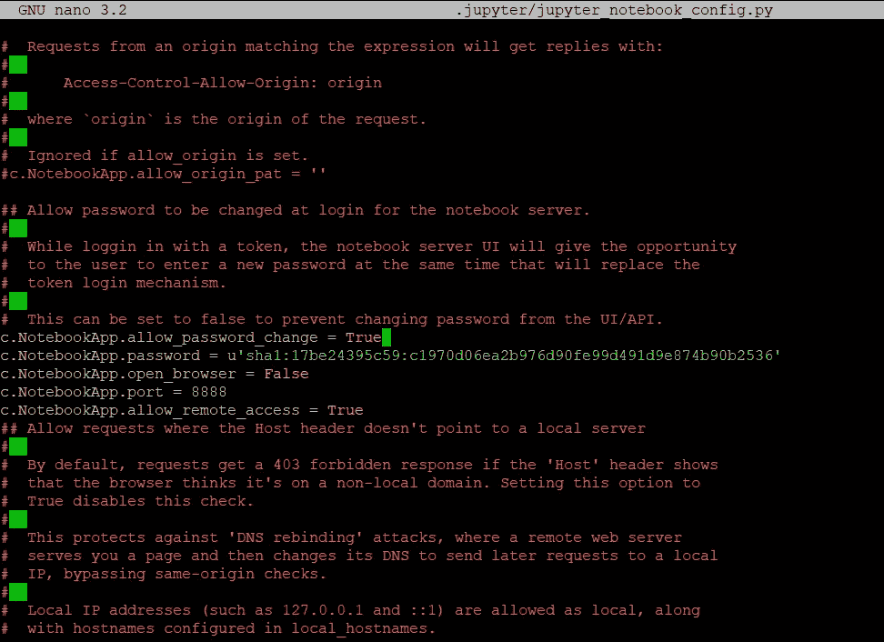
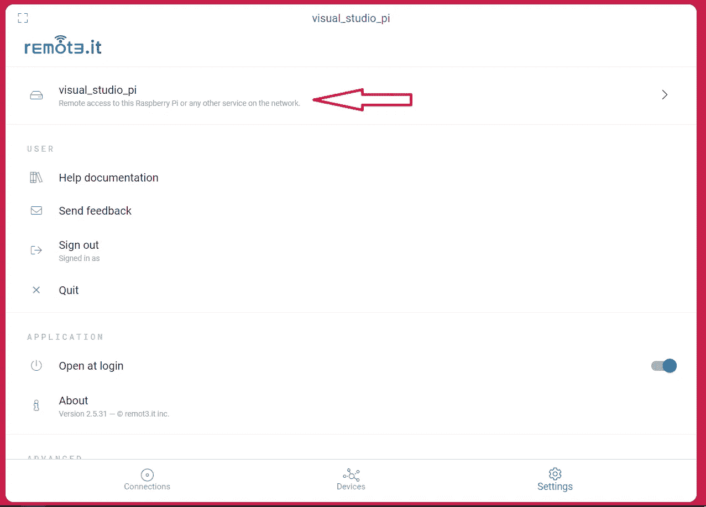
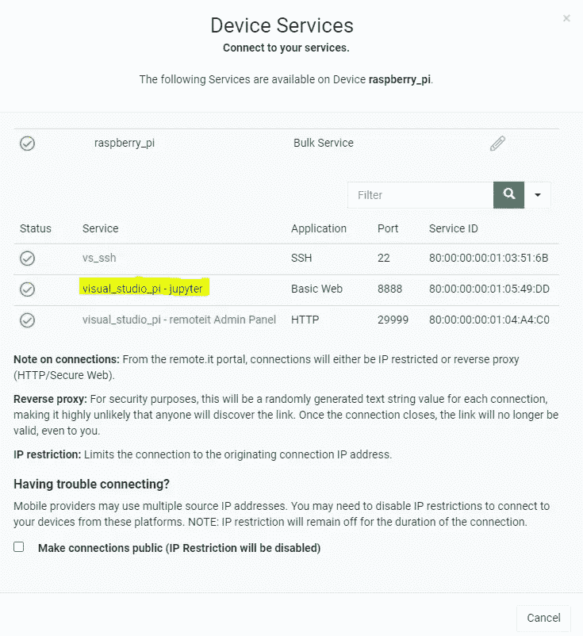
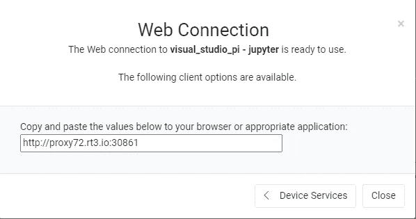
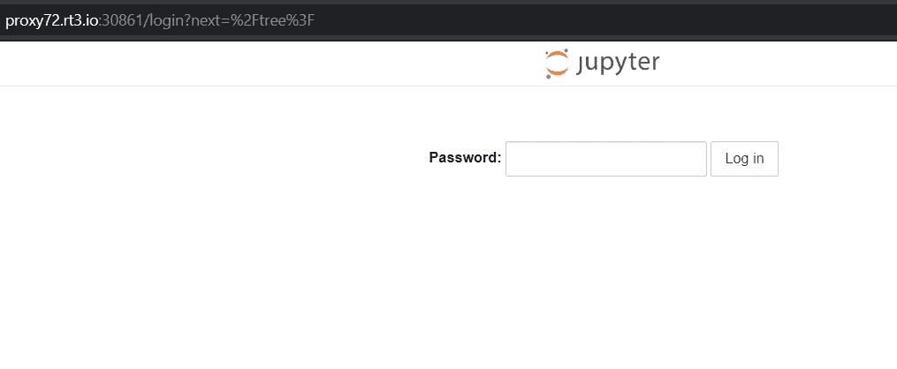

# Raspberry Pi:托管 Jupyter 笔记本的虚拟教程，你可以在任何地方访问它

> 原文：<https://towardsdatascience.com/raspberry-pi-tutorial-on-hosting-a-jupyter-notebook-that-you-can-access-anywhere-32191f882b1f?source=collection_archive---------10----------------------->

这个系列主要是关于用一个 Jupyter 笔记本服务器来设置你的 Raspberry Pi，你可以通过开放的互联网在任何地方访问它。我们已经到了最后一章。

在前面的会话中，我们已经介绍了如何设置端口转发或云代理服务器，以便您通过 SSH 安全地连接到 Raspberry Pi。在我的第一篇文章中，我还介绍了 TCP/IP 如何处理不同的传入流量。现在我们知道了如何打开我们的 Pi 并通过 SSH 访问它，我们实际上可以复制同样的想法。在一个简单的单行程序中，Jupyter Notebook 运行在 HTTP 上(这似乎很明显，因为我们都使用 web 浏览器来使用 Jupyter Notebook)。因此，我们需要做的只是为来自 Pi 的 HTTP 流量打开一个端口，并将其与 Jupyter Notebook 应用程序连接起来。

> 对于必要的先决条件，请查看下面介绍云代理服务器设置的文章。我假设您已经在 remote.in 注册了一个云代理服务器，并且能够通过 SSH 连接到您的 Pi。我想强调的是，许多云代理服务器提供商为您访问您的 Raspberry Pi 提供免费服务。因为你实际上并不租用任何服务器，而是托管自己的服务器，所以许多提供商的服务通常都很慷慨。所以一定要自己去看看其他的供应商！

[](https://medium.com/@jimip6c12/raspberry-pi-tutorial-on-the-most-secure-way-to-connect-to-your-pi-cloud-proxy-server-11867ddaac95) [## Raspberry Pi:以最安全的方式连接到您的 Pi——云代理服务器的教程

### 这是我关于将 Raspberry Pi 设置为远程 jupyter 笔记本代码编辑器的系列文章的继续。在最后…

medium.com](https://medium.com/@jimip6c12/raspberry-pi-tutorial-on-the-most-secure-way-to-connect-to-your-pi-cloud-proxy-server-11867ddaac95) 

我们希望**以最安全的方式**做到这一点。这就是为什么本章将把我们到目前为止学到的所有东西结合起来。我们不仅要在我们的 Raspberry Pi 上公开一个端口，我们还要将 port/Jupyter 笔记本应用程序连接到云代理服务器。从用户的角度来看，没有什么不同，他们只需要访问另一个 URL，而不是原来的 IP 地址。但是从服务器的角度来看，这给了你很大的安全性。这真的很重要，因为我假设你们大多数人都在家里设置 Pi，这意味着如果出现任何问题，你们的家庭网络都将受到攻击。

再说一遍，这只是为了好玩。Raspberry Pi 并没有提供很多计算能力。但是假设你有一个 NVIDIA 计算盒，那么设置远程访问可能是一个好主意。此外，在数据科学行业，使用 linux 服务器来做 ML 工作现在是一种规范。学习如何建立一个只是让你比别人更有优势和方便。

> 你肯定可以通过端口转发开放你的笔记本应用程序的公共访问。但是这样做真的很危险。由于 jupyter 笔记本通常启用“jupyter magic ”,它可以在您运行的操作系统上创建、更改和删除任何文件，任何有意访问您的 jupyter 笔记本的人都将面临相当于 SSH 访问的巨大风险。

随着所有的 BS 封面，这里是步骤列表。我们开始吧。

*   在树莓 pi 上安装 Jupyter 笔记本。
*   添加配置并设置密码。
*   在云代理服务器上安装一个应用程序，这样你就可以把你的 Jupyter 笔记本暴露在开放的互联网上。

# 在树莓 Pi 上安装 Jupyter 笔记本

当前的 Raspberry Pi 版本不包含 python3-pip。所以首先我们需要安装 pip3，然后是 jupyter。SSH 到您的树莓派，然后运行

```
# install pip
sudo apt -y install python3-pip# install jupyter
pip3 install jupyter# running pip freeze should show jupyter in the list of packages your installed
pip freeze
```

# 添加配置并设置密码

Jupyter 为我们处理设置过程提供了很多方便的工具。它包括这三个步骤。

**1。创建一个密码并散列它。**

托管公共笔记本服务器的一个良好做法是，每次用户访问笔记本时都要求输入密码。为此，首先，我们需要创建一个密码，并将其安全地存储在 web 服务器中(因此是散列部分)。

要创建密码，请运行`jupyter notebook password`，

```
$ jupyter notebook password
Enter password:  ****
Verify password: ****
[NotebookPasswordApp] Wrote hashed password to /Users/you/.jupyter/ jupyter_notebook_config.json
```

然后，使用任何编辑器打开 json，您应该看到有一个散列密码(从 sha1 开始，见下图)，请现在复制它，因为我们稍后需要将它粘贴到配置文件中。


**2。创建配置文件。**

运行`jupyter notebook --generate-config`，在`/home/USERNAME/.jupyter/jupyter_notebook_config.py`下应该会产生一个`jupyter_notebook_config.py`。

使用任何编辑器打开。py 文件，您应该看到所有设置都被注释了，所以我们可以简单地添加我们需要的任何配置，而不会与任何设置冲突。

**3。添加配置参数。**

在任一行中，添加以下配置。

```
c.NotebookApp.allow_password_change = True
c.NotebookApp.password = u'your_copied_hash_password'
c.NotebookApp.open_browser = False
c.NotebookApp.port = 8888
c.NotebookApp.allow_remote_access = True
```

*allow_password_change* :允许您在成功使用密码登录笔记本服务器后更改密码。

*密码*:复制刚刚生成的密码，记得粘贴 sha 哈希密码，不要粘贴文字密码！

*open_browser* :将其设置为 false，以防止 web 服务器像我们通常在本地机器上所做的那样打开浏览器。

*端口*:笔记本服务器使用的端口号。您需要记住这一点，因为我们需要将它公开给云代理服务器。



完成后，保存文件，安装完成！让我们跑去`jupyter notebook`主持一个树莓派的笔记本吧！

> 这里涉及的大部分内容都在[官方文档](https://jupyter-notebook.readthedocs.io/en/stable/public_server.html)上。

# 在云代理服务器上设置应用程序

简而言之，云代理服务器所做的就是监听你指向的端口，并托管一个你可以从开放互联网的任何地方访问的公共服务器。每当你访问那个公共服务器时，它唯一做的事情就是把你的请求转发给开放端口的应用程序。在这种情况下，jupyter notebook 运行在端口 8888 上，使用 HTTP 协议。这意味着当用户访问公共云代理服务器时，HTTP get 请求将在端口 8888 转发到您的 Pi，Pi 将笔记本网站返回给用户。

假设您在 remote.in 设置了一个远程服务器，我们可以通过访问[http://find.remote.it/](http://find.remote.it/)来添加一个 HTTP 应用程序。选择您的 Raspberry Pi 设备，您应该在仪表板中，转到设置并在那里选择您的 Pi。

> 如果你需要一些快速帮助来设置你的 Raspberry Pi 中的云代理服务器，最好的资源是官方 gitbook 中的[快速入门指南，或者是我的上一篇关于设置](https://docs.remote.it/adding-remote.it-to-your-device/the-remoteit-package-for-raspbian)的文章。



然后，点击`Add Manually >`，填写新服务。您可以填写您喜欢的任何名称，将类型设置为 HTTP，将端口设置为 8888(或者您选择在 jupyter 配置中使用的任何端口)。


然后设置终于完成了！现在访问[https://app.remote.it/](https://app.remote.it/)，选择你的 Pi 设备，点击你刚刚创建的服务。



点击突出显示的部分，启动公共服务器！

它应该返回一个你可以访问的公共 URL。



访问这个网站，您将访问您的 jupyter 笔记本！这并不局限于同一个局域网，你现在可以从开放的互联网上的任何地方访问它！



需要您输入密码的登录页面

这就结束了整个系列。我们讲述了如何安装 Raspberry Pi 操作系统，设置 SSH，云代理服务器，最后是 Jupyter 笔记本服务器。同样的方法也适用于建立一个网站和其他 ide，如 visual studio 代码(从技术上讲，目前建立 visual studio 代码时存在编译问题，我们自己无法解决这个问题。但这在未来肯定是有可能的！).所以，一定要尝试不同的东西，谷歌一下，测试你的技能。

如果你有其他项目需要帮助，请在评论区告诉我。感谢您阅读本系列。