# Ratlab:一个用于研究空间选择性神经元的慢特征分析工具包

> 原文：<https://towardsdatascience.com/ratlab-a-toolkit-for-studying-spatially-selective-neurons-with-slow-feature-analysis-fbc45f65a0c3?source=collection_archive---------52----------------------->

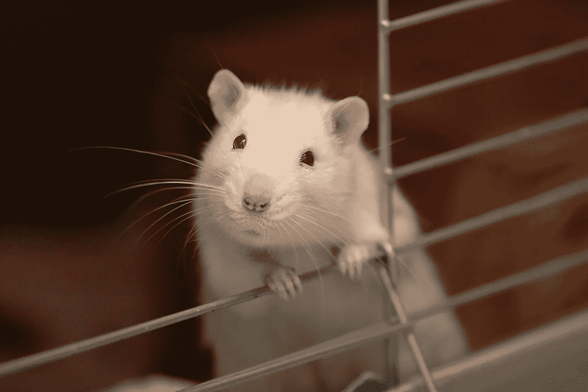

图片由[vaun0815](https://unsplash.com/@vaun0815) 上的 [Unsplash](https://unsplash.com/?utm_source=medium&utm_medium=referral)

我最近开始在德国波鸿鲁尔大学攻读神经科学博士学位。我的导师是 Laurenz Wiskott 教授，他在计算神经科学和机器学习之间的广泛领域开展工作。该小组使用的主要方法之一是慢特征分析(SFA)，这是一种从时态数据中提取慢变化特征的无监督技术。使用该算法获得的一个显著结果是，它能够生成与哺乳动物大脑中发现的神经元的空间编码相匹配的放电模式。rat lab(Fabian schn feld 2016—[https://gitlab.com/fabschon/ratlab](https://gitlab.com/fabschon/ratlab))是一款通过模拟大鼠的探索行为，并用分层 SFA 网络处理感官输入来探索这一特性的软件。我最近把这个软件从 Python 2 升级到 Python 3:[https://github.com/wiskott-lab/Ratlabv3](https://github.com/wiskott-lab/Ratlabv3)

我很喜欢使用这个软件，我相信它是理解 SFA 的一个有价值的工具，特别是在空间导航的应用中。此外，该软件不需要彻底的编程经验，这使得它成为神经科学领域工作人员非常容易使用的工具。在介绍 Ratlab 及其主要模块之前，我先对 SFA 做一个(简短的)概述，最后展示一些使用该软件可以获得的不同结果。我强烈建议您自己安装 Ratlab，并在阅读时和我一起探索它。我希望你喜欢学习这个有趣和多才多艺的工具包！

# 内容

1.  SFA 简介
2.  Ratlab 简介
3.  模拟
4.  培养
5.  抽样
6.  把这一切联系在一起

# SFA 简介

SFA 的动机是慢度原则。这表明，在多维时间相关信号 **x** (t)中，该信号中更有意义的特征通常比不太有意义的特征在更慢的时间尺度上变化。作为一个例子，考虑这样一个事实，我们的视觉系统已经进化，以便为我们提供关于外部世界的行为相关信息。这些信息可以采取多种形式，包括我们周围的物体或其他动物的位置，以及它们的相对运动。典型地，这样的环境特征在秒的时间尺度上变化。然而，对于组成这种信息流的单个组件来说，情况就不一样了，例如视网膜中的单个受体(或者等效地，计算机视觉系统中的单个像素)接收的信号。后一种类型的信息在时间尺度上的变化比任何与动物相关的特征都要快得多。SFA 利用了这一观察结果，并试图通过仅考虑那些缓慢变化的特征来从 **x** (t)中提取有意义的信息。

关于 SFA 如何做到这一点的详细和数学描述，请参见我的同事 Hlynur David Hlynsson 写的这篇帖子([https://www . ini . rub . de/research/blog/a _ brief _ introduction _ to _ slow _ feature _ analysis/](https://www.ini.rub.de/research/blog/a_brief_introduction_to_slow_feature_analysis/))。或者，对于那些对神经科学中 SFA 的更广泛范围感兴趣的读者来说，Scholarpedia 将它已经获得的各种结果进行了分类([http://www.scholarpedia.org/article/Slow_feature_analysis](http://www.scholarpedia.org/article/Slow_feature_analysis))

分级 SFA (HSFA)网络具有避免 SFA 非线性扩展可能遇到的“维数灾难”的优点。这种形式的网络已经应用于虚拟老鼠的原始视觉输入。al 2007) 。有趣的是，这个网络产生的慢速特征类似于在哺乳动物大脑中发现的几个空间选择性神经元的放电模式。根据虚拟大鼠的运动统计，这些慢特征采取位置细胞、头部方向细胞、空间视图细胞的形式，并且还再现了网格细胞的一些特性。

Ratlab 允许我们通过在虚拟大鼠上进行我们自己的模拟实验来探索其中的一些结果。在这个软件中，各种实验设置和控制参数都是可能的，这大大增加了它的范围。该软件使用由 3 层组成的前馈分层 SFA 网络，在虚拟大鼠探索时处理其视觉输入。在每一层中，过滤器接收来自前一层的输入，并对该输入执行 SFA 算法。这些滤波器的感受野大小随着网络的每一层而增加，使得第三 SFA 层仅是单个节点，并且具有覆盖虚拟 rat 的整个视觉输入的有效感受野大小。Ratlab 能够研究位置细胞和头部方向细胞的放电。因为在本文中已经表明，独立分量分析(ICA)对于将原始 SFA 输出转换成现场点火是必要的。al 2007 )，Ratlab 也提供了包括这一点的选项。Ratlab 的网络架构草图如下所示。

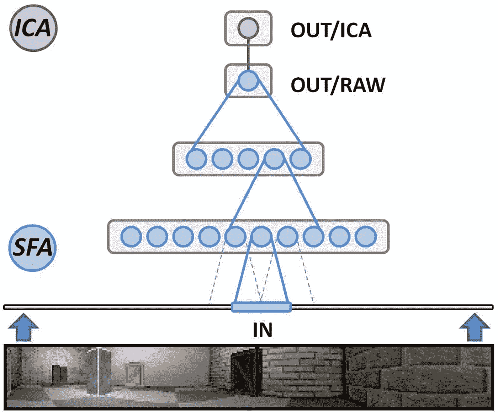

Ratlab 使用的网络架构—图片来自[schn feld&Wiskott(2013)](https://www.frontiersin.org/articles/10.3389/fncom.2013.00104/full)

# Ratlab 简介

Ratlab 软件是用 Python 写的，最新版本用的是 Python 3(【https://github.com/wiskott-lab/Ratlabv3】T4)。在这篇文章中，我将尝试概述该软件的更广泛的范围，并展示其作为理解神经系统空间编码的工具的用途。

如果有兴趣，读者可以看看该软件早期版本的 Gitlab 页面([https://gitlab.com/fabschon/ratlab](https://gitlab.com/fabschon/ratlab))，其中也给出了一些软件语法和功能的例子。此外，[schn feld&Wiskott(2013](https://www.frontiersin.org/articles/10.3389/fncom.2013.00104/full))在本文中正式引入了 Ratlab。

Ratlab 工具包由四个核心模块组成:

```
ratlab.py, convert.py, train.py, sample.py
```

这两个模块中的第一个处理实验的模拟阶段，并且生成随后可由第三模块 **train.py** 用于训练 HSFA 网络的数据。最后，最后一个模块采用训练阶段生成的慢速要素，并在整个环境中对其进行采样，以便您可以评估所实现的任何空间选择性。在任何这些模块之后输入 **help** 命令，提供了它们角色的详细描述以及它们需要的任何相关参数。

此外，该软件有自己的 GUI 来设置实验和选择模拟参数，如果想快速了解该软件的范围，这是一个很好的起点。从 Ratlab 主目录开始，通过运行以下命令打开 GUI:

```
python RatLabGUI.py 
```

这会产生以下窗口:

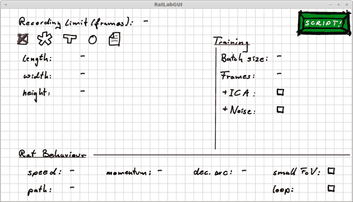

Ratlab 的 GUI——使用 [RatLabv3](https://github.com/wiskott-lab/Ratlabv3) 生成的图像

左上角是可用的不同环境几何图形，以及用于输入相应尺寸和模拟记录限制的字段。在底部是用于指定人造大鼠的运动统计的其他字段。这两类信息在右侧的 **ratlab.py.** 中使用，训练参数在 **train.py** 中指定使用。

完成这些字段后，您可以点击“脚本！”在目录中生成一个 bash 脚本，这样就可以使用以下命令从头到尾运行实验:

```
./RatLabScript
```

一旦您开始实验，将会创建一个 */current_experiment* 文件夹，该文件夹将存储您的实验的所有相关文件。

虽然 GUI 对于开始熟悉实验如何运行是有用的，但是 Ratlab 作为命令行工具工作得最好。在下面几节中，我将概述以这种方式运行 Ratlab 时可以使用的不同设置和计算。我鼓励读者在阅读时利用每个模块的**帮助**菜单。

# 模拟

**环境**

我真正喜欢这个软件的一点是它在设计环境时提供的灵活性。 **ratlab.py** 模块带有 4 种预定义的几何图形:**矩形、星形迷宫、T 形迷宫和圆形**。**长方形**和**丁字迷宫**如其名。**星形迷宫**由几条远离中心区域的走廊构成(走廊数量由用户指定)。**圆形迷宫**只是近似圆形，并且采用正 N 边多边形的形状(N 由用户固定)。

此外， **custom_maze** 选项允许您通过在文本文件中指定每面墙的纹理以及交叉点来手动设计您自己的迷宫(已经包括了一个自定义迷宫示例:*工具/custom_example_world* )。要使用它，必须先将其移动到*当前实验*文件夹中)

下面您可以看到每个环境设置的示例，以及生成它们的相应脚本。在每幅图像中，上面显示了鸟瞰图(白点= rat 以前的位置，红色箭头=当前航向)，下面显示了 rat 的当前视图。图(a)显示了默认情况下激活的矩形几何图形(当没有调用其他参数时，其尺寸为 60(长)x40(宽)x10(高))。

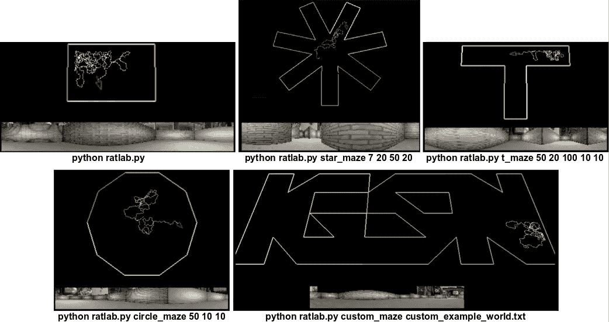

Ratlab 中允许的不同环境类型:矩形、星形迷宫、t 形迷宫、圆形迷宫和自定义——使用 [Ratlabv3](https://github.com/wiskott-lab/Ratlabv3) 生成的图像

除了环境几何体，Ratlab 还允许你使用 **box** 和 **dbox** 命令将障碍物插入到环境中。

**运动参数**

一旦你选择了你的环境，你就可以决定(I)固定虚拟老鼠的导航点，或者(ii)让老鼠探索固定的移动统计数据。

**(一)定点**

此选项的一个好处是，您可以保证虚拟 rat 将探索环境的某些区域。它利用了**路径**命令，该命令要求。txt 文件来定义虚拟 rat 必须导航到的点。例如，尝试运行 */tools* 文件夹中的 **radial_points.py** 文件，并将输出保存为 */current_experiment* 文件夹中的‘path . txt’。这是为具有适当臂尺寸的五臂径向迷宫设计的路径。为了在所有这些都指定的情况下运行模拟，只需输入:

```
python ratlab.py star_maze 5 12 40 8 path path.txt
```

这将导致大鼠在返回迷宫中心之前依次探索每条手臂，如下图(a)所示:

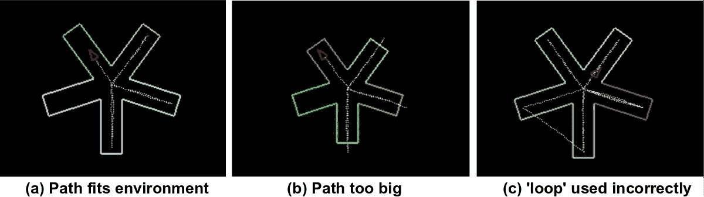

使用 **ratlab.py** 中的“路径”命令——用 [Ratlabv3](https://github.com/wiskott-lab/Ratlabv3) 生成的图像

重要的是，路径要尊重环境的几何形状，否则老鼠会在实验室的墙壁间游荡！作为一个例子，如果你像以前一样调用相同的模拟，但使用较短的臂的星形迷宫，你会得到类似上面的图像(b)。

最后，额外的**循环**命令决定了虚拟 rat 到达最终节点时应该做什么。如果调用**循环**，它将使用结束和开始节点之间的最短路径导航，否则它将在到达最终节点后立即出现在第一个节点(如果您选择调用**循环**，请注意这也考虑到了环境几何)。否则，可能会出现如上图(c)所示的情况。

**(二)自由探索**

相反，如果你希望让老鼠自由探索，Ratlab 提供了各种控制参数来确定虚拟老鼠的运动统计数据。在这里，我简要概述了其中最重要的几个。

**弧线**:为了提供不规则的轨迹，虚拟大鼠的旋转是使用以大鼠当前航向为中心的高斯白噪声项生成的。由于较小的旋转(即< 20 度)比较大的旋转(即> 90 度)更有可能，因此这捕捉到了真实的探索。然而，由于我们不想产生完全随机的旋转，我们可能会进一步限制允许的角度范围。这个参数就是这样做的，并设置旋转的决定弧。默认值为 320。下图说明了弧线。

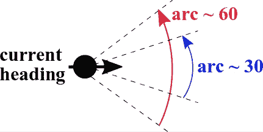

**ratlab.py** 中“arc”参数的示意图—图片由作者提供

**mom:** 这个术语描述了大鼠的有效动量。对于较大的值，可以将虚拟 rat 视为一个大质量粒子，其前进方向对噪声有很强的抵抗力。在这种情况下，生成的路径是平滑的。对于较低的值，由于噪波，老鼠的前进方向波动更大，产生的路径更加锯齿状。默认值为 0.55

(注意:一些极端值，如 **arc** =0 或 **mom** =1，会导致老鼠在撞墙时被卡住，所以要小心这一点！)

**偏差:**如果你想让虚拟老鼠有各向异性的运动统计，这是一个有用的参数。通过在 2D 空间中指定一个特殊的方向，老鼠在这个方向上的移动速度会比在正交方向上快。这种偏差的大小需要具体说明。

**实验参数**

现在你已经选择了你的环境和运动参数，你差不多准备好开始你的实验了！但是，在你这样做之前，你需要决定一些最终的细节。

**limit:** 这控制了您希望实验持续多长时间，以及最终您希望在多少数据上训练 SFA 网络。显然，较大的数据集可以提供更好的收敛性，但代价是计算时间。另一方面，太小的数据集可能会在 SFA 展开中产生奇异的协方差矩阵。我建议从几千个时间步开始。

**图像颜色:**默认情况下，训练图像以彩色保存，但 Ratlab 也允许你以灰度或两种颜色方案同时保存。

一旦你决定了这些，你可以通过加入最后的命令:**记录**来开始你所选择的选项的实验。我建议在你这样做之前清空 *current_experiment* 文件夹，这样新的训练图像就不会与之前实验的图像混淆*。*一个包括迄今为止所讨论的选项组合的示例可能是这样的:

```
python ratlab.py star_maze 5 12 40 8 mom 0.5 grey limit 5000 record
```

生成的训练数据将被保存在文件夹:*current _ experiment/sequence 中。如果你想检查它是否被正确保存，看看这个文件夹，你会看到一堆。当老鼠在环境中移动时，从老鼠的视野中拍摄的 png 图像。图像数量应与参数**的限制相同。**此外，文件 *exp_finish.png* 将在模拟结束时保存，并让您看到虚拟大鼠的总轨迹。*

最后一步，我们需要重新格式化数据，以便它可以被网络训练。我们通过以下方式实现这一点:

```
python convert.py
```

该步骤没有参数，训练数据编译到文件*current _ experiment/sequence _ data*中不会花费太长时间。

# 培养

现在你已经准备好训练你的网络，重要的是考虑你希望从这个具体的实验中获得什么。正如介绍中所解释的，Ratlab 能够研究位置细胞和头部方向细胞的放电频率。在放置单元格(即位置选择性)的情况下，需要额外的 ICA 节点，调用时使用:

```
python train.py ICA
```

在没有 ICA 的情况下，SFA 已经对磁头方向部分敏感，但是包括它增加了这种选择性的精度。在任何一种情况下，Ratlab 都允许您使用 **add_ICA** 命令追溯添加 ICA 节点，而无需再次训练整个网络，因此您还可以查看两者并比较结果(我强烈推荐)。

训练阶段的另一个有用选项是使用参数 **noise** 将噪声引入网络。如前一节所述，在小数据集上训练会导致协方差矩阵中的冗余。虽然解决这个问题的一个办法是使用更大的数据集，但也可以尝试在网络中加入噪声，以减少冗余。

Ratlab 将一层一层地更新你的训练过程，完成后将训练好的网络作为. tsn 文件保存在 *current_experiment* 文件夹中。

# 抽样

一旦你的网络被训练，你终于准备好想象它已经学会的慢特征。这是通过在环境中的多个位置和方向上对大鼠的视野进行采样，并记录网络的响应来实现的。与培训阶段一样，你在这里的选择应该反映出你想学什么。Ratlab 可以做的采样有两种:*空间采样*和*方向采样。*如你所料，前者适用于研究空间选择性(位置细胞)，后者适用于方向选择性(头部方向细胞)。在这两种情况下，都必须指定要采样的慢速特征的数量。在 Ratlab 中，这被限制为 32，选择一个较小的数字可以大大减少计算时间。

**空间采样:**这种方法的工作原理是将虚拟鼠定位在环境中的周期性位置(形成网格)。用户可以使用**周期**参数指定这些采样点出现的频率。最后，也是最重要的一点，在不同的实验中对环境进行采样，每次老鼠都面向不同的方向。有 8 个方向(北，东北，东，东南等。)并且用户可以选择特定的选项或者使用所有选项。Ratlab 还会通过对用户选择的所有方向进行平均，自动产生一组额外的输出。通过比较各个方向和平均输出，我们可以检查网络输出是否依赖于方向。因为这应该*而不是*是 place 字段的情况，所以它充当了解释结果的有用的诊断工具。下图显示了空间采样输出的示例。这些发射模式在空间上是局部的，不同的方向与平均发射几乎没有差别，表明方向选择性很小。在这种情况下，Ratlab 生成了描述环境不同区域的 place 字段！

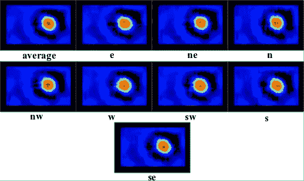

矩形迷宫上的空间采样慢速特征—使用 [Ratlabv3](https://github.com/wiskott-lab/Ratlabv3) 生成的图像

**定向采样:**第二种类型的采样工作方式是固定虚拟 rat 的头部方向，并在对这些位置进行平均之前，在环境中的位置网格上对网络进行采样。这是针对所有 360°整数角度进行的，结果图允许您可视化网络慢速功能的方向选择性。下面是取自[schn feld&Wiskott 2013](https://www.frontiersin.org/articles/10.3389/fncom.2013.00104/full)的图像，显示了使用定向采样的 10 个慢速特征的响应。在这种情况下，包括了额外的 ICA 层，并且结果显示了对某些方向的明显偏好(尽管一些低水平响应仍然出现在其他角度)。

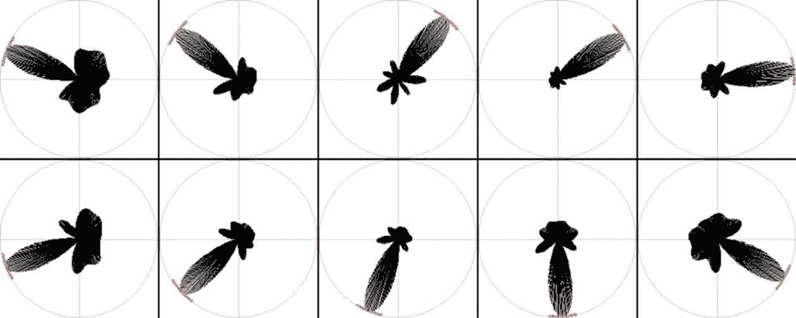

Ratlab 生成的定向样本图示例—摘自[schn feld&Wiskott(2013](https://www.frontiersin.org/articles/10.3389/fncom.2013.00104/full))

# 把这一切联系在一起

现在您已经熟悉了 Ratlab 的每个主要模块，您可以开始根据您的特定兴趣设计实验了。为了最大限度地利用该软件，很有必要在不同的环境和参数下进行大量的模拟，以便您首先对实验范围有一个大致的了解，并且能够更全面地了解 SFA 在不同场景下的表现。

一个很好的例子是**弧**和**矩**参数，它们分别控制老鼠运动的直线度和平滑度。如果您尝试在将这些参数设置为默认值的情况下运行模拟，您将会看到 rat 转动了很多，并且具有相当锯齿状的路径。因为 SFA 提取缓慢变化的特征，所以对于这些参数值，头部方向图显示几乎没有方向选择性就不足为奇了。或者，通过减少**弧**和/或增加**力矩**，可以减少每个时间步长的旋转大小，这意味着在轨迹过程中头部方向变化较慢。因此，如你所料，如果我们像以前一样运行相同的模拟，但做了这些更改，头部方向图现在显示出更好的方向选择性。下面描述了这两种情况，其中显示了两种参数规格下最慢 SFA 特征的 rat 轨迹(左)和头部方向图(右)。

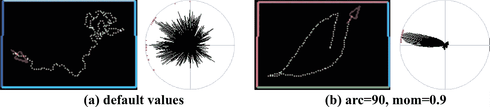

“arc”和“mom”参数对头部方向选择性影响的比较——使用 [Ratlabv3](https://github.com/wiskott-lab/Ratlabv3) 生成的图像

**偏差**参数也会对结果产生明显的影响，特别是对于空间采样。直觉上，人们会认为定向运动偏差会降低任何位置场发射模式的对称性。这正是发生的情况，如下图所示。在这个实验中，大鼠探索了一个默认大小的矩形环境，并且除了**偏差**之外的所有参数都设置为默认值。我输入的偏移方向为 0±1(即环境中的垂直轴)，缩放因子为 1，这意味着该方向的移动速度是水平轴的两倍。下图显示了生成的前 8 个慢速特征。垂直轴和水平轴之间的不对称清晰可见。在这种情况下，由于水平位置的变化比垂直位置慢，所产生的 SFA 输出对水平位置更敏感，即水平位置更局部化。

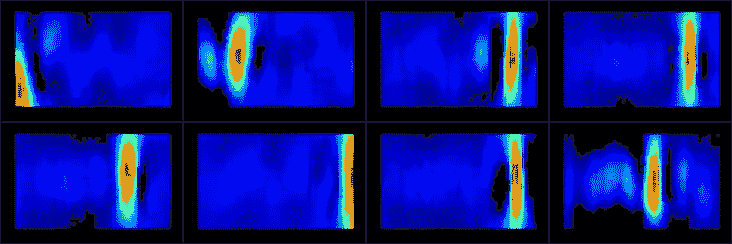

使用 **ratlab.py** 中的“偏置”参数生成的不对称位置细胞触发—使用 [Ratlabv3](https://github.com/wiskott-lab/Ratlabv3) 生成的图像

到目前为止，所有显示的结果都是在最终 SFA 层之后包括可选 ICA 节点的网络中获得的。将这些与没有 ICA 节点的网络进行比较，在空间采样的情况下会产生有趣的结果。这可以在下图中看到，在矩形环境中对 16 个慢速要素进行了采样(同样使用默认尺寸)。这些输出与在 [Franzius et 中发现的没有 ICA 的输出相匹配。al 2007](https://journals.plos.org/ploscompbiol/article?id=10.1371/journal.pcbi.0030166) ，具有部分类似于内嗅皮层网格细胞放电的周期性放电模式。在这篇早期的论文中，作者用理论论据解释了这一结果，证明了 SFA 发现的慢特征形成了傅立叶基础，每个特征的慢度与其频率相关。这确实可以在下面的结果中看到，它清楚地描绘了频率增加的谐波函数。

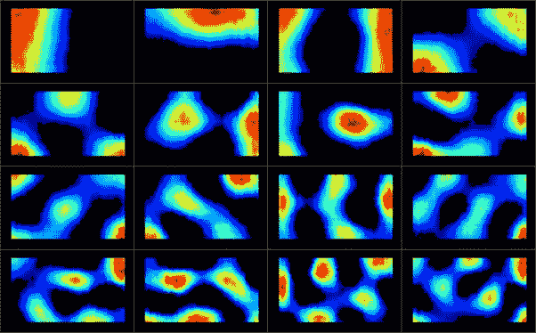

前 16 个输出是在没有 ICA 的矩形环境中使用默认运动统计生成的。输出按慢度排序，并显示递增的频率——用 [Ratlabv3](https://github.com/wiskott-lab/Ratlabv3) 生成的图像

由于要花很长时间才能完全说明您可以使用 Ratlab 做的所有事情，我鼓励您深入研究该软件，并尝试自己的设置和参数选择。

我希望你喜欢这个 Ratlab 的介绍，并希望你在自己的研究中使用这个软件。万事如意！

**参考和链接**

1.  franzius m .和 Wiskott l .(2007 年)。缓慢和稀疏导致位置、方向和空间视图单元。PLoS Comput。生物。3:e166。doi: 10.1371/journal.pcbi
2.  Schö nfeld 和 l . Wiskott(2013 年)。Ratlab:一个易于使用的位置代码模拟工具。前面。计算机。神经科学。7:104.doi: 10.3389/fncom
3.  Schö nfeld 和 l . Wiskott(2015 年)。用分层慢特征分析模拟场所现场活动。前面。计算机。神经科学。9:51.doi: 10.3389/fncom.2015.00051
4.  [http://www.scholarpedia.org/article/Slow_feature_analysis](http://www.scholarpedia.org/article/Slow_feature_analysis)
5.  我的课题组网页:[https://www . ini . rub . de/research/groups/theory _ of _ neural _ systems/](https://www.ini.rub.de/research/groups/theory_of_neural_systems/)