# RCar |全民机器人！

> 原文：<https://towardsdatascience.com/rcar-robots-for-all-71ca3df71749?source=collection_archive---------48----------------------->

## 3D 打印的遥控汽车和 Android 应用程序能够使用蓝牙连接控制其许多功能

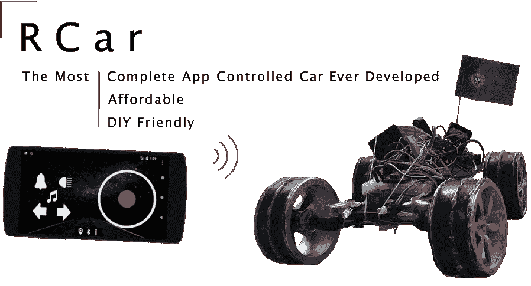

RCar

# 故事

## 项目陈述

> 我们生活在一个快速变化的世界。人们现在比以往更加紧密地联系在一起。技术正变得越来越强大。尽管令人惊讶的是，民族之间仍然存在巨大的不平等，少数民族有时会停止追求他们的梦想。
> 
> *RCar 项目不会解决这个问题，但它提醒了人们团结起来为一个公平的世界而战的重要性。我们认为这是向前迈出的一步。*
> 
> *Next lines 将让你意识到 Arduino 和 3D 打印是如何通过赋予人们权力和在全球传播科学来引领潮流的。#Science4All*
> 
> 意味着简单，意味着便宜，意味着让机器人大众化。打印 3D 零件，拿起 Arduino，下载应用程序并发挥创意！；)

视频 1 — RCar 项目[宣传片]

查看 RCar [网站](https://warcraft12321.github.io/RCar/)(针对谷歌 Chrome 进行了优化)

# 汽车

## **遥控车**

这种机器人在我们的社会中有广泛的用途。军队应用、儿童玩具、自动化项目和专业竞赛是我们可能会发现这种设备的一些场景。它们可以通过多种技术来控制，比如:有线、蓝牙、Wi-Fi 或 4G/3G 信号是一些最著名的技术。一般来说，它们可以由石油或电力驱动。根据它们的大小，通常会有一个比例因子。这是通过将它们与类似的真实模型进行比较来完成的。他们可以在许多类别中找到:街道，漂移，越野车，卡车和卡车(图 1)。

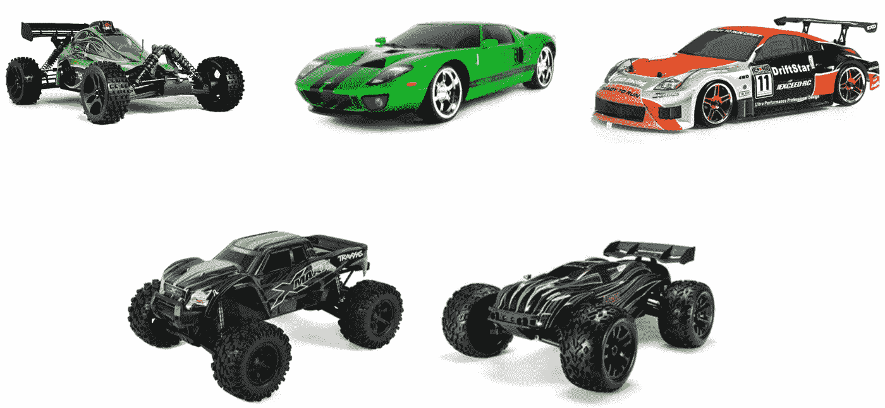

**图 1** 小车、街道、漂移、卡车、卡车(从左上至右下)

## **电子设备**

“硬件组件”一节解释了每个组件的选择。注意所用驱动器( [L298N 电机驱动器](https://tronixlabs.com.au/news/tutorial-l298n-dual-motor-controller-module-2a-and-arduino/))的接线与图 2 中的略有不同。DC 3V 电机有一个指向相反方向的额外轴(两者同步移动)。

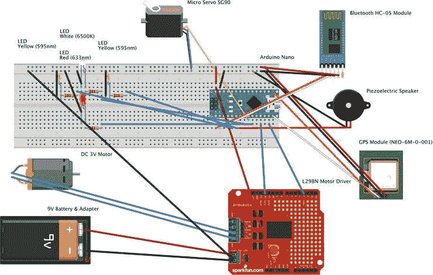

**图 2** 汽车电路示意图

## **设计**

使用 CAD 软件 SolidWorks 对 RC 汽车的所有部件进行建模。完整的模型(图 3)被分成几个组件(这意味着要单独进行 3D 打印):车轮，底盘，L 形车轴，连杆和车身。最后一个结构的形状来自一个有趣的尝试，大致类似于联邦调查局的车辆(查看图 3，右图)。

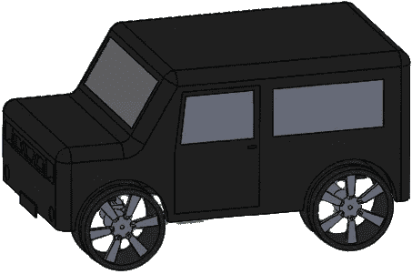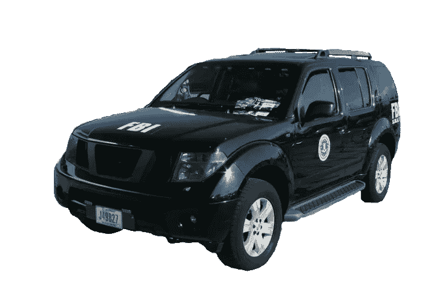

**图 3** 遥控车模型立体图

一开始，第一个要建模的部分是后轮。从 GrabCad 获得了一个[初始设计](https://grabcad.com/library/rc-drift-wheel-1-10-1)。然而，为了适应我们的模型，必须进行一些更改。由于这些轮子是要连接到电机上的(有一个双轴，一个指向右边，另一个指向左边)，所以必须建造一个具有适当长度和内径的圆柱形轴。我们在图 4(右图)中看到，空心内圆筒的形状改变了，以匹配电机轴的形状，而不是原来设计中的六边形空腔(图 4，左图)。

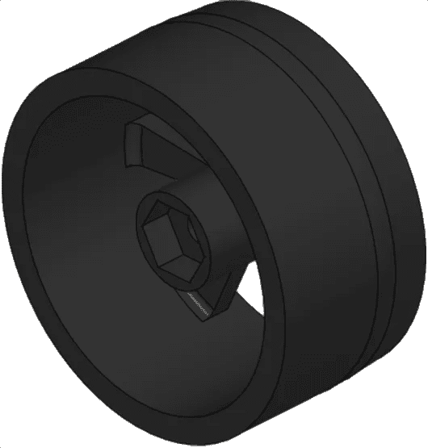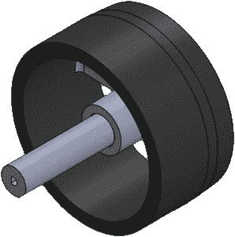

**图 4** 黑色车轮——原始设计/修改设计(从左至右)

需要特别注意的是，车轮是固定在双轴上的，因此，这两个车轮以电机的速度移动。对于两个前轮来说，情况并非如此。

相同的[原始设计](https://grabcad.com/library/rc-drift-wheel-1-10-1)被用在前轮上。然而，模拟的轴是完全不同的，因为这些轴意味着围绕一个垂直的假想轴旋转，与伺服机构的桨同步。这种移动被限制为每侧旋转 45°。两个车轮的车轴都设计成 L 形，一端为圆柱形，另一端为矩形。后者总是平行于伺服的桨，并有一个切口，在那里一个弹性被包裹和连接到桨(图 5)。

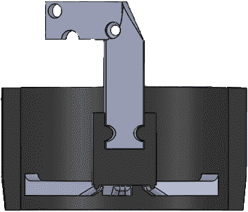

**图 5** 前轮 1 的剖视图。这里可以看到 L 形车轴的两个特征:松紧带缠绕的切口，以及车轴和车轮之间的连接

每根车轴的两端都用一根横杆连接起来，以保证车轮同时向两侧移动。此外，为了确保轮子以与伺服叶片相同的角度旋转，轴铰链中心和切口中心之间的距离等于叶片的长度(图 6)。

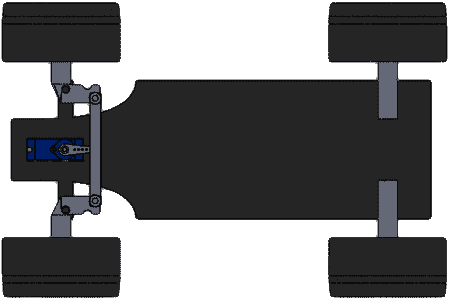

**图 6** 底盘仰视图。可以看到两个前轮车轴之间的连接

为了保证轮子的旋转，在轴的圆柱端增加了一个旋转切口，并在轮子上设计了一个互补的凸台(图 5)。为了使接头可拆卸，要保证内外半径相差 0.3 毫米。同样的原理也适用于两个轴上的铰链。因此，两个圆柱形结构建立在底盘的底面上，每个结构的末端都有一个旋转切口。每个轴角都有一个互补的结构，也有 0.3 毫米的差异。

至于汽车的底盘，除了已经提到的结构，还有另外两个特点值得一提。首先，在底盘上做了一个切口，以适应伺服系统，因为桨必须与轴处于相同的高度。第二，为了让轮子转动，必须在前面切割(图 7)。

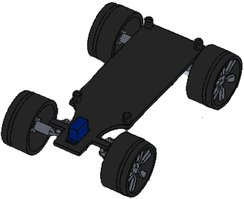

**图 7** 底盘、车轮、车轴和伺服系统的等距视图

最后，虽然由于尺寸和附件的性质，这部分没有打印出来，但车身也是经过设计的。我们确保包括各个照明系统的切口，用于(背面和正面)注册板的位置，以及 4 个与机箱顶面上的支架互补的支架——紧密连接两个部分。它显示在完全组装好的模型的侧视图、前视图和后视图的下方(图 8)。

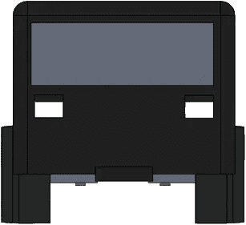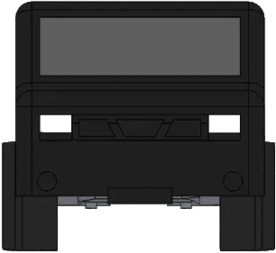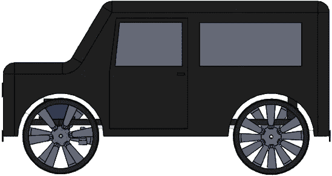

**图 8** 使用 Soliworks 建模的汽车原型的不同视图

这部分项目面临的最大挑战是前轮旋转系统的设计。这不得不重做几次，以允许伺服施加适当的运动。然而，这从来没有测试过，因为轴是要连接到一个弹性伺服的桨，这只能在印刷后完成。

此外，值得一提的是，为了实现最终设计，所有组件都必须重做多次，尤其是负责零件之间连接的切割和挤压。这确保了零件对齐并具有适当的尺寸。

建模后，就设计而言，主要目标是 3D 打印(使用 Ultimaker 2+扩展打印机—图 9)几个零件，并使用它们来构建模型。最后，所有的电子元件都被转移到了车上。

**图 9** Ultimaker 2+扩展

值得一提的是，打印机有尺寸限制，不允许我们打印车身。印刷需要使用 2.85 毫米的 PLA 细丝。虽然模型的一些较小的细节没有被完美地复制，但是印刷是非常成功的。

关于底盘底部设计的两个圆柱形结构(以适应 L 形轴)，它们最终稍微容易断裂。这是通过包装一些耐水龙头胶水解决的。此外，为了将车轴固定在底盘上，每侧都缠绕了两条松紧带，这有助于保持汽车的稳定性和所有部件的位置。换句话说，他们把两个部分推向对方。避免这些问题的一个方法是增加这些结构的尺寸。

前轮内部的旋转结构是为了配合车轴而设计的，填充了支撑材料(与汽车一起打印)。这需要精确的手工操作，以避免在拆卸时松开这些接头。虽然，后来，我们意识到由于 PLA 的膨胀，这两个部分不合适。这是通过刮胡子解决的。接下来遇到的问题是车轮不太安全，这导致它们随着汽车的运动而弯曲。解决方案是在每个前轮上粘一个铝环(在插入相应车轴的补充部分后)，并在每个接头处缠绕一些金属丝。

按照最初的设计，两个轴通过一根杆(使用 2 个螺钉和相应的螺母作为接头)和一根松紧带连接在一起。最初，这种弹性应该连接到伺服的桨。在测试了汽车的侧向运动并确认杆如果直接连接到桨上可以更好地翻转车轴后，我们决定用一根细金属丝将两者连接起来。因此，松紧带(平行于杆)被丢弃。伺服保持在适当的位置，用胶水把它粘在底盘的孔上。

对于前轮和后轮，沿着它们的周边分布热胶以增加地面牵引力。由于增加的直径，胶水条纹加到前轮上，底盘的一部分必须被刮掉，以避免汽车在侧向运动中发生颠簸。

最后，前、后和转向信号灯被粘在汽车通常的位置上。试验板和全球定位系统安装在背面。和底盘底部的 DC 3V 电机。所有其他组件都用几个橡皮筋固定在适当的位置，以保证它们不会影响汽车的运动或断开电路。

总的来说，尽管设计在印刷后需要一些修改，但结果是成功的。汽车能够稳定地移动，有足够的牵引力，完美地支撑所有部件的重量。此外，印刷成本可以忽略不计

## 优化的蓝牙模块将提高可操作性的范围，并减少命令(与应用程序一起给出)和有效执行的动作之间的滞后；

*   市场上有很多不同的电池。更轻、更耐用的电池将对汽车的自主性产生积极影响；
*   PCB(印刷电路板)将代替试验板，使汽车电路更耐用，更不容易发生短路或其他电气故障；
*   悬挂系统是另一种将来可以添加到项目中的结构。如果原型车打算在越野赛道上使用，这一特性就显得更为重要；
*   模型车身本可以更符合空气动力学。然而，由于这一部分没有与汽车的其余部分一起印刷(由于尺寸和时间的限制)，这在设计中没有得到优先考虑；
*   给汽车安装摄像头可以让我们在看不见的地方控制它；
*   几个部分都是要用塑料印刷的。使用其他低成本材料，如用于车轮的橡胶和用于车轴/底盘的一些金属合金，将使我们能够创建一个增强且仍然便宜的模型。
*   应用

# **图 11** RCar 应用

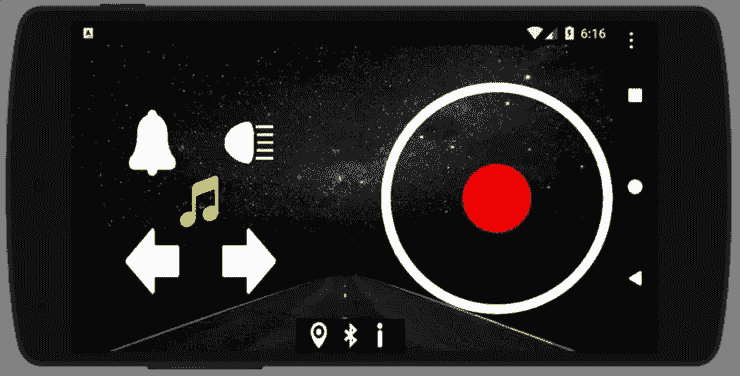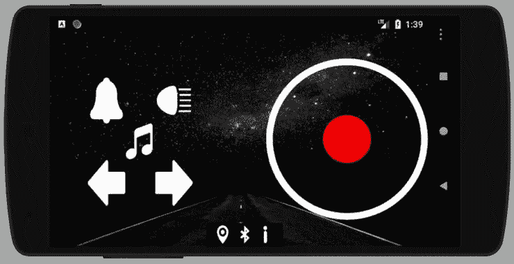

在 [Play Store](https://play.google.com/store/apps/details?id=appinventor.ai_luis20dr.RCar) 或 [MIT App Inventor Gallery](http://ai2.appinventor.mit.edu/?locale=en#5247514752188416) 查看 RCar 应用。

**安卓应用**

## 使用麻省理工学院应用程序 Inventor 2(图 12)，我们开发了一个 Android 应用程序，它能够使用蓝牙连接控制 RC 汽车的许多功能。具体来说，后轮的角速度，前伺服的旋转角度，喇叭，音乐，灯光和 GPS 组件。

**图 12a** MIT App Inventor 2 标志

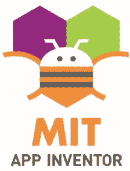

**图 12b** MIT App Inventor 2 编程界面

一旦应用程序有了许多控件(一个操纵杆和几个按钮)，我们就需要清楚地定义 Arduino 接收的数据源。这尤其重要，因为我们只能向 BT 模块发送一种类型的值(字符串、字节或整数)。应用程序和 Arduino 之间的通信是使用 1 字节数字完成的。因此，每个命令都与一个从 0 到 255 的特定整数相关联。

GPS 模块的加入最终增加了应用程序的复杂性。原因是，在某些时候，应用程序发送值，而在其他时候，接收经度和纬度坐标。由于这些数字有大量的十进制数字(这是达到可接受的定位精度所必需的)，所以传输它们并不特别容易。问题的根源是实时传输这两个值，并且不与先前接收的值重叠。

与 GPS 模块发生的情况类似，操纵杆动作不容易协调。同样，水平和垂直坐标的传输是通过在它们的传输之间包括一个小的延迟来完成的。这是经过仔细调整的，因此 Arduino 不会将 x 理解为 y，也不会将 y 理解为 x。同时，为了防止重叠的信号传输。此外，还避免了应用程序命令按钮中常见的一系列数字。

如上所述，单一通信信道的存在阻止了我们一次传输多个值。因此，在尝试发送新指令时，应小心禁用所有先前激活的定时器命令。

另一个我们无法控制的问题是麻省理工学院应用程序 Inventor 2 中仍然存在的大量错误。在项目开发过程中，我们在对蓝牙模块(HM-10)的最新版本进行编程时，遇到了大量意想不到的问题。麻省理工学院应用程序 Inventor 2 中的 BLE(蓝牙低能耗)库在其功能工具方面仍然非常有限。我们最后用了 HC-05。如果我们的目标是传输零星的开/关值，比如在一个按钮或一组按钮的情况下，这就可以了。但是，就目前而言，在非常短的时间间隔内发送许多值(如操纵杆为获得实时响应命令所请求的那样)会使仍处于 AI2 同伴模式的应用程序崩溃，或者在构建应用程序之后崩溃。

**用户指南**

## 为了使用该应用程序，第一步是进入智能手机的定义，并与汽车的蓝牙接收器配对，该接收器的名称为 HC-05。(默认)密码是 1234。完成此步骤后，打开应用程序，单击屏幕底端的蓝牙图标，并与模块建立连接。该应用程序控制的所有功能——前灯、转向灯、喇叭、音乐播放器和操纵杆——现在都可以使用了。GPS 的图标在蓝牙图标旁边，也可以访问(注意，它在室内不起作用)。在图 13 中，描述了应用程序的一些特性。

**图 13**RCar app 主要功能描述

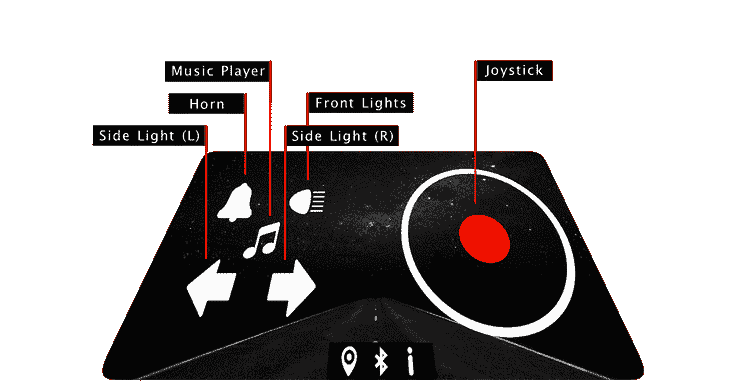

**未来改进**

## 根据稳定性和内存要求开发改进的应用程序；

*   扩展跨移动设备的兼容性:创建 iOS 版本；
*   引入实时 FPV(第一人称视角)功能将允许我们控制汽车，而不用让它保持在我们的视野范围内。因此，允许一组全新的应用程序。
*   视频 2 — RCar 项目[DIY]

关于

# 在里斯本大学高级技术学院 Luís Sousa 教授的指导下，开发了一辆遥控汽车和相应的应用程序。

与本项目相关的所有应用程序、CAD 文件和装配图都是免费的。而且永远都是…

> 路易斯·丽塔&萨拉·弗雷塔斯

这个项目中使用的东西

# 硬件组件

## Arduino Nano R3——使用 Arduino Nano，我们能够降低能耗并提高最终项目的可移植性。这是以牺牲一些计算能力为代价的。由于这个 Arduino 的模型只有 2 个串行连接(RX 和 TX-用于在蓝牙模块和 Android 应用程序之间传输数据)，我们需要包括一个额外的串行端口来接收智能手机中 GPS 模块的位置值；

*   DC 3V 电机-电机由 9V 电池供电，由 L298N 驱动器控制。它有两个轴(一个指向右边，另一个指向左边，同步移动)；
*   在 Arduino 脚本中，SG90 微伺服电机伺服的旋转下限和上限分别为 45 度和 135 度。避免汽车车轮的过度旋转。我们首先在我们的项目中使用了一个旧的伺服系统，但是由于坏的润滑齿轮，它被一个新的取代了。这样，我们消除了抖动，大大提高了角度精度；
*   电阻 220 欧姆-我们包括几个电阻，以限制通过发光二极管的电流强度；
*   led(红色、黄色和白色)-关于车辆中存在的不同灯，我们总是包括一个电阻，以限制通过二极管的电流强度。这是在(2)前，(2)后和(2)转向信号灯上完成的。这些灯完全由 RCar 应用程序控制，除了后面的那些在汽车向后加速时自动打开的灯；
*   HC-05 蓝牙模块-蓝牙模块采用了类似的方法。虽然，在这种情况下，我们在电路中包括一个分压器，以便 HC-05 接收来自 5V Arduino 端口(TX)的一半电压(在 RX 端口)。然而，这是可有可无的。因此，它没有包括在电路图中(图 2)；
*   L298N 驱动器-L298N 驱动器是一个电气部件，其行为类似于 H 桥。根据闭合的断路器，电流将沿两个不同的方向流过 DC 电机。这样，通过始终向 Arduino 施加正电压，电机可以顺时针或逆时针旋转。此外，它还控制轴的旋转速度。这两组中断器由驱动器中的 IN1 和 IN2 引脚控制；
*   GPS 模块(NEO-6M-0–001)-我们还决定在汽车中增加一个额外的功能— GPS。这可以以低于 3 米(半径)的显著精度(考虑到价格)检测位置。然后，带有红点的地图显示在应用程序中，位置正确。注意，由于 GPS 模块的限制，不可能在室内得到汽车的位置；
*   压电扬声器-电路中还增加了一个扬声器。每当点击应用程序的相应按钮时，就会发出声音信号。波形的持续时间和频率都是在 Arduino IDE 中定义的；
*   9V 电池-汽车由连接到 L298N 驱动器的 9V 电池供电。这既是对电机的供电，也是对 Arduino 的供电(因此，是对所有剩余电路的供电)；
*   9V 电池适配器-带有开/关按钮，更容易切断电路的电源；
*   试验板——先前组件之间的所有连接都在试验板中可逆地进行；
*   跳线-公-公、公-母和母-母线确保所有电气元件之间的连接；
*   M3x20 螺丝和螺母-这些是汽车的酒吧和每个 L 形轴之间的旋转接头；
*   橡皮筋- 2 个橡皮筋用于将 L 形轴压在底盘上，另外 5 个橡皮筋用于固定试验板顶部的所有非胶合部件；
*   金属环-每个前轮上有一个，以减少前轮和相应车轴的圆柱形部分之间的松动。事实上，这种结构是由 2×180 个环用热胶水粘合而成的。一旦环的内径需要与轴的最细部分具有大致相同的尺寸，这是安装两者的最简单的方法；
*   金属线-短而细的金属线用于连接汽车的酒吧和伺服的桨。这允许前轮转动；
*   热熔胶——我们用一管便宜但有效的热熔胶将大部分部件固定在汽车上。
*   软件应用和在线服务

## [Arduino IDE](https://www.arduino.cc/en/main/software)

*   [麻省理工学院应用发明者 2](http://appinventor.mit.edu/)
*   [Google Play](https://play.google.com/store)
*   [GitHub](https://github.com/)
*   [苹果 Final Cut Pro X](https://www.apple.com/final-cut-pro/)
*   [SolidWorks](https://www.solidworks.com/)
*   [GrabCAD](https://grabcad.com/)
*   [网络风暴](https://www.jetbrains.com/webstorm/)
*   [像素化器](https://www.pixelmator.com/pro/)
*   [烧结](http://fritzing.org/home/)
*   [草图制作](https://sketchfab.com/feed)
*   手工工具和加工机械

## 位于荷兰的 Ultimaker 2+Extended-Ultimaker-3D 打印机制造公司；

*   Android 智能手机- RCar 应用程序，目前仅适用于 Android 用户。要求安卓 2.2 以上；
*   热胶枪-热胶水分配器。它会升温并向周围喷射。
*   定制零件和外壳

# CAD 模型

## “打包”一套 SolidWorks CAD 文件(SLDPRT 和 SLDASM)。换句话说，打印全车所需的一切。

[下载](https://hacksterio.s3.amazonaws.com/uploads/attachments/556224/rcar_cad_JQ8qKl3YSh.zip)

RCar

## 装配了所有 SolidWorks 零件的完整模型。仅供预览。这个文件包含在以前的包中。

[三维模型](https://skfb.ly/6BGJ8)

图表

# 电路

## 1.由于缺少与我们在项目中使用的电机驱动器(L298N 驱动器)类似的电机驱动器，我们用另一个少一个输入端口(定义电机轴的旋转方向)的型号代替了它；
2。DC 3V 电机有一个双轴，而不是。

密码

# 麻省理工学院应用程序发明者 2 (Java)

## Android 应用程序就是用这段代码创建的。你将需要访问麻省理工学院 AI2 网站并导入文件进行可视化或编辑。
注意:MIT App Inventor 2 是一种基于 Java 的编程语言。

完成 MIT App Inventor 2 [代码](http://ai2.appinventor.mit.edu/?locale=en#4712138577149952) ( [下载](https://hacksterio.s3.amazonaws.com/uploads/attachments/556228/RCar__6_.aia))

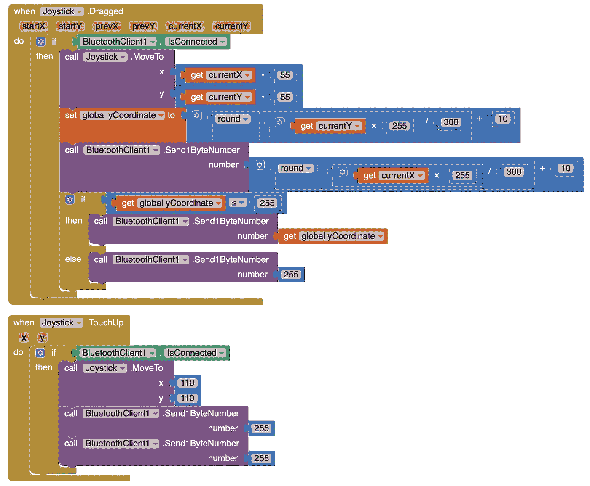

阿尔杜伊诺

## Arduino Nano 中实现的整套指令。我们提醒您注意需要导入的库。

完成 Arduino [代码](https://create.arduino.cc/editor/warcraft12321/90858a7e-12c9-48ab-a765-b7355e14e936/preview)

Complete Arduino [Code](https://create.arduino.cc/editor/warcraft12321/90858a7e-12c9-48ab-a765-b7355e14e936/preview)