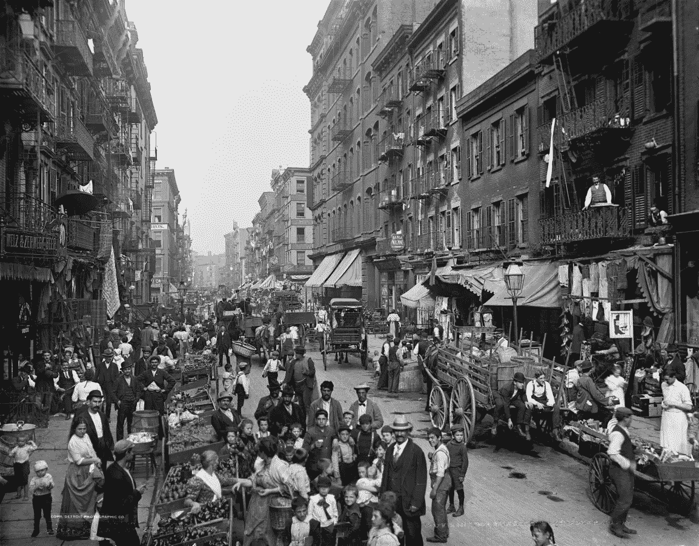

# 重现历史

> 原文：<https://towardsdatascience.com/re-animated-history-6b5eb1a85efa?source=collection_archive---------36----------------------->

## 正在使用的深度学习模型

历史形象，被#去理想化和# 3d 化

我们学习了[各种奇妙的模型](/14-deep-learning-uses-that-blasted-me-away-2019-206a5271d98?source=friends_link&sk=4ac313764b2ca90e765566714dd2c88e)，由深度学习驱动。从长远来看，你可以称之为**数据驱动的可视化复兴**。但是，对于人工智能图像处理的所有这些多种方式，我们能做些什么呢？*特别是如果我们结合各种 DL 方法*。

## 你可以建造一台时间机器。

这里有一个有趣的例子，一个图像在激发团队合作中变得活跃的速度有多快。以及意想不到的事情是如何发生的。

这里是[桑街](https://en.wikipedia.org/wiki/Mulberry_Street_(Manhattan))、纽约市*曼哈顿*、曾经的心*小意大利*:

来源:([维基](https://commons.wikimedia.org/wiki/Category:Mulberry_Street_(Manhattan)#/media/File:Mulberry_Street,_New_York_City_(LOC_det.4a08193).jpg))

[Jason Antic](https://medium.com/u/13ad5d836603?source=post_page-----6b5eb1a85efa--------------------------------) 是 [DeOldify](/deoldify-gan-based-image-colorization-d9592704a57d) ( *DL 驱动模型，允许给 B & W 照片*上色)的开发者，他经常在他的 twitter 时间轴上展示[他工作的最新成果:历史图像正在恢复它们的色彩和新鲜感。](https://twitter.com/citnaj)

昨天他上传了上面的图片，被#DeOldified:

注意细节的分辨率和调色板的丰富性！你可以没完没了地思考曼哈顿老街的复兴(在电影、书籍和电影中经常被提及):

例如，杰森发现了有趣的小细节(历史的人文因素在每一种形式中都令人着迷):

另一位推特用户发现了时光旅行的奥兰多·布鲁姆:

在这里，你可以看到另一个人生动的童年:

甚至这个:时光机。

整个构图几乎恳求虚拟化。

## 示意图片

所以我添加了由西蒙·尼克劳斯开发的 3D 本·伯恩斯方法:

或者，更好的质量:

3D 本·伯恩斯方法最适合这种清晰的消失点图像。图片被分成不同的空间层，层后的背景空白被内容敏感的修补填充。

上面这样的模拟跟踪拍摄，是有说服力的。然而，它仍然可以通过更多的动力得到改善。[乔纳森飞](https://medium.com/u/6229bfa739?source=post_page-----6b5eb1a85efa--------------------------------)做到了。他微调了 3D 本·伯恩斯相机的设置:

试验参数创造新的愿景:

然而，他甚至完美地夸大了设置，直到一个过高的质量:

你再也认不出最初的图像，但你会发现图像背后新的**边界，是人工智能虚构出来的*:***

因此，在人们敏锐的思维和深度学习的结合下，历史镜头的交互式检查已经成为对现实极限的迷人探索。

深度学习不仅仅可以打开新的领域，它还可以开阔我们的思维。