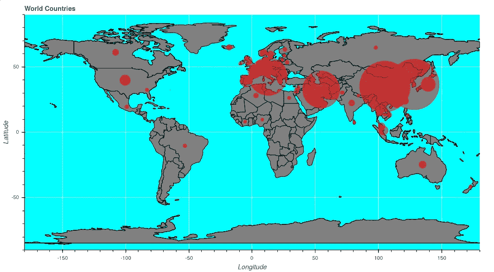

# 角度反应事件和 Python 后端驱动的散景图

> 原文：<https://towardsdatascience.com/reactive-event-and-python-backend-driven-bokeh-charts-in-angular-6fc23d608eeb?source=collection_archive---------22----------------------->



引用。:摘自[http://infographics.quantecdc.es:8080/dashboard](http://infographics.quantecdc.es:8080/dashboard)

如何克服 ajax 调用的缺点，让散景图更具反应性。

# 为什么通过 Ajax 方法进行数据轮询是一个死胡同

当谈到定期更新的数据视图时，来自 web 前端的 Ajax 调用似乎是准标准。但是 Ajax 调用使用轮询技术。这意味着客户端通过 http 调用在每个时间段向服务器端请求新数据，这有几个缺点:

*   降低视图的整体反应速度，尤其是当轮询时间低于 50 毫秒时
*   当你必须事先决定你想承认哪一个延迟时间时，轮询时间是至关重要的。如果您希望在数据更改事件上有短暂的时间延迟，轮询肯定不是最佳选择。
*   即使数据根本没有变化或者保持在非关键范围内，轮询也会永远进行下去，这是网络和服务器上的额外负载，尤其是当数据平台需要随着数据量和视图请求的增加而扩展时。

这也是为什么事件驱动的更新技术总是优于轮询技术的原因。我们将向您展示如何在[角度散景](https://github.com/NuCOS/angular-bokeh)设置中实现这一点。

# 角度事件

Angular 已经实现了一种内在的事件驱动机制，这就是为什么将 Python 的异步范例与 Angular 事件检测结合起来显然是非常有吸引力的。

在 Python 方面，处理异步的最成熟的 web 服务器是 aiohttp。它还提供了一种简单的可能性，即打开一个 websocket 服务器，Angular 客户机可以连接到这个服务器上。

在我们发表的关于 angular 和散景图结合的上一篇文章中，我们通过 websocket 连接将 json 格式的图表发送到 Angular。但是仍然依赖 ajax 调用来更新图表，因为 BokehJS API 主要提供了用于嵌入图表的黑盒嵌入方法。在深入研究了 Bokeh-API 之后，似乎不使用 embed 方法而是一步一步地进行嵌入是非常可行的。因此，我们能够提取 Bokeh 文档对象，并从该对象中访问数据源。

由于互联网上有很多可用的视图示例，我们决定就如何处理源对象以及如何使用它来将更新范例更改为事件驱动给出一点见解。

# 源对象更新

我们现在把重点放在有角的一面。在 item.doc 中接收到用 Python 以 json 格式生成的 chart-item 后，我们可以用

```
const doc = Bokeh.Document.from_json(item.doc);
```

可以通过调用从文档中提取源对象

```
const source = doc.get_model_by_name('my-tiles').data_source
```

其中在数据模型的后端也使用相同的名称“my-tiles”是很重要的。嵌入现在像这样工作

```
const roots: Roots = {[item.root_id]: el}; Bokeh.embed.add_document_standalone(doc, el, roots, false);
```

其中元素是 Http 元素，通常可以通过它的 id 获得。

```
const el = document.getElementById(id);
```

前一行的文档与散景文档无关，只是全局 app 文档钩子。既然我们已经访问了源代码，那么继续我们通常的事件驱动更新就不那么困难了。

```
public getNumberChartData(source: any) { const callbackId = 'numberChartData'; this.messageService.awaitMessage().pipe(filter(msg => msg.name === callbackId)) .subscribe( msg => { source.data.label[0] = msg.args.number; source.data.color = msg.args.color; source.change.emit(); }); }
```

每当相关的 websocket 消息到达 MessageService 时，就会调用 source change 事件，这将导致固有的图表更新。对于任何新源，该订阅必须只进行一次，并且应该确保当图表组件被移除时，订阅被取消订阅。

# Python 方面:观察者和可观察对象

当谈到异步编程时，似乎仍然必须寻找最佳实践的例子。异步范式令人困惑，因为它打破了简单的未来，将异步编程有效地简化为三件事:异步、等待和循环浮动。由于大多数例子都是单一的、小的，所以首先似乎很难将整个项目设置为异步的，尤其是当人们试图将异步和非异步功能结合起来的时候。有时甚至不可能引入异步，例如常用的 **init** 函数。它只是不接受前面的异步。

同样令人吃惊的是，循环主要是作为一个持久的阻塞调用，循环内的所有东西都要被关注，而循环外的所有东西都将永远消失。这并不完全正确，但是根据我们的经验，当运行到完成时，如果一切都在循环内，这是最佳实践。

为了切换到一个完全事件驱动的范例，如果我们在模块 nucosObs 中引入一个观察者可观察的范例，设置起来会容易得多。因此，我们构建了一个简单而强大的观察者机制，它允许避免将每个方法引用分配到我们想要调用它的地方。另一方面，我们现在必须分配可观测量，这些可观测量为任何正在监听可观测量的观察者携带信息。此外，我们对可观测量内部数据的反应方式可以在事后很容易地单独调整。

所有的可观测数据都是在所谓的接口中输入的。例如，这可以是控制台或 websocket 服务器上的文本输入。在界面上，我们可能只关注如何从数据源获取数据，并将其输入到可观察对象中。这个任务与处理数据的任务是完全分离的。在遗留上下文中，回调通常连接到数据，但即使这样，在这里也不是必需的。

另一方面，观察器是在开始主循环调用之前设置的。但它们包含了所有固有的反应。它们监听可观察对象，并为任何目的解析数据，甚至通过调用后续方法。解析功能可以非常容易地个性化。

作为一个额外的奖励，观察员可以很容易地安排单一或定期的任务。

*最初发表于*[*【https://github.com】*](https://github.com/NuCOS/angular-bokeh/wiki/Reactive-event-driven-Bokeh-Charts)*。*