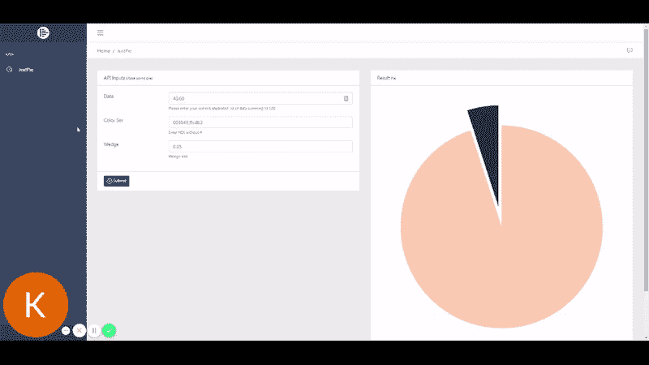

# Heroku 上的 ReactJS + Python 烧瓶

> 原文：<https://towardsdatascience.com/reactjs-python-flask-on-heroku-2a308272886a?source=collection_archive---------3----------------------->

## 为 API 开发和部署制定框架


马库斯·斯皮斯克在 [Unsplash](https://unsplash.com?utm_source=medium&utm_medium=referral) 上的照片

我真的很喜欢做东西，但我真的讨厌部署。我有一堆想法，放在我的本地机器上，只是积满灰尘，因为我懒得部署它们让全世界看到。在过去，我一直试图从零开始建立自己的服务器。这包括安装所有的 linux 包，处理 nginx 配置和所有我不喜欢的服务器管理工作。在我的开发生涯中，出于某种原因，我从未听说过 Heroku。Heroku 是我所需要的完美人选。它基本上允许你连接一个 git 存储库，当你把它推到他们的远程时，它会自动计算出你在运行什么(检测 flask 或 node.js 等),并自己完成构建。实际上只是将代码推向生产，没有服务器端的麻烦。

为了纪念我新发现的最好的朋友，我想展示如何构建一个简单的 ReactJs + Flask 框架，我将用它作为我今后开发 API 和 Web 应用程序的模板。这里的想法是让一些 ***可重用*** ，这样我就可以克隆回购协议，开始做一些新的事情，而不需要重做任何步骤。

# 建立 Heroku

为此你所要做的就是去 www.heroku.com 注册一个账户。一旦一切就绪并登录，您应该会看到这样一个屏幕，显示您当前的应用程序:


我的 Heroku 仪表板

然后你所要做的就是点击右上角的**新建**按钮，创建你自己的新应用！是的，确实是这样。

据我所知，它基本上在他们的服务器上为我们建立了一个 git 存储库，它与我们的用户帐户相关联。这意味着我们现在可以在 heroku 上向这个应用程序推送代码。问题是如何做到这一点？这是你必须下载 Heroku CLI(命令行界面)的地方。这允许我们运行命令行命令来登录和推送代码等。CLI 可在此下载:

[](https://devcenter.heroku.com/articles/heroku-cli) [## Heroku CLI

### Heroku 命令行界面(CLI)使得直接从终端创建和管理您的 Heroku 应用程序变得非常容易…

devcenter.heroku.com](https://devcenter.heroku.com/articles/heroku-cli) 

请确保为您的系统下载它。安装完成后，你可以打开一个终端并运行 **heroku 登录**，这会打开一个网页浏览器让你登录你的账户。

## 其他软件

你还需要一些其他的软件。我不打算详细说明如何安装它们，但我会在这里列出它们。

*   Git:这是一个仓库管理系统
*   Python:这当然是 Python。我会推荐 3.7.x，因为这是我正在使用的！
*   NodeJS/NPM:用于反应堆开发部分

# 本地设置

现在，所有的软件都已安装，我们将设置我们的目录，并开始制作我们的 API 和客户端前端接口。首先，我们要创建一个新目录(注意:我用 **datastuffplus** 来命名我所有的东西):

```
mkdir datastuffplus
cd datastuffplus
git init **<--- This makes the current folder into a repo****# Links the repo to our heroku project!**
heroku git:remote -a datastuffplus
```

至此，我们所做的就是创建一个链接到 Heroku 项目库的目录。这意味着当我们添加代码并提交/推送时，它会被 Heroku 和 self 部署。接下来，我们可以使用 Flask 构建一个简单的 API。

# 构建 Flask API 和 Web 服务器

我们的 flask 服务器将做两件主要的事情。第一个是服务的网页文件，使我们的最终网页(前端)。第二个是充当 API 服务，完成一些 python 特定的任务，并将结果发送回前端网站。

首先为我们的 python 安装生成一个虚拟环境。这允许我们将这个环境从我们的系统中隔离出来。如果您需要在这个项目上安装某些版本的包，而在另一个项目上安装不同版本的包，这将非常有用。

```
python -m venv venv/
```

要使用这个环境，我们需要激活它。根据您的操作系统，它可能看起来有点不同，但在 Windows 上，我们运行:

```
cd ./venv/Scripts/
activate.bat
```

接下来，我们安装 python 包，并为部署到 Heroku 做好准备。请注意，因为我们在活动的 **venv** 中，所以软件包只安装在这个隔离目录中。太好了。

```
pip install flask flask-cors gunicorn boto3 matplotlib
```

上述 python 包适用于以下情况:

*   **烧瓶**:主服务器功能
*   **flask-cors** :用于跨原点请求。基本上允许您在不违反安全性的情况下从不同的系统调用端点
*   gunicorn :这是一个生产服务器包，Heroku 使用它来为站点提供服务
*   **boto3** :这个包用于访问 Amazons S3 存储桶(把它想象成一个基于云的目录来存储文件) **NB** :由于 Heroku 不能保证文件在停止运行后的持久性，所以使用这种云存储是非常重要的
*   **matplotlib** :用于制作地块的包。这很重要，因为我们的测试 API 将使用它来生成一个饼图

在我们真正编写服务器代码之前，还有几个步骤。为了跟踪所有需要的包，Heroku 需要一个***requirements . txt***文件，它基本上列出了我们已经安装的所有 python 包。要做到这一点，我们只需运行:

```
pip freeze > requirements.txt
```

## 饼图 API

那么我们真正想要创造的是什么呢？我想要的一件事是一个漂亮的高分辨率饼图，用来展示我制作的一些图形。我通常使用 python matplotlib 来完成这项工作，但是如果我每次都需要实际运行 python，这就有点烦人了。所以，让我们把它变成一项服务，让我的生活更轻松，也让其他人可以使用它！奖金！

第一步是始终只定义完成工作的函数。下面我粘贴了制作饼状图并保存到本地的函数:

```
def GeneratePie():
 **# Get the input data (Wedge is the distance between slices)**    data = [60,40]
    colors = ['#003049','#ffcdb2']
    wedge = 0.05 **# Make a matplotlib (high res) pie chart!**    fig1, ax1 = plt.subplots(figsize=(20,20))
       patches, texts = ax1.pie(data,explode=[float(wedge) for w in
       range(0,len(data))], colors = colors, startangle=90) **# Equal aspect ratio ensures that pie is drawn as a circle**    ax1.axis('equal')
    plt.tight_layout() **# Save the image temporary on the local machine**    plt.savefig(os.getcwd() + '/test.png');
```

输出如下所示:


啊太好了！

所以我们现在有了我们想要的函数。下一步是将它包装在我们的 flask 服务器中。

在您的工作目录中创建一个名为 **app.py** 的新 python 文件。裸露的骨骼看起来是这样的(我们稍后会填充):

我们做的第一件事是导入我们需要运行的包

```
from flask import Flask,
    render_template,send_from_directory,request, jsonify,
    make_response
from flask_cors import CORS, cross_origin
import boto3
import os
```

接下来，我们将定义 flask app 对象，并设置静态文件夹和 URL:

```
app = Flask(__name__ 
    ,**static_folder**='client/build',**static_url_path**='')
cors = CORS(app)
```

在上面的例子中，当我们还想为前端网站提供服务时，静态文件夹和 url 是很重要的。 **static_folder** 将指向我们的 ReactJS 前端的构建版本，并且 **static_url_path** 需要被设置，否则构建将引用所有错误的位置。即。CSS 文件的路径将会是相对于位置的，如果你不指定它，它们将无法被找到！

```
[**@app**](http://twitter.com/app)**.route('/api')**
[@cross_origin](http://twitter.com/cross_origin)()
def Welcome():
    return "Welcome to the API!!!"[**@app**](http://twitter.com/app)**.route('/api/justpie/')**
[@cross_origin](http://twitter.com/cross_origin)()
def GeneratePie():
    ....[**@app**](http://twitter.com/app)**.route('/')**
def serve():
    return send_from_directory(app.static_folder, 'index.html')if __name__ == '__main__':
    app.run(host='0.0.0.0')
```

在上面的框架代码中，我们看到了服务器的三条新路由。这些充当您可以通过 web 浏览器调用的端点。

*   【T6**@ app****。route('/api'):** 这是将作为 api 调用基础的路由。它现在所做的就是发回一个愉快的小信息！
*   [@ app](http://twitter.com/app)。route('/api/justpie'): 这个端点完成了大部分工作。我们将在这里调用之前的饼图生成函数(做了一些修改，通过 get 请求接收用户输入，并将最终图像存储在 S3 桶中)
*   [**@ app**](http://twitter.com/app)。route('/'): 这个根端点将指向 ReactJS 代码的构建版本，我们将在这里调用端点并在 web 浏览器中显示结果。

既然已经建立了框架，我们需要看看如何将独立的 python 函数修改成 flask 可调用函数。

## 修改功能

上面的 GeneratePie()函数有两个主要的变化。

1.  我们需要通过 GET 请求接收来自客户端的输入
2.  将最终文件存储到亚马逊 S3 存储桶中，这样它可以在 Heroku 重启后继续存在

为了进行第一次修改，我们替换以下代码

```
data = [60,40]
colors = ['#003049','#ffcdb2']
wedge = 0.05
```

随着

```
**# Get the input data from the request**
data = request.args.get('data')
colors = request.args.get('colors')
wedge = request.args.get('wedge')**# Turn it into a list**
data = [float(i) for i in data.split(',')]
colors = ['#'+i for i in colors.split(',')] **<-- Adding # to string**
```

数据传递的方式是通过 web URL。例如，为了模仿原始函数中的操作，您可以将 API 调用为:

> http://localhost:5000/API/just pie/？data=10，10，80&colors=003049，ffcdb2，0fc9b2&wedge=0.02

你可以看到我们是如何传递参数的。

> 注意:颜色没有使用标签，因为它是一个特殊的字符，所以我们只是在把它变成一个列表的时候加上这个标签

第二个变化是替换代码:

```
**# Save the image temporary on the local machine** plt.savefig(os.getcwd() + '/test.png');
```

随着

```
**# Save the image temporary on the local machine**
plt.savefig(os.getcwd() + '/test.png');**# Connect to the S3 bucket and just drop it on there**
s3 = boto3.client('s3', aws_access_key_id=**ACCESS_KEY**,
    aws_secret_access_key=**SECRET_KEY**)
s3.upload_file(os.getcwd() +
    '/test.png',bucket,'test.png',**ExtraArgs={'ACL':'public-read'}**)**# The return will be a json where message contains the image path (URL)**
status = {};
status['status'] = 'DONE';
status['message'] = '[https://'+**bucket**+'.s3.ca-central-1.amazonaws.com/test.png'](https://'+bucket+'.s3.ca-central-1.amazonaws.com/test.png')return make_response(jsonify(status), 200)
```

在上面有几样东西可以看看:

1.  我们仍然在本地保存文件，但是我们随后连接到 S3 存储桶来上传文件
2.  ACCESS_KEY 和 SECRET_KEY 来自你自己的亚马逊账户。我不会详细介绍如何设置它，因为有上百万篇文章，而且它非常无缝！extra args = { ' ACL ':' public-read ' }用于使文件公开。
3.  最后，你可以看到我们发回了一个 json 响应，给出了我们的公共 S3 桶的上传位置 URL。这可以被前端用来向用户显示结果。

所以现在我们的 API 已经准备好了！现在我们所要做的就是得到一个前端网站来展示它！

# 与 CoreUI 的反应前端

对于前端，我使用 ReactJS 来制作一个简单的仪表板并与 API 交互。我不打算深入讨论仪表板样式本身的细节，但是会涉及它如何与 API 交互。我使用的模板来自

[](https://coreui.io/react/) [## 免费 React.js 管理模板 CoreUI

### 时间是我们最宝贵的资产，因此我们希望通过创建简单、可定制、易于学习的工具来帮助您节约时间…

coreui.io](https://coreui.io/react/) 

这是一个非常棒的免费管理面板，可以在 react 和许多其他框架中使用。我刚刚下载了它并解压了 zip 文件。只要你已经安装了 npm，你就可以运行安装程序来获得需要的包，然后用

```
mkdir client
cd ./client/
npm install
npm start
```

所有我决定放在 **app.py** 旁边的**客户端/** 子目录中的文件。


我现在的目录结构的例子。请注意客户端子目录。

实际调用并显示结果的 ReactJS web 部分如下所示:

```
**# Define the function (functional components not classes)**
const JustPie = () => { **# Set up the state variables**
  const [downloadLink, setDownloadLink] = useState(""); **# Image** **# Default settings for our form**
  const [data, setData] = useState("40,60");  
  const [colors, setColors] = useState("003049,ffcdb2")
  const [wedge, setWedge] = useState(0.05); **# NB: This URL will changed depending on your release!!!**
  const api_base_url =
     '[http://datastuffplus.herokuapp.com/api/justpie/'](http://justpie.herokuapp.com/api/v1/') **# Function to fetch the data from our API**
  function fetchData(){ **# Set the image to be empty**     setDownloadLink(''); **# Build up the endpoint to our API**
     var url_req_string = api_base_url+ "?data=" + data + "&colors="
        + colors + "&wedge=" + wedge; **# Fetch the URL and parse the JSON response  **  
     fetch(url_req_string)
        .then(res => res.json())
        .then(
          (result) => { **# Set the image to be the API return "message"** 
            setDownloadLink(result.message);
          }, (error) => {
            console.log(error); }
        );
    };**# The rest of the code that runs the actual render**
return (<> </>)
```

上面简单地调用了一个对我们的 API 的获取，并更新了下载链接的状态，这是 S3 桶图像 URL。

最后，为了完整起见，页面呈现中出现的下一部分显示了状态变量如何连接到表单:

```
**# Update the data when the form changes**
<CInput type="text" id="hf-text" name="hf-text" placeholder="40,60" autoComplete=""   
**value={data}**
**onChange={(event)=> setData(event.target.value)}**/>**# Call the API on a button press** <CButton type="submit" size="sm" color="primary"
**onClick={() => fetchData()}**>
```

就是这样！您可以通过运行以下命令来检查它的外观:

```
npm start
```

我的本地设置如下所示:


正如您所看到的，我们有输入表单以及输出结果部分！现在这一切都在本地运行，最后一步是将其部署到 Heroku。

# 部署到 Heroku

为部署做好准备还有最后几个步骤。我们需要为我们的服务器建立一个 Procfile 并构建 React 代码，这样我们的 flask 服务器就可以发送结果了。

## Procfile

您所要做的就是创建一个名为 **Procfile** 的新文件，并在其中填入:

```
web: gunicorn app:app
```

## 反应生成

另一个简单的步骤是，一旦你进入**/客户端/** 目录，你可以运行:

```
npm run build
```

这将生成一个名为 **/client/build/** 的新目录，这是我们的 Flask 服务器在根路径上指向的位置。

> 注意:构建步骤可能需要一些时间，这取决于你的应用程序有多大

最后，我们可以将所有文件添加到 git 存储库中，如下所示:

```
git add .
git commit -am "All of teh codes"
git push heroku master
```

这也要花很多时间，所以去喝杯咖啡吧。一旦推送完成，你会看到 Heroku 自动检测到你正在推送一个 Flask 应用程序，它会为你的安装所有的包和服务器！如果你曾经尝试过自己做，这是疯狂的！


该版本在控制台中的外观

在所有这些艰苦的工作之后，我们可以看到我们创造了什么，并且可以与大众分享。看看这个视频，看看它是如何工作的！



最后这里是你可以自己尝试的链接！

[***http://labs . datastuff . plus***](http://labs.datastuff.plus)

> 如果你有问题或需要有人就你的项目进行咨询，请给我发消息到 kyleanthonypastor@gmail.com，如果你在 instagram 上，请关注我@ datastuffplus。