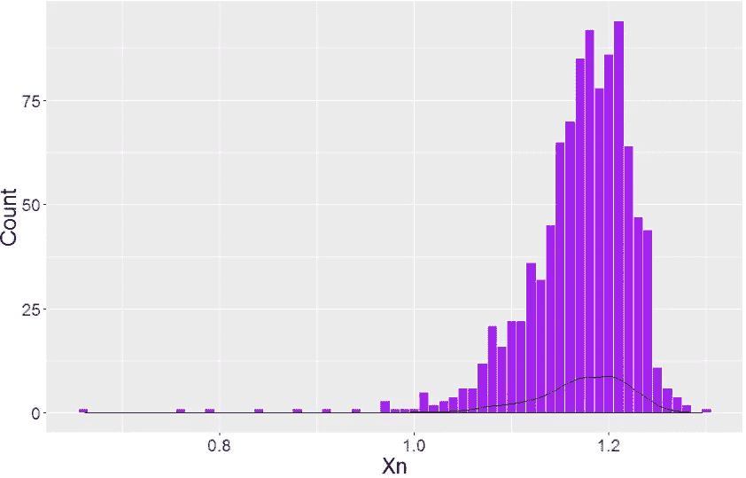
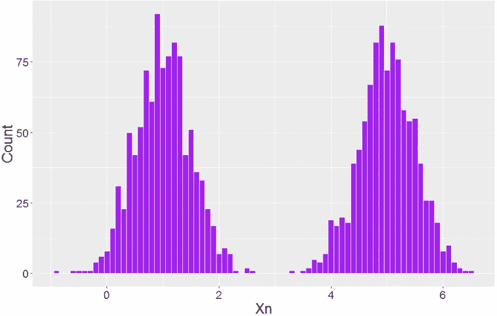
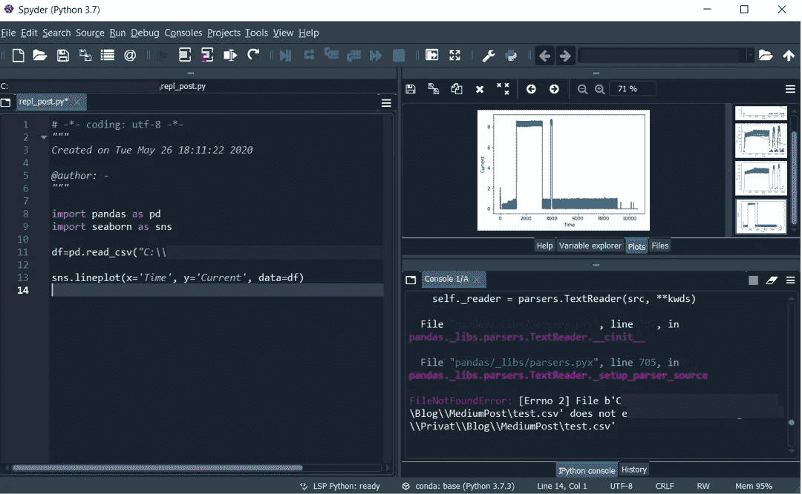
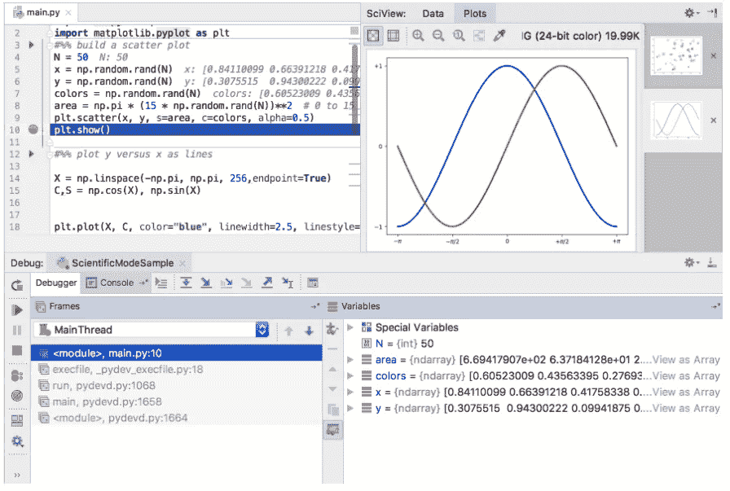
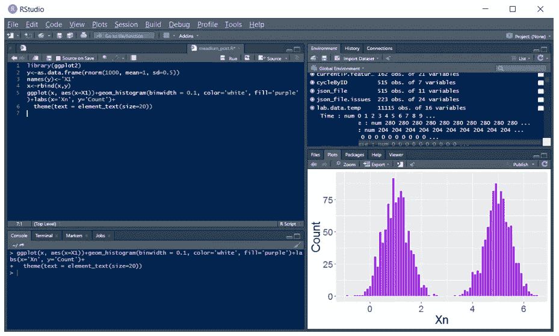

# 数据科学中的“读取-评估-打印-循环”环境

> 原文：<https://towardsdatascience.com/read-evaluate-print-loop-environment-in-data-science-e9668aadf98?source=collection_archive---------72----------------------->

这里有很多类似“*为什么 Python 比 R* 好，反之亦然”的文章。我们还需要另一个吗？所以，最近我花了几周时间将一个项目从 R 移植到 Python。我意识到有一个重要的特征在 99%的文章中被完全遗忘了。在这篇文章中，我将讨论这个话题，并分享我对在数据科学任务中实现强大的 REPL 环境的重要性的看法。

在此之前，让我们声明一件重要的事情:在这篇文章中，不会有人声称“R 优于…”。R 和 Python 都只是数据科学的工具。对于专业研究人员来说，应该根据他或她想要实现的目标来决定选择哪种工具。这不是平均利弊的总和。它是关于特定工具如何满足您在特定挑战中的需求。

我们还需要缩小一点我将在这里讨论的数据科学的范围。我只考虑表格数据和时间序列。显然，在计算机视觉和自然语言处理的两个选项中——R 或 Python——任何研究人员都会更喜欢 Python，只是因为它有可用的框架和最先进的算法。

另一个假设是，我将考虑更接近研究阶段而不是生产阶段的数据科学任务。这都是关于探索性数据分析，统计假设检验，建立模型和模型选择，数据可视化等。为了方便起见，我称之为统计分析，尽管这可能不是一个好的术语。

最后，介绍了这么久，让我们进入正题。什么是“[阅读-评估-打印-循环](https://en.wikipedia.org/wiki/Read%E2%80%93eval%E2%80%93print_loop)”环境？我想专业的程序员会讨厌这样的定义，但是对于统计分析来说，REPL 意味着有机会单独执行一行或多行代码，并检查变量的当前状态(与执行整个脚本并查看最终结果形成对比)。

让我们来看看为什么 REPL 选项在所描述的数据科学领域非常重要。事实上，这是因为当我们探索我们的数据时，我们是一步一步地做的，下一步会是什么强烈地依赖于上一步的结果。在这种情况下，逐行添加和执行代码的机会只是反映了数据分析的过程。让我们想象一个非常基本的例子:你读取一个带有数据的源文件(假设它是几个预测值 *X1，X2，X3* 和目标变量 *Y* )，你将要拟合一个模型 *Y=f(X)* 。当然，可以写一个类似 read->normalize variables->fit model 的脚本。但这可能不是一个好主意。如果一个变量 *Xn* 看起来像这样会怎么样:

来源:作者

应用 Box-Cox 变换可能更准确，而不仅仅是归一化这些值。或者如果 *Xn* 是这样的呢:

来源:作者

我们可能想要根据 *Xn* 的原始值属于什么分布来引入一个新的分类变量。还有成吨的其他“如果”——如果 *Xn* 有很多遗漏怎么办，如果 *Xn* 方差接近于零怎么办等等。我们在数据分析中的下一步行动取决于上一步的发现。这就是为什么在你的 IDE 中拥有一个强大且用户友好的 REPL 环境是至关重要的。该选项使**可视化当前步骤的结果成为可能，测试主脚本中的一些特殊假设并检查变量**。

好吧，即使之前你没有想到 REPL 在你每天的数据分析活动中的影响，我希望现在我们在同一页上:它似乎非常有用。让我们看看将 REPL 与 Python 和 r 结合使用的机会。基本上，有两种选择——比方说“经典”IDE 或 Jupyter 笔记本。

好了，朱庇特笔记本。这绝对是一个很好的工具，可以用来交互展示结果，协同工作以及类似的事情。但是在我看来，在日常活动中有一些缺点是很烦人的。首先，当你检查和可视化你的数据很多的时候，笔记本变得太长，你总是需要上下滚动。那真的不方便。其次，要检查变量，你只能打印它。最后，我相信我们都喜欢代码自动完成，不需要按任何附加按钮。

转到 IDE，我假设这里最常用的两个是 Spyder 和 PyCharm(当然，这只是我的猜测)。

Spyder 提供了与 RStudio 几乎相同的功能来可视化和检查数据。事实上，当我开始写这篇文章的时候，我的机器上已经安装了 Spyder 3。我将提到控制台中的绘图和与 RStudio 相比 variable explorer 的有限功能。然后我将其更新到 Spyder 4，现在它有一个专用的绘图窗格。那真是太好了！对于变量资源管理器，我仍然认为 RStudio 比 Spyder 强，因为它在数据帧中显示列数据类型，在内存中显示对象大小。

来源:作者

尽管 PyCharm 为开发人员提供了令人惊叹的功能，但对于逐步可视化、运行特定分析和探索数据框架来说，它似乎不太友好。根据文档，它有“科学模式”，看起来像是为研究人员设计的。但是只有专业版才有。在免费版中，IPython 控制台可用，当然它支持 REPL 功能，但这不是我们在探索性数据分析、数据可视化等过程中需要的。

皮查姆的科学模式。来源:https://www.jetbrains.com/help/pycharm/

在我个人看来，R 与 RStudio 目前是数据科学中最强大和最友好的工具，这种数据科学在上面被称为统计分析。在 RStudio 中，您可以在编辑器和控制台中单独执行一行代码，您有绘图窗格，最后还有功能强大的环境窗格，它特别显示数据帧中列的数据类型和内存中对象的大小。那真的很有用，很友好，不是吗？！

来源:作者

好了，这就是我想分享的关于 REPL 和 ide 中用于数据分析的相关特性的全部内容。希望这篇文章对初学者或那些从未尝试过其他选择的人有帮助和兴趣。

如果你觉得有趣，可以看看[我的博客](https://research-based.blogspot.com/)。