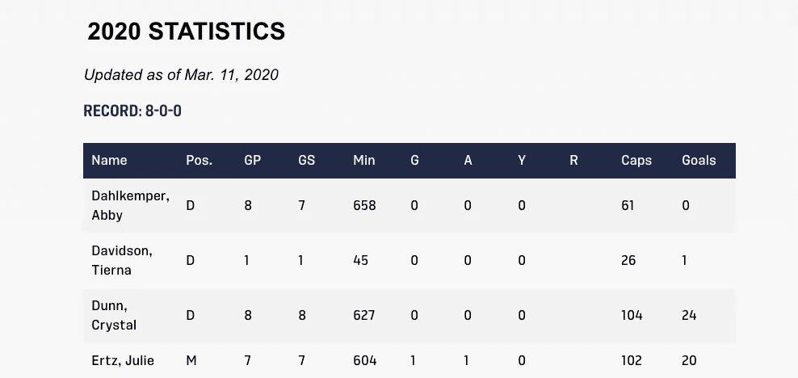
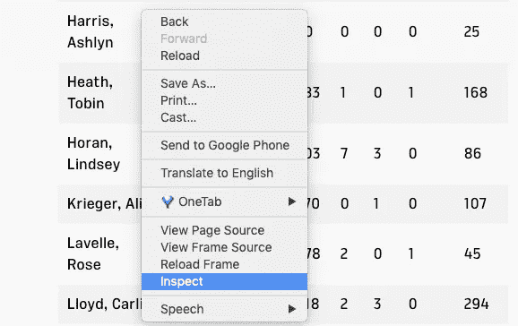
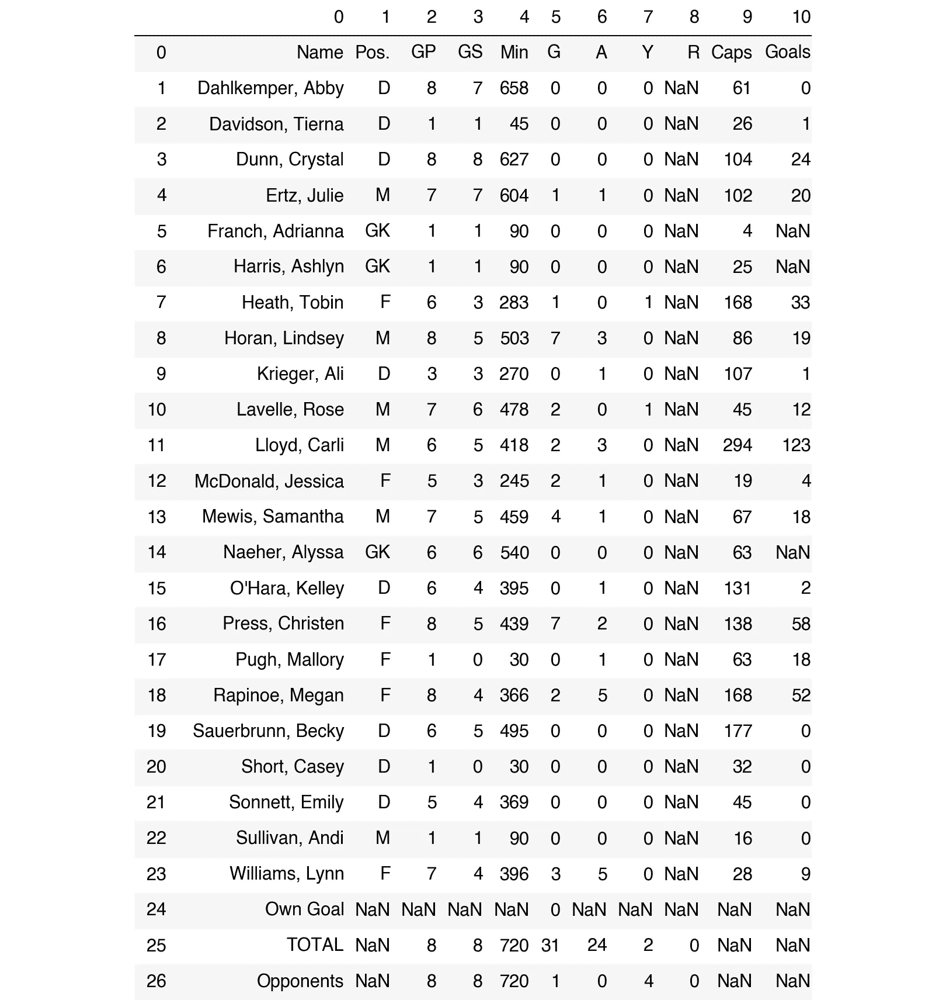
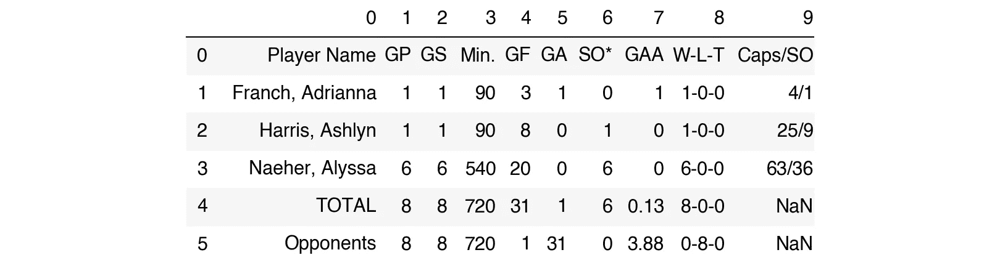
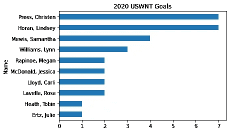
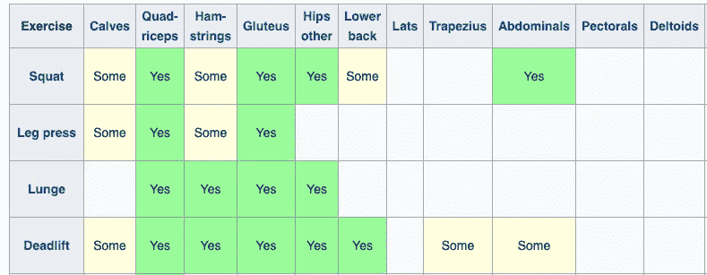
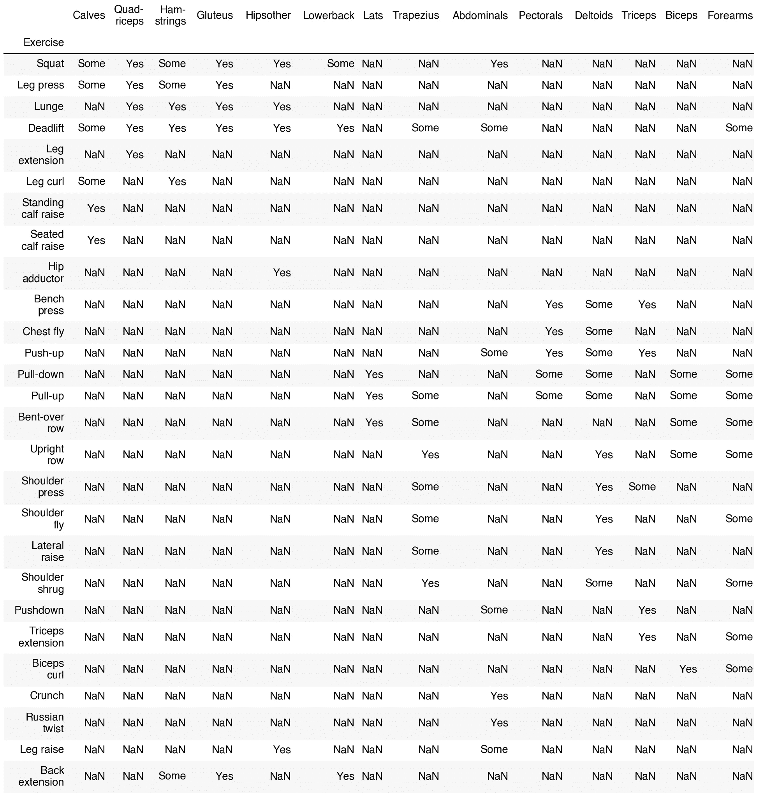
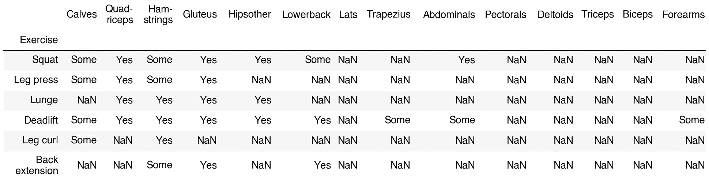
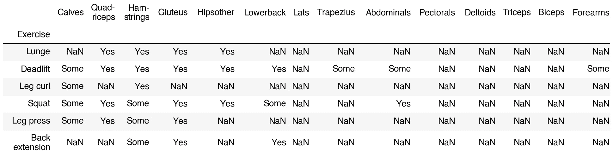

# 不用离开熊猫就能抓取 HTML 表格

> 原文：<https://towardsdatascience.com/read-html-54a942305c0f?source=collection_archive---------43----------------------->

## 如何从基于表格的网站中快速获取所需数据

网络搜集通常是一件痛苦的事。研究、查找和安装您需要的库可能非常耗时。在 HTML 中找到您需要的内容需要时间。让所有东西都工作起来可能很难。🙁

在本文中，我将向您展示如何使用 Python pandas 库用单行代码来抓取 HTML 表格！它并不是在所有情况下都有效，但是当你在网站上有 HTML 表格时，它会让你的生活变得更容易。😀

您将看到如何使用它从网站上获取关于足球和举重的数据。⚽️ 🏋


资料来源:pixabay.com

我们将使用`[pd.read_html()](https://pandas.pydata.org/pandas-docs/stable/reference/api/pandas.read_html.html)`来抓取表格数据。根据我的经验，很多人不知道`pd.read_html()`，尽管[已经在](https://pandas.pydata.org/docs/whatsnew/v0.12.0.html?highlight=read_html)出现了 7 年多。

本文原载于 [Deepnote](https://beta.deepnote.com/article/scrape-html-tables-without-leaving-pandas) 。你可以在那里运行交互式笔记本。👍

# 设置

要获得必需的软件包及其依赖项的最新版本，请取消注释并运行以下代码一次。然后重启你的笔记本内核。

```
# !pip install pandas lxml beautifulsoup4 html5lib matplotlib -U
```

一般熊猫会尝试用 lxml 解析 HTML，因为它速度快。如果失败，它将使用 BeautifulSoup4 和 html5lib。你可以在熊猫[文档](https://pandas.pydata.org/pandas-docs/stable/user_guide/io.html#html-table-parsing-gotchas)中阅读更多关于解析器的内容。

让我们导入包并检查版本。我总是喜欢检查 Python 和密钥库的版本，以帮助诊断可能出现的问题。😉

```
import sys
import pandas as pd

print(f"Python version {sys.version}")
print(f"pandas version: {pd.__version__}")> Python version 3.7.3 (default, Jun 11 2019, 01:11:15) 
> [GCC 6.3.0 20170516]
> pandas version: 1.0.5
```

如果你的 Python 版本低于 3.6，建议你更新一下。如果你的版本低于 1.0.5，熊猫也一样。要了解更多关于熊猫 1.0 的更新，请看我的指南[这里](/whats-new-in-pandas-1-0-ffa99bd43a58)。

## 示例 1:足球⚽️

让我们收集一些关于美国女子国家队的足球统计数据——这是世界上大多数地方的足球。⚽️

让我们使用美国足球网站:[https://www.ussoccer.com/uswnt-stats](https://www.ussoccer.com/uswnt-stats)。



在 Chrome 中，进入网站，右击数据，选择*检查*。



您应该会看到边栏出现。这向您展示了页面背后的 HTML，以及其他内容。寻找 HTML 标签、、或

| 。这些都表明你找到了一张桌子。如果你想了解 HTML 表格的基础知识，请参见[w3schools.com](https://www.w3schools.com/html/html_tables.asp)。 |

我们将要使用的 pandas 函数要求我们找到 HTML 表。所以你刚刚挖到了金子！🎉

让我们从网页上抓取数据。要将每个表放入数据帧中，我们只需运行以下代码。

```
list_of_dfs = pd.read_html('https://www.ussoccer.com/uswnt-stats')
```

现在数据帧在一个列表中。

```
type(list_of_dfs)> list
```

让我们看看列表中有多少数据帧。

```
len(list_of_dfs)> 2
```

好的，让我们看看第一个数据框。👀

```
list_of_dfs[0]
```



看起来像是一堆球员的数据。很好，这符合我们在网站上看到的预期。

让我们看看第二个表格里有什么。

```
list_of_dfs[1]
```



看起来里面有守门员的数据。

在这两种情况下，如果我们将第一行作为列标题，将第一列作为索引来读取，效果会更好。

当您使用`pd.read_html()`读取表格时，您可以使用许多与使用`pd.read_csv()`相同的参数。这是大多数人更熟悉的熊猫方法。👍

让我们通过再次获取数据，将表列放在我们想要的位置。这次我们会通过`header=0, index_col=0`。

```
list_of_dfs_nicer = pd.read_html('https://www.ussoccer.com/uswnt-stats', header=0, index_col=0)
list_of_dfs_nicer[0].head(2)
```


好多了。😀

要在 Jupyter 笔记本或 IDE 中查看更多可能的参数，请在函数中按住`Shift` + `Tab`。或者直接去看[文档](https://pandas.pydata.org/pandas-docs/stable/reference/api/pandas.read_html.html)。

我们继续拍吧。🧻

我们可以将每个数据帧保存为它自己的变量。让我们把所有不是守门员的人放在`runners_df`里，把守门员放在`goalies_df`里。根据互联网和我经常踢足球的女儿的说法，足球队中所有的非守门员都没有一个名字。我称他们为跑步者，因为他们经常这样做。🙂如果我遗漏了什么，请纠正我。

```
runners_df = list_of_dfs_nicer[0]
goalies_df = list_of_dfs_nicer[1]
```

我们希望排除 *runners_df* 中的最后三行和 *goalies_df* 中的最后两行。用`.iloc[]`切片吧。如果你想了解更多关于切片数据帧和如何使用熊猫的知识，我谦恭地建议你看看我的[令人难忘的熊猫书](https://memorablepandas.com)。

```
runners_df = runners_df.iloc[:-3]
runners_df.tail(2)
```


```
goalies_df = goalies_df.iloc[:-2]
goalies_df
```


让我们快速做一个可视化的展示，展示今年每个进球的球员的进球情况。

```
goal_scorers_df = runners_df[runners_df['G']>0]
goal_scorers_df['G'].sort_values().plot(kind='barh', title='2020 USWNT Goals');
```



看起来克里斯蒂安·普雷斯和林赛·霍兰在短暂的 2020 赛季中领先得分。🏅

好吧，我们可以做很多有趣的数据清理和可视化，但今天的重点是抓取和读取 HTML 表。让我们再看一个例子。

## 例子 2:举重🏋🏼‍♀️

[维基百科](https://en.wikipedia.org/wiki/List_of_weight_training_exercises)有一个有趣的图表，显示不同的举重练习锻炼了哪些肌肉群。



检查后，我们看到这是一个 HTML 表。让我们抓住它。🚀

```
weightlifting_df_list = pd.read_html('https://en.wikipedia.org/wiki/List_of_weight_training_exercises', index_col=0)
len(weightlifting_df_list)2weightlifting_df_list[0]
```



这就是我们想要的！👍


资料来源:pixabay.com

让我们将第一个数据帧赋给一个变量。

```
exercises_df = weightlifting_df_list[0]
```

现在你可以对数据框做任何你想做的事情。也许你想过滤它，只显示锻炼你的腿筋。

```
hammies = exercises_df[(exercises_df['Ham-strings']=='Yes') | (exercises_df['Ham-strings']=='Some')]
hammies
```



让我们根据大量锻炼腿筋的练习对表格进行排序。

```
hammies.sort_values(by='Ham-strings', ascending=False)
```



看起来，如果我们想要更强壮的腿筋，我们应该做一些弓步、硬拉和腿部弯曲。我想是时候锻炼了！🏋️‍

## 包装

您已经看到了如何使用`pd.read_html()`将数据从 HTML 表移动到熊猫数据帧列表中。`pd.read_html()`并不是每一个网络抓取努力的正确工具，但当它是一个选择时，它是一个伟大的选择。👍

我希望这篇关于`pd.read_html()`网络抓取的介绍对你有所帮助。如果你有，请在你最喜欢的社交媒体上分享，这样其他人也可以找到它。😀

如果你有问题或意见，请在 [Twitter](https://twitter.com/discdiver) 或 [LinkedIn](https://www.linkedin.com/in/-jeffhale/) 与我分享。


资料来源:pixabay.com

刮的开心！🚀