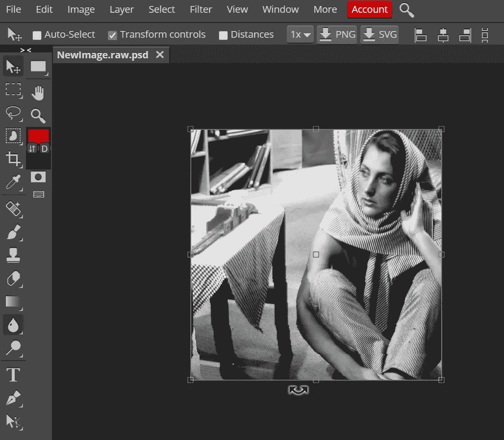

# 用 Python 读取图像(不使用特殊的库)

> 原文：<https://towardsdatascience.com/reading-an-image-in-python-without-using-special-libraries-534b57de7dd4?source=collection_archive---------11----------------------->

## 就告别 OpenCV，Matplotlib，PIL 除了 Numpy！


照片由[克里斯蒂安娜·特斯顿](https://unsplash.com/@cristiane?utm_source=unsplash&utm_medium=referral&utm_content=creditCopyText)在 [Unsplash](/wallpapers/colors/black-and-white?utm_source=unsplash&utm_medium=referral&utm_content=creditCopyText) 拍摄

嗯，上面这张照片很棒，不是吗？。对我来说这是一部杰作。尽管如此，你有没有想过或者问过自己这个一百万美元的问题:

> 图像是由什么组成的？

现在，在阅读整个教程之前，我希望你们在评论区 ***回答这个问题*** ，这样你们可以给大脑一些工作。无论如何，对于那些从未回答过问题或不知道答案的人，通过阅读这篇文章，你最终可以毫不犹豫地回答这个问题。炒作够了，我们开始吧！。顺便说一下，本教程的完整代码也可以在下面我的 [***GitHub 资源库***](https://github.com/Tanu-N-Prabhu/Python/blob/master/Reading_An_Image_In_Python_(Without_Using_Special_Libraries).ipynb) 中找到:

[](https://github.com/Tanu-N-Prabhu/Python/blob/master/Reading_An_Image_In_Python_%28Without_Using_Special_Libraries%29.ipynb) [## 塔努-北帕布/Python

### permalink dissolve GitHub 是超过 5000 万开发人员的家园，他们一起工作来托管和审查代码，管理…

github.com](https://github.com/Tanu-N-Prabhu/Python/blob/master/Reading_An_Image_In_Python_%28Without_Using_Special_Libraries%29.ipynb) 

# 故事


照片由 [Pixabay](https://www.pexels.com/@pixabay?utm_content=attributionCopyText&utm_medium=referral&utm_source=pexels) 从[像素](https://www.pexels.com/photo/basket-blur-boy-child-208087/?utm_content=attributionCopyText&utm_medium=referral&utm_source=pexels)拍摄

我在图像处理课上(毕业时)有一个作业，我必须从一个文件中读取一个原始图像，使用单点重采样和加权平均重采样算法将图像调整到指定的尺寸。有人给了我一张纸条，上面写着“ ***不要使用任何外部库*** ”用于你的程序，尤其是读取和保存图像。只有选定的算法被允许使用，python 中的一个这样的算法是`**numpy**`。这听起来很痛苦，但无论如何我不得不这么做，我做到了。在本教程中，我们将只专注于读取和保存图像，没有什么花哨的。

# 问题

编写一个程序，从文件中读取 raw 格式的灰度图像，并将新图像保存到 raw 格式的新文件中。(我只是把问题说得简短些，因为这是你今天要学的内容)。

## 图像源

下面是灰度 8 位图像的来源。我将使用 ***第 4 张*** 样图 [***芭芭拉，8 位灰度(512×512)。raw***](http://eeweb.poly.edu/~yao/EL5123/image/barbara_gray.raw) ”。其他样本图像的链接可以在 这里找到 [***。***](http://eeweb.poly.edu/~yao/EL5123/SampleData.html)

# 图书馆的使用

正如我所说的，我不会使用任何特殊的 python 库。图像处理领域中一些最受欢迎和使用最广泛的库包括:

1.  [**Numpy**](https://numpy.org/)
2.  [**OpenCV**](https://opencv.org/)
3.  [**PIL**](https://pillow.readthedocs.io/)
4.  [**Matplotlib**](https://matplotlib.org/)

有趣的是，通过使用 ***OpenCV*** ， ***PIL*** 和 ***Matplotlib*** 库，我们只需两行代码就可以读取图像并将其保存到文件中。但是这里的问题是不要使用特殊的库和特殊的方法。 ***Numpy*** 是唯一会被贯穿使用的标准库( ***你就知道为什么*** )。

# 密码

这是你们期待已久的时刻。

## 导入库

使用`**numpy**` 库的唯一原因是将 raw 图像转换为像素 的 ***数组。**主要用于*存储数组*中的值。*****

```
**# Necessary library used for this tutorial** import numpy as np
```

## 初始化图像的行和列值

图像的维度由行和列组成。

```
**# For example a particular image in this case would contain (512*512) rows and columns meaning 262,144 pixels** ROWS = 512    
COLS =  512**# Different images have different dimensions. Change it accordingly**
```

## 打开输入图像文件(RAW 格式)

```
**# Opening the input image (RAW)** fin = open('barbara_gray.raw')     
print(fin)
```

这将提示输出如下:

```
**<_io.TextIOWrapper name='barbara_gray.raw' mode='r' encoding='UTF-8'>**
```

现在，我们需要从原始数据(图像)构建一个 2D 数组。必须使用一种高效的方法来读取已知数据类型的二进制数据，这可以在`**numpy**` 库的帮助下完成。

## 加载输入图像

这是真正的乐趣开始的地方。感谢`**numpy**`

```
**# Loading the input image** print("... Load input image")
img = np.fromfile(fin, dtype = np.uint8, count = ROWS * COLS)
print("Dimension of the old image array: ", img.ndim)
print("Size of the old image array: ", img.size)
```

执行此操作后，您将获得

```
**... Load input image** Dimension of the old image array:  **1** 
Size of the old image array:  **262144**
```

## **从 1D 到 2D 阵列的转换**

有一种方法可以将 1D 阵列转换为 2D 阵列，例如用图像的行和列或列和列(任何一种都可以)来划分像素总数。这可以借助一个公式来写:

`**img = tp // (cols, cols)**`

***tp*** =总像素； ***cols*** 代表图像的行和列。我们之所以使用地板除法而不是除法，是因为我们需要将数值四舍五入为整数。

```
**# Conversion from 1D to 2D array** img.shape = (img.size // COLS, COLS)
print("New dimension of the array:", img.ndim)
print("----------------------------------------------------")
print(" The 2D array of the original image is: \n", img)
print("----------------------------------------------------")
print("The shape of the original image array is: ", img.shape)
```

执行此操作后，您将获得

```
New dimension of the array: **2** 
----------------------------------------------------  
The 2D array of the original image is:   
**[[240 240 240 ... 230 230 230]  
[240 240 239 ... 230 229 229]  
[240 239 238 ... 231 232 232]  
...  
[ 50  50  50 ...  50  50  50]  
[ 50  50  50 ...  50  50  50]  
[ 50  50  50 ...  50  50  50]]** 
---------------------------------------------------- 
The shape of the original image array is:  **(1000, 1600)**
```

## 将新图像以 raw 格式保存到新文件中

```
**# Save the output image** print("... Save the output image")
img.astype('int8').tofile('NewImage.raw')
print("... File successfully saved")
**# Closing the file** fin.close()
```

这就是你如何以 raw 格式保存新图像。这将保存在您的本地系统中。

```
... Save the output image 
... File successfully saved
```

> **注意**:进入图像的**行**和**列**时。例如，如果一幅图像的分辨率是 **1600x1000** ，那么就意味着**宽度**是 **1600** 而**高度**是 **1000** 。类似地，在上面的程序中，**行**将是 **1000** ，而**列**将是 **1600** 。

# 输出

成功执行上述代码后，您现在可以读取原始图像，然后保存原始图像。耶！！！。现在，如果你不相信我，你可以使用一些在线图像打开工具(或其他工具)打开保存的图像。我通常使用[***光电***](https://www.photopea.com/)**，这是我得到的。**

****

**塔努·南达·帕布摄**

**先提醒一下，上面是工具输出的截图，主要输出的图像是灰度的，叫做“ ***【芭芭拉*** ”(一个举起一只手的女人或者其他什么)。**

# **结论**

**在离开之前，尝试阅读其他格式的图像，如 JPEG (JPG)，PNG，看看你会得到什么价值。此外，尝试阅读彩色(RGB)图像。反正现在你可以轻松回答教程开头的上述问题了。让我再次提醒你。 ***图像是由什么组成的？*** ”。答案是大家都看到了，“ ***图像是由一组像素值*** ”组成的。值的数量取决于给定图像的行和列。**

**今天到此为止，希望大家喜欢阅读教程“ ***(不使用特殊库)*** ”的内容。正如承诺的那样，除了`**numpy**`，我没有使用任何其他库。嗯，咄！你需要使用`**numpy**` 来处理数组。如果你们对教程有任何意见或担忧，请在下面的评论区告诉我。直到那时再见，保持安全:)**