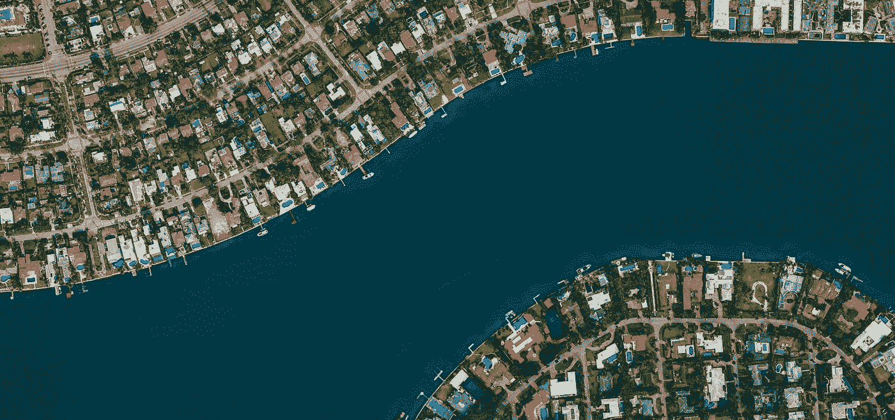
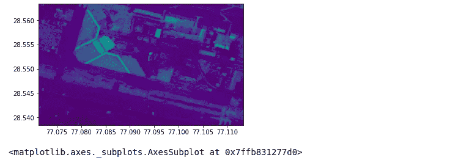
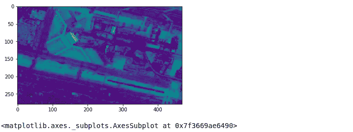
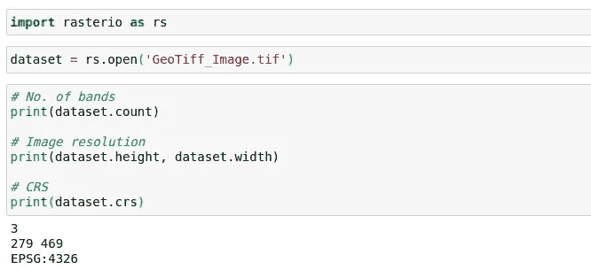
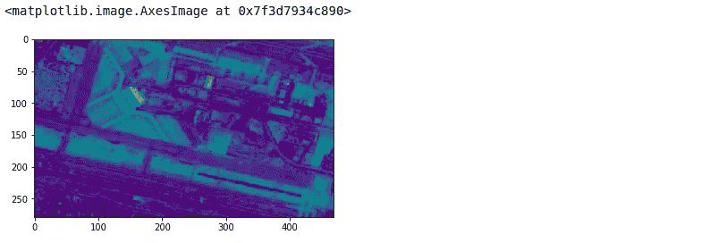
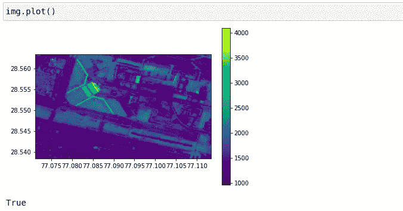
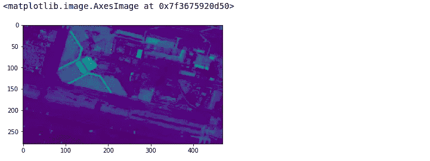
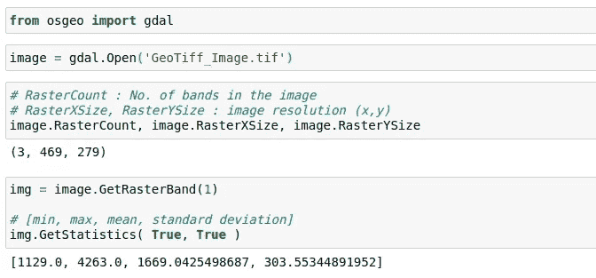

# 使用 Python 读取和可视化 GeoTiff |卫星图像

> 原文：<https://towardsdatascience.com/reading-and-visualizing-geotiff-images-with-python-8dcca7a74510?source=collection_archive---------2----------------------->

## 用于处理 GeoTiff 或卫星影像的 python 库简介。



[Unsplash 图像链接](https://unsplash.com/photos/JqKv7_gz_3U)

在 python 中读取图像非常容易，因为有许多库可用于读取、编辑和可视化不同格式的图像。这些库的例子有 Matplotlib、OpenCV、Pillow 等。这些库可以很好地处理流行的图像格式，比如*。png，。tiff，。jpg，。jpeg，*等。但它们似乎对 GeoTiff 图像不起作用。

如果我们了解 GeoTiff 格式与其他图像格式的不同之处，就很容易猜到原因。下面给出了一个简单的定义。

> GeoTIFF 是一种标准的`.tif`或图像文件格式，它包括嵌入在。tif 文件作为标签。

通过标签，这意味着它有一些额外的元数据，如空间范围、CRS、分辨率等。以及像素值。是**卫星**和**航空** **摄影** **影像的一种流行分发格式。**

本文讨论了使用 jupyter 笔记本通过 python 读取和可视化这些图像的不同方法。使用的库有 GDAL、rasterio、georaster 和 Matplotlib(用于可视化)。这些库将帮助我们将这些图像转换为简单的 numpy 数组格式，从那里我们还可以使用 numpy 或 TensorFlow 执行其他图像转换，尽管我在本文中没有讨论转换。

这些库的文档中提到了安装步骤，我在参考资料部分提供了它们的链接，请仔细阅读。

# 使用 RasterIO

RasterIO 由 Mapbox 实现，它提供了用于读取地理参考数据集的 python API。此外，文档中提到，与 GDAL python 绑定不同，它没有悬空 C 指针和其他可能导致程序崩溃的指针问题。

```
import rasterio
from rasterio.plot import showfp = r'GeoTiff_Image.tif'
img = rasterio.open(fp)
show(img)
```



不要把自己和 x 轴和 y 轴的刻度值混淆，它们只是经度和纬度值。如果你想读取单个波段，使用下面的代码。

```
fp = r'GeoTiff_Image.tif'
img = rasterio.open(fp) # mention band no. in read() method starting from 1 not 0
show(img.read(3))
```



## 使用 RasterIO 的图像相关数据

```
# No. of Bands and Image resolution
dataset.count, dataset.height, dataset.width# Coordinate Reference System
dataset.crs
```



使用 RasterIO 的图像相关数据

# **使用地理控制器**

georaster 安装了 *pip* 的版本为 1.25。这个版本可能会给你带来一些问题，如果你遇到任何问题，先去你的 *georaster* 安装目录。下面的代码会告诉你安装目录路径。

```
import georaster
print(georaster.__file__)
```

现在，在那里找到 georaster.py 文件，并用这个 [georaster](https://github.com/GeoUtils/georaster/blob/master/georaster/georaster.py) 中的内容更改它的内容。py 文件。

下面是可视化具有多个波段(或通道)的图像的代码。

```
import georaster
import matplotlib.pyplot as plt# Use SingleBandRaster() if image has only one band
img = georaster.MultiBandRaster('GeoTiff_Image.tif')# img.r gives the raster in [height, width, band] format 
# band no. starts from 0
plt.imshow(img.r[:,:,2])
```



## 不使用 matplotlib 打印图像

我们可以直接使用绘图方法，而不是选择和可视化单个波段。



地理绘图法

# 使用 GDAL

这是处理 GeoTiff 图像时最受欢迎的库，但有时很难安装，需要花费大量精力才能最终使用它。GDAL 的大部分方法和类都是用 C++实现的，我们在这里使用它的 python 绑定。像 *georaster* 这样的大多数库都利用 GDAL，并为它提供了一个漂亮而简单的 python 接口。

```
from osgeo import gdal
import matplotlib.pyplot as pltdataset = gdal.Open('GeoTiff_Image.tif', gdal.GA_ReadOnly) # Note GetRasterBand() takes band no. starting from 1 not 0
band = dataset.GetRasterBand(1)arr = band.ReadAsArray()
plt.imshow(arr)
```



## 使用 GDAL 的图像相关数据

```
# For no. of bands and resolution
img.RasterCount, img.RasterXSize, img.RasterYSize# stats about image
img.GetStatistics( True, True )
```



Jupyter 笔记本实现图像统计

# 参考

**安装**

1.  [https://mothergeo-py . readthedocs . io/en/latest/development/how-to/gdal-Ubuntu-pkg . html](https://mothergeo-py.readthedocs.io/en/latest/development/how-to/gdal-ubuntu-pkg.html)
2.  [https://github.com/GeoUtils/georaster](https://github.com/GeoUtils/georaster)
3.  [https://rasterio.readthedocs.io/en/latest/installation.html](https://rasterio.readthedocs.io/en/latest/installation.html)
4.  [https://pypi.org/project/GDAL/](https://pypi.org/project/GDAL/)

**单据**

1.  [https://geo raster . readthe docs . io/en/latest/API . html # multi band raster](https://georaster.readthedocs.io/en/latest/api.html#multibandraster)
2.  [https://rasterio.readthedocs.io/en/latest/quickstart.html](https://rasterio.readthedocs.io/en/latest/quickstart.html)
3.  [https://gdal.org/python/index.html](https://gdal.org/python/index.html)