# 阅读色盲图表:深度学习和计算机视觉

> 原文：<https://towardsdatascience.com/reading-color-blindness-charts-deep-learning-and-computer-vision-a8c824dd71cd?source=collection_archive---------13----------------------->

## 转换数据，使其与类似的数据集兼容

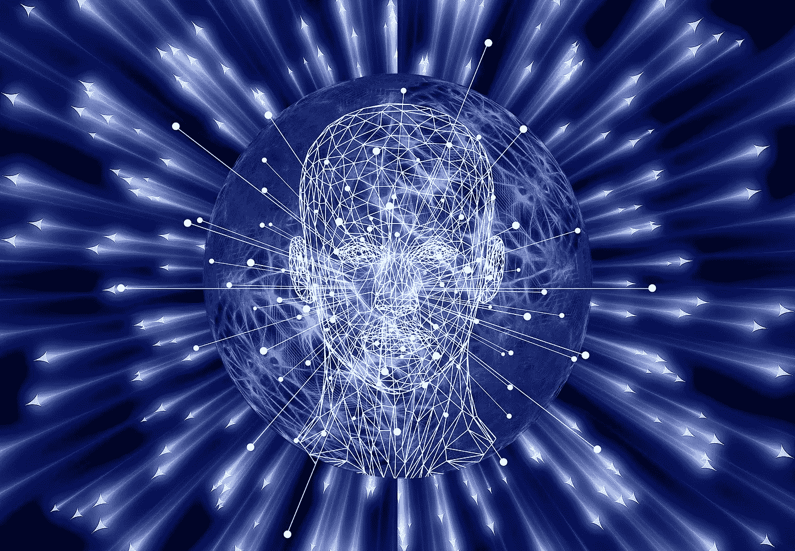

有很多在线教程，你可以学习训练一个神经网络，使用 [MNIST](https://en.wikipedia.org/wiki/MNIST_database) 数据集对手写数字进行分类，或者区分猫和狗。我们人类总是非常擅长这些任务，可以轻松地匹配或击败训练有素的模型的性能。

情况并非总是如此。在这个项目中，我想探索一个我个人非常纠结的任务。我有轻度红绿色盲。所以，这样的图表对我来说通常很难看到，如果不是不可能的话:

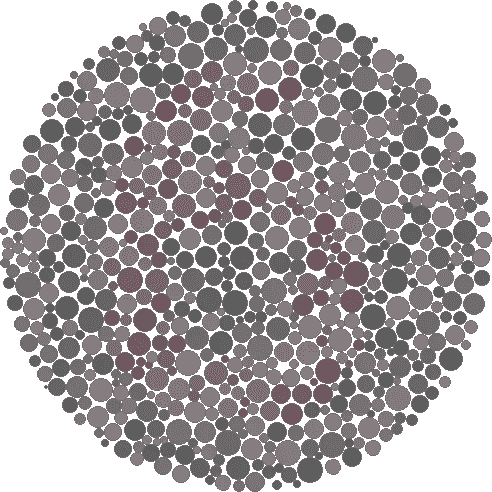

这是一个 6(我想？)

有没有可能让我训练一个模型来帮我完成这项任务，而不用我眯着眼睛，不可避免地把问题弄错？

乍一看，这个任务似乎很简单。我们可以拍摄一些图像，将它们分成训练集和测试集，然后训练一个卷积神经网络。除了…没有数据集。在网上，我只能找到 54 个不同的图像，这对于一个训练集来说是不够的，因为有 9 个类别(数字 1-9)。

如何解决这个问题？我们仍然有包含单个手写数字图像的 MNIST 数据集。我们可以使用这个数据集来训练一个擅长分类单个数字的神经网络。通过一些 OpenCV 转换，我们可以让色盲图表看起来类似于 MNIST 图像，就像这样:

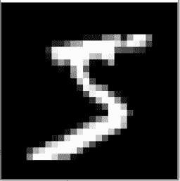

手写 5

我们开始吧！

# 在 MNIST 数据集上训练卷积神经网络

有很多关于这方面的[教程](https://machinelearningmastery.com/how-to-develop-a-convolutional-neural-network-from-scratch-for-mnist-handwritten-digit-classification/)，但我还是会给出一个关于这是如何完成的高层次概述。

首先，我们需要安装 Tensorflow，它可以通过 pip 获得。如果没有安装，请在终端中运行以下命令。

```
pip install tensorflow
```

或者如果你有一个图形处理器:

```
pip install tensorflow-gpu
```

现在，我们将创建一个 mnist.py 文件并获取我们的训练数据，由于 mnist 数据集的流行，这些数据内置于 tensorflow 中:

接下来，我们将建立我们的卷积神经网络。我不会详细介绍这些是如何在内部工作的，但是网上有很多资源可以阅读，比如[这个](https://www.datacamp.com/tutorial/convolutional-neural-networks-python)。我们将使用一个 Conv2D 层，然后是 MaxPooling 和 Dropout。然后，我们的 2D 输出被展平并通过具有 128 个单元的密集层，接着是具有 10 个类(编号 0–9)的分类层。输出将是长度为 10 的向量，以指示预测。例如，2 会被预测成这样:

```
[0, 0, 1, 0, 0, 0, 0, 0, 0, 0]
```

因为 1 在第二个索引中。以下是型号代码:

现在，我们编译模型，在训练数据上运行它，在测试数据上评估它，并将模型作为. h5 文件保存在我们的目录中:

当我们运行这段代码时，我们得到了大约 99%的训练准确率和 98%的测试集准确率:

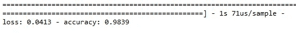

还不错！现在，您应该在您的目录中看到一个 mnist.h5 文件。现在，让我们进入下一步。

# OpenCV 图表处理

下一个目标是获取现有的图表，并将其转换为与 MNIST 数据尽可能相似的形式，我们保存的模型在分类方面非常出色。对于这一部分，我们还需要几个库:

```
pip install opencv-python
pip install imutils
pip install numpy
pip install sklearn
pip install scikit-image
```

我们的目标是这样的转变:

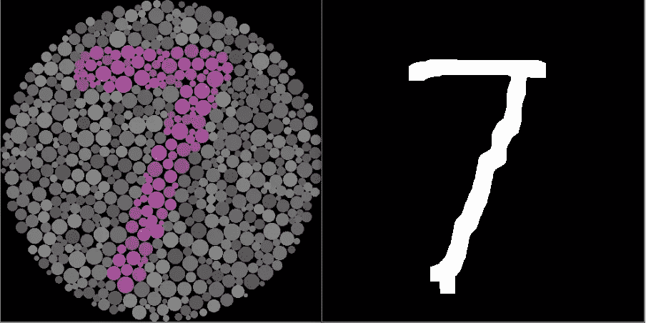

经过一些实验后，下面是我们需要做的处理:

1.  增加对比度，使手指的颜色更明显。
2.  应用中值和高斯模糊来平滑我们在原始图像中看到的小圆圈。
3.  应用 K-均值颜色聚类获得一致的颜色斑点。
4.  转换为灰度
5.  应用阈值处理(这将是棘手的)来得到一个只用黑白的图像。
6.  更多模糊和阈值处理
7.  形态学开放、封闭、侵蚀
8.  骨骼化
9.  扩张

哇，太多了。让我们从对比开始。我从网上复制了一个函数，它接收一幅图像并应用定制的亮度和对比度变换。我把它放在一个文件 ContrastBrightness.py 中，并使它成为一个类:

在高水平上，增加亮度会将值添加到图像的 RGB 通道，而增加对比度会将值乘以某个常数。我们将只使用对比功能。

我们算法的另一个复杂部分是聚类。同样，我创建了一个文件 Clusterer.py，并将我在网上获得的必要代码放入其中:

这段代码将接受一个图像和一个数字作为输入。这个数字 K 将决定我们将使用多少颜色聚类。你可以在这里阅读更多关于 K-means 聚类的内容。现在，让我们创建最后一个文件 main.py。我们将从导入开始:

请注意，我们正在导入刚刚创建的两个类。现在，请从 [my Github](https://github.com/msolonko/colorblindness_classification) 下载图表目录中的图片。

这些都被分类(在没有色盲的人的帮助下)到适当的文件夹里。

现在，我们将遍历路径中的所有图像，并应用变换 1–4。我对我的代码做了大量的注释。

下面是一些转换后的图像:

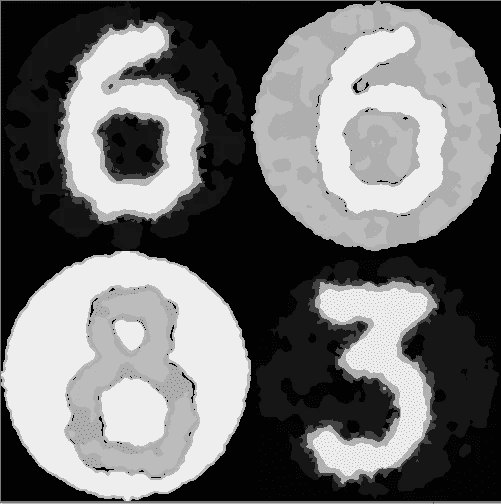

这是一个明显的进步。数字都很清楚，连我都看得一清二楚。仍然存在两个问题:

1.  它们看起来不是手写的，而且太厚了
2.  它们在黑色背景上不是全白的

所以，我们将门槛。然而，由于图像的各种颜色，每一种都需要不同的阈值来工作。我们将自动搜索最佳阈值。我注意到，根据像素数，一个数字通常占整个图像的 10–28%。

因此，我们将尝试不同的阈值，直到白色百分比在 10–28%的范围内。首先，我们将定义一个函数，它告诉我们输入图像中白色所占的百分比。有更短的方法可以做到这一点，但我想明确地展示这是在做什么。我们正在计算所有值为 255 的像素(255 表示白色，0 表示黑色)。

现在，我们将从阈值 0 开始，以 10 为增量增加到 255，直到我们处于 0.1–0.28 区域(此代码进入 for 循环):

厉害！终点在望。现在我们得到这样的图像(如果我们使用我们找到的阈值):

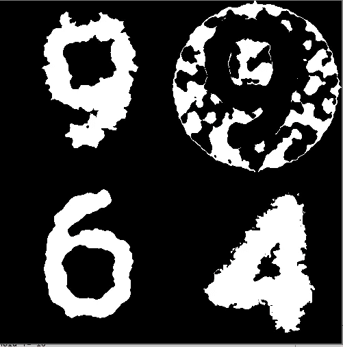

大多数图像看起来都很不错！然而，有些是有问题的。结果是一些数字比背景暗，就像你看到的右上角的 9。因此，阈值处理使它们变黑，而不是变白！从未达到 0.1–0.28 区域。

我们可以通过变量值来检查我们的阈值是否成功。如果 threshold 变量的值是 260，这意味着 while 循环没有找到一个完美的阈值就结束了。对于这些图像，我们将有一个单独的过程。

本质上，我们会

1.  反转图像，使内部比背景明亮
2.  转换成黑白
3.  创建一个圆形蒙版来遮盖背景(当我们反转时，背景从黑色变成白色)。

这是视觉过程:

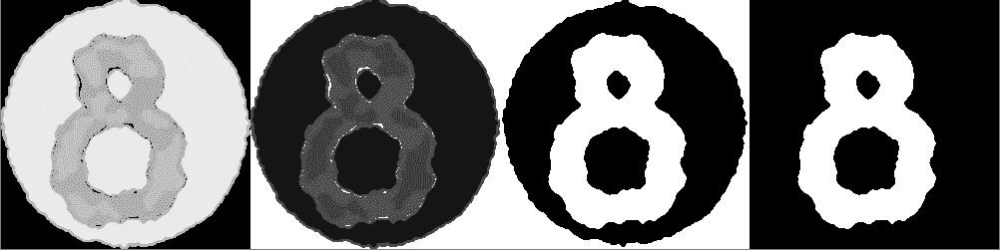

最后一步是最难的，所以我在代码中对它进行了注释。这是我们的整个函数:

我们将调整代码以使用新函数，并执行步骤 6–7。这些都是内置的 OpenCV 转换，所以没什么好奇怪的:

让我们看看图像是什么样的！

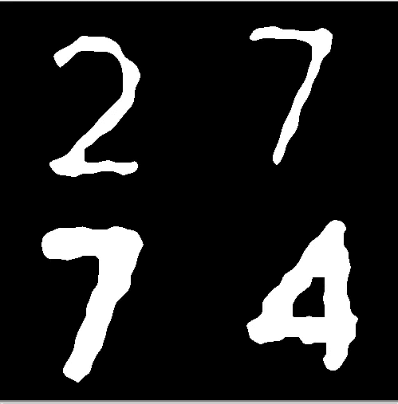

厉害！清晰可辨。最初，我们预计精度约为 10%,因为模型输出大小为 10，并且其输出基本上是随机的，因为原始图像看起来一点也不像模型所训练的 MNIST 数据集。有了这些变换后的图像，该模型肯定比随机模型做得更好。如果我们停在这里，我们的准确率大约是 63%，比随机准确率高 6 倍！然而，我们可以做得更多一点。

我们将骨骼化和扩大我们的图像。这将使我们的宽度一致，整体看起来更加统一。让我们开始吧:

这段代码是我们放在大 for 循环中的最后一段代码。结果如下所示:

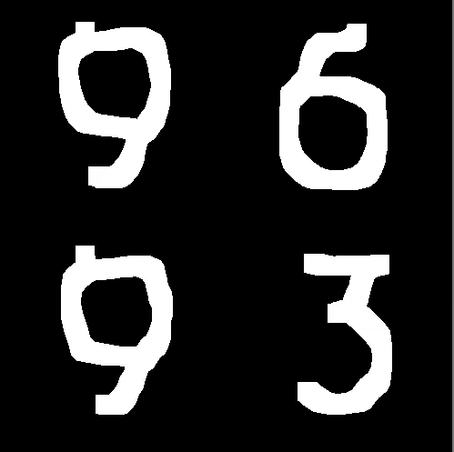

它们有点参差不齐，但笔迹也是。这些输入对神经网络来说应该不成问题。现在，我们只需重塑我们的列表，加载模型，并进行评估:

将这段代码放在 for 循环下面。概括地说，我们加载我们的模型，重塑数据，并在评估后打印准确性。

# 结果

运行代码后，打印出来的内容如下:

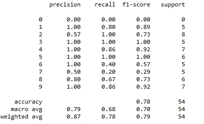

我们来看看吧！我们得到了…的总体精确度。78%!这比随机测试好 7-8 倍，比中度到重度色盲的人好得多。这是杰出的！

如果我们看看我们对数字的回忆(正确预测的正面观察与实际类别中所有观察的比率)，我们会看到我们对 1-5 和 9 有很好的表现。我们在 8 分的时候表现还可以，我们的神经网络在 6 分和 7 分的时候真的很挣扎。

这种方法显然有局限性，并且我列出的变换并不适用于所有可能的色盲图像(实际上，在阈值化步骤之后，在数据集中有一个图像不适用)。试着打印所有处理过的 9，你会看到阈值步骤产生的比率在 0.1 和 0.28 之间，但那是因为背景变成了部分白色。我没有试图找到解决这个问题的方法，因为这只影响了一张图片。

# 结论

我希望本教程能够提供关于如何使用相似的数据集对不同的数据集进行预测的信息。另外，我希望本教程能帮助初学者更好地掌握 OpenCV、Tensorflow 和 Python。

要查看完整代码并下载图片和模型，请查看 [my Github](https://github.com/msolonko/colorblindness_classification) 。

## 参考

[1]数据科学栈交换(2020)，[链接](https://datascience.stackexchange.com/questions/66377/how-to-use-mnist-dataset-to-make-predictions-on-similar-images-colorblindness-c)