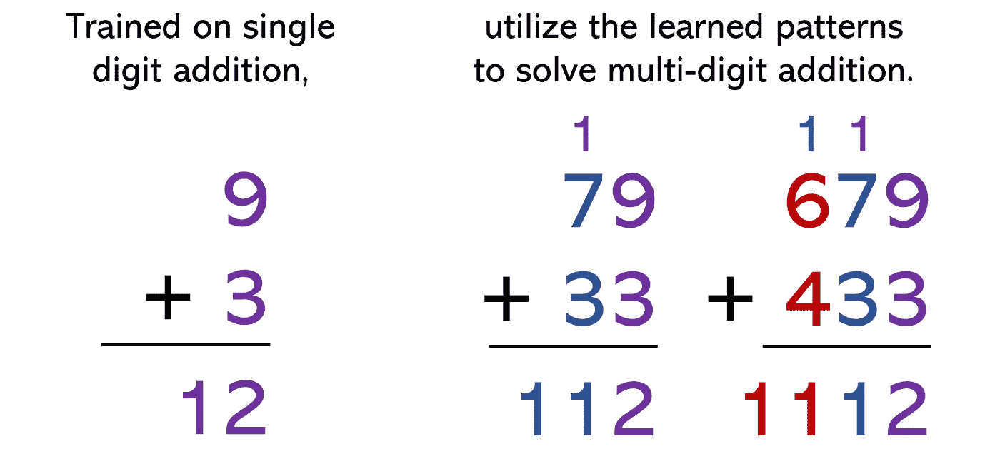
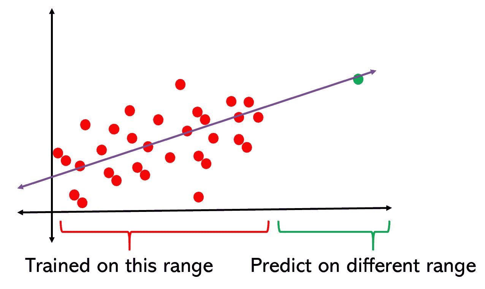
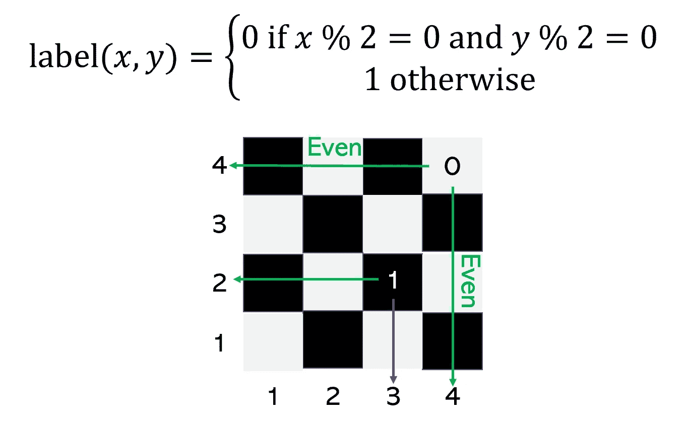
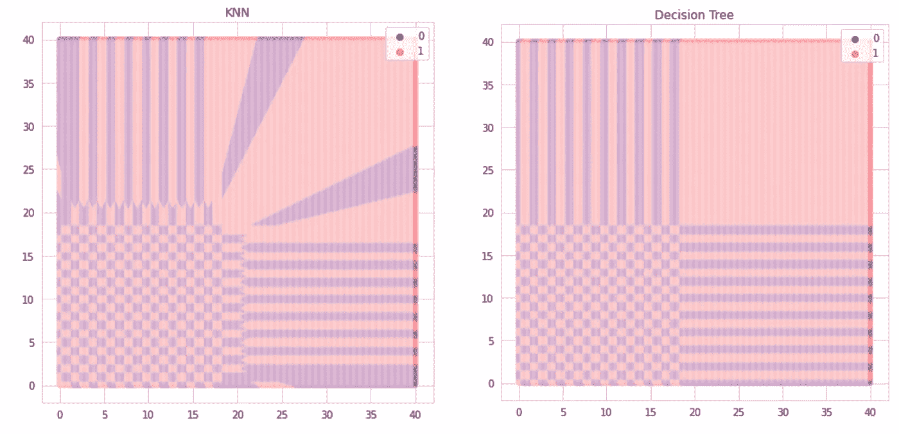
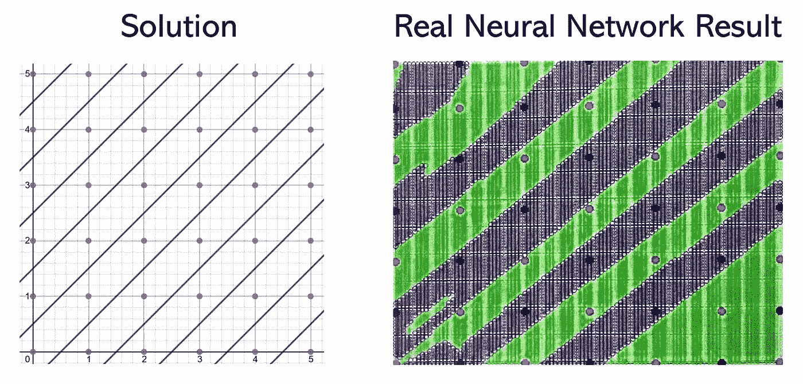

# 真正的人工智能:理解外推 vs 概括

> 原文：<https://towardsdatascience.com/real-artificial-intelligence-understanding-extrapolation-vs-generalization-b8e8dcf5fd4b?source=collection_archive---------11----------------------->

[来源](https://www.zastavki.com/eng/Backgrounds/wallpaper-35605.htm)。图片免费分享。

## 不要混淆这两者

机器学习模型不需要很智能——它们的大多数应用都需要执行像推荐 YouTube 视频或预测客户下一步行动这样的任务。理解外推法和一般化/内插法之间的区别很重要，这样才能理解模型智能的真正含义，并避免混淆这两者的常见问题，这通常是许多模型实现失败的根本原因。

泛化是机器学习的全部要点。该模型被训练来解决一个问题，试图利用从该任务中学到的模式来解决相同的任务，只是略有不同。打个比方，假设一个孩子正在学习如何进行一位数加法。概括是执行相同难度和性质的任务的行为。这也可以称为插值，虽然泛化是一个更常用和理解的术语。

由作者创建。

另一方面，外推是指模型能够从较低维度的训练中获得更高维度的洞察力。例如，考虑一个一年级学生，他被教授一位数加法，然后面临一个多位数加法问题。一年级学生想，“好的，所以当个位数加起来大于 10 时，有一个 10 的部分和一个 1 的部分。我会考虑到这一点，并在十位数上加 1。”当然，这是算术所基于的关键见解，如果你足够努力地思考加法意味着什么，并且理解了位置值，你就能弄明白它。然而，大多数一年级学生从来没有意识到这一点，很少发现如何独立完成学业。

由作者创建。

重要的是要认识到*外推是困难的*。甚至许多人都无法成功地进行外推——事实上，智力确实是一种能够进行外推的衡量标准，或者能够将在较低维度中解释的概念应用于较高维度(当然，维度是指复杂程度，而不是字面意义)。大多数智商测试都是基于这个前提:以只有真正的推断者才能理解的方式使用标准概念。

就机器学习而言，外推的一个例子可以被认为是在一定范围的数据上进行训练，并能够在不同范围的数据上进行预测。对于简单的模式，例如简单的正数/负数或在一个圆内/不在一个圆内的分类，这可能很容易。

由作者创建。

然而，传统的机器学习方法限制了模型推断更复杂模式的能力。例如，考虑棋盘问题，在这个问题中，二维平面上交替的正方形被着色为 0 或 1。对人类来说，这种关系是清楚的，只要给定一个更小的有限的 *x* 乘 *x* 棋盘的规则，就可以继续给一个无限的棋盘着色。虽然棋盘问题是由人类的一组规则定义的(没有两个共用一边的正方形可以是相同的颜色)，但数学上它是这样定义的:

由作者创建。

这是一种非常不直观的思维方式，大多数模型都不认为会产生严格的数学推断定义。相反，常规算法本质上试图以几何方式分割特征空间，给定任务，这可能有效也可能无效。不幸的是，在这种情况下，他们不能外推至他们接受训练的坐标之外的坐标。甚至许多神经网络都无法完成这项任务。

KNN 和决策树在 20x20 棋盘上训练并被告知预测 40x40 空间时的结果。由作者创建。

然而，有时候，外推法与其说是为了识别复杂的关系，不如说是为了找到一个智能的、可外推法的解决方案来执行国外范围的任务。例如，棋盘问题可以通过画对角线来解决。例如，已经观察到用神经网络集成发现了这种解决方案。

神经网络来自“通过预测性能加权的竞争学习神经网络集成”。由作者创建。

在机器智能的辩论中，你会听到一个常见的论点，即“机器只能做好一件事。”这确实是插值或泛化的定义——在一套预定义的规则中执行任务*。然而外推法需要对概念有如此坚实的理解，以至于它们可以被应用到额外的领域，或者在教授的领域之外。当前的机器学习模型很少能够可靠地进行推断；通常，那些有希望的人在几何学上更容易推断出一个问题，而在其他问题上失败。所有的人工智能方法本质上都是插值的，即使人工构建一个外推(“智能”)算法也是有争议的。*

外推很少是建模或机器学习的目标，但它经常与泛化互换使用-最明显的当然是线性回归，在这种情况下，当有多个维度在起作用时，将其趋于无穷大的预测作为黄金更常见，也更不明显(多元回归)。

外推法的另一个例子是，比如说，公司将在无异常值的数据上训练一个模型，然后在现实生活中实现它，在现实生活中，异常值要丰富得多，不能简单地忽略。这在模型的实现中很常见，常常不被发现，但这可能是您的模型在现实生活中可能无法达到测试结果的一个重要原因。当模型的定型数据和模型的预测数据之间存在差异时，您可能会要求模型进行外推。

[XKCD](https://xkcd.com/605/) 。有时甚至人类也是糟糕的推断者。图片免费分享。

模型通常不能很好地外推，无论是在符号智能的测量中还是在实际应用中。确保您的模型没有面临外推任务非常重要-当前的算法，即使像神经网络一样复杂和强大，也不能很好地执行外推任务。检查外推任务的一个不错的方法是绘制出训练和测试集中每一列的分布，然后查看测试集是否与训练集明显不兼容。

在我们能够创建一种能够概括所有问题的机器学习算法之前，类似于神经网络(当然，具有一些不同的架构)的概念如何能够独自解决几乎任何概括问题，它们将永远不会真正能够“智能”并在它们接受培训的狭窄范围之外执行任务。

如果你喜欢的话，你可能会对外推-概括讨论的应用感兴趣，来解释 ReLU 是如何工作的:

 [## 如果整流线性单元是线性的，它们如何增加非线性？

### 神经网络最喜欢的功能背后的直觉

medium.com](https://medium.com/analytics-vidhya/if-rectified-linear-units-are-linear-how-do-they-add-nonlinearity-40247d3e4792)