# 房地产咨询数据项目

> 原文：<https://towardsdatascience.com/real-estate-consulting-data-project-44c904480290?source=collection_archive---------35----------------------->

## 使用 Zillow 数据为房地产投资公司提供建议


照片由[晨酿](https://unsplash.com/@morningbrew?utm_source=medium&utm_medium=referral)在 [Unsplash](https://unsplash.com?utm_source=medium&utm_medium=referral) 拍摄

***来自《走向数据科学》编辑的提示:*** *虽然我们允许独立作者根据我们的* [*规则和指导方针*](/questions-96667b06af5) *发表文章，但我们并不认可每个作者的贡献。你不应该在没有寻求专业建议的情况下依赖一个作者的作品。详见我们的* [*读者术语*](/readers-terms-b5d780a700a4) *。*

最近，我接受了一项任务，根据从 Zillow 获得的数据集获得的见解，为一家虚构的房地产投资公司提供关于前 5 个邮政编码的投资建议，该数据集包含 14，723 个邮政编码中每个邮政编码的平均房屋销售价格，时间窗口从 1996 年 4 月开始，到 2018 年 4 月结束。该项目的分析和建模是结合使用 Python 和 R Jupyter 笔记本完成的。数据和项目笔记本可在项目存储库中的[这里](https://github.com/FoamoftheSea/dsc-mod-4-project-online-ds-sp-000)获得。

由于该项目使用的数据于 2018 年 4 月结束，因此可以想象这是提供咨询的时间，因为世界上最近的发展对金融和房地产市场产生了广泛的影响，而且没有办法将项目数据与当前事件联系起来。可以说，重要的是要记住，宏观经济和社会政治问题会在市场上造成不可预见的冲击，任何预测都应考虑到这种冲击造成的波动集群。幸运的是，这些数据跨越了包括 2007 年至 2010 年金融和房地产市场崩溃在内的时间框架，提供了一个观察单个邮政编码如何经受住上次风暴的机会，让人们对那些有望显示出对未来不利经济和市场条件的弹性的邮政编码有所了解。许多邮政编码在数据库的时间段内没有完整的数据，这使得不可能将它们的行为与那些有完整数据的行为进行适当的比较，因此被排除在考虑范围之外。

投资建议基于两个主要标准:高预期资本增值率和低预期方差，以及在投资期限内在邮政编码范围内租赁物业的盈利能力。为了预测每个邮政编码的资本增值率，设计了一种方法来为每个邮政编码快速生成适当的 SARIMAX 模型，以便可以对投资期限内的预测平均回报率和波动率进行比较。为了比较每个邮政编码内租赁物业的盈利能力，从 2017 年 [Zillow research 的一篇文章](https://www.zillow.com/research/where-rent-covers-mortgage-15624/)中获得了一个数据库，其中包含各个大都市地区的 P2R(房价与租金)比率。这些比率可以与全国平均水平进行比较，并给出一个在给定区域内多少年的租金支付可以付清房产价值的概念。

代码块将遵循本文中展示的工作流进行演示。对于所用方法的更深入的研究，请参见资源库中的 Jupyter 笔记本。本文将介绍一种在 Python 工作流中为时间序列数据生成良好拟合的 SARIMAX 模型的有效方法，该工作流足够快，允许对每个邮政编码单独建模，以便可以比较这些模型，找到具有最佳前景的邮政编码。该方法将 Python 和 R(分别为 statsmodels 和 forecast)的时间序列建模包的优势结合起来，通过使用 rpy2 包从 Python 工作流中调用 R 的 forecast 包中 auto.arima 函数的快速模型生成功能，以便为 SARIMAX 模型生成最佳阶数和系数，然后使用获得的值平滑 statsmodels SARIMAX 模型。我们发现，这种方法可以生成始终令人满意的模型，避免了使用循环进行网格搜索以获得最佳模型阶数的耗时过程，并且可以利用 statsmodels 的所有统计明确性和功能，以及在 Python 环境中工作。

请注意，本文的内容仅旨在演示与房地产环境中的时间序列数据分析和建模相关的数据科学工作流程和方法，不得作为任何形式的投资建议。除非另有说明，所有图片都是作者的财产。

## 加载数据和初始观测值

首先，我们需要导入所有要使用的库；我们将使用许多标准的 Python 数据科学包，尤其是 pandas 和 statsmodels。

现在用熊猫来读取数据:


查看原始数据，我们可以看到有两列用 5 位数来标识“区域”在谷歌上快速搜索几下，就会发现“地区名”一栏包含了邮政编码。另一栏对我们没用。我们还可以观察到，数据是所谓的“宽格式”，其中每个邮政编码的日期及其对应值包含在向右扩展数据框架的列中，这就是它有 273 列的原因。要将数据转换为长格式，可以使用 pandas 的 melt 方法。出于我们的目的，我们需要长格式的数据。测试发现 sizeRank 功能没有用。


该操作复制了在列中找到的每个日期的每个邮政编码，从而得到一个包含 3，901，595 行的数据帧。在这一点上，可以使用多索引数据框架来处理面板数据，但是这里我将使用 GroupBy 对象。首先，需要将“date”列转换为 datetime，并且我们需要检查是否缺少值。

最后一个操作显示在“值”列中有 156，891 个丢失的值，我们需要记住这些值。现在，让我们创建我们的 GroupBy 对象，并首先查看一些邮政编码。


首先看一些数据，我们可以看到各个邮政编码有许多不同之处。只看 14，723 个中的前 6 个，就能看出平均值和增长率的差异。我们还可以看到他们正在遵循一个总体趋势，价值不断上升，直到 2007 年至 2010 年间的次级抵押贷款危机导致市场崩溃，随后在 2013 年左右开始复苏。只看这 6 个，我们可以看到一些邮编比其他的更好地经受住了风暴，这对于那些意识到未来的低迷可能是由不可预见的宏观经济影响引起的投资者来说是一个有吸引力的特征。

我们现在有了一些想法，在确定向投资者推荐的“5 个最佳邮政编码”时，我们可能会寻找什么:增长率和对糟糕经济环境的适应能力；但是还有其他的要考虑。首先，如果预期的增长率与较低的预期波动性相辅相成，人们会对投资最有信心。第二，最好是在持有期间将自有物业出租给租户，这样资本就不会无所事事。这意味着我们应该推荐这样的邮政编码，它不仅具有强劲的预期增长、较低的预期方差和对恶劣经济条件的弹性，而且还具有高于平均水平的租赁盈利能力。为了确定这一点，我们可以求助于一个叫做房价租金比(P2R)的指标。这一比率让我们了解到在某一地区购买和拥有房产的价格与租房者每年愿意支付的金额之间的比例。贾米·安德森撰写的这篇 Zillow research 文章提供了房地产投资者在租赁房产的盈利能力方面应该考虑的更多问题，并提供了我们现在将要导入的数据。


我们可以看到，在这篇文章发表时(2017 年 6 月 19 日，方便地接近我们数据集的末尾)，全国平均 P2R 为 11.44。根据这篇文章，大多数“主要市场”的大多数房屋都可以出租获利，因此有理由认为，在 P2R 低于全国平均水平的任何邮政编码进行房地产投资，不仅对业主来说租金是有利可图的，而且盈利能力也将好于全国平均水平。

另一个丰富的房地产投资建议来源于 Sam Dogen 写的这篇金融武士文章。在这篇文章中，多根建议投资者遵循他所谓的“关键房地产投资规则”:购买公用设施，租用奢侈品(伯尔)。多根解释说，豪华房产(尤其是在沿海城市)往往不像公用事业房屋(尤其是在中西部)那样通过租赁获得利润，而且通常根本没有租赁利润，租金无法覆盖每年的拥有成本。多根引用了上面 Zillow research 的文章，并使用 P2R 比率来区分奢侈品和效用，他将 P2R 低于 9.6 的所有东西都标记为效用，P2R 高于 13.3 的所有东西都标记为奢侈品。这意味着我们应该寻找 P2R 低于全国平均水平的邮政编码，如果可能的话，希望低于 9.6。显而易见，由于预期资本增值率是我们的标准之一，我们可能无法获得 P2R 低于 9.6 的所有邮政编码，因为预期增长率通常反映在资本价格中，但这为我们的竞争者提供了一个坚实的目标。同样可以肯定的是，被视为公用事业的住宅所在的邮政编码的平均销售价格不会超过 50 万美元，因此这也将有助于缩小我们的列表。

## 对单个邮政编码建模

在我们能够遍历所有的邮政编码并为每个邮政编码生成一个模型之前，我们需要一种好的方法来快速生成一个适合单个邮政编码的模型。Statsmodels 为我们提供了 SARIMAX 模型的强大功能，但它不包含确定这种模型的最佳阶数的方法。使用循环和比较 AIC 分数的网格搜索非常慢，特别是如果要考虑 AR 和 MA 项的滞后，比如说 5 或 6。幸运的是，R 的预测包有一个 auto.arima 函数，它可以快速找到给定时间序列的最佳阶数和系数。这样，我们可以选择采用建议的阶数并让 statsmodels 估计系数，或者用给定的系数平滑建议阶数的 statsmodels SARIMAX。在这项研究中发现，由 auto.arima 函数估计的系数始终比使用 statsmodels 估计的系数产生更低的 AIC 分数，因此我们将使用前者来制作我们的模型。为了了解我们将如何做到这一点，我们首先需要看看如何使用 rpy2 从 Python 中调用 R 函数。我们将从进口必要的商品开始。

我们现在可以在 Python 工作流中使用 forecast 包中的函数，但是要利用输出结果还需要一点修补。系数和它们的名字可以在附加到返回对象的 vectors 中获得，但是顺序并不是以这样一种方便的方式存储的。让我们看看 auto.arima 函数返回的打印输出是什么样的，使用测试数据集的第一个邮政编码。请注意，我们必须将时间序列转换为 FloatVector，以便它与 R 函数兼容。另外，请注意如何从 pandas GroubBy 对象访问时间序列，方法是通过名称(邮政编码)获取一个组，将日期列设置为索引，然后获取值列。还要注意，Python 去掉了这些“较低”邮政编码的第一个零，因为它们是数值，但我们知道它实际上是一个前面带零的 5 位数邮政编码。在金融时间序列分析中，通常的做法是对一个序列的收益建模，而不是对价格建模，因为这为我们提供了一个比较所有邮政编码的通用尺度。为了数学上的方便，对数回报通常比百分比增长更受青睐，因为它们可以随着时间的推移进行累积求和。这些是通过取一系列的差分对数值而产生的。这会在我们要删除的序列的第一天产生一个 NaN 值。此外，频率“MS”被分配给产生的返回序列，因为这告诉 pandas 数据是每月的。


这里我们可以看到第一个邮政编码的返回流。我们可以看到序列有趋势，方差不是常数，意味着它不是平稳的。趋势可以通过另一阶差分来消除，但异方差将会保留，不可避免地导致我们模型中的异方差误差。尽管残差将是异方差的，但是只要误差在时间上以零为中心，具有大致的正态分布，并且不是序列相关的，那么该模型将是最有效的。该模型将根据给定估计参数的数据的对数似然性来估计参数，因此受不一致波动性影响的将是该模型的 sigma2(方差)估计值，该模型将在早年的较低方差和 2009 年前后的较高方差之间找到一个合适的中间值。这在我们的预测考虑中非常重要，因为该模型将基于方差的估计值生成置信区间，该估计值在某种程度上偏向于方差较低的过时市场制度，导致置信区间比实际上可能合适的区间更窄。

然而，尽管预测置信区间存在这一问题，但当比较许多在崩溃期间和之后经历不同程度的方差波动的邮政编码的模型时，使用整个时间序列来估计模型参数是有优势的，即使存在异方差，因为崩溃期间更强烈的波动期将导致模型中更高的方差估计值，这些模型适合没有很好处理崩溃的邮政编码。这意味着，一旦所有的模型都生成了，那些对未来方差前景更乐观的人将是那些被提供了波动性没有那么大峰值的数据的人；换句话说，那些在危机中表现出弹性的模型，意味着模型的比较仍然有利于我们找到我们想要的东西。人们可以在事后对预测的有偏 sigma2 估计进行调整，在执行预测之前，仅将平滑步骤中的该参数更改为更能反映近年来的变化的值，但由于这是一个假设项目，已经涵盖了很多内容，因此我将省略它。

寻找 ARMA 模型阶次的传统方法是 Box-Jenkins 方法，它使用 ACF 和 PACF 直观地寻找自相关中的尖峰。我们将在 auto.arima 函数中使用更现代的方法，但看看 ACF 和 PACF 的第一个邮政编码以及建议的订单会很有意思。请记住，回报将需要一个差分顺序，因此我们在查看要建模的自相关之前应用该顺序，并删除前导 NaN 值。

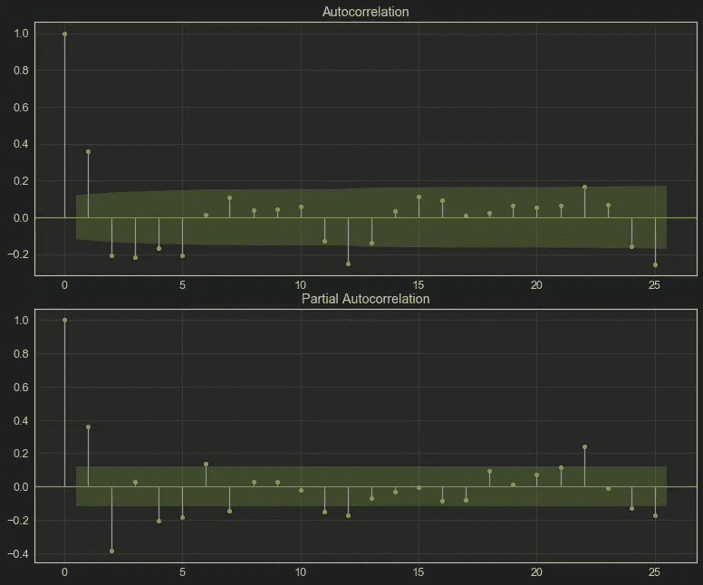

我们可以看到序列中确实存在一些序列相关性，但是很难确切地说出什么样的顺序最适合模拟它。看起来每年的季节性在 12 个滞后时是明显的，在 5 个滞后时有很强的自相关性。让我们看看从 auto.arima 调用返回的对象是什么样子的。请注意，在 R 中使用 ts 函数创建时间序列对象时，频率被指定为 12，以表示每月的数据。

```
Series: structure(c(-0.00265604405811537, -0.00177462335836864, -0.00266785396119396,  -0.00178253166628295, -0.00178571476023492, -0.000894054596880522,  -0.000894854645842713, 0, 0.00178890924272324, 0.00178571476023492,  0.00178253166628295, 0.0017793599000786, 0.002663117419484, 0.0017714796483812,  0.0026513493216207, 0.00264433825308963, 0.00263736416608573,  0.00263042676877312, 0.00262352577238545, 0.00261666089117085,  0.0034782643763247, 0.00346620797648711, 0.0025917941074276,  0.00258509407210461, 0.00171969087952739, 0.00171673861905397,  0.000857265376119187, 0.000856531101616653, 0.000855798083895465,  0.0017094021256483, 0.00170648505575954, 0.00170357792478271,  0.00254993763327249, 0.004235499766855, 0.00337553063128126,  0.00336417474563255, 0.00335289501031077, 0.00417537141048108,  0.00332779009267448, 0.00414422474602638, 0.00330305832925681,  0.00329218404347742, 0.00328138112317689, 0.00408664238545242,  0.00407000968829685, 0.00567032706008774, 0.00483482005458313,  0.00401123682645377, 0.00399521106728784, 0.0039793128514809,  0.00396354066245586, 0.00473560474583401, 0.00392927813988919,  0.00469484430420763, 0.00544960476756629, 0.00464756839654612,  0.00616334770766791, 0.0068886609951857, 0.00608366895361456,  0.00604688161489264, 0.00526119214336163, 0.00523365680611043,  0.00520640819057405, 0.00444116199996714, 0.00515654917924557,  0.00513009553102961, 0.00510391191817661, 0.0065241260769433,  0.00719945514285492, 0.00857148105014005, 0.00849863472146239,  0.00842701616188002, 0.00835659459094273, 0.00828734024856992,  0.00958255108099593, 0.00949159668157051, 0.00873367996875452,  0.00932097294306367, 0.0112027530765531, 0.0123739774874423,  0.00902067972593201, 0.00575633185257551, 0.00572338605268641,  0.00632113356336994, 0.00753299230754578, 0.00747667034301891,  0.00680485149838539, 0.0067588582951057, 0.00610502506680355,  0.0072771697738947, 0.00782429510752891, 0.0077635504899245,  0.00711324872451868, 0.0076493459184892, 0.00817284175587396,  0.00925932541279728, 0.0097449897009394, 0.010780246243792, 0.0112234623698484,  0.011650617219976, 0.0120615497338186, 0.0119178008640368, 0.0101795682134629,  0.0100769879503577, 0.0110208410142789, 0.0119326967118454, 0.0128108336717592,  0.0146578312983845, 0.014940516954951, 0.0156942897625889, 0.0149725086303825,  0.01380645591966, 0.012685159527317, 0.0120651115518431, 0.0100964602510096,  0.00682596507039968, 0.0049762599862273, 0.00270392233240102,  0.00134922440076579, 0.000449337235149727, -0.000898876465017295,  -0.0013498314760465, -0.00225377602725274, -0.00225886700972744,  -0.00181077460070966, -0.000453206443289389, 0, 0.000453206443289389,  0.00181077460070966, 0.00225886700972744, 0.00180342699915137,  0.000900495333249651, -0.0013510472669811, -0.00270758288154482,  -0.00452899324870693, -0.00500569873443624, -0.00503088186627743,  -0.0045955963233375, -0.00415417167913823, -0.00463607691747825,  -0.00605921219926842, -0.00703732672057633, -0.00756147270057639,  -0.00809721023262, -0.00623652776946138, -0.00482393603085285,  -0.00436152860052985, -0.00389294895540893, -0.00390816325475818,  -0.00294117859081666, -0.0024576075284326, -0.00345082915773354,  -0.00395844158642866, -0.00347653690108984, -0.00348866538730341,  -0.0040020063418531, -0.00351494210744541, -0.00453744161395342,  -0.00354341043998474, -0.000507228009860583, 0.00202737018250154,  0.00303336936332954, 0.00252079790656623, -0.00151171608532152,  -0.00201918291723047, -0.000505433419908385, 0.00252461633713885,  0.00402617554439999, 0.00300902935161851, -0.00100200409185014,  -0.00301205046999264, -0.00706360151874996, -0.00813425939068146,  -0.0123268124806586, -0.0135277817381336, -0.00683314091078202,  0.00263365967346196, 0.000525900616906938, -0.00263227317032033,  -0.00422610243350618, -0.00424403820047914, -0.00266169973486008,  0.00159786984729493, 0.00318810046864648, -0.00106157122495887,  -0.0042575902526405, 0, 0.00159872136369721, -0.00320000273067222,  -0.00535619920052355, -0.00215053846322988, -0.00269469308842396,  -0.00704037568232785, -0.00873367996875452, -0.00660068403135128,  -0.00442478598035656, 0, 0.00442478598035656, 0.00495459312468327,  0.00383667228648576, 0.00327690080231591, 0.00163443239871519,  -0.00217983737542049, 0.00109051264896465, 0.00705949171296005,  0.0118344576470033, 0.0085197533447694, 0.00264760546505549,  -0.00211752328990755, -0.00318471606752091, -0.00533050302693994,  -0.00643433855264597, -0.00431267514794698, -0.00162206037186685,  0.00054097918549445, -0.0021656749124972, 0, 0.0032467560988696,  0.00377460680028641, 0.00322407587175277, 0.00267881221002675,  0.00267165534280522, 0.00266453661509658, 0.00477834729198179,  0.00528263246442684, 0.00525487283835879, 0.00366204960651473,  0.00364868791549178, 0.00104004169541305, -0.0015604684570949,  -0.00312826115380993, -0.00261438057407126, 0.00104657257067053,  0.00573665197743445, 0.00673752224774127, 0.00515199490942919,  0.0035906681307285, 0.00306748706786131, 0, 0.00102040825180616,  0.00508648095637376, 0.00455581653586101, 0.00654419652421367,  0.00899106955985651, 0.00496032763096999, 0.000989119764124524,  0.00148184764088199, 0.000493461643371162, -0.000493461643371162,  0.00639608576582695, 0.0102464912091715, 0.0106229873912866,  0.0109864969415678, 0.00945633524203515, 0.00656662772389005,  0.00837993730674924, 0.0115235200038608, 0.00866991513344573,  0.00453309933098467, 0.00271002875886417, 0, 0, 0.00450045764105589,  0.00403316701762257), .Tsp = c(1, 22.9166666666667, 12), class = "ts") 

ARIMA(3,1,1)(0,0,2)[12] 

Coefficients:

          ar1     ar2      ar3     ma1     sma1     sma2

      -0.5119  0.0622  -0.3987  0.9257  -0.4116  -0.3586

s.e.   0.0611  0.0649   0.0578  0.0259   0.0666   0.0703

sigma^2 estimated as 2.524e-06:  log likelihood=1320.17

AIC=-2626.35   AICc=-2625.91   BIC=-2601.34
```

我们可以看到这有点乱，但我们需要的一切都在那里。如前所述，参数估计值和它们的名称可以方便地作为易于访问的向量附加到对象上。但是，订单不方便存储，需要通过将输出转换成字符串并对其进行索引来提取所需的信息。下面是两个函数，一个可以提取参数，另一个可以从这个对象中提取订单。

现在我们有了助手函数来从 auto.arima 输出中提取我们想要的信息。还有一个问题需要处理，那就是当 auto.arima 输出有一个常量时，我们需要以一个向量的形式向 statsmodels SARIMAX 对象提供一个外部变量，系数将被分配给这个向量。此外，创建我们的 auto.arima 响应对象可能要简单得多。我们可以创建另一个助手函数，一步提供创建 statsmodels SARIMAX 模型所需的一切，而不是每次都生成这些函数，如下所示:

我们现在拥有了快速生成时间序列的适当模型所需的一切。让我们在我们的第一个邮政编码的日志返回中尝试一下，看看它是否有效:

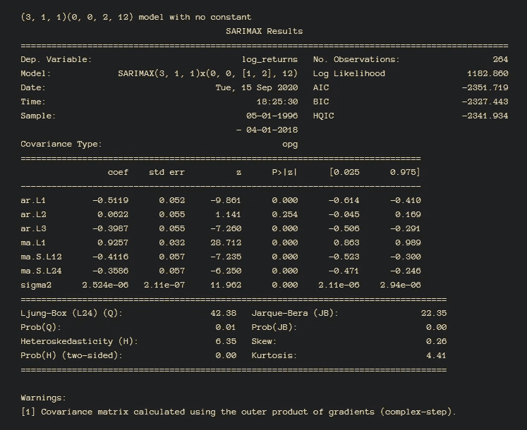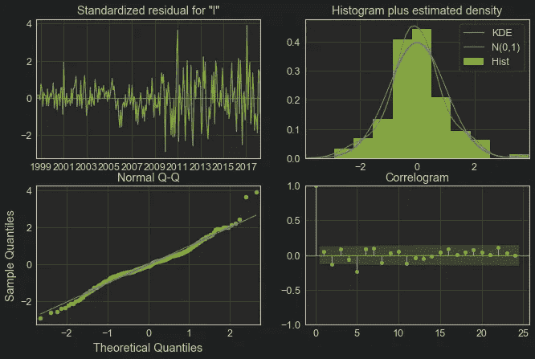

我们可以看到这个模型有一些问题，但它是相当有效的。正如预期的那样，残差是异方差的，在滞后 5 的残差中有一些轻微的自相关，这不是理想的。然而，残差以零为中心，尽管尖峰值(过度峰度，指由波动性聚类引起的细长峰)导致正态分布残差的 JB 检验零假设被拒绝，但它们不会太远，具有合理的偏斜和峰度。在其他几个邮政编码上测试这一过程表明，生成的模型一般不具有自相关残差，接近但不是正态分布的残差，异方差遵循相同的随时间增加的波动性的一般模式，以及由此产生的稀疏性。有很多讨论集中在这样一个事实上，即具有适合金融时间序列的完美 SARIMAX 模型并不常见，考虑到这个领域，尤其是考虑到它们生成的速度，这些模型是相当可靠的。

## 比较所有邮政编码的型号

我们现在希望将这个建模过程应用于所有具有完整数据的邮政编码，以及最近平均销售价格低于 500，000 美元的邮政编码。每个模型都将用于预测 5 年内的情况，然后我们将取每个模型预测期内预测平均值和置信下限的平均值进行比较。这两个指标对于邮政编码比较来说是一个很好的组合，因为较高的预期回报均值告诉我们，该模型对未来的回报前景持乐观态度，当这与同一时期较高的置信下限均值配对时，这意味着邮政编码不仅对收益有积极的前景，而且具有相对紧密的置信区间，从而具有较低的预期方差。在金融危机期间经历了不太强烈的波动聚集的邮政编码将在其模型中具有较低的 sigma2 估计值，因此在其预测中具有更紧密的置信区间。这种方法应该会引导我们找到我们投资标准中 3 个最重要的邮政编码:高预期资本增值率，低预期波动性，以及在危机期间对恶劣经济条件的弹性。一旦我们有了竞争对手，我们就可以查看他们的 P2R 比率，找出那些也能满足我们租赁盈利能力需求的比率。

尽管我们有一种新颖高效的方法来生成模型，但 14，723 个邮政编码仍然很多，为每个邮政编码生成一个模型需要几个小时。以下代码将运行适当的循环来编译指标的数据帧，我们将使用该数据帧来选择我们的顶级邮政编码候选项。

```
0 - 1001
(3, 1, 1)(0, 0, 2, 12) model with no constant
1 - 1002
(0, 1, 3)(0, 0, 2, 12) model with no constant
2 - 1005
(2, 1, 1)(0, 0, 2, 12) model with no constant
3 - 1007
(4, 1, 3)(1, 0, 1, 12) model with no constant
4 - 1008
(0, 1, 3)(0, 0, 1, 12) model with no constant...and so on forever
```

非常好。短短几个小时后，我们有了一些不错的预测指标，可以引导我们找到更好的投资邮政编码。我们采用的信息量最大的指标是整个 5 年预测中置信下限的平均值。这个数字包含了很多信息，因为如果没有一段时间内的高平均预测回报率以及低预期方差，它就不可能很高。这意味着我们可以按照这个指标降序排列我们的结果，找到目前为止我们的最佳竞争者，然后包括 P2R，以最终确定我们投资的前 5 个邮政编码的列表。

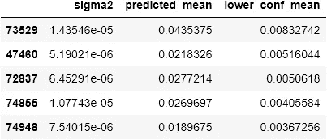

## 选择前 5 位邮政编码

结果出来了，但我们需要一个更具描述性的数据框架，我们还需要 P2R 比率。之前，我们看到 P2R 数据帧在“区域名称”列中记录了位置，这是地铁的名称以及州的缩写。我们可以从原始数据帧中创建一个类似的列，将 metro 和 state 列组合起来，这样我们就可以合并这两个数据帧。让我们将结果限制在前 200 名，然后遍历索引并创建一个 info dataframe，然后将所有内容合并在一起。


现在我们在一个地方就有了我们需要的所有信息。我们可以看到，P2R 一栏中有缺失值，因此我们无法对这些邮政编码的租赁盈利能力进行评论，我们将专注于那些我们有 P2R 信息的项目。让我们将我们的结果过滤到 P2R 低于全国平均水平的所有东西，然后从那里开始。

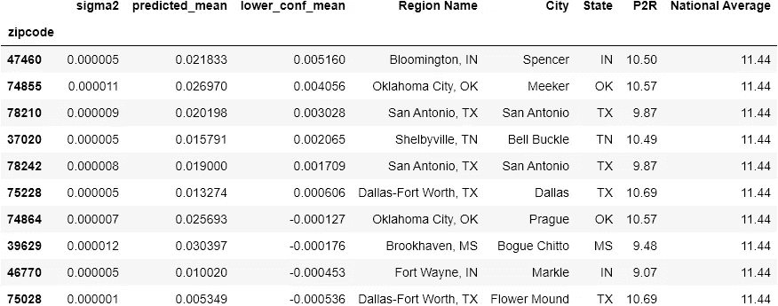

现在我们的搜寻即将结束。接下来要做的是分别检查每个邮政编码的模型，为投资者找到最好的机会。为了节省一点空间，这个列表中的前两个邮政编码具有历史上较低的波动性，然后在最近一两个月出现了巨大的意想不到的增长率，这些因素的结合使得模型预测在短期内相当乐观。然而，最好是建议客户投资于近几个月回报率较高的邮政编码，所以我们继续往下看。圣安东尼奥有很高的 P2R 比率，接近多根推荐的 9.6。由于我们的目标 P2R 是 10 左右，让我们考虑一下这意味着什么:需要 10 年的租金支付才能还清拥有一套房产的成本。这意味着，如果投资者持有房产 10 年，并在此期间将其出租，他们将已经还清了初始投资，并且仍然可以以潜在的更高价值出售房产！这给了他们巨大的投资回报。让我们看看圣安东尼奥的模型，并对未来 10 年进行预测。

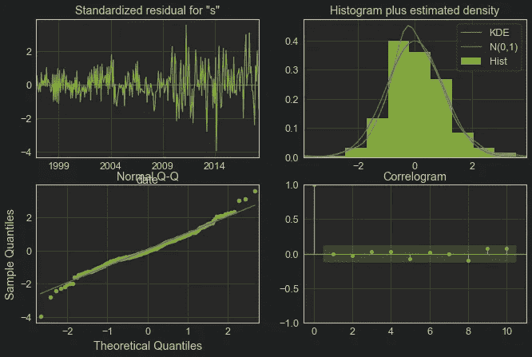

我们可以看到，除了该数据集中任何邮政编码预期的典型异方差性之外，该模型拟合得相当好。残差接近正态分布，并且残差不是自相关的。让我们看看样本内和样本外的 10 年预测。

这是一个 10 年的样本预测，带我们回到危机中期，那时事情最不确定。


我们可以看到，尽管我们的 sigma2 可能有点低估，但我们模型的置信带包含了 2008 年 4 月以后的所有情况，除了最近的增长峰值。让我们看看这个模型对未来 10 年的预测。


这看起来很不错。预测的平均值为每月 2%左右，置信区间大多在零线以上。阴影区域中低于零线的面积比零线以上的面积小得多，这让投资者相信他们在未来 10 年不太可能亏损。

在这一点上，选择前 5 个邮政编码是通过检查每个邮政编码的单个模型手工完成的。只需在最初的 get_group 调用中更改邮政编码，就可以调整上面的三个代码块来为任何邮政编码生成模型及其预测。在选择前 5 名时，避免选择同一城市的两个邮政编码，因为分散投资在资本投资中通常是一件好事，这样，如果某个地方的市场受到不利影响，投资组合就不会过度暴露。然而，达拉斯/沃斯堡地铁的两个邮政编码被选中，尽管在不同的地区，一个是郊区，一个是市区。最好的 5 个邮政编码是:


所有这些邮政编码都有很好的平均回报预测，较低的估计波动性，以及低于全国平均水平的 P2R 比率。根据 SARIMAX 模型，由于这些邮政编码在预测中也具有最高的平均置信区间下限，因此它们代表了最不可能在未来失去价值的区域。这些邮政编码区的房产可以通过大约 10 年的租金来偿还所有权成本，因此，假设房屋除了保持其价值之外什么也不做，投资者可以在这段时间内获得 100%的利润，房产的任何资本收益都将是额外的。考虑到这些邮政编码具有最低的贬值概率，它们对于房地产投资者来说是相当有吸引力的选择。让我们一起来看看它们的价格曲线。

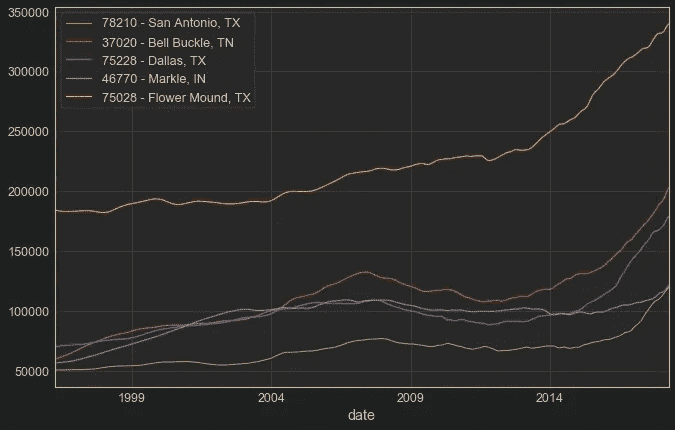

这让我们很好地了解了这些邮政编码对市场崩溃的弹性，以及我们所期待的近期增长。让我们看看其余前 5 位邮政编码的型号。

钟形扣，TN:

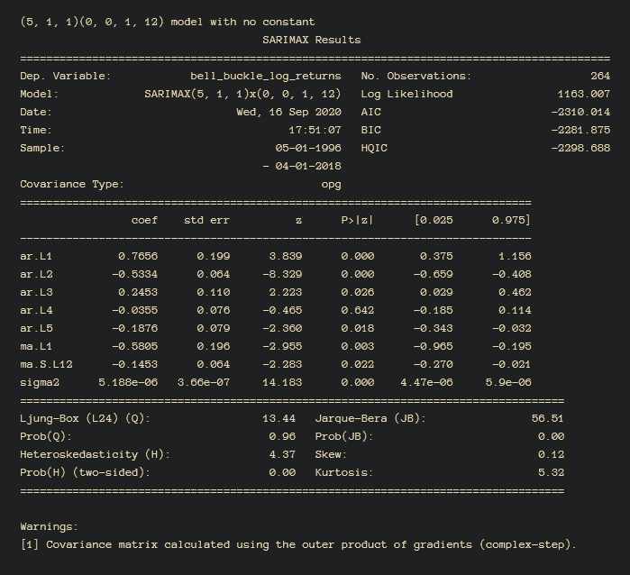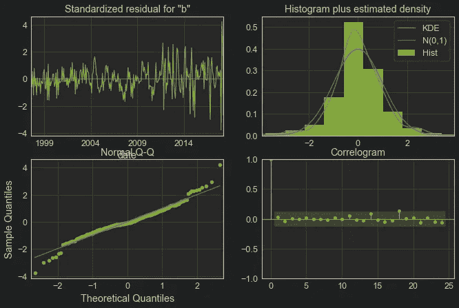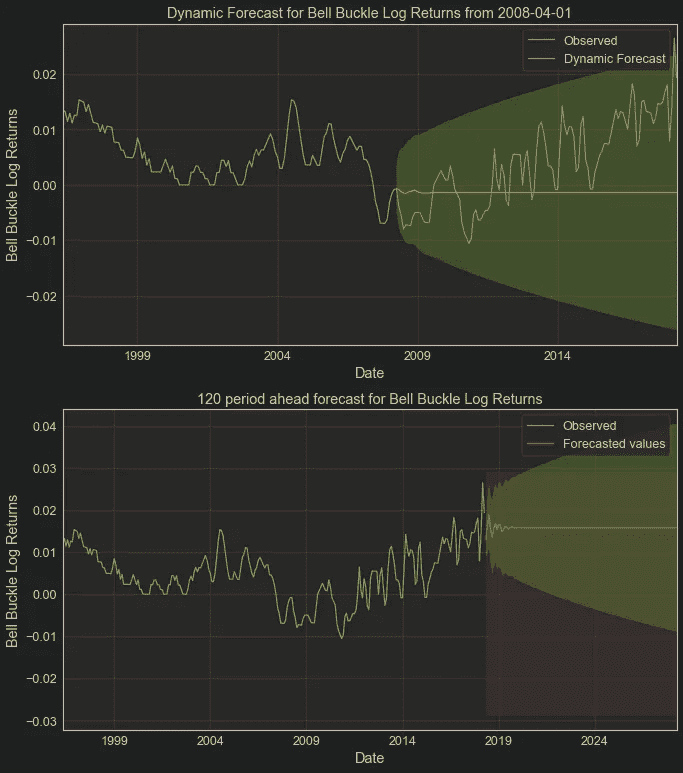

德克萨斯州达拉斯:

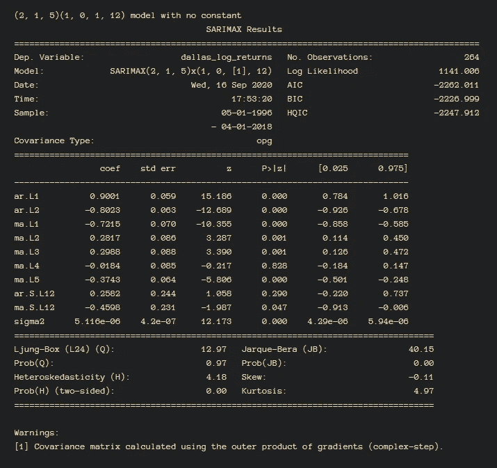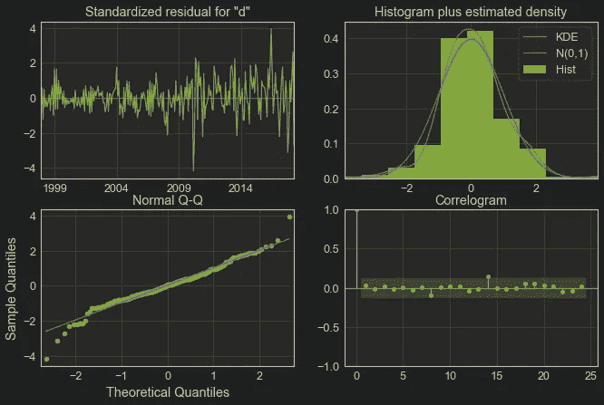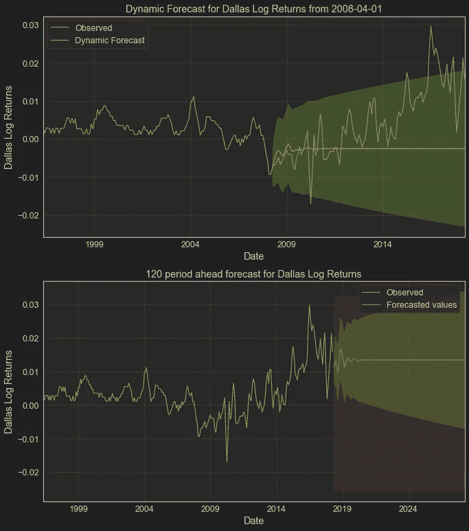

马克尔，在:

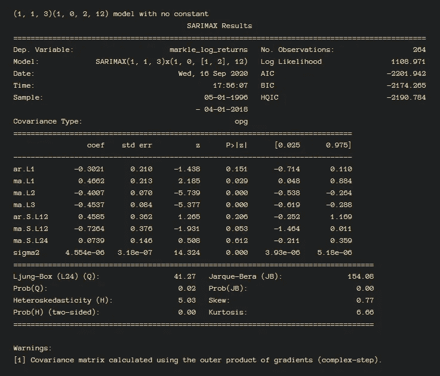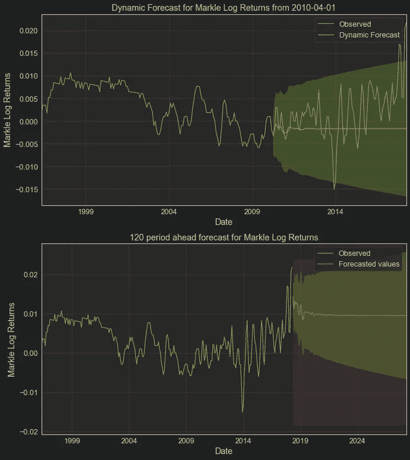

德克萨斯州花丘:

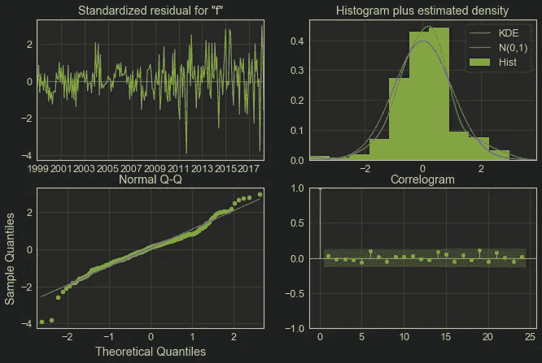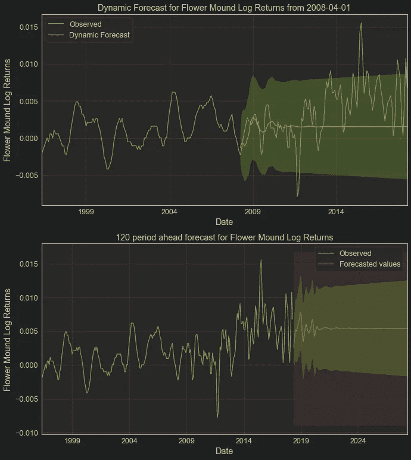

## 结论

在这个项目中，一个虚构的房地产投资公司被告知要投资的前五个邮政编码。为了回答这个问题，将领域知识与为每个邮政编码的返回序列生成的 SARIMAX 模型的比较相结合。为了在合理的时间框架内生成如此大量的模型，使用 Python 演示了一种为大量时间序列生成良好拟合模型的有效方法。通过在 Python 环境中使用 R 的 forecast 包中的 auto.arima 函数，可以使用 Python 工作流和 statsmodels 功能，并快速生成适当的模型。邮政编码是由他们对资本增值的展望评估的，寻找低预期方差的强劲增长。然后，具有最佳前景的邮政编码的 P2R 比率被用于筛选结果，同时具有良好前景和高于平均租赁利润率的邮政编码被手动选择用于推荐。由于目标 P2R 约为 10 年，因此生成了 10 年预测，以了解持有期内模型预期是什么，在持有期内，所有者可以预期支付财产所有权的成本。由于所选的邮政编码(78210、37020、75228、46770 和 75028)是数据集中 14，723 个邮政编码中最不可能贬值的，因此它们是房地产投资者的最佳选择。