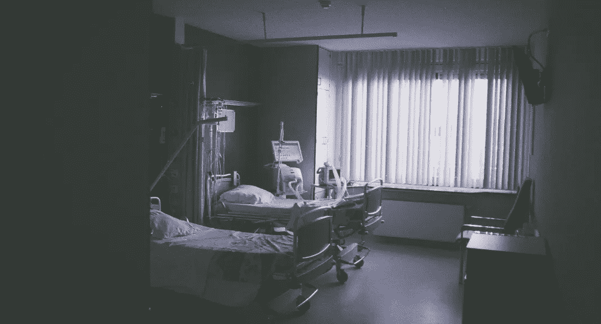

# 辨别人工智能的真实例子

> 原文：<https://towardsdatascience.com/real-life-examples-of-discriminating-artificial-intelligence-cae395a90070?source=collection_archive---------0----------------------->

## 人工智能算法展示偏见和成见的真实例子

马库斯·斯皮斯克在 [Unsplash](https://unsplash.com/s/photos/racism?utm_source=unsplash&utm_medium=referral&utm_content=creditCopyText) 上的照片

# 目录

1.  介绍
2.  人工智能偏见的三个真实例子
3.  我们能从这一切中学到什么？

# 介绍

> **人工智能。**

有些人说这是一个没有什么实际意义的时髦词。其他人说这是人类灭亡的原因。

事实是，人工智能(AI)正在引发一场技术革命，尽管 AI 尚未接管世界，但我们已经遇到了一个更紧迫的问题:AI 偏见。

**什么是 AI 偏见？**

人工智能偏见是用于创建人工智能算法的数据中的潜在偏见，最终可能导致歧视和其他社会后果。

让我举一个简单的例子来阐明这个定义:假设我想创建一个算法来决定一个申请人是否被一所大学录取，而我的输入之一是地理位置。假设来说，如果一个人的位置与种族高度相关，那么我的算法将间接有利于某些种族。这是人工智能偏见的一个例子。

**这是危险的**。歧视破坏了平等机会，加剧了压迫。我可以肯定地说这一点，因为已经有几个例子表明人工智能偏见确实做到了这一点。

在这篇文章中，我将分享三个真实的例子，说明人工智能算法何时对他人表现出偏见和歧视。

# 人工智能偏见的三个真实例子

## 1.美国医疗保健中的种族主义

照片由[金奎大·斯蒂文斯](https://unsplash.com/@daanstevens?utm_source=unsplash&utm_medium=referral&utm_content=creditCopyText)在 [Unsplash](https://unsplash.com/s/photos/hospital?utm_source=unsplash&utm_medium=referral&utm_content=creditCopyText) 上拍摄

2019 年 10 月，研究人员发现，在美国医院对超过 2 亿人使用的一种算法预测哪些病人可能需要额外的医疗护理，这种算法严重倾向于白人病人而不是黑人病人。虽然种族本身不是这个算法中使用的变量，但另一个与种族高度相关的变量是，即医疗费用历史。基本原理是，成本总结了一个特定的人有多少医疗保健需求。出于各种原因，平均而言，在同样的情况下，黑人患者比白人患者花费的医疗费用要低。

令人欣慰的是，研究人员与 Optum 合作，将偏差水平降低了 80%。但是如果他们一开始没有被审问，人工智能偏见会继续严重歧视。

## 2.康派斯牌衬衫

比尔·牛津在 [Unsplash](https://unsplash.com/s/photos/crime?utm_source=unsplash&utm_medium=referral&utm_content=creditCopyText) 上的照片

可以说，人工智能偏见最显著的例子是 COMPAS(替代制裁的矫正罪犯管理概况)算法，该算法在美国法院系统中用于预测被告成为[惯犯](https://en.wikipedia.org/wiki/Recidivism)的可能性。

由于所使用的数据、所选择的模型以及创建算法的整个过程，模型[预测黑人罪犯再犯的误报率(45%)是白人罪犯的两倍(23%)](https://www.logically.co.uk/blog/5-examples-of-biased-ai/) 。

## 3.亚马逊的招聘算法

布莱恩·安杰洛在 [Unsplash](https://unsplash.com/s/photos/amazon?utm_source=unsplash&utm_medium=referral&utm_content=creditCopyText) 上拍摄的照片

亚马逊是世界上最大的科技巨头之一。因此，毫不奇怪，他们是机器学习和人工智能的大量用户。2015 年，亚马逊意识到他们用于雇用员工的算法[被发现对女性](https://www.theguardian.com/technology/2018/oct/10/amazon-hiring-ai-gender-bias-recruiting-engine)有偏见。这是因为该算法是基于过去十年提交的简历数量，由于大多数申请人是男性，它被训练成更倾向于男性而不是女性。

# 我们能从这一切中学到什么？

很明显，制作无偏见的算法很难。为了创建无偏见的算法，使用的数据必须是无偏见的，创建这些算法的工程师需要确保他们没有泄露任何自己的偏见。也就是说，这里有一些小贴士可以减少偏见:

1.  **一个人使用的数据需要代表“应该是什么”而不是“是什么”**。我的意思是，随机抽样的数据会有偏差，这是很自然的，因为我们生活在一个有偏差的世界，在那里平等的机会仍然是一个幻想。但是，我们必须主动确保我们使用的数据平等地代表每个人，并且不会对特定人群造成歧视。例如，对于亚马逊的招聘算法，如果男性和女性的数据量相等，该算法可能不会有这么大的区别。
2.  **应该强制实施某种数据治理**。由于个人和公司都有某种社会责任，我们有义务规范我们的建模过程，以确保我们在实践中是道德的。这可能意味着几件事，比如雇佣一个内部合规团队对每个创建的算法进行某种审计，就像 Obermeyer 的团队所做的那样。
3.  **模型评估应包括社会团体的评估**。从上面的例子中，我们应该努力确保在比较不同的社会群体(无论是性别、种族还是年龄)时，真实准确率和假阳性率等指标是一致的。

> 你们还觉得怎么样？每个人都应该采取哪些最佳做法来最大限度地减少人工智能偏差！留下评论，大家一起讨论！

# 感谢阅读！

## 特伦斯·申

*创始人*[*ShinTwin*](https://shintwin.com/)*|我们来连线一下*[*LinkedIn*](https://www.linkedin.com/in/terenceshin/)*|项目组合这里是***。**