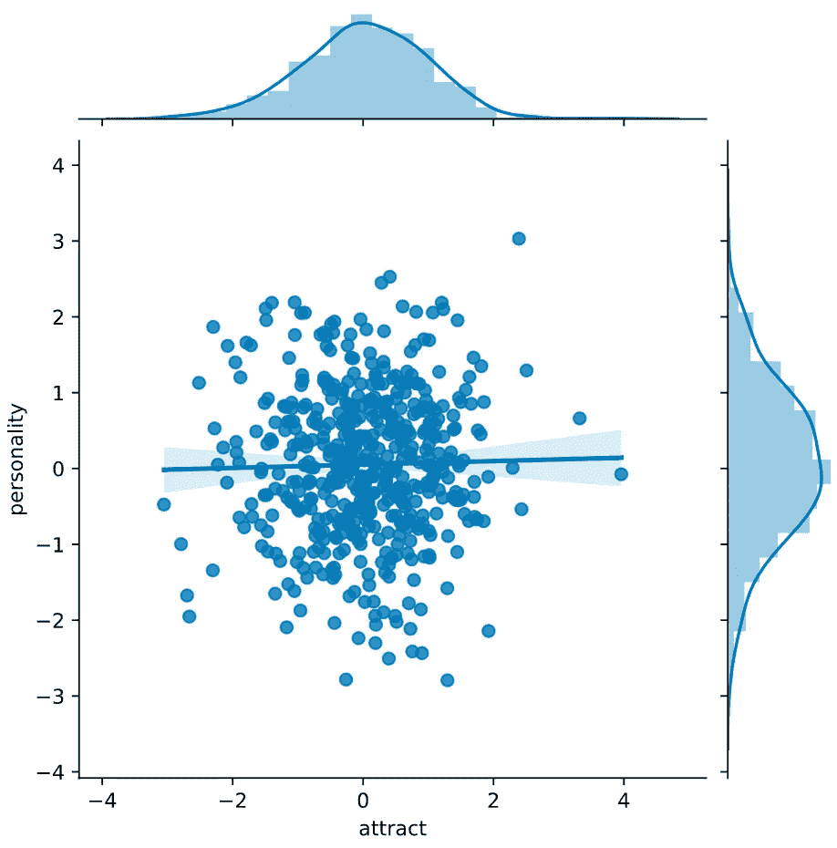
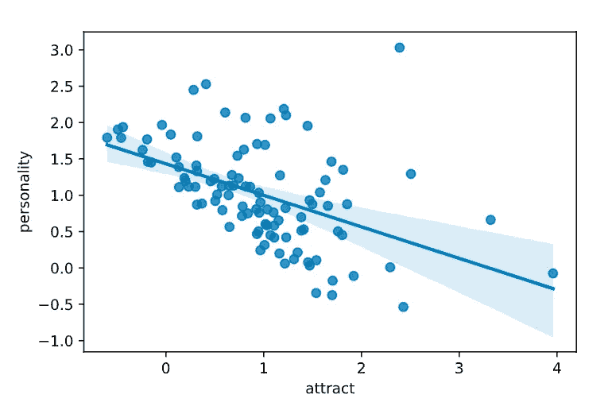
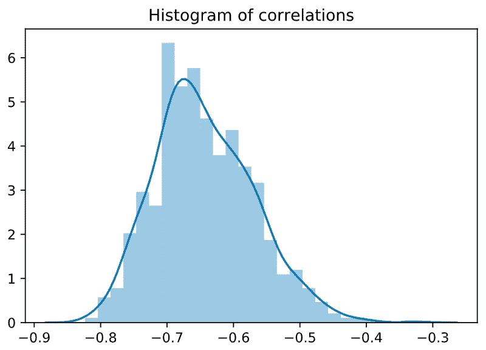
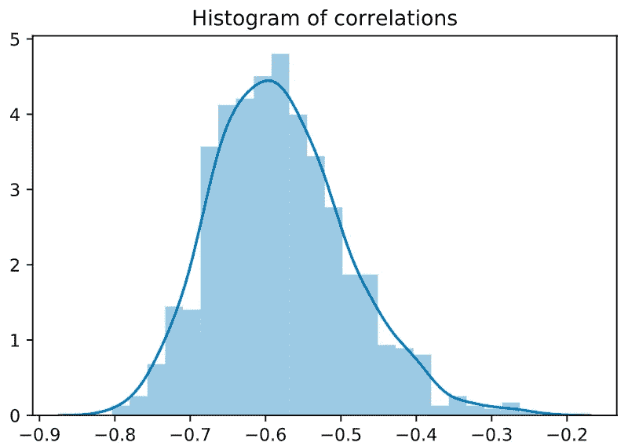

# 真实或虚假的关系:你约会的有魅力的人更令人讨厌

> 原文：<https://towardsdatascience.com/real-or-spurious-correlations-attractive-people-you-date-are-nastier-fa44a30a9452?source=collection_archive---------28----------------------->

## 因果推理和虚假关联

## 使用 Python 模拟假相关性


照片由[达雷尔·弗雷泽](https://unsplash.com/@darrellfraser?utm_source=unsplash&utm_medium=referral&utm_content=creditCopyText)在 [Unsplash](https://unsplash.com/s/photos/dating-nasty?utm_source=unsplash&utm_medium=referral&utm_content=creditCopyText) 上拍摄

# 魅力-个性相关性

这里有一个普遍的直觉:你已经非常仔细地挑选了你的约会对象，基于他们看起来有多好，以及他们是否有很好的个性。但不知何故，在你约会过的人中，那些更有魅力的人往往性格更差。吸引力和个性之间有很强的负相关性。

在你断定有魅力的人一定是令人讨厌的之前，我们可以使用一些基本的数据科学技能来测试我们的直觉，看看是否有什么地方出了可怕的问题(**剧透:是的，有什么地方出了问题**)。

如果你喜欢像这样的因果推理问题和悖论，看看洛德悖论(另一个常见的推理问题):

 [## 数据科学:因果推理和洛德悖论:改变分数还是协变量？

hausetutorials.netlify.app](https://hausetutorials.netlify.app/posts/2020-04-11-causal-inference-and-lords-paradox-change-score-or-covariate/) 

# 模拟数据以获得洞察力

但是我们怎么知道吸引力和性格之间的负相关是真的呢？数据科学家定期处理相关性，获得更多关于数据的直觉和学习分析方法的好方法是通过模拟。所以我们模拟一些数据来检验我们的直觉。

# Python 模拟

首先，我们导入常用的数据科学模块:`numpy`、`pandas`、`seaborn`(用于可视化仿真结果)。

```
import numpy as np
import pandas as pd
import seaborn as sns
```

让我们指定几个模拟参数，模拟一些数据。我们将设置一个随机种子，以便您可以复制我的结果，但如果您愿意，可以跳过它。你的模拟也可以工作，但是你的结果不会和我的一样，但是会非常相似。

```
# set seed so you can replicate my results
np.random.seed(1)# let’s pretend you have 500 potential dates to choose from
n = 500# generate personality and attractiveness data
# assume data comes from normal distribution
data = {"personality": np.random.randn(n),
        "attract": np.random.randn(n)}# store data in pandas dataframe
df = pd.DataFrame(data)
```

因为个性和吸引力是使用`np.random.randn()`随机生成的，所以模拟值来自正态分布，这两种分布并不相关。

```
sns.jointplot('attract', 'personality', *data*=df, *kind*='reg')
```



在你的 500 个潜在约会对象中，吸引力和个性之间没有关联。

现在让我们具体说明你的约会标准。这个参数反映了你有多挑剔。**我们将它设置为 0.80，这意味着你将只和那些在你的 500 个潜在约会对象中，综合吸引力和个性值排在前 20%的人约会。**

```
quantile = 0.80    # dating criterion
```

现在让我们决定你实际上和谁约会。

```
# add personality and attract values
df['personality_attract'] = df['personality'] + df['attract']# determine the 0.80 quantile personality_attract cutoff value
cutoff = df['personality_attract'].quantile(quantile)# determine who to date/reject
# if higher than our cutoff value/criterion, date person
# else (lower than cutoff value/criterion, reject person
# save 'dated'/'rejected' in new 'outcome' column
df['outcome'] = np.where(df['personality_attract'] > cutoff, 'dated', 'rejected')
```

过滤数据，使其只包含你约会过的人。

```
# select only rows/people you chosen to date
dated = df.query('outcome == "dated"')
```

`dated`数据帧有 100 行(可以用`dated.shape`验证)。在你可能约会的 500 个人中，你和其中的 100 个人约会了(前 20%的人)。

# 可视化模拟结果

让我们画出你约会过的人的`personality`和`attract`特征之间的相关性。记住，你选择约会对象是基于**他们看起来有多好(‘吸引’)**和**他们是否有伟大的个性(‘个性’)**。

```
sns.regplot('attract', 'personality', *data*=dated)
```

假设你之前和我一样使用了相同的随机种子，`attract`和`personality`之间的相关性应该大约是–0.48，你可以使用 pandas `.corr()`方法:`dated.corr()`来验证



你约会过的有魅力的人显然个性更差。

另外，如果您经常在 Python 中使用统计模型，我强烈推荐 Pingouin 库。

[](/new-python-library-for-statistical-tests-simpler-than-statsmodels-richer-than-scipy-stats-ff380d4673c0) [## 用于统计测试的新 Python 库—比 statsmodels 更简单，比 scipy.stats 更丰富

### 统计建模变得更简单

towardsdatascience.com](/new-python-library-for-statistical-tests-simpler-than-statsmodels-richer-than-scipy-stats-ff380d4673c0) 

# 是不是偶然？运行更多模拟

优秀的数据科学家非常了解机会和概率。上面的负相关可能都是由于偶然，所以总是有必要运行多个模拟来看看我们是否能重复上面的结果。

# 定义模拟功能

为了避免重复代码(软件开发中的 **DRY** 原则——不要重复自己)，让我们定义一个运行模拟的函数。我们基本上是把上面所有的代码放在一个函数里。

下面是我们新定义的`simulate`函数的注意事项:

*   模拟参数现在是函数参数
*   `simulations`参数让我们指定运行多少模拟
*   `simulate`函数返回所有模拟的相关值

```
# define function to run simulations
def simulate(*simulations*=1000, *n*=500, *quantile*=0.80):

    # initialize array to store simulated correlations
    correlations = np.zeros(simulations)

    # loop
    for i in range(simulations): # same code described above in the article
        data = {"personality": np.random.randn(n), 
                "attract": np.random.randn(n)}
        df = pd.DataFrame(data) # identify who you want to date
        df['personality_attract'] = df['personality'] + \
                                    df['attract']
        cutoff = df['personality_attract'].quantile(quantile)
        df['outcome'] = np.where(df['personality_attract'] > cutoff, 
                                 'dated', 'rejected')
        dated = df.query('outcome == "dated"') # compute correlation between attract and personality
        correlations[i] = dated.corr()['personality'][1] return correlations
```

# 运行并绘制 1000 次模拟的结果

```
np.random.seed(1)  # set seed so you get same results as me
correlations = simulate()
sns.distplot(correlations).set_title('Histogram of correlations')
```

下面是来自 1000 次模拟的 1000 个相关值的直方图。直方图的中点约为–0.65，所有模拟的相关性都小于 0。也就是说，在所有 1000 个模拟中，相关性都是负面的:你约会过的有魅力的人性格更差！



吸引力和个性之间的负相关模拟。

# 用不同的参数再次模拟

如果负相关是因为我们的模拟参数呢？现在，让我们假设你有一个更小的可供选择的人群(300 人)，你决定对你的约会标准更加宽松(0.7:你愿意和高于 0.7 分位数的人约会)。

```
np.random.seed(2)  # set seed so you get same results as me
correlations = simulate(n=300, quantile=0.7)
sns.distplot(correlations).set_title('Histogram of correlations')
```

同样，我们所有的模拟在吸引力和个性之间有负相关(大约-0.60)。



吸引力和个性之间的负相关模拟。

# 在你下结论之前，多思考和模拟

你认为负相关是真实的还是虚假的？也就是说，有魅力的人真的倾向于性格更差吗，还是我们正在处理的数据的性质有问题？**剧透:是后者，但我不会告诉你为什么(因为答案可以在数据中找到)，除了告诉你这是一个因果推断问题。**

在您结束之前，请试验并调整上面的代码，模拟更多的数据，并更改参数(甚至是代码本身)。至关重要的是，以不同的方式绘制模拟数据和结果，你可能会在数据中看到有趣的模式。

我期待着你的想法，评论，或回答如下。如果你喜欢这篇文章，请关注我的更多数据科学文章，我会在以后的文章中解释因果推理如何帮助我们解决这个(cor)关系问题！

如果您对提高数据科学技能感兴趣，以下文章可能会有所帮助:

[](/reshaping-numpy-arrays-in-python-a-step-by-step-pictorial-tutorial-aed5f471cf0b) [## 在 Python 中重塑 numpy 数组—一步一步的图形教程

### 本教程和备忘单提供了可视化效果，帮助您理解 numpy 如何重塑数组。

towardsdatascience.com](/reshaping-numpy-arrays-in-python-a-step-by-step-pictorial-tutorial-aed5f471cf0b) [](/two-simple-ways-to-loop-more-effectively-in-python-886526008a70) [## 在 Python 中更有效地循环的两种简单方法

### 使用枚举和压缩编写更好的 Python 循环

towardsdatascience.com](/two-simple-ways-to-loop-more-effectively-in-python-886526008a70) [](https://medium.com/better-programming/code-and-develop-more-productively-with-terminal-multiplexer-tmux-eeac8763d273) [## 使用终端多路复用器 tmux 提高编码和开发效率

### 简单的 tmux 命令来提高您的生产力

medium.com](https://medium.com/better-programming/code-and-develop-more-productively-with-terminal-multiplexer-tmux-eeac8763d273) 

*更多帖子，* [*订阅我的邮件列表*](https://hauselin.ck.page/587b46fb05) *。*