# 具有深度学习的实时 3D 人脸跟踪

> 原文：<https://towardsdatascience.com/real-time-3d-face-tracking-with-deep-learning-963b91bb5ad4?source=collection_archive---------11----------------------->

## 我在尝试复制 Snapchat 镜头和抖音特效背后的人工智能技术时学到的东西

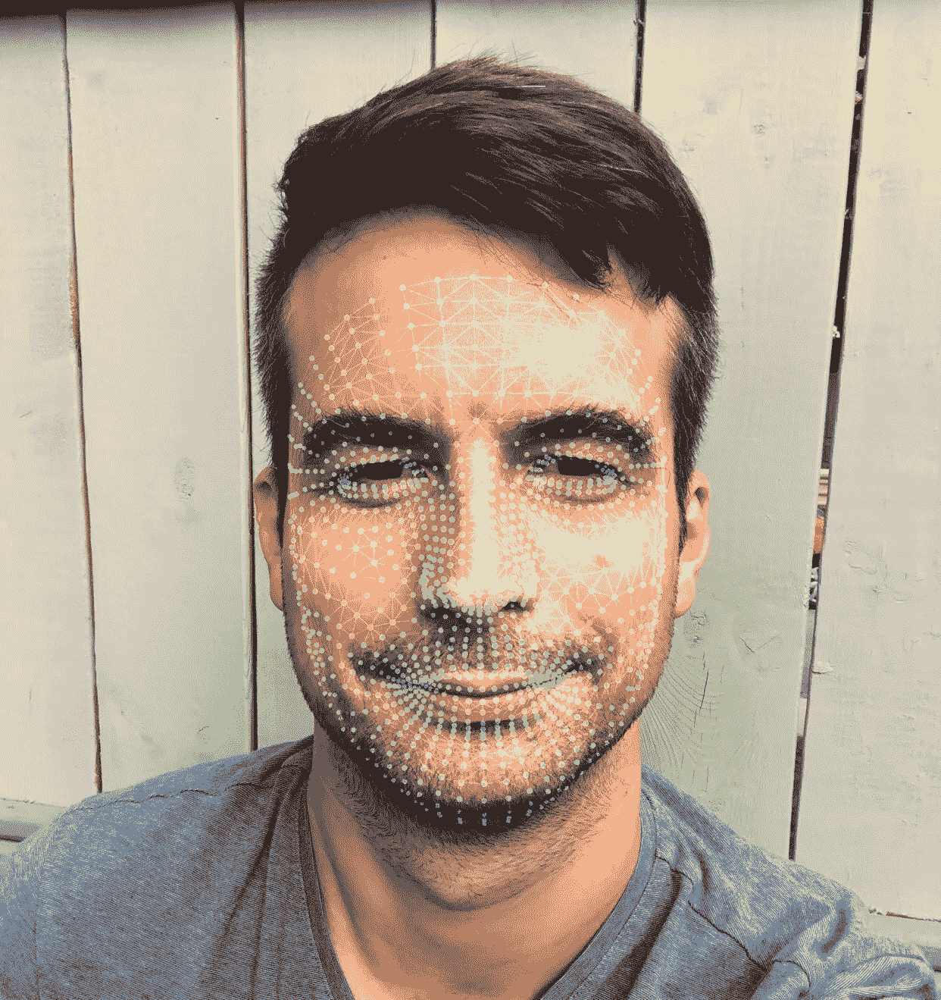

电脑眼中的我

napchat 通过在人们的头上戴上有趣的狗耳朵、交换面部表情和其他把戏变得流行起来，这些把戏不仅有趣，看起来也不可能，甚至还有*的魔法*。我在数字视觉特效行业工作，所以我对这种魔力很熟悉..以及了解它在幕后如何运作的渴望。

# 魔术背后

修改人脸是好莱坞视觉特效中的常规工作，这是一项当今广为人知的技术，但通常需要数十名数字艺术家才能实现逼真的人脸变换。我们如何实现自动化？

以下是这些艺术家遵循的步骤的简单分类:

1.  **追踪**3D 中人脸相对于摄像机的位置、形状和运动
2.  **3D 模型的动画**捕捉到被跟踪的人脸(如狗鼻子)
3.  **将 3D 模型的光照和渲染**成 2D 图像
4.  **将渲染的 CGI 图像的**与真人动作镜头合成

步骤 2 和 3 的自动化与视频游戏中发生的事情没有太大的不同，它相对简单。合成可以简化为 3D 前景超过现场背景，很容易。挑战在于追踪，一个程序如何“看到”人类头部的复杂运动？

# 用人工智能追踪人脸

计算机科学界长期以来一直试图自动跟踪人脸，但这很难。近年来，机器学习来拯救我们，每年都有许多关于深度学习的论文发表。我花了一段时间寻找“艺术状态”,并意识到实时做到这一点是非常困难的！这是一个尝试应对挑战的好理由(这将与我已经实现的 AR 美颜模式配合得很好)。

> “试图追踪面孔..这很难..实时做这个很辛苦！”

我是这样做的。

## 设计网络

卷积神经网络常用于图像的视觉分析，并且通常用于诸如对象检测和图像识别的应用。

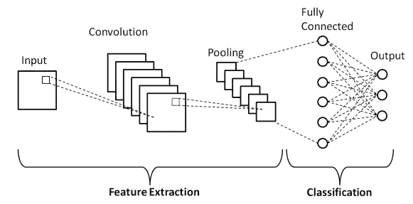

基本的卷积神经网络架构(来自[本刊](https://www.researchgate.net/publication/336805909_A_High-Accuracy_Model_Average_Ensemble_of_Convolutional_Neural_Networks_for_Classification_of_Cloud_Image_Patches_on_Small_Datasets) ⁹)

对于要实时评估的深度神经网络(至少每秒 30 次)，需要紧凑的网络。随着机器学习和智能手机的普及，每年都会发现新的模型，推动效率的极限——在计算*精度*和*开销*之间进行权衡。在这些模型中，MobileNet、SqueezeNet 和 ShuffleNet 由于其紧凑性而在移动设备上的应用中很受欢迎。

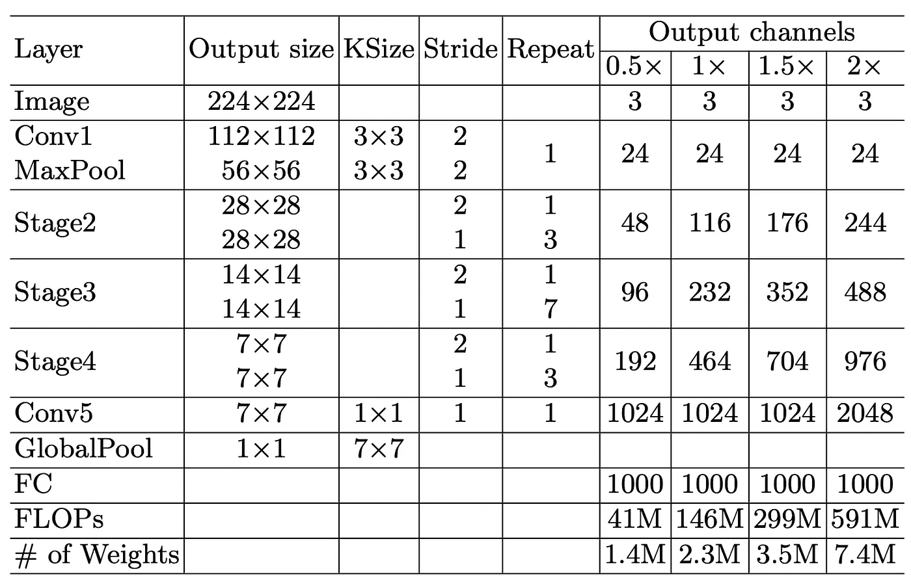

针对不同复杂程度的 ShuffleNet V2 架构(来自作者)

[ShuttleNet V2](https://arxiv.org/abs/1807.11164) 最近推出，提供最先进的表演，有各种尺寸，以平衡速度和准确性。它配有 PyTorch，这是选择该型号的又一个原因。

## 选择要学习的功能

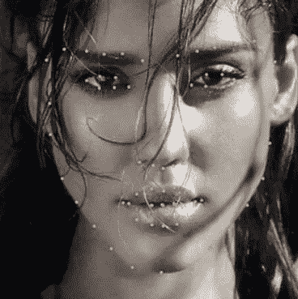

面部标志(摘自[本文](https://arxiv.org/abs/1803.04108))

现在我需要找到 CNN 应该学习的特性。一种常见的方法是为面部的不同关键部位定义一系列锚点，也称为“面部标志”。

这些点被编号并战略性地围绕着眼睛、眉毛、鼻子、嘴和下颌线。我想训练网络来识别每个点的坐标，以便稍后可以基于它们重建遮罩或几何网格。

## 构建训练数据集

因为我想用 3D 效果增强视频，所以我寻找了一个具有 3D 地标坐标的数据集。300W-LP 是少数几个带有 3D 位置的数据集之一，它非常大，并且作为一个额外的好处，它提供了很好的面部角度多样性。我想将我的解决方案与最先进的技术进行对比，最近的出版物在 aflw 2000–3D 上测试了他们的模型，因此我选择 300W-LP 进行训练，并在 aflw 2000–3D 上进行测试以进行比较。

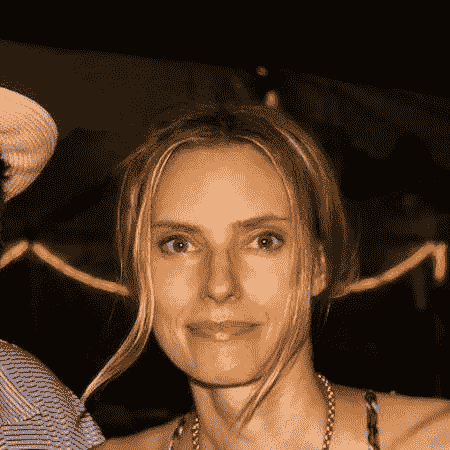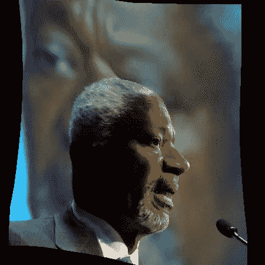

来自数据集 [300W-LP](http://www.cbsr.ia.ac.cn/users/xiangyuzhu/projects/3DDFA/main.htm) 的图像，以数学方式生成剖面图

关于这些数据集的说明，它们是为研究社区准备的，通常不会免费用于商业用途。

## 扩充数据集

数据集扩充通过向已有的集合添加更多变化来提高训练的准确性。我对每个图像和地标进行了如下的变换，以随机的数量创建新的图像和地标:围绕中心旋转-/+ 40 度，平移和缩放 10%,水平翻转。我在内存中对每张图片和每一个学习阶段(时期)应用不同的随机变换来进行额外的增强。

还需要将输入图像裁剪到界标的边界框附近，以便 CNN 识别界标的相对位置。这是为了节省训练期间从磁盘加载的时间而做的预处理。

## 设计损失函数

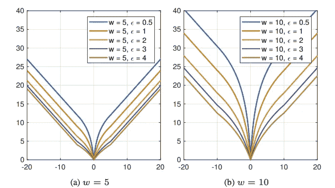

不同参数设置下的机翼损失函数图(图片来自[出版物](https://arxiv.org/abs/1711.06753) ⁴)

典型地，L2 损失函数用于测量标志位置的预测误差。最近的[出版物](https://arxiv.org/abs/1711.06753) ⁴描述了一个所谓的机翼损失函数，它在这个应用中表现更好，我可以验证。我按照作者的建议，用 w=10 和ε = 2 对其进行参数化，并对所有地标坐标的结果求和。

## 训练网络

训练深度神经网络是非常昂贵的操作，需要强大的计算机。实际上，使用我的笔记本电脑一个培训阶段要花费数周时间，而建立一个像样的系统要花费数千美元。我决定利用云，这样我就可以只为我需要的计算能力付费。

我选择了 [Genesis Cloud](http://www.genesiscloud.com) ，它提供了极具竞争力的价格和 50 美元的免费积分。我用 GeForce GTX 1080 Ti 构建了一个 Linux 虚拟机，准备了一个操作系统和存储映像，在那里我安装了 PyTorch 并上传了我的代码和数据集，所有这些都是通过 ssh 完成的。一旦系统设置完毕，就可以根据需要启动和关闭，创建快照允许从我离开的地方继续工作。

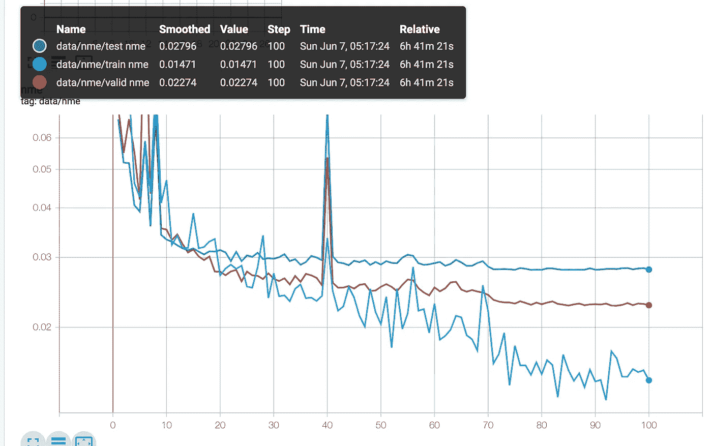

每个历元的平均误差图

内部训练循环处理 32 个图像的小批量，以最大限度地提高 GPU 上的并行计算。一个学习过程(epoch)处理大约 60，000 个图像的整个集合，并且花费大约 4 分钟。训练集中在 70 个纪元左右，所以为了安全起见，我让它整夜运行 100 个纪元。

我使用流行的 Adam 优化器，它可以自动调整学习率，从 0.001 开始。我发现设置正确的初始学习率是至关重要的，如果它太小，训练过早地收敛于次优解。如果它太大，就很难收敛。我通过反复试验找到了价值，这很费时间..实际上，为每次使用支付云费用是非常昂贵的！

## 估价

所有这些努力都得到了回报，通过更大的网络洗牌网 V2 2x，我在 aflw 2000–3D 上获得了 2.796 的归一化平均误差(NME)。在该数据集上，这比最先进的[模型](https://arxiv.org/abs/1812.01936) ⁵及其 3.07 的非市场经济性要好很多，尽管该模型要重得多！💪

预测的界标与地面真实情况的比较证实了理论结果，界标甚至在大角度下也能精确地找到它们的路径(尽管 aflw 2000–3D 包含我的模型失败的极端角度的挑战性案例)。

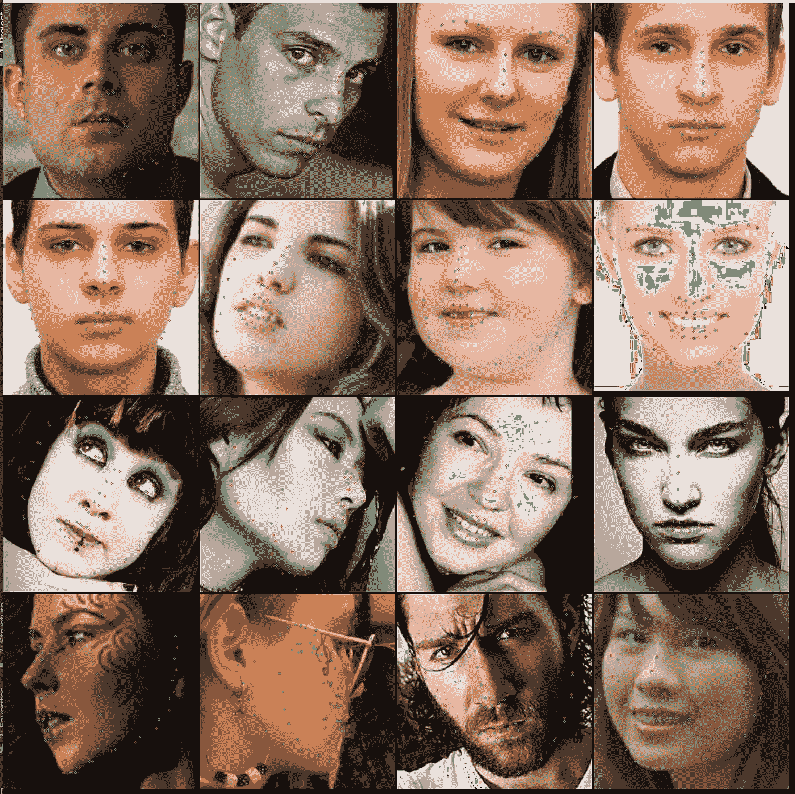

在 aflw 2000–3D 上评估我的模型，红色标记来自地面实况，绿色标记预测

我的 MacBook Pro 上没有大的 CUDA GPU 进行推理(对模型的评价)。为了最大限度地利用硬件资源，我将模型转换为可移植格式 ONNX，并使用微软的[库](https://github.com/microsoft/onnxruntime) ONNX 运行时，它可以在我的机器上更有效地推断模型(是的，它在 OSX 上运行！).在 **CPU** 上，推理时间在 100 毫秒以下，这已经很不错了，尽管不是实时的。但是我要记住，我在这里使用最大版本的 ShuffleNet V2 (2x)以获得最大的精度，我可以选择较小的版本以提高速度(例如 1x 版本快 4 倍)。我也可以在 GPU 上运行更好的数字。

这一切都是为了一个强大的面部跟踪系统..至少我是这么认为的。

# 视频的局限性

我终于可以把训练好的网络接入视频流了。在使用单独的模型来检测面部边界框时需要一个额外的步骤，因此我们可以在接近地标的位置裁剪图像，就像在训练数据集中一样。经过大量的研究，我选择使用[这款轻量级人脸检测器](https://medium.com/syncedreview/smaller-is-better-lightweight-face-detection-for-smartphones-bcd27a1a1a82)，它的评估速度非常快，而且非常精确(我也试过其他的)。

尽管我尽了一切努力，但非常遗憾的是，我发现视频上的结果一点也不稳定:标记抖动很大，随时间漂移，检测不到眨眼。😱

> 我做错了什么？

## 摇晃的马克笔

进一步挖掘后，我意识到这是什么。训练数据集仍然是照片，而不是视频帧！它似乎确实在剧照上工作得很好，但视频就不同了。它们代表了额外的挑战:时间一致性(和运动模糊)。

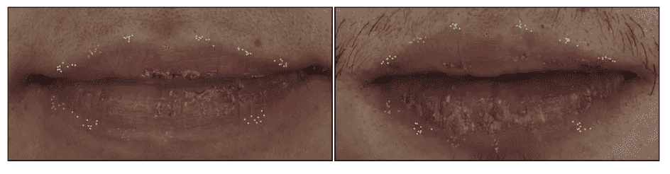

注释不精确(来自[本刊](https://arxiv.org/abs/1807.00966) ⁶)

正如来自悉尼科技大学和 Facebook Reality Labs 的[这项工作](https://arxiv.org/abs/1807.00966) ⁶所指出的，来自训练数据集的地面真相标记是在每张照片上手动标注的，这不是很精确。如上所示，不同的注释器将标记放置在稍微不同的位置。

***我们的网络实际上学习了不精确的地标位置***——这导致在预测期间在小区域内随机抖动，而不是精确的位置。

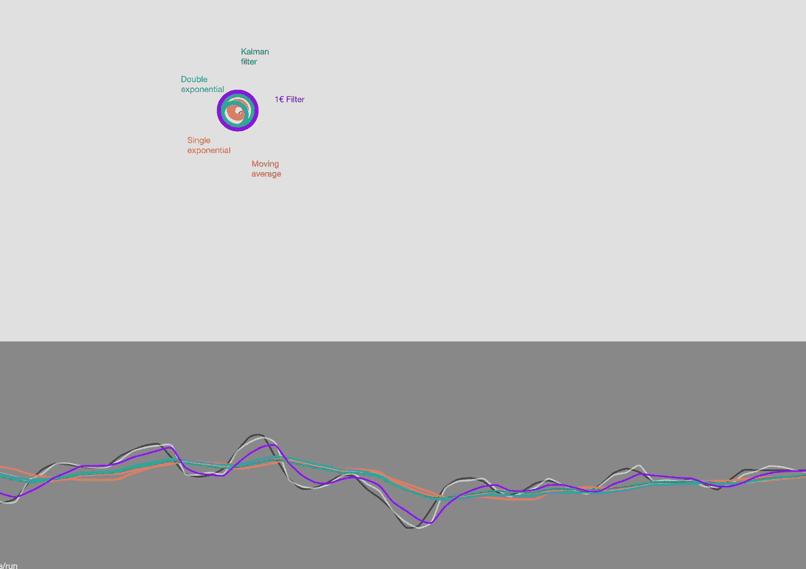

来自[互动演示](https://cristal.univ-lille.fr/~casiez/1euro/InteractiveDemo/)的 *1€* 滤镜的图示

解决这个问题的常见方法是在事件发生后稳定预测的标记。为了达到这种效果，正如谷歌研究的另一个出版物 ⁷所建议的那样，我使用了[*1⁸的*](http://cristal.univ-lille.fr/~casiez/1euro/)*€滤波器*来平滑运动噪声。我发现它比传统的*卡尔曼* *滤波器*给出了更好的结果，并且更容易实现。我还用它来稳定面部检测器返回的盒子，因为它也抖动很多，这没有帮助。

运动过滤器有很大的不同。但它并不完美，特别是像我笔记本电脑那样的低质量网络摄像头会产生嘈杂的视频，这种模式似乎不太喜欢。

上面提到的来自 UTS 和脸书的论文建议基本上如下微调训练模型:

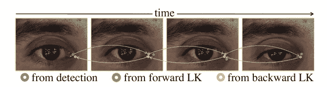

前向-后向通信方案(摘自[本刊](https://arxiv.org/abs/1807.00966) ⁶)

*   通过计算跨帧的光流来预测地标位置(OpenCV 可以做到这一点)
*   从该结果反向计算光流
*   基于来自光流的预测和来自预训练模型的预测之间的距离来计算损失函数

我自己没有尝试过，但是[演示视频](https://github.com/facebookresearch/supervision-by-registration/blob/master/cache_data/cache/demo.gif)看起来很有前景。

## 僵硬的眼睛和眉毛

经过训练的网络受到眼睛运动的影响，它看不到眨眼，也不能完全“关闭”眼睛标志。与他们正在跟踪的相比，眉毛界标在它们的运动中似乎也是僵硬的。

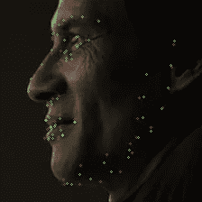

我的宽面角模型

我的模型变得非常擅长预测轮廓，因为数据集中有大量的轮廓(实际上在面部角度方面非常平衡)，但没有那么好地学习眼睛。如果 CNN 学习的特征倾向于生活在一致的位置周围，它可以表现得更好，这就是为什么我们必须在推理之前检测人脸边界框，并在训练期间围绕地标进行裁剪:这使得人脸每次都处于中心。

随着脸部角度的变化，脸部内部的特征——眼睛、嘴巴和鼻子——在帧中的形状和位置会发生变化，甚至可以在广角下消失。这使得模型每次都很难识别它们。我试着增加极端眼部姿势(闭着眼，睁着眼)的数据集，但收效甚微。

# 后续步骤

这个项目很有趣，但耗费时间和金钱(除了最初的 50 美元免费信贷外，我还自掏腰包 15 美元)。这是一个很好的学习机会，但我不打算重新发明轮子。自从我开始这段旅程以来，谷歌已经[开源了 MediaPipe](https://github.com/google/mediapipe) ，提供了他们模型的跨平台实现。虽然 MediaPipe 的初始演示显示了一些漂移、僵硬和抖动，这验证了我的结果。

不过，我有一些想法来改进我的方法(从上面提到的基于光流的微调开始)。

## 3D 可变形人脸模型

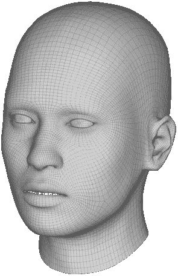

[4DFM](https://www.4dface.io/4dfm/) 变形模型

为了能够构建像 Snapchat 这样的应用程序，我们实际上需要的不仅仅是几个 3D 点。一种常见的方法是使用 3D 可变形人脸模型(3DMM)并将其拟合在带注释的 3D 点上。数据集 300W-LP 其实就有这样的数据。网络可以学习 3D 模型的所有顶点，而不是少量的界标，这样 3D 人脸将由模型直接预测，并准备好用于一些 AR 乐趣！

## 多重网络

为了提高整体精度，前面提到的机翼损失论文，以及谷歌研究的工作，建议用第一个轻量级模型预测一些地标。由于初始信息，我们可以垂直裁剪和对齐面部，以帮助第二个模型处理较少的姿势变化。

我相信，我们可以将专业模型的概念进一步推广到多个网络。我们可以为特定的面部角度训练不同的 CNN，比如一个网络用于大角度(60 +)，一个用于中间角度(30 到 60)，一个用于正面角度(0 到 30)，然后以某种方式将它们结合起来。

或者，不同的网络可以学习不同的面部部分，一个用于眼睛，一个用于嘴，等等..希望简化模型的工作能提高精确度。第一遍可以如上所述检测头部的粗略位置和方向，然后为相关的专家网络裁剪和对准感兴趣的区域。

# 结论

深度学习在人脸跟踪中的应用是一个活跃的研究领域，在过去几年中取得了很多进展。仍有改进的空间，尤其是在跟踪视频方面。预测的面部特征的时间一致性以及眼睛和嘴巴等关键区域的精度仍然是一个挑战。

我很期待看到这个话题的未来！

[1]: N .马等， [ShuffleNet V2:高效 CNN 架构设计实用指南](https://arxiv.org/abs/1807.11164) (2018)，

[2]: X .董等，[风格聚合网络人脸标志点检测](https://arxiv.org/abs/1803.04108) (2018)

[3]: X .朱等，[大姿态人脸对齐:一种 3D 解决方案](http://www.cbsr.ia.ac.cn/users/xiangyuzhu/projects/3DDFA/main.htm) (2016)，

[4]: Z. Feng 等，[用卷积神经网络实现鲁棒的人脸标志点定位](https://arxiv.org/abs/1711.06753) (2018)，

[5]: J. Guo 等人，[使用双变压器的堆叠密集 U 形网实现鲁棒的人脸对齐](https://arxiv.org/abs/1812.01936) (2018)，

[6]: X .董等，[注册监督:一种提高人脸标志点检测器精度的无监督方法](https://arxiv.org/abs/1807.00966) (2018)

[7]: Y. Kartynnik 等人，[基于移动 GPU 的单目视频实时人脸表面几何](https://arxiv.org/abs/1907.06724) (2019)，CVPR

[8]: G. Casiez 等， [1 €滤波器:一种简单的基于速度的低通滤波器，用于交互系统中的噪声输入](http://cristal.univ-lille.fr/~casiez/1euro/) (2012)，迟

[9]: V.H. Phung 等人，[一种用于小数据集上云图像斑块分类的卷积神经网络的高精度模型平均集成](https://www.researchgate.net/publication/336805909_A_High-Accuracy_Model_Average_Ensemble_of_Convolutional_Neural_Networks_for_Classification_of_Cloud_Image_Patches_on_Small_Datasets) (2019)，应用科学