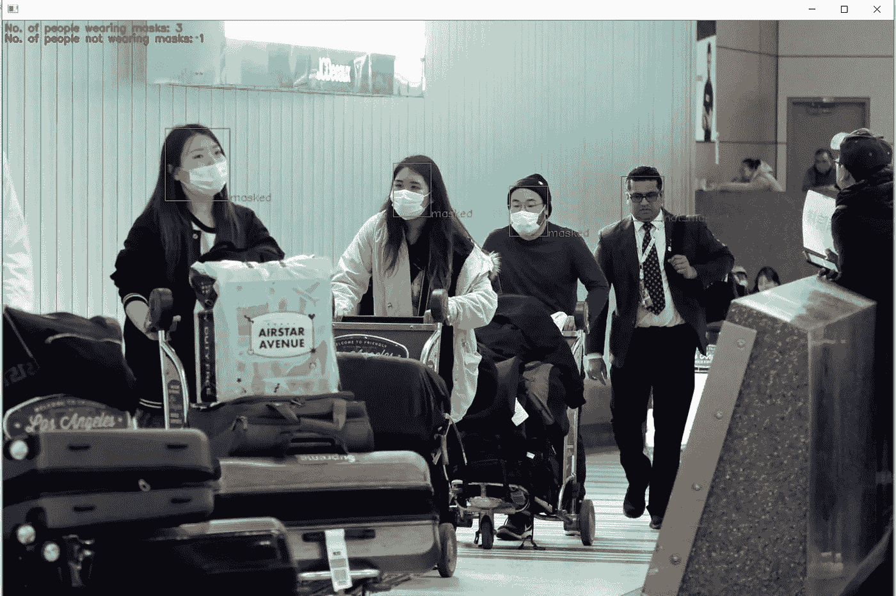
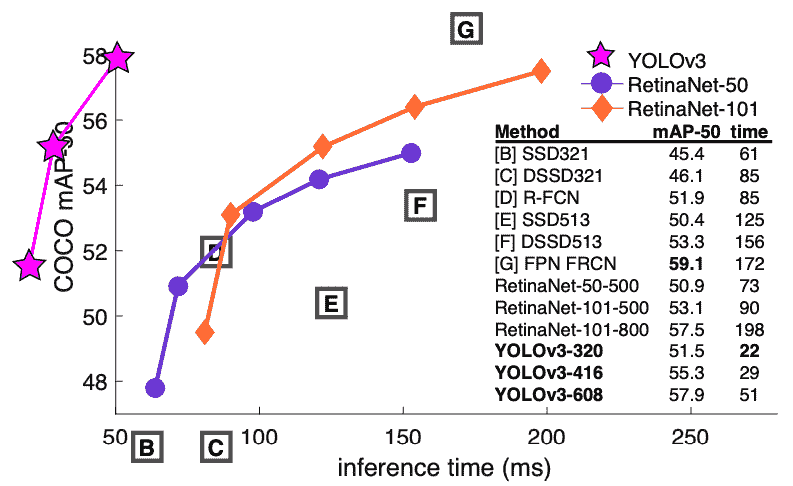

# 实时自定义对象检测

> 原文：<https://towardsdatascience.com/real-time-custom-object-detection-a95d955cecda?source=collection_archive---------20----------------------->

## 创建自定义对象检测器指南—第 2 部分


亚采克·迪拉格在 [Unsplash](https://unsplash.com?utm_source=medium&utm_medium=referral) 上的照片

> **在这篇文章中，我们将测试我上一篇文章**中定制的暗网模型

建议:视频输出可以通过彭博快带在 YouTube 上获得。一个窗口的图像是我的个人电脑的屏幕截图。输出图像来源取自 [Kaggle](https://www.kaggle.com/) 的开源数据集。非常感谢 Shauryasikt Jena

在我的上一篇文章中，我们看到了如何使用 darknet 创建一个自定义的蒙版检测器。如果能看到它的行动，那会更有趣，不是吗？)

因此，让我们使它工作，是的，这些步骤比训练模型要容易得多，因为如果您已经按照我以前的文章安装了所需的库(唷！).

如果没有，保持冷静:)，可以上我的文章详细查一下。

> 这是我以前的文章—

[](https://medium.com/@tejas.khare99/custom-object-detection-using-darknet-9779170faca2) [## 使用暗网的自定义对象检测

### 自定义暗网完全指南

medium.com](https://medium.com/@tejas.khare99/custom-object-detection-using-darknet-9779170faca2) 

> 使用 CPU 执行整个代码**。如果您正在编写视频输出，您不需要 GPU，视频是根据您首选的每秒帧数值编写的。要编写视频文件，请查看步骤 10。**

# 内容

1.  导入库
2.  从培训中获取生成的文件
3.  阅读网络
4.  输入图像的一些预处理
5.  置信度得分、类标识符、边界框的坐标
6.  非最大抑制(NMS)
7.  绘制边界框
8.  使用
9.  写入文件(可选)

好吧…让我们成功吧！请通读整篇文章，以免遗漏任何内容。谢谢:)

## 1.导入库

请导入这些库。

```
import tensorflow as tf
import numpy as np
import cv2
import pandas as pd
import time
import os
import matplotlib.pyplot as plt
from PIL import Image
```

N 注:你还需要 **ffmpeg==4.2.2+** 来写视频输出文件。如果你有任何问题，请浏览我以前的文章。一旦你有了 ffmpeg，确保你在安装了 ffmpeg 的同一个 anaconda 环境中运行所有的东西。

这就是你所需要的，让我们进入重要的下一步！

## 2.从暗网和训练模型中收集文件

这是我们的目标探测器运行的非常关键的一步。我在下面列出这些文件，确保你有这些文件。

1.  习俗。名称文件
2.  习俗。cfg 文件

注:我们在培训前创建了这些文件，所以如果你错过了其中的任何一个，你的模型将会给你带来麻烦。这两个文件对于您的自定义对象检测器来说是非常特定的，我以前的文章将指导您可以进行哪些更改。你可以冷静下来！创建这些文件只需一分钟，如果遵循每个细节:)

3.习俗。权重文件

好吧…让我们在这里暂停一分钟来理解你是如何得到它的。

这个文件被称为重量文件，它通常是一个大文件，也取决于你的训练大小(对我来说是 256mb)。当你的**训练**完成**后，你**就会得到这个文件**。**在我的例子中，我使用的文件名是 yolov 3 _ custom _ train _ 3000 . weights。在这里，“3000”意味着文件是在完成 3000 个历元后生成的。如果你已经通过了。cfg 文件，您会发现纪元设置为 6000。

**那么我为什么没有用‘yolov 3 _ custom _ train _ 6000 . weights’呢？**

这是因为经过一些测试后，我发现 3000 个历元后生成的权重文件在实际生成的所有权重文件中具有最好的准确性，而不仅仅是“6000”的那个。

**好。因此，更多的时代应该意味着更高的准确性，对不对？**

不尽然:(

更多的历元也意味着**过拟合**，这会大大降低精度。我的训练数据可能有一些重复的图像，或者我可能将**错误地标记为****(是的，我知道..这是一个乏味的任务，所以..你知道思想是如何偏离正确的)，这确实对准确性有直接影响。**

## ****3。阅读网****

**现在..测试部分开始。我会尽我所能让它简单易懂，显然，理解并排:)**

**幸运的是，cv2 有一个内置函数。**

```
net = cv2.dnn.readNetFromDarknet(configPath, weightsPath)
ln = net.getLayerNames()
ln = [ln[i[0] - 1] for i in net.getUnconnectedOutLayers()]
```

**这些漂亮的功能通过直接读取存储在 [Darknet](https://pjreddie.com/darknet/) 模型文件中的网络模型并为我们的探测器代码设置它们，使我们的日常工作变得更加容易。！).**

**有关该函数的更多信息—**

**[](https://docs.opencv.org/3.4/d6/d0f/group__dnn.html#gafde362956af949cce087f3f25c6aff0d) [## OpenCV:深度神经网络模块

### cv::dnn::blobFromImage(input array image，double scalefactor=1.0，const Size &size= Size()，const Scalar & mean=…

docs.opencv.org](https://docs.opencv.org/3.4/d6/d0f/group__dnn.html#gafde362956af949cce087f3f25c6aff0d) 

您还需要从“yolo.names”文件中获取标签..

```
LABELS = open(labelsPath).read().strip().split("\n")
```

N 注:configPath、weightsPath 和 labelsPath 包含各自文件的**路径**

## 4.输入图像的一些预处理

这些是我们需要为我们的模型做的一些步骤，以获得一些预处理的图像。预处理包括 [**均值减法**和**缩放**](https://www.pyimagesearch.com/2017/11/06/deep-learning-opencvs-blobfromimage-works/) **。**

[](https://docs.opencv.org/3.4/d6/d0f/group__dnn.html#ga29f34df9376379a603acd8df581ac8d7) [## OpenCV:深度神经网络模块

### cv::dnn::blobFromImage(input array image，double scalefactor=1.0，const Size &size= Size()，const Scalar & mean=…

docs.opencv.org](https://docs.opencv.org/3.4/d6/d0f/group__dnn.html#ga29f34df9376379a603acd8df581ac8d7) 

```
(H, W) = image.shape[:2]
blob = cv2.dnn.blobFromImage(image, 1 / 255.0, (416, 416),
       swapRB=True, crop=False)
net.setInput(blob)
layerOutputs = net.forward(ln)# Initializing for getting box coordinates, confidences, classid boxes = []
confidences = []
classIDs = []
threshold = 0.15
```

## 5.获得一些自信

是的…实际上在这一步之后，我们会对我们的代码有一些信心，并且更好地理解我们已经做了什么，以及在这之后我们要做什么。

```
for output in layerOutputs:
    for detection in output:
        scores = detection[5:]
        classID = np.argmax(scores)
        confidence = scores[classID] if confidence > threshold:
            box = detection[0:4] * np.array([W, H, W, H])
            (centerX, centerY, width, height) = box.astype("int")           
            x = int(centerX - (width / 2))
            y = int(centerY - (height / 2))    
            boxes.append([x, y, int(width), int(height)])
            confidences.append(float(confidence))
            classIDs.append(classID)
```

**那么这段代码到底在做什么呢？**

包含一个巨大的 2D 浮点数数组，从中我们需要“将要”绘制的边界框的坐标、classid 和每个预测的置信度得分，或者我们可以说是检测:)

## 6.非最大抑制(NMS)

对..最初，当我没有向它提供正确的输入数据类型时，这一步给了我很大的困难。我也试过 NMS 的一些预写功能，但是我的物体检测太慢了…


尼克·艾布拉姆斯在 [Unsplash](https://unsplash.com?utm_source=medium&utm_medium=referral) 上拍摄的照片

在撞了我的头一段时间后(不是字面上的..)，我能够通过为这个**超快**救生功能编写**上一步**中给出的代码来获得**正确的输入数据类型**。

```
idxs = cv2.dnn.NMSBoxes(boxes, confidences, threshold, 0.1)
```

你可以在这里找到一些信息—

 [## OpenCV:深度神经网络模块

### cv::dnn::blobFromImage(input array image，double scalefactor=1.0，const Size &size= Size()，const Scalar & mean=…

docs.opencv.org](https://docs.opencv.org/master/d6/d0f/group__dnn.html#gaeec27cb32195e71e6d88032bda193162) 

那么什么是 NMS 呢？

该模型返回多个预测，因此单个对象存在多个框。我们当然不希望这样。多亏了 NMS，它为该对象返回了一个单一的最佳包围盒。

为了深入了解 NMS 及其运作方式—

[](/non-maximum-suppression-nms-93ce178e177c) [## 非最大抑制(NMS)

### 一种消除目标检测中重复和误报的技术

towardsdatascience.com](/non-maximum-suppression-nms-93ce178e177c) 

## 7.绘制边界框

Aahhaa..有趣的部分。现在让我们的探测器开始工作吧

```
mc = 0
nmc = 0if len(idxs) > 0:
   for i in idxs.flatten():
       (x, y) = (boxes[i][0], boxes[i][1])
       (w, h) = (boxes[i][2], boxes[i][3]) if LABELS[classIDs[i]] == 'OBJECT_NAME_1'):
          mc += 1
          color = (0, 255, 0)
          cv2.rectangle(image, (x, y), (x + w, y + h), color, 1)
          text = "{}".format(LABELS[classIDs[i]])
          cv2.putText(image, text, (x + w, y + h),                     
          cv2.FONT_HERSHEY_SIMPLEX,0.5, color, 1)

       if (LABELS[classIDs[i]] == 'OBJECT_NAME_2'):
          nmc += 1
          color = (0, 0, 255)
          cv2.rectangle(image, (x, y), (x + w, y + h), color, 1)
          text = "{}".format(LABELS[classIDs[i]])
          cv2.putText(image, text, (x + w, y + h),      
              cv2.FONT_HERSHEY_SIMPLEX,0.5, color, 1)text1 = "No. of people wearing masks: " + str(mc)
text2 = "No. of people not wearing masks: " + str(nmc)
color1 = (0, 255, 0)
color2 = (0, 0, 255)cv2.putText(image, text1, (2, 15), cv2.FONT_HERSHEY_SIMPLEX, 0.5, color1, 2)
cv2.putText(image, text2, (2, 30), cv2.FONT_HERSHEY_SIMPLEX, 0.5, color2, 2)
```

搞定了。！这段代码会给你一个包含你的边界框的图片/框架

N 注:请务必根据您的对象名称更改`OBJECT_NAME_1`和`OBJECT_NAME_2`。这将使你更好地理解你的代码；)

T ip:我建议你创建一个**函数**，在其中传递一个图像，因为以后你可以将这个函数用于视频以及图像输入；)

## 9.使用

上面的代码有两种用途—

1.  **实时**，即将**视频**传递给探测器

这可以通过从视频中读取帧来完成，如果你愿意，你也可以调整它的大小，以便你的“cv2.imshow”以更快的速度显示输出帧，即每秒帧。用 cv2 阅读视频——

[](https://opencv-python-tutroals.readthedocs.io/en/latest/py_tutorials/py_gui/py_video_display/py_video_display.html) [## 视频入门- OpenCV-Python 教程 1 文档

### 学会看视频，显示视频，保存视频。学会从相机捕捉并显示它。你会学到这些…

opencv-python-tutro als . readthedocs . io](https://opencv-python-tutroals.readthedocs.io/en/latest/py_tutorials/py_gui/py_video_display/py_video_display.html) 

注意:你不需要将获得的帧转换成灰度。

现在只需将框架传递给**功能**(在提示中提到)和吊杆..你有你的实时物体探测器准备好了！

输出视频—

以 20fps 写入的视频输出

N 注:上面的视频输出很流畅，因为我已经以每秒 20 帧(fps)的速度将这些帧写入了一个. mp4 文件

2.图像

你也可以通过传递一张图片来测试你的物体检测器。(是啊..没那么好玩)。用 cv2 来读取图像—

[](https://opencv-python-tutroals.readthedocs.io/en/latest/py_tutorials/py_gui/py_image_display/py_image_display.html) [## 图像入门- OpenCV-Python 教程 1 文档

### cv2.waitKey()是一个键盘绑定函数。它的参数是以毫秒为单位的时间。该功能等待…

opencv-python-tutro als . readthedocs . io](https://opencv-python-tutroals.readthedocs.io/en/latest/py_tutorials/py_gui/py_image_display/py_image_display.html) 

输出图像—



物体探测器的单图像输出

## 10.写入文件(可选)

你可能想知道我是如何让视频输出如此流畅的，对吗？这里有一个技巧，你可以用它来获得流畅的视频输出…

OpenCV 有一个函数叫做 cv2。VideoWriter()，您可以通过指定文件名、codecid、fps 和与输入字段相同的分辨率来编写帧。

[](https://docs.opencv.org/3.4/dd/d9e/classcv_1_1VideoWriter.html) [## OpenCV: cv::VideoWriter 类引用

### 视频编剧类。更大的...默认构造函数。构造函数初始化视频编写器。在 Linux FFMPEG 上…

docs.opencv.org](https://docs.opencv.org/3.4/dd/d9e/classcv_1_1VideoWriter.html) 

在 while 循环之外定义变量`out`,在该循环中读取视频的每一帧

```
out = cv2.VideoWriter('file_name.mp4', -1, fps,    
         (int(cap.get(3)),int(cap.get(4))))
```

注意:第二个参数'-1 '是要给出的 codecid，但是它在我的计算机上工作得很好。计算机上的 codecid 可能不同。请访问这个网站进行调试—

[](https://stackoverflow.com/questions/38397964/cant-write-and-save-a-video-file-using-opencv-and-python) [## 无法使用 OpenCV 和 Python 编写和保存视频文件

### 感谢贡献一个堆栈溢出的答案！请务必回答问题。提供详细信息并分享…

stackoverflow.com](https://stackoverflow.com/questions/38397964/cant-write-and-save-a-video-file-using-opencv-and-python) 

最后一个参数将帮助您获得输入视频的分辨率。之后，将下面的代码放入调用检测器函数的 while 循环中。

```
while True:
  ....
  ....  
  image = detector(frame) 
  out.write(image)
  ....
  ....
```

注意:你的探测器函数应该返回一个“图像”

ip:你也可以用“moviepy”将你的画面写入视频…

[](https://pypi.org/project/moviepy/) [## 电影

### MoviePy 依赖于 Python 模块 Numpy、imageio、Decorator 和 tqdm，这些模块将在…

pypi.org](https://pypi.org/project/moviepy/) 

pjreddie 暗网的推理时间图

> 原来如此！我希望你现在已经有了自己的自定义对象检测器。干杯！

> 感谢您通读整篇文章，希望您能从中受益。如果你有任何反馈，他们是最受欢迎的！**