# 使用 Azure 的 Power BI 中的实时数据流

> 原文：<https://towardsdatascience.com/real-time-data-streaming-in-power-bi-with-azure-8650d3cbfddb?source=collection_archive---------20----------------------->

## 使用 Azure 创建无缝的实时 Power BI 仪表板

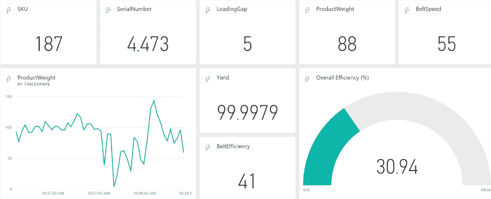

# **背景**

**Azure Event Hubs** 是一个大数据流平台和事件摄取服务，每秒可以跟踪和处理数千个事件。来自活动中心的数据可以使用实时分析服务进行转换和存储。 **Azure Stream Analytics** 是一款实时分析服务，旨在帮助分析和处理可用于触发警报和行动的数据流。Power BI 是一项商业分析服务，提供交互式可视化。

# 目标

> 利用 Azure 数据接收/查询服务，如事件中心和流分析——成功创建自流式 Power BI 实时仪表板

# 设置 Azure

1.  首先，访问 Azure 门户，通过以下链接设置您的 Azure 免费试用订阅:[**https://azure.microsoft.com/en-us/free/**](https://azure.microsoft.com/en-us/free/)
2.  一旦您的免费试用帐户被激活，请访问 azure 门户网站:[**https://portal.azure.com/#home.**](https://portal.azure.com/#home.)**仔细检查右上角，确保您已使用您的免费试用 azure 帐户登录。如果不是，请确保登录，然后再执行后续步骤。**
3.  **在左上角的标题下:“微软 Azure”，点击创建资源。**

**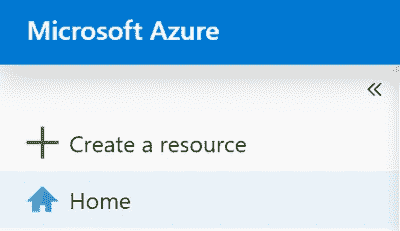**

**4.在“搜索市场”搜索栏中，键入**“资源组”**。点击标题为**“资源组”**的第一个结果，然后点击创建。**

**5.点击 create 后，您将转到一个页面，在该页面中您可以设置新资源组的设置。为您的新资源组键入任何名称，然后点击下面标题为**“Review+Create”**的蓝色按钮。要进入资源组，请单击位于门户右上角的通知图标。然后点击**“转到资源组”**。**

**6.现在，再次单击门户右上角的 create a new resource 按钮。**

**7.在搜索栏中，输入**“活动中心”**。点击标题为**“活动中心”的第一个结果****

**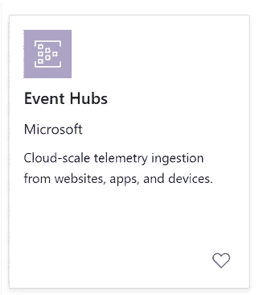**

**8.这将再次把您带到一个页面，您可以在这里设置新的活动中心的设置。为您的活动中心键入任何名称。将定价等级设置为**标准。**启用 Kafka，并确保“使该命名空间区域冗余”被关闭**。**订阅应设置为**免费试用。**选择您在之前步骤中创建的现有资源组。保持位置设置为美国西部，并将吞吐量单位设置为 **4。**同时启用**自动充气**。**

**8.点击“创建”后，需要几分钟时间来部署事件中心。单击右上角的通知图标，查看事件中心部署的状态。一旦部署成功，单击通知描述中的**事件中心链接名称**。**

**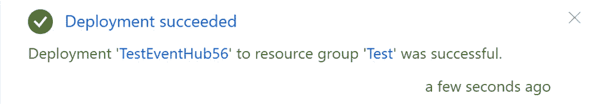**

**点击您的活动中心的名称。在我的例子中，我将点击文本 TestEventHub56**

**9.单击后，它会将您带到您的部署页面。只需单击转到该资源即可访问您的事件中心**名称空间。****

**10.进入 event hub 名称空间后，查看右侧列中的各种资源部分。在**实体下查找标题为**“事件中心”**的部分。****

****

**11.**

**转到活动中心页面后，单击单词**活动中心**旁边的+图标。点击后，您将进入活动中心创建设置页面。键入新事件中心的名称(不同于您的命名空间名称)，并将分区计数和消息保留时间设置为 4。将捕获设置为**关闭**。然后点击创建。将立即创建事件中心，并且您将被转移回您的名称空间中的事件中心页面。要访问新的事件中心**实例，**单击其名称。**

**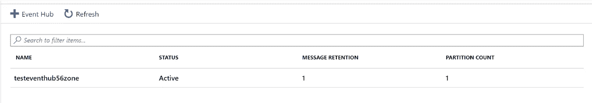**

**12.下一个设置是**流分析**作业。要进行设置，单击左上角的 create resource 按钮。然后，搜索上游分析作业。点击第一个结果，然后点击创建。您将再次转到流分析作业设置页面。在“设置”页面中，输入您的 ASA 作业名称，并选择您创建的资源组。保持**托管环境**为云，并将流式单元移动到 **4。****

**13.部署您的 ASA(**Azure Stream Analytics)**作业需要几分钟时间。一旦部署成功，点击通知栏中的**转到资源**。**

**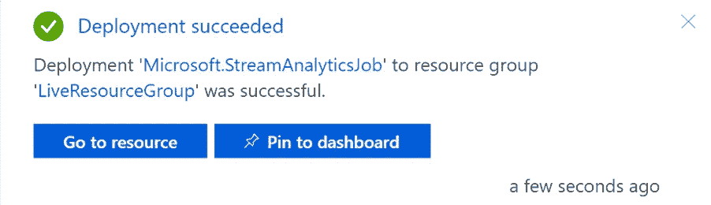**

**14.进入流分析作业后，单击右侧栏中**作业拓扑下的**输入**。****

****

**在输入页面中，点击页面顶部的**新流输入**。一旦点击，它将带来三个不同的流输入供您选择。**点击“活动中心”。****

**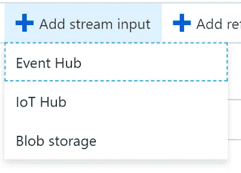**

**15. **1。**点击活动中心后，将显示输入设置页面。为您的输入别名设置一个名称，并保持其他设置不变。确保将“**事件序列化格式”**设置为 **JSON。接下来，点击保存。这将自动开始测试与 ASA 和您的活动中心的连接。它将很快弹出一个通知，说你的连接是成功的。****

**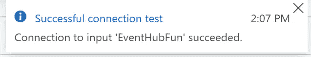**

**16.接下来，转到**“作业拓扑”下的输出部分****

**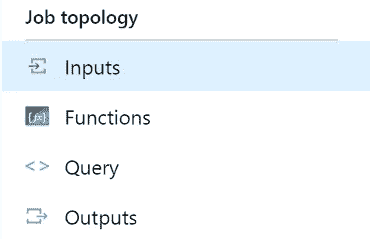**

**一旦你点击输出。选择页面顶部的添加按钮。向下滚动选择 Power BI 作为输出。在 Power BI 设置页面中，设置 Power BI 输出别名的名称。然后点击授权。登录您的 Power BI 个人/工作帐户。登录后，为数据集选择一个名称。**运行流分析作业会在 Power BI 中自动创建流数据集。数据集名称将是该流式数据集的名称。还要选择一个表名。****

**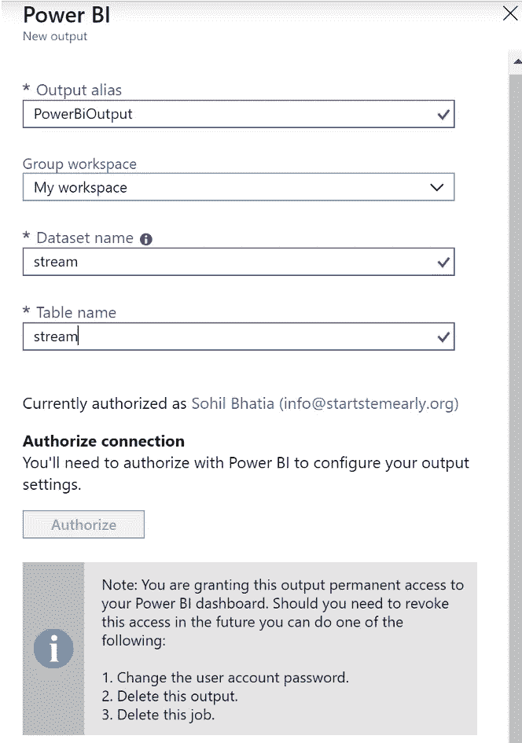**

**17.一旦您单击 save，它将自动开始测试到输出的连接。它应该说连接成功。**

**18.现在，回到您的事件中心**名称空间。**点击右上角“创建资源”下的主页图标。确保选择**“事件中心名称空间”而不是**实例。名称空间是您在本教程中创建的第二个资源。单击后，您将位于事件中心名称空间内。在右侧栏中，点击设置下的**共享访问策略**。**

**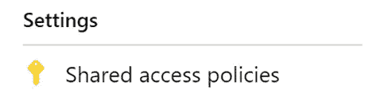****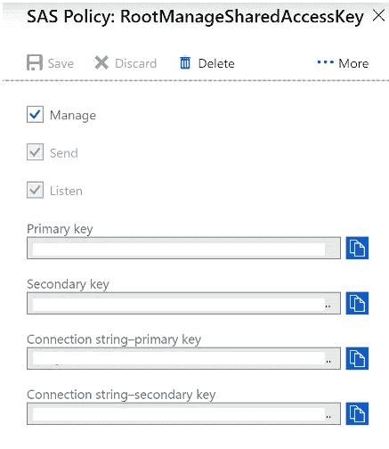**

# **Python 设置**

> **我们将使用 Python 向我们的 Azure 事件中心发布数据。请随意使用最适合您的 IDE。流行 Python ide:[**py charm**](https://www.jetbrains.com/pycharm/download/#section=mac)**，**[**notepad++**](http://csc.ucdavis.edu/~chaos/courses/nlp/Software/Windows/npp.html)**

**我们将使用 pandas 读取 excel 文件中的数据，然后将数据值发布到 Azure Event Hub。**

**建立一个包含行和列的简单 Excel 表格。至少有 15-20 行数据供 Python 脚本读取。我的数据将包含*产量、SKU、序列号、产品重量、皮带速度等列。***

**负载字典应该分别具有列名和行值数据类型的键值对。**

**确保安装所有必需的软件包，否则程序将无法运行。**

> **现在您的 python 程序已经设置好了，可以运行了。**
> 
> **运行程序并确认您的结果没有任何错误。**

# **流分析和 Power BI**

1.  **现在继续你在 Azure 门户中的流分析工作。点击**“职位拓扑”下的查询****
2.  **从这里，将以下代码复制到您的流分析查询中:**

****用您的列名替换 SKU、产量、BeltEfficiency 等。确保相应地调整数据类型。****

> **流分析**查询数据类型**的完整列表可以在[这里](https://docs.microsoft.com/en-us/stream-analytics-query/data-types-azure-stream-analytics)找到**

**3.现在点击你的输入名旁边的 3 个省略号。接下来，单击来自输入的样本数据。**

**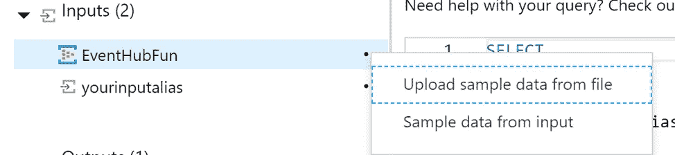**

> ***4。等待您的输入被采样。采样完成后，您将会收到一个通知，告知您的样本已经成功。现在点击页面顶部的 test。***

****

**5.一旦测试成功，它应该会在查询的底部弹出您的结果。现在，单击 ASA 作业右侧的概述。然后点击**开始。**这将启动您的流式作业。**

**6.ASA 作业需要一段时间才能开始流式传输，但一旦开始，将会在 Power BI 工作区的数据集部分创建一个新的流式数据集。**在这里，您可以创建一个新的仪表板，并使用您的流数据集创建视觉效果。****

****

**联系人:**

**索希尔·巴蒂亚**