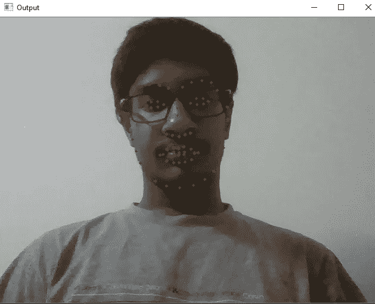
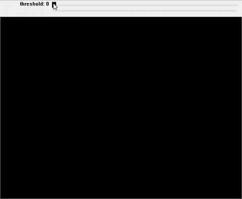

# 使用 OpenCV 和 Dlib 的实时眼睛跟踪

> 原文：<https://towardsdatascience.com/real-time-eye-tracking-using-opencv-and-dlib-b504ca724ac6?source=collection_archive---------3----------------------->

## 在本教程中，学习通过 python 中的网络摄像头创建一个实时凝视探测器。


第一步是下载所需的包。通过 pip 安装:

```
pip install opencv-python
pip install dlib
```

或者，如果您使用 Anaconda，那么使用 conda:

```
conda install -c conda-forge opencv
conda install -c menpo dlib
```

除此之外，我们需要一个面部关键点检测器，可以实时检测眼睛。为此，我们将使用 dlib 库中预先训练好的网络，该网络可以检测出本[论文](https://www.semanticscholar.org/paper/One-millisecond-face-alignment-with-an-ensemble-of-Kazemi-Sullivan/d78b6a5b0dcaa81b1faea5fb0000045a62513567)中提出的“68 个关键点”。所需的预训练模型可以从[这里](https://github.com/davisking/dlib-models/blob/master/shape_predictor_68_face_landmarks.dat.bz2)下载。使用 Dlib 是因为它可以实时给出预测，不像 CNN 模型，它对我来说非常重要，因为我正在为在线监督制作 AI。


Dlib 面部关键点。图片取自[此处](https://www.google.com/url?sa=i&url=https%3A%2F%2Fwww.pyimagesearch.com%2F2017%2F04%2F03%2Ffacial-landmarks-dlib-opencv-python%2F&psig=AOvVaw3WbGbCrqFX4vkvRUP3m3TW&ust=1588628143544000&source=images&cd=vfe&ved=0CAIQjRxqFwoTCKiiwpTTmOkCFQAAAAAdAAAAABAT)。

## 使用 Dlib 的眼睛检测

首先要做的是找到眼睛，然后我们才能继续进行图像处理，并找到我们需要找到一张脸的眼睛。面部关键点检测器将 dlib 模块的一个*矩形对象作为输入，它只是一张脸的坐标。为了找到人脸，我们可以使用 dlib 内置的正面人脸检测器。您可以使用任何分类器来完成这项任务。如果你想要高精度和速度对你来说不是问题，那么我会建议你使用 CNN，因为它会提供更好的精度，特别是对于非正面人脸和部分遮挡的人脸，如下面链接的文章所示。*

[](/robust-facial-landmarks-for-occluded-angled-faces-925e465cbf2e) [## 用于遮挡倾斜面部的鲁棒面部标志

### Dlib 提供了一个很好的面部标志检测器，但是当面部处于陡峭的角度时，它不能很好地工作。学习如何…

towardsdatascience.com](/robust-facial-landmarks-for-occluded-angled-faces-925e465cbf2e) 

```
import cv2
import dlibimg = cv2.imread('image.png')
gray = cv2.cvtColor(img, cv2.COLOR_BGR2GRAY) # convert to grayscale detector = dlib.get_frontal_face_detector()
rects = detector(gray, 1) # rects contains all the faces detected
```

这时我们有了矩形的人脸对象，我们可以把它传递给关键点检测器。

```
def shape_to_np(shape, dtype="int"):
    coords = np.zeros((68, 2), dtype=dtype)
    for i in range(0, 68):
        coords[i] = (shape.part(i).x, shape.part(i).y)
    return coordspredictor = dlib.shape_predictor('shape_68.dat')
for (i, rect) in enumerate(rects):
    shape = predictor(gray, rect)
    shape = shape_to_np(shape)
    for (x, y) in shape:
        cv2.circle(img, (x, y), 2, (0, 0, 255), -1)
```



获得输出。

关于 dlib 的更详细的描述可以在这篇很棒的文章[中找到，这篇文章是我在做这个项目时参考的。](https://www.pyimagesearch.com/2017/04/03/facial-landmarks-dlib-opencv-python/)

## 利用 OpenCV 寻找眼球中心


照片由 [Anastase Maragos](https://unsplash.com/@visualsbyroyalz?utm_source=medium&utm_medium=referral) 在 [Unsplash](https://unsplash.com?utm_source=medium&utm_medium=referral) 拍摄

我们将通过网络摄像头获得现场直播。要打开网络摄像头，读取帧并显示它，您可以使用以下代码:

```
import cv2cap = cv2.VideoCapture(0)
while(True)
    ret, img = cap.read()
    cv2.imshow("Output", img)
    if cv2.waitKey(1) & 0xFF == ord('q'): # escape when q is pressed
        break
```

所以，现在我们如何从网络摄像头读取帧，是时候对他们进行工作，以达到我们的目标。我们创建一个新的黑色遮罩，使用与我们的摄像头框架相同尺寸的 NumPy。存储来自关键点阵列*形状*的左右眼点的(x，y)坐标，并使用`cv2.fillConvexPoly`将其绘制在蒙版上。它接受一个图像，点作为一个 NumPy 数组，数据类型= `np.int32`和颜色作为参数，并返回一个图像，这些点之间的区域用该颜色填充。

```
def eye_on_mask(mask, side):
    points = [shape[i] for i in side]
    points = np.array(points, dtype=np.int32)
    mask = cv2.fillConvexPoly(mask, points, 255)
    return maskleft = [36, 37, 38, 39, 40, 41] # keypoint indices for left eye
right = [42, 43, 44, 45, 46, 47] # keypoint indices for right eye
mask = np.zeros(img.shape[:2], dtype=np.uint8)
mask = eye_on_mask(mask, left)
mask = eye_on_mask(mask, right)
```

这样做之后，我们有了一个黑色的蒙版，眼睛区域是白色的。这个白色区域用一个形态学操作`cv2.dilate`扩大了一点。使用`cv2.bitwise_and`和我们的蒙版作为我们图像上的蒙版，我们可以分割出眼睛。将所有的(0，0，0)像素转换为(255，255，255)，这样只有眼球是唯一剩下的黑暗部分。将结果转换为灰度，使图像为阈值处理做好准备。

```
kernel = np.ones((9, 9), np.uint8)
mask = cv2.dilate(mask, kernel, 5)
eyes = cv2.bitwise_and(img, img, mask=mask)
mask = (eyes == [0, 0, 0]).all(axis=2)
eyes[mask] = [255, 255, 255]
eyes_gray = cv2.cvtColor(eyes, cv2.COLOR_BGR2GRAY)
```

阈值处理用于创建二元掩模。因此，我们的任务是找到一个最佳阈值，根据这个阈值，我们可以从眼睛的其余部分中分割出眼球，然后我们需要找到它的中心。但是阈值对于不同的照明条件是不同的，所以我们可以制作一个可调节的跟踪条来控制阈值。平心而论，我从 [Stepan Filonov](https://medium.com/u/683e0406453b?source=post_page-----b504ca724ac6--------------------------------) 那里得到了这个想法，他也试图在这篇[文章](https://medium.com/@stepanfilonov/tracking-your-eyes-with-python-3952e66194a6)中解决这个凝视检测的问题，并使用了 Haar cascade 和 Blob 检测。阈值处理步骤，即腐蚀，膨胀和中值模糊也是从他那里得到的，但他的最终结果并不令人信服，所以我做了这个解决方案。

```
def nothing(x):
    pass
cv2.namedWindow('image')
cv2.createTrackbar('threshold', 'image', 0, 255, nothing)
threshold = cv2.getTrackbarPos('threshold', 'image')
_, thresh = cv2.threshold(eyes_gray, threshold, 255, cv2.THRESH_BINARY)
thresh = cv2.erode(thresh, None, iterations=2)
thresh = cv2.dilate(thresh, None, iterations=4)
thresh = cv2.medianBlur(thresh, 3)
```



用跟踪条反转后显示阈值

我们已经到了项目的最后一步。眼球被分割出来，我们可以利用`cv2.findContours`来找到它们。现在我们的背景是白色的，眼球是黑色的。但是在 OpenCV 的`cv2.findContours()`方法中，要查找的对象应该是白色的，背景是黑色的。所以我们需要使用`cv2.bitwise_not`来反转我们的*阈值*。现在我们可以找到轮廓。理论上，我们可以说，我们现在需要做的是找到两个最大的轮廓，这些应该是我们的眼球。然而，这为假阳性留下了一点空间，可以通过找到眼睛之间的中点并将图像除以该点来解决。然后我们在那些划分中找到最大的轮廓，应该是我们的眼球。关键点 40 和 43(在 Python 中是 39 和 42，因为 index 从零开始)用于寻找中点。用`cv2.contourArea`排序，找到中点两边最大的等高线。我们可以利用`cv2.moments`找到眼球的中心。

```
def contouring(thresh, mid, img, right=False):
    cnts, _ = cv2.findContours(thresh, cv2.RETR_EXTERNAL, cv2.CHAIN_APPROX_NONE)
    cnt = max(cnts, key = cv2.contourArea) # finding contour with #maximum area
    M = cv2.moments(cnt)
    cx = int(M['m10']/M['m00'])
    cy = int(M['m01']/M['m00'])
    if right:
        cx += mid # Adding value of mid to x coordinate of centre of #right eye to adjust for dividing into two parts
    cv2.circle(img, (cx, cy), 4, (0, 0, 255), 2)# drawing over #eyeball with redmid = (shape[39][0] + shape[42][0]) // 2
contouring(thresh[:, 0:mid], mid, img)
contouring(thresh[:, mid:], mid, img, True)
```

在运行时，我们的代码会抛出几个类似于`max() arg is an empty sequence`或`division by zero`的错误，分别在没有找到轮廓或`M['m00']`为零时抛出。要解决这个问题，请将轮廓绘制函数包含在 try 块中。如果只在没有检测到眼睛时才会出现错误，我们不需要做任何事情。新的轮廓绘制函数将如下所示:

```
def contouring(thresh, mid, img, right=False):
    cnts, _ = cv2.findContours(thresh, cv2.RETR_EXTERNAL,cv2.CHAIN_APPROX_NONE)
    try:
        cnt = max(cnts, key = cv2.contourArea)
        M = cv2.moments(cnt)
        cx = int(M['m10']/M['m00'])
        cy = int(M['m01']/M['m00'])
        if right:
            cx += mid
        cv2.circle(img, (cx, cy), 4, (0, 0, 255), 2)
    except:
        pass
```

一切都结束了。只需显示 img 和 thresh 并相应地设置阈值跟踪栏，就可以享受了。完整代码:

使用人工智能进行在线监督的完整代码可以在我的 Github 上找到。