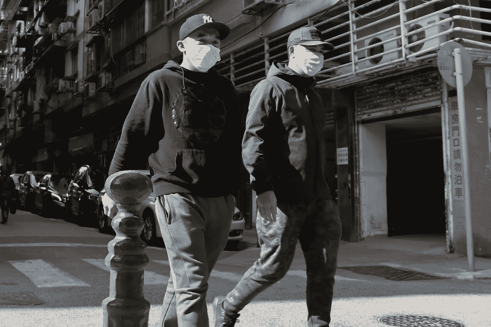
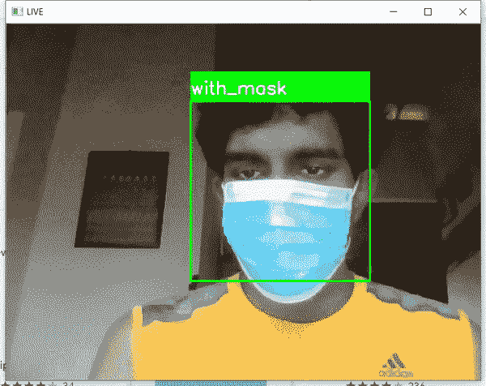

# 使用 TensorFlow、Keras 和 OpenCV 的实时人脸检测器

> 原文：<https://towardsdatascience.com/real-time-face-mask-detector-with-tensorflow-keras-and-opencv-38b552660b64?source=collection_archive---------13----------------------->

## 了解如何使用 Tensorflow、Keras 和 OpenCV 以及您的网络摄像头或移动摄像头创建实时面具检测器

[澳门图片社](https://unsplash.com/@macauphotoagency?utm_source=unsplash&utm_medium=referral&utm_content=creditCopyText)在 [Unsplash](https://unsplash.com/s/photos/coronavirus?utm_source=unsplash&utm_medium=referral&utm_content=creditCopyText) 上拍摄的照片

在本文中，我将使用由 [Prajna Bhandary](https://www.linkedin.com/feed/update/urn%3Ali%3Aactivity%3A6655711815361761280/) 创建的面具数据集。该数据集由属于`with mask`和`without mask` 2 类的 1376 幅图像组成。

我们的主要焦点是检测一个人是否戴着面具，而不需要靠近他们。

# 概观

简而言之，首先，我们获得带有人脸的图像，并将其通过级联分类器。分类器将给出面部的感兴趣区域(高度和宽度)。其次，我们将把感兴趣区域的大小调整为一个`100x100`，并将其传递给预先训练好的 CNN，它将把概率作为输出给我们。

## 步骤 1:数据预处理

我们使用的数据集由不同颜色、不同大小和不同方向的图像组成。因此，我们需要将所有图像转换为灰度，因为我们需要确保颜色不应该成为检测蒙版的临界点。之后，我们需要在将它应用到神经网络之前，使所有的图像都具有相同的大小(`100x100`)。

数据预处理

## 第二步:训练 CNN

这包括 2 个卷积层(两个 Convo2D 100 @ 3x3)。首先，您必须从数据预处理加载数据集。然后你必须配置卷积架构。我已经包括了一个`model.add(Dropout(0.5))`来消除过度拟合。由于我们有两个类别(带面具和不带面具)，我们可以使用`binary_crossentropy`。你从一个模型关卡开始训练 20 个纪元。

训练 CNN

请记住，您可以使用更多的卷积层或使用外部训练器，如 [MobileNetV2](https://arxiv.org/abs/1801.04381) 以获得更好的准确性。

您可以绘制图表来做出更好的验证决策。我已经把它放在我的知识库里了。请参考。

## 步骤 3:检测戴面具和不带面具的人脸

首先，您必须加载我们创建的模型。然后我们把想要的相机设置为默认。

> 可选—您可以将手机摄像头(Android/IOS)连接到 OpenCV。为您的手机和 PC 下载 [DroidCam](https://www.dev47apps.com/) 应用程序。并更改代码`*source = cv2.VideoCapture(1)*`

其次，我们需要标注两个概率(0 代表`with_mask`，1 代表`without_mask`)。之后，我们需要使用 RGB 值设置边框颜色。我给了红色和绿色两种颜色。

在一个无限循环中，我们将从相机中一帧一帧地读取，并将它们转换成灰度并检测人脸。并且它将通过一个`for`循环来运行，以针对每张脸检测感兴趣的区域，调整其大小并将其重塑为 4D，因为训练网络期望 4D 输入。对于模型，我们将使用可用的最佳模型来获得结果。这个结果由带面具或不带面具的概率(`result=[P1, P2]`)组成。之后会贴上标签。

检测遮罩

让我们看看演示，

演示

 [## 面具检测器-谷歌驱动

### 编辑描述

drive.google.com](https://drive.google.com/open?id=1oLIPBOkCuhej-iNTre_qnlQ3b-fWZeEy)  [## ravindu 9701/面罩检测器

### 在 GitHub 上创建一个帐户，为 ravindu 9701/面罩探测器的开发做出贡献。

github.com](https://github.com/ravindu9701/Face-Mask-Detector.git) 

# 结论

如果使用 MobileNetV2 进行微调，可以提高精确度。我们也可以将这个模型部署到嵌入式系统中。如果我们正确部署它，我们可以帮助确保您和他人的安全。

文章到此为止。希望对某个人有用。谢谢，注意安全！

## 资源

*   [般若的 Github 回购](https://github.com/prajnasb/observations/tree/master/mask_classifier/Data_Generator)
*   [阿德里安·罗斯布鲁克的文章](https://www.pyimagesearch.com/2020/05/04/covid-19-face-mask-detector-with-opencv-keras-tensorflow-and-deep-learning/)