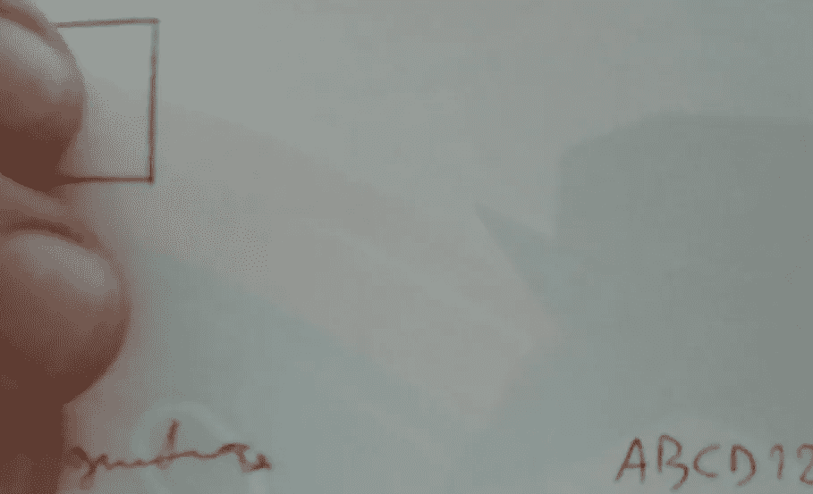
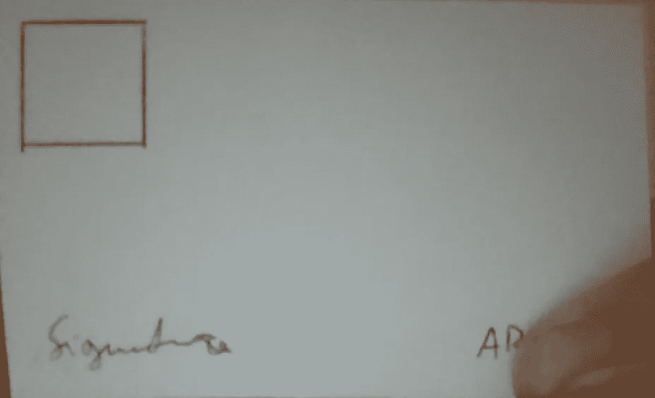

# 物体上的实时手指检测器—工作示例

> 原文：<https://towardsdatascience.com/real-time-fingers-detector-over-an-object-a-working-example-73fd1cc84e91?source=collection_archive---------38----------------------->

普里西拉·杜·普里兹在 [Unsplash](https://unsplash.com/s/photos/fingers?utm_source=unsplash&utm_medium=referral&utm_content=creditCopyText) 上的照片

# 介绍

最近，我有机会构建一个 PoC(概念验证——演示)来解决一个特定的计算机视觉问题，这是一个很酷的体验，为什么不分享一下呢？

演示的目标是实时检测，以摄像机的视频流作为输入，如果特定对象(假身份证)上有手指，覆盖的信息可以在帧完成后用于 OCR 任务。

换句话说，一个可以帮助自动捕获 id 文档的系统确信文档上的所有相关数据都是可见的。

不

不

好的

# 我们将涵盖的内容

简而言之，这些是我们将涉及的要点:

*   构建一个工作示例(即使不完美)来验证方法的重要性
*   如何使用一个标准框架——CRISP-DM——即使是在一个轻量级的版本中，也可以非常有用地指导项目的所有重要阶段
*   工作码

重要提示:在这个项目的制作过程中没有手指受伤:)

所以让我们开始吧！

# 构建一个工作示例

创建一个工作模型的目标是验证一种方法，看看第一个结果是否指向正确的方向，或者很快失败并尝试不同的东西。

PoC 是一个工作示例，既可以在开发期间内部使用，也可以向某人展示——猜猜是什么——证明方法的有效性。

但是在开始编码之前，理解问题、可用的数据和所有需要预先知道的东西是必要的。

为了做到这一点，使用结构化的方法会有所帮助，这里 CRISP-DM 开始发挥作用。

# 使用基于 CRISP-DM 的方法

CRISP-DM(数据挖掘的跨行业标准流程)是一个框架，用于在解决面向数据的问题时拥有一个精确且可重复的步骤和任务列表。

顾名思义，它用于自 1999 年就存在的数据挖掘项目——但也可以用于今天的 ML 项目，因为它们也是高度面向数据的。

在这里，您可以看到迭代过程的主要阶段，从业务问题到生产部署。

[Kenneth Jensen](https://commons.wikimedia.org/w/index.php?title=User:Kennethajensen&action=edit&redlink=1) —自己的工作基于:FTP://public . dhe . IBM . com/software/analytics/SPSS/documentation/modeler/18.0/en/modelercrispdm . pdf

因此，让我们按照它来描述在 PoC 中做了什么，跳过对演示没有用的步骤，如准备项目计划或评估成本/收益分析。

## 商业理解

业务需求是自动执行捕获文档的过程，并确保检索到的数据可用于进一步的用途:特别是，包含整个文档的图片，没有任何东西覆盖它的一部分。

由于该过程是使用相机完成的，而卡的所有者将文档放在它的前面，所以目标是确保我们可以用有用的数据来终止捕获会话。

作为一个在短短几天内开发出来的 PoC，引入了*约束*以保持其简单性:

*   固定捕捉区域，以避免跟踪对象和处理与相机的距离的必要性——我想这一限制也可以用于制作系统。在演示中，一个简单的蓝色方框将指示屏幕上感兴趣的区域
*   在这篇文章中，出于隐私的原因，使用了一个假文件，而不是一个真正的身份证
*   仅考虑了文档的侧面部分——稍后将详细介绍
*   不太关注焦点——使用了基于拉普拉斯方差的简单模糊阈值检查函数，但结果表明它非常依赖于光线条件，因此不能一概而论。作为高级预处理步骤，这一部分专用 ML 解决方案可能更有效
*   只有手指被认为是不需要的物体
*   有限的评估和训练数据集，使用特定的摄像头捕获—仅使用我的笔记本电脑来捕获和评估数据

*的成功标准是*，基于准确性度量(客观)和实例如何工作(经验)。

## 数据理解

输入数据是从使用笔记本电脑摄像头创建的视频流中获取的图像。

## 数据准备

捕获大量几乎相同的帧可能会令人烦恼，因此引入了一个参数来捕获或评估视频流中每 x 帧的一个帧。

作为输入，来自原始帧的两个子集被考虑用于捕获和评估，即左右边界和上下边界，通过选择和组合特定的图像部分来构建。

左+右捕捉

顶部+底部捕捉

没有做进一步的预处理。

除了彩色图像矩阵表示之外，没有添加其他特征。

注意:可能值得研究 hog 表示(基于边缘检测)是如何工作的

## 建模

显而易见的方法是考虑一个受监督的问题，并为训练建立四个不同的标记数据数据集(ok 上下图像、ko 上下图像、ok 左右图像、ko 左右图像)。

使用了两个简单的 CNNs 因为它是处理图像识别任务的事实上的标准——具有相同的架构但不同的输入形状，一个用于上下图像，一个用于左右图像。回想起来，一个更好的解决方案可以使用一个独特的图像，建立旋转的左帧和右帧，并用自上而下的一个进行组装，因此只能使用一个 CNN。

一旦捕获了足够的标记数据，CNN 就被训练和评估。如果在测试实况会话期间，一个主要的分类错误是明显的，则该图像被添加到正确的类，并且该网络用添加的新数据从头开始再次训练。

## 估价

该评估基于准确性，使用与训练和测试数据分离的维持(验证)集。

在我的例子中，由于严重的过度拟合，结果非常高——太高了，因为只使用了几百张图像。

除了数值之外，作为一个概念验证，甚至现场观看也是证明它可以工作的必要条件。

这是一个例子。让我们描述一下你所看到的:

*   主区域窗口，带有指示放置卡的位置的蓝色框
*   两个框架窗口—上下和左右图像—带有一个小的彩色框，指示在评估模式下图像是否正常(绿色)或不正常(红色)。这个想法是，如果上下和左右都可以，那么对于连续数量的帧来说，整个帧都可以

让我们看看它的实际表现([https://youtu.be/rzG7LHYfiho](https://youtu.be/rzG7LHYfiho)

手指探测器在工作

## 部署

PoC 在笔记本电脑上本地运行，但很容易将分类器想象为一个公开的 API，或者使用 TensorFlow Lite 等在本地部署到特定的目标设备。

这两种方法各有利弊，选择超出了 PoC 的范围，主要是因为需要更多多样化的数据来决定什么是最好的。

# 代码

该代码由以下文件组成:

*   py:它处理视频流。可用于捕获帧，用于训练目的，或使用预测器实例评估帧以进行预测
*   py:它包含用于预测的模型
*   trainer _ CNN . py:CNN 及相关加载、训练、保存和评估方法
*   properties.py:检测器和训练器使用的属性列表
*   utils.py:处理缓存图像和处理文件的辅助方法
*   在捕获模式下启动程序
*   main_predict.py:以评估模式启动程序
*   py:从头开始训练和评估 cnn，并使用文件夹中所有可用的图像

代码可从 GitLab 的[这里](https://gitlab.com/acalax/fingers-detector)获得

## 它是如何工作的

*1 —运行***main _ capture . pyT5*。它将创建必要的目录并启动相机。按“c”启动捕获阶段，将出现两个以上的窗口，显示上下和左右帧的捕获图像，这些图像将保存在 sample_left_right 和 sample_top_bottom 文件夹中。
再次按下“c”停止捕捉。改变位置，再次按“c”开始另一个记录会话。如果捕获了太多模糊图像，请提高 capture _ fuzzy _ threshold 属性值。
记录有效图像(没有手指，只有文档边框可见)和无效图像(手指可见)。完成后按“q”。***

*2 —目视评估捕获的图像，并将它们移动到正确的文件夹中(ok_left_right 等)。重复步骤 1 和 2，直到有足够的数据可用*

*3 —运行****main _ train _ CNN . py****。它会将训练图像保存在磁盘缓存上以便更快地检索(此处未使用，因为从头开始构建)，编译和训练 CNN 模型，使用维持集执行评估，打印结果并将模型保存在磁盘上。*

*4 —运行****main _ predict . py****。它将使用上一步中保存的模型创建一个预测器，并启动摄像机。按“e”开始评估。将出现另外两个窗口，显示上下和左右框架的分类结果。一旦达到一定数量的 ok 帧(均为绿色),将显示结果图像*

# 结论

我在开发这个 PoC 的过程中得到了很多乐趣，甚至因为我以前从未使用过 OpenCV，所以我有机会在解决这个问题的同时学到了很多东西。

更一般地说，尝试解决一个真正的问题比只是看教程或看书更有用，所以找到问题，理解它们，然后实施可行的解决方案！