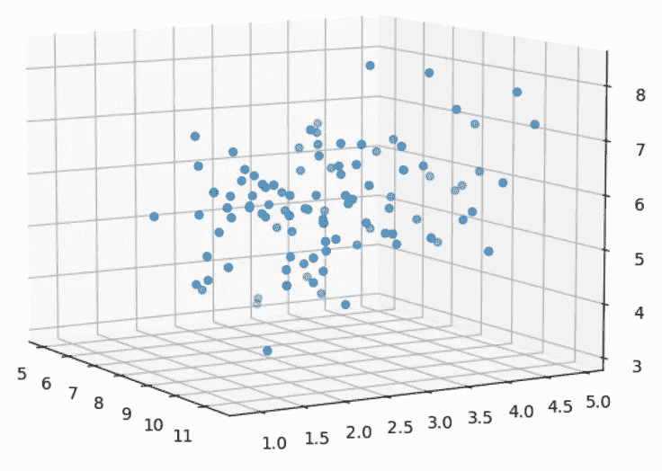
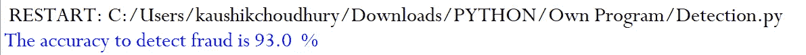
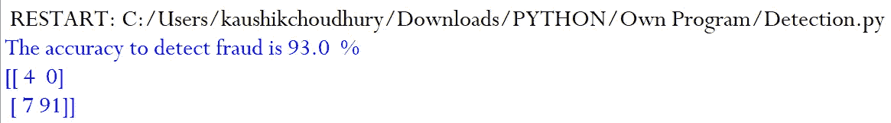
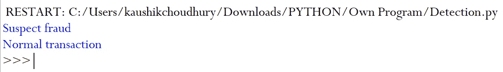

# 利用机器学习进行实时欺诈检测

> 原文：<https://towardsdatascience.com/real-time-fraud-detection-with-machine-learning-485fa502087e?source=collection_archive---------12----------------------->

## [内部 AI](https://towardsdatascience.com/machine-learning/home)

## 随着我们的生活和金融从物理世界转向数字世界，实时欺诈检测将占据中心位置。


[Bermix 工作室](https://unsplash.com/@bermixstudio?utm_source=medium&utm_medium=referral)在 [Unsplash](https://unsplash.com?utm_source=medium&utm_medium=referral) 拍摄的照片

与我们的父母和祖父母不同，我们生活和呼吸在数字世界中。最初是在线论坛上的讨论，然后是聊天和电子邮件，现在我们整个生活和金融交易的大部分都是以数字模式进行的。

随着风险越来越高，事后发现欺诈是不够的。想象一下，某人拥有一些关于您的银行或信用卡详细信息的机密信息，能够执行欺诈交易。银行和保险公司需要工具和技术来实时检测欺诈，以便采取适当的措施。

当我们超越三维空间时，我们人类失去了解释和观想的感觉。



如今，金融交易涉及数百个参数，如交易金额、过去的交易趋势、交易的 GPS 位置、交易时间、商户名称等。我们需要考虑许多参数来实时检测异常和欺诈。

Scikit-Learn 中实施的隔离森林算法有助于实时识别欺诈，避免经济损失。在这篇文章中，我将讨论一个带有机器学习的欺诈交易的一步一步的过程。

第一步:我们需要导入将要使用的包。我们将使用“make_blobs”来生成我们的测试数据，并将使用 accuracy_score 来测量拟合模型的准确性。

```
**from sklearn.datasets import make_blobs
from sklearn.metrics import accuracy_score
from sklearn.ensemble import IsolationForest**
```

**第二步:**在现实生活中，我们基于数百万和数十亿的过去交易和数百个参数来建立模型。在本文中，我们将考虑一百个样本和四个特性来理解核心概念和过程。

```
**X, y = make_blobs(n_samples=[4,96], centers=[[5,3,3,10],[9,3,6,11]], n_features=4, random_state=0, shuffle="True")**
```

数组 X 保存 100 条记录的四个参数的值，y 存储它是欺诈交易还是正常交易。

**步骤 3:** 我们将使用集合中的 300 个基本估计量(树)和来自数据集的 10 个样本来训练每个基本估计量。

```
**clf = IsolationForest(n_estimators=300,max_samples=10,
random_state=0,max_features=4,contamination=0.1).fit(X)**
```

此外，我们将为模型使用所有四个特征值(“max_feature”参数)。在项目中，通过特征工程，确定每个参数的重要性，并确定模型所基于的特征列表。我不会在本文中讨论特性工程的细节，我会在另一篇文章中讨论它。 **IsolationForest** 模型进一步拟合样本数据集。

我们基于历史数据中异常的比例和针对错误警报的丢失异常的风险来设置参数“污染”的值。假设历史数据集中欺诈交易的比例为 0.05 %，且这是一个非常高风险的交易。在这种情况下，我们可能希望将污染值设置为 0.25 到 0.35。将污染值设置为历史数据记录中异常比例的 5 到 7 倍将确保没有欺诈交易被错误地分类。事实上，与异常比例相比，设置较高的污染值也会导致错误警报的增加。在风险较低的情况下，我们可能会错过一些欺诈交易，但通过较低的污染值减少错误警报。

**步骤 4:** 在下面的代码中，fitted **IsolationForest** 模型预测交易是欺诈还是正常交易。IsolationForest 预测异常为“-1”，正常事务为“1”。在我们的样本测试数据集中，欺诈交易编码为“0”，正常交易编码为“1”。

```
**y_pred=clf.predict(X)
y_pred[y_pred == -1] = 0**
```

为了将模型预测准确性与样本数据集中的实际分类进行比较，我们将对预测的欺诈交易进行从“-1”到“0”的分类。

**第五步:**由于现在欺诈交易在样本和预测集中被标记为“0”，因此我们可以直接用 accuracy_score 函数比较模型的预测精度。

```
**fraud_accuracy_prediction= round(accuracy_score(y,y_pred),2)
print("The accuracy to detect fraud is {accuracy}  %" .format (accuracy=fraud_accuracy_prediction*100))**
```

该模型似乎以 93%的准确率识别了欺诈交易。乍一看，该模型的预测准确性可能不够好，但请记住，由于风险更高，因此我们可以接受很少的假警报(假阳性)。这些假警报牺牲了预测的准确性，但它比错过一些欺诈交易更安全。



**第 6 步:**我们将使用混淆矩阵更深入地研究预测**。**

```
**from sklearn.metrics import confusion_matrix
print(confusion_matrix(y, y_pred))**
```

在样本数据集中的总共 100 笔交易中，该模型可以识别所有四笔真实的欺诈交易。

由于模型中污染(安全系数)参数为 0.1，模型将七个真实交易标记为欺诈(假警报)。我们将污染值设置为高于历史数据中欺诈交易的实际比例，因为在风险更高的情况下，安全比遗憾更好。



**步骤 7:** 我们已经编写了一个小函数来实时检测新交易是否是欺诈。它将新交易馈送的参数值输入到已训练的模型中，以检测交易的真实性。

```
**def frauddetection(trans):
    transaction_type=(clf.predict([trans]))
    if  transaction_type[0] < 0:
        print("Suspect fraud")
    else:
        print("Normal transaction")
    return**
```

**步骤 8:** 在新交易时收集各种交易参数。

```
**frauddetection([7,4,3,8])   
frauddetection([10,4,5,11])**
```

通过调用前面用事务参数定义的函数来确定事务的真实性。



我已经简化了一些事情，如交易中的特征数量，历史交易的数量以适应模型，特征工程等。来解释核心概念。我们已经看到隔离林算法如何帮助实时检测欺诈性交易。

如果您想知道我们如何利用探索性数据分析执行特征工程，请阅读关于[探索性数据分析(EDA)的高级可视化](/5-advanced-visualisation-for-exploratory-data-analysis-eda-c8eafeb0b8cb)的文章。