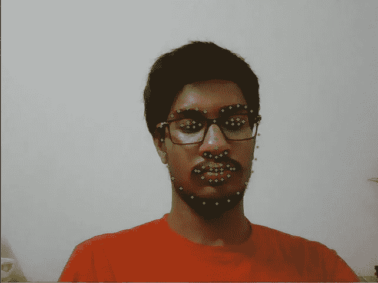
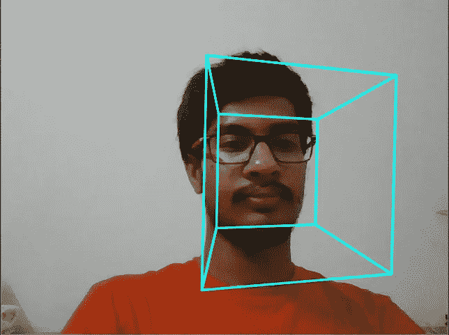
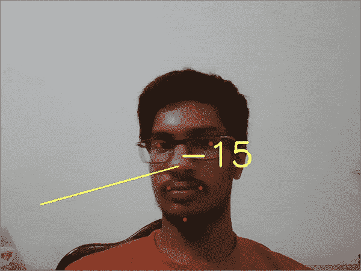
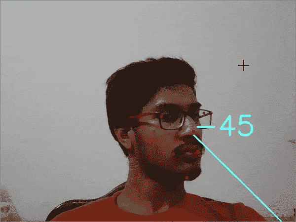

# Python 中的实时头部姿态估计

> 原文：<https://towardsdatascience.com/real-time-head-pose-estimation-in-python-e52db1bc606a?source=collection_archive---------6----------------------->

## 使用 Python 和 OpenCV 创建一个头部姿态估计器，它可以告诉你头部朝向的角度。


头部姿态估计器

头部姿态估计在计算机视觉中是一个具有挑战性的问题，因为需要各种步骤来解决它。首先，我们需要在帧中定位面部，然后定位各种面部标志。如今，识别人脸似乎是一件微不足道的事情，面对镜头的人脸也是如此。当面部有角度时，问题就出现了。此外，由于头部的运动，一些面部标志不可见。在这之后，我们需要将这些点转换到 3D 坐标来找到倾斜度。听起来工作量很大？不要担心，我们将一步一步来，并提到两个伟大的资源，这将使我们的工作容易得多。

# 目录

*   要求
*   人脸检测
*   面部标志检测
*   姿态估计

# 要求

对于这个项目，我们需要 OpenCV 和 Tensorflow，所以让我们安装它们。

```
#Using pip
pip install opencv-python
pip install tensorflow#Using conda
conda install -c conda-forge opencv
conda install -c conda-forge tensorflow
```

# 人脸检测

我们的第一步是在图像中找到面部标志。对于这个任务，我们将使用 OpenCV 的 DNN 模块的 Caffe 模型。如果你想知道它与其他模型如 Haar Cascades 或 Dlib 的正面人脸检测器相比表现如何，或者你想深入了解它，那么你可以参考这篇文章:

[](/face-detection-models-which-to-use-and-why-d263e82c302c) [## 人脸检测模型:使用哪一个，为什么？

### 一个关于用 Python 实现不同人脸检测模型的完整教程，通过比较，找出最好的…

towardsdatascience.com](/face-detection-models-which-to-use-and-why-d263e82c302c) 

你可以从我的 GitHub [库](https://github.com/vardanagarwal/Proctoring-AI/tree/master/face_detection/models)下载需要的模型。

```
import cv2
import numpy as npmodelFile = "models/res10_300x300_ssd_iter_140000.caffemodel"
configFile = "models/deploy.prototxt.txt"
net = cv2.dnn.readNetFromCaffe(configFile, modelFile)img = cv2.imread('test.jpg')
h, w = img.shape[:2]
blob = cv2.dnn.blobFromImage(cv2.resize(img, (300, 300)), 1.0,
(300, 300), (104.0, 117.0, 123.0))
net.setInput(blob)
faces = net.forward()#to draw faces on image
for i in range(faces.shape[2]):
        confidence = faces[0, 0, i, 2]
        if confidence > 0.5:
            box = faces[0, 0, i, 3:7] * np.array([w, h, w, h])
            (x, y, x1, y1) = box.astype("int")
            cv2.rectangle(img, (x, y), (x1, y1), (0, 0, 255), 2)
```

使用`cv2.dnn.readNetFromCaffe`加载网络，并将模型的层和权重作为参数传递。它在大小调整为 300x300 的图像上表现最佳。

# 面部标志检测

最常用的一个是 Dlib 的面部标志检测，它给我们 68 个标志，但是，它没有给出很好的准确性。相反，我们将在这个 Github [repo](https://github.com/yinguobing/cnn-facial-landmark) 中使用尹提供的面部标志检测器。它还提供了 68 个地标，这是一个在 5 个数据集上训练的 Tensorflow CNN！预先训练好的模型可以在[这里](https://github.com/vardanagarwal/Proctoring-AI/tree/master/face_detection/models)找到。作者只写了一系列解释包括背景、数据集、预处理、模型架构、训练和部署的帖子，可以在这里找到。我在这里提供了一个非常简短的摘要，但是我强烈建议您阅读它们。

在第一个系列中，他描述了视频中面部标志的稳定性问题，然后列出了现有的解决方案，如 OpenFace 和 Dlib 的面部标志检测以及可用的数据集。第三篇文章是关于数据预处理和准备使用的。在接下来的两篇文章中，工作是提取人脸并在其上应用面部标志，以使其准备好训练 CNN 并将它们存储为 TFRecord 文件。在第六篇文章中，使用 Tensorflow 训练了一个模型。在本文中，我们可以看到损失函数在训练中有多重要，因为他首先使用了`tf.losses.mean_pairwise_squared_error`，该函数在最小化损失时使用点之间的关系作为优化的基础，并且不能很好地概括。相比之下，当使用`tf.losses.mean_squared_error`时，它工作得很好。在最后一篇文章中，模型被导出为 API，并展示了如何在 Python 中使用它。

该模型采用大小为 128x128 的正方形盒子，其中包含人脸并返回 68 个人脸标志。下面提供的代码取自这里，它也可以用来绘制 3D 注释框。该代码被修改以在所有的脸上绘制面部标志，而不像原始代码那样只在一张脸上绘制。

这个代码将在人脸上绘制面部标志。



绘制面部标志

使用`draw_annotation_box()`,我们也可以绘制如下所示的注释框。



带注释框

# 姿态估计

这是一篇关于 [Learn OpenCV](https://www.learnopencv.com/) 的很棒的[文章](https://www.learnopencv.com/head-pose-estimation-using-opencv-and-dlib/)，它解释了图像上的头部姿态检测，其中有很多关于将点转换到 3D 空间的数学知识，并使用`cv2.solvePnP`来找到旋转和平移向量。快速通读这篇文章将有助于理解其内在的工作原理，因此我在这里只简单地写一下。

我们需要面部的六个点，即鼻尖、下巴、嘴唇的最左和最右点，以及左眼的左角和右眼的右角。我们采用这些面部标志的标准 3D 坐标，并尝试估计鼻尖处的合理和平移向量。现在，为了进行精确的估计，我们需要摄像机的固有参数，如焦距、光学中心和径向失真参数。我们可以估计前两个，并假设最后一个不存在，以使我们的工作更容易。获得所需的向量后，我们可以将这些 3D 点投影到 2D 表面上，这就是我们的图像。

如果我们只使用可用的代码，并找到与 x 轴的角度，我们可以获得如下所示的结果。



结果

它非常适合记录头部上下移动，而不是左右移动。那么如何做到这一点呢？嗯，上面我们已经看到了一个标注框的脸。如果我们能利用它来测量左右运动。


带注释框

我们可以找到两条深蓝色线中间的线作为我们的指针，找到与 y 轴的角度，找到运动的角度。



结果

把两者结合起来，我们就可以得到我们想要的结果。完整的代码也可以在我的 GitHub [库](https://github.com/vardanagarwal/Proctoring-AI)找到，还有在线监督解决方案的各种其他子模型。

在 i5 处理器上测试时，即使显示图像，我也能获得每秒 6.76 帧的健康帧，而面部标志检测模型只需 0.05 秒即可找到它们。

现在我们已经创建了一个头部姿势检测器，你可能想做一个眼睛凝视跟踪器，然后你可以看看这篇文章:

[](/real-time-eye-tracking-using-opencv-and-dlib-b504ca724ac6) [## 使用 OpenCV 和 Dlib 的实时眼睛跟踪

### 在本教程中，学习通过 python 中的网络摄像头创建一个实时凝视探测器。

towardsdatascience.com](/real-time-eye-tracking-using-opencv-and-dlib-b504ca724ac6)