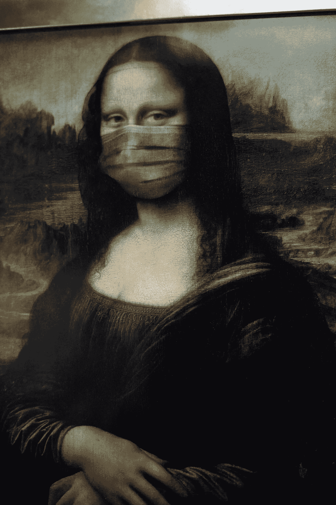

# 使用 YOLOv3 进行实时掩模检测

> 原文：<https://towardsdatascience.com/real-time-mask-detection-with-yolov3-21ae0a1724b4?source=collection_archive---------22----------------------->



来源: [cottonbro](https://www.pexels.com/@cottonbro) ，via [Pexels](https://www.pexels.com/photo/mona-lisa-with-face-mask-3957982/)

# 介绍

由于冠状病毒疫情，我们都知道 2020 年的灾难性开始。我们所知的生命已经停止。研究一直表明，基本卫生，如洗手和打喷嚏或咳嗽时捂住口鼻，会大有帮助。**在这种场合，** **在公共场所戴口罩是必不可少的**。

在这篇文章中，我将谈论一个我使用 [Darknet](https://pjreddie.com/darknet/) 训练的自定义对象检测器，它可以检测你是否戴了面具。Darknet 是一个用 C 和 CUDA 编写的开源神经网络框架，支持 CPU 和 GPU 计算。使用 Darknet，我训练了一个 YOLO(你只能看一次)物体探测器。

简单来说，YOLO 可以一次探测到图像中的所有物体。这篇文章不会讨论 YOLO 的细节。YOLO 的详细情况可以在[这里](https://arxiv.org/pdf/1506.02640.pdf)和[这里](https://arxiv.org/pdf/1804.02767.pdf)的文件中找到。

# 先决条件

首先，你需要一个运行 **Linux** 和 **GPU 的系统，最好是**。虽然你可以使用 AlexAB 的实现在 Windows 上设置 Darknet，但是我强烈建议你坚持使用 Linux ，因为这个过程要简单得多。好吧，我明白了，你用的是 Windows，你不想经历笔记本电脑双重启动的麻烦。不管你的选择是什么，这篇文章将帮助你的物体探测器启动并运行！除此之外，我将在 Python 3.7 中使用 OpenCV。请随意使用您已经安装的 Python 版本。确保还安装了 numpy 和 argparse python 库。

> TLDR；如果你出于任何原因不想经历训练模型的麻烦，我会帮你搞定的！跳到最后一节。

# 安装暗网

## 对于 Linux

在 Linux 上安装 Darknet 非常简单。建议看官方指南[这里](https://pjreddie.com/darknet/install/)。要开始，请打开您的终端并键入以下内容:

```
git clone https://github.com/pjreddie/darknet.git
cd darknet
make
```

如果你有 NVIDIA 支持的 GPU，你应该考虑安装 CUDA，因为它可以大大减少培训时间。[这篇](https://medium.com/@exesse/cuda-10-1-installation-on-ubuntu-18-04-lts-d04f89287130)帖子让安装过程变得简单，将为您节省大量时间。用 CUDA 和 OpenCV 编译 Darknet，只需打开`/darknet/Makefile`，编辑`GPU=1`、`CUDNN=1`、`OPENCV=1`，用`make`命令构建软件即可。

## 对于 Windows

对于 Windows，这个过程稍微复杂一些。首先，克隆 AlexAB 的存储库:

```
git clone [https://github.com/AlexeyAB/darknet.git](https://github.com/AlexeyAB/darknet.git)
```

完成后，转到存储库的需求页面:

[https://github.com/AlexeyAB/darknet#requirements](https://github.com/AlexeyAB/darknet#requirements)

在继续之前，确保您已经满足了**所有要求**，然后进入本节:

[https://github . com/AlexeyAB/darknet #如何使用 cmake 在 windows 上编译](https://github.com/AlexeyAB/darknet#how-to-compile-on-windows-using-cmake)

选择您想要用来构建软件的方法。我建议使用 **CMake 方法**(这也是作者推荐的方法)，因为使用 vcpkg 可能会令人厌倦。

# 模特培训

继续克隆我的存储库:

```
git clone [https://github.com/rushad7/mask-detection.git](https://github.com/rushad7/mask-detection.git)
```

文件夹结构应该类似于:

```
.
├── annotations
├── cfg
├── class_names
├── data
│   ├── mask
│   └── no-mask
├── misc
├── results
├── weights
└── yolo
```

`data`文件夹包含`mask`和`no-mask`文件夹，它们包含戴面具和不带面具的人的图像。`annotations`文件夹包含`data`文件夹中的所有图像，但带有各自的`.txt`注释文件。

将`/mask-detection/annotations`文件夹中的图像和`.txt`文件复制到`/darknet/obj/`文件夹中。如果您希望**添加您的训练图像**，也将它们添加到上面的文件夹中。为了给图像添加注释，我使用了 [LabelImg](https://github.com/tzutalin/labelImg) ，这是一个免费且易于使用的标签工具，支持 Linux、Windows 和 Mac。在使用它的时候，只要**确保你是以 YOLO 格式**保存文件(可以通过点击保存按钮附近的按钮来设置)。同样，将`/mask-detection/cfg/yolov3-custom.cfg`文件复制到`/darknet/cfg/`文件夹，将`/mask-detection/yolo/voc.data`文件复制到`/darknet/cfg/`文件夹。

从终端运行`/mask-detection/misc/test_train_split.py` python 脚本(检查脚本的用法)，它将在`/mask-detector/train_test/`文件夹中生成`train.txt`和`test.txt`文件。打开`/mask-detection/yolo/voc.data`并用上述文件的路径编辑`train`和`test`变量。

另外，你**可能**需要修改路径，这取决于你在系统的什么地方使用了 Darknet 和 my repository。如果你使用的是 Windows 系统，你必须将路径改为 Windows ie。`C:/Users/...`

最后，从[这里](https://pjreddie.com/media/files/darknet53.conv.74)下载 darknet53 模型的卷积权重，并将其放在您的 darknet 目录中。

现在我们都准备好接受训练了！要开始训练模型，请转到您的 darknet 目录并键入:

```
./darknet detector train /cfg/voc.data cfg/yolov3-custom.cfg darknet53.conv.74
```

根据您训练的图像数量以及是在 CPU 还是 GPU 上，训练时间会有所不同。我在英伟达 GTX 1050 上训练了这个数据集，花了我大约 6 个小时。

附:如果你得到一个关于 CUDA 内存不足的错误，试着在`yolov3-voc.cfg`文件中改变批量大小。

现在你要做的就是等待训练结束！Darknet 每 100 次迭代保存权重，直到第 1000 次迭代，然后每 10，000 次迭代保存在`/darknet/backup/`文件夹中。

# 测试对象检测器

转到`/darknet/backup`并将最后生成的`.weights`文件复制到我的存储库中。

**对于那些没有训练模型**、[的、](https://github.com/rushad7/mask-detection)克隆我的 GitHub 库的人，我已经把我训练的权重包含在里面了。

要运行实时屏蔽检测，只需从终端运行`yolo-live-cv2.py`脚本，如下所示:

```
python yolo-live-cv2.py --yolo yolo
```

瞧啊。，你的 YOLO 面具探测器正在工作！检测器表现相当好，但大约 10 到 15 FPS。我注意到，模型的准确性可以通过增加数据的大小和质量来提高。我在 GitHub 上找到了[这个](https://github.com/prajnasb/observations/tree/master/experiements/data)数据集，可能会有帮助。