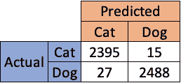
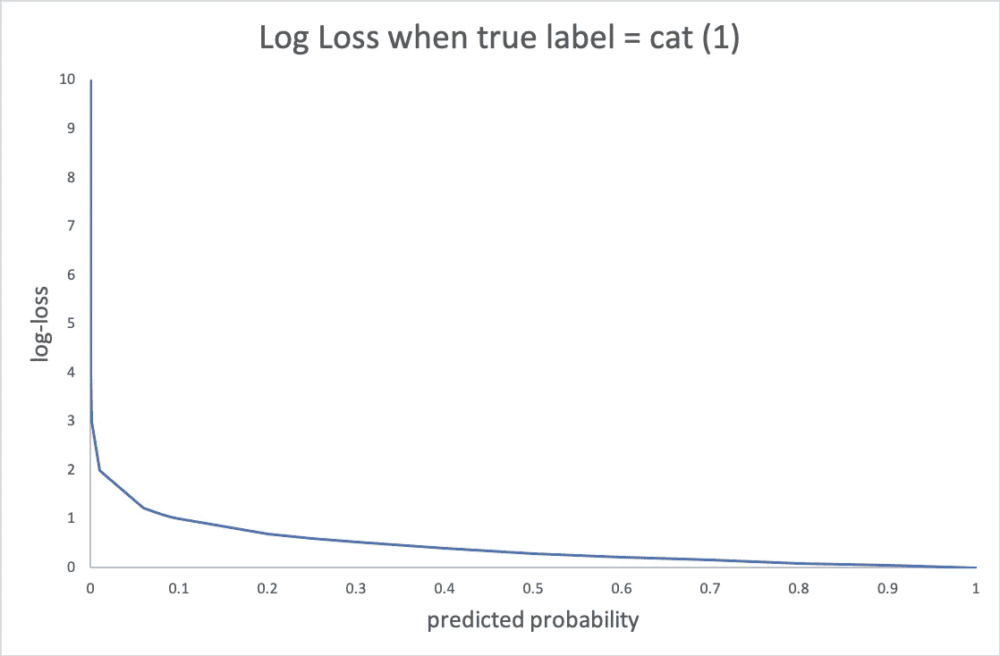
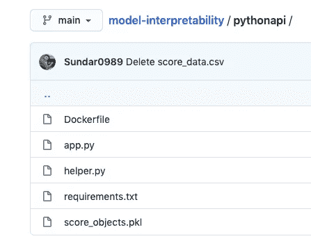
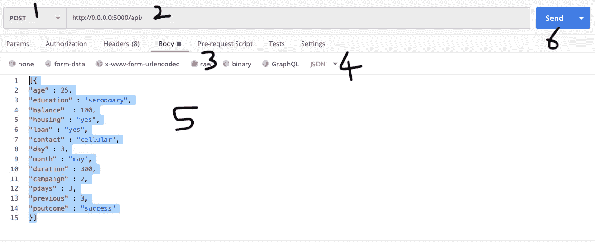
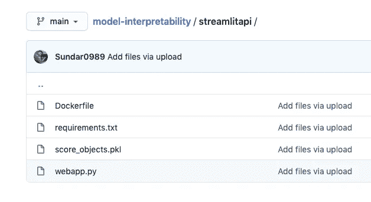
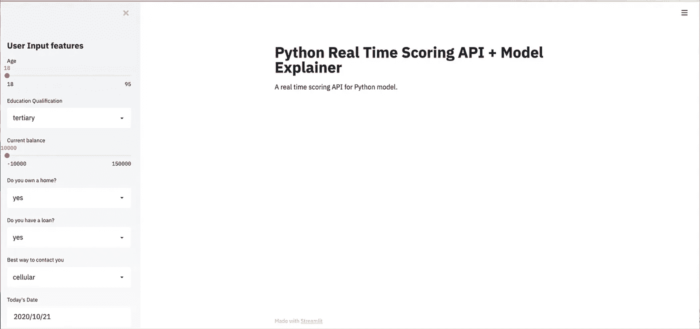
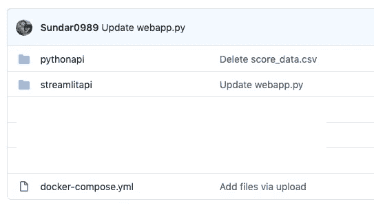
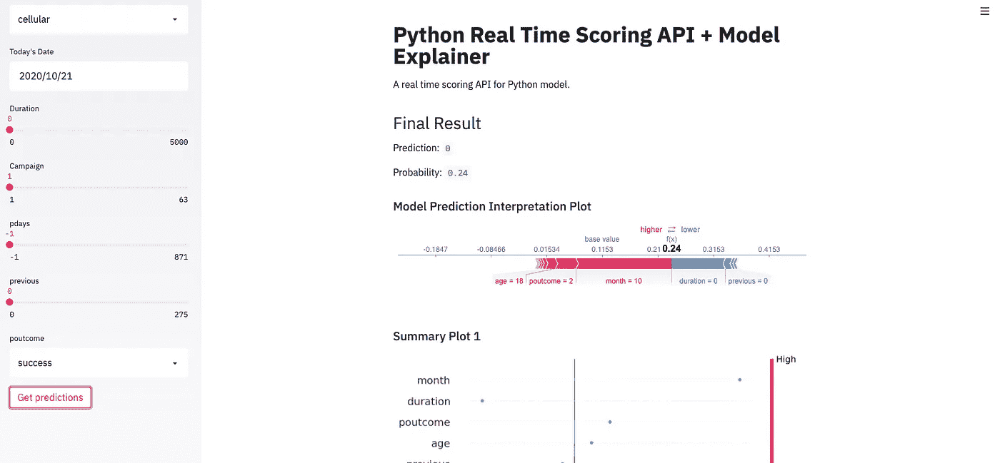
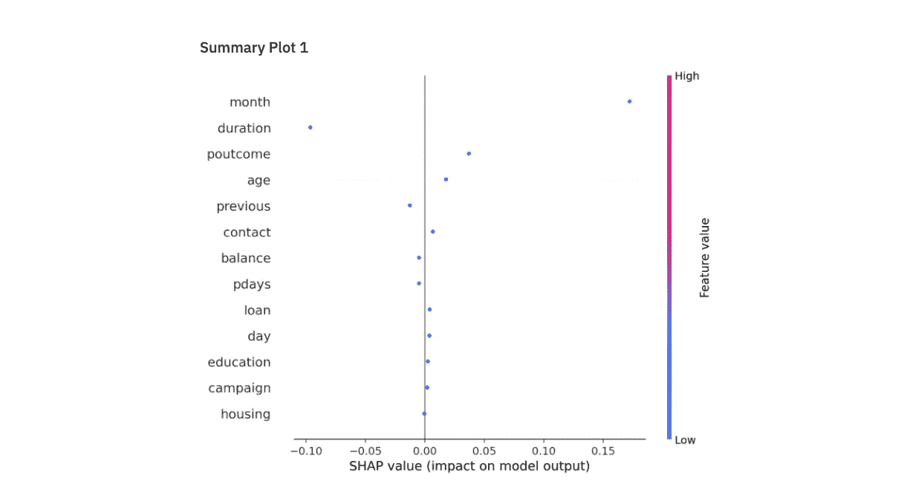
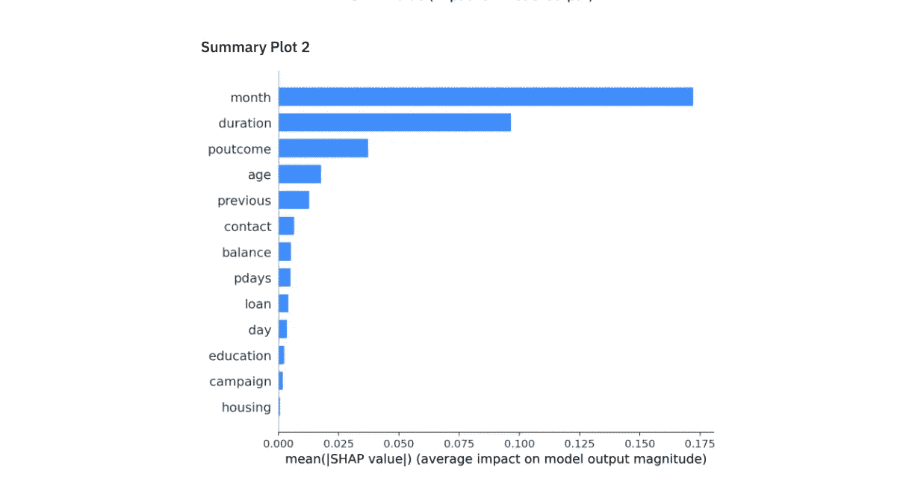

# 使用 SHAP、Streamlit 和 Docker 的实时模型可解释性 API

> 原文：<https://towardsdatascience.com/real-time-model-interpretability-api-using-shap-streamlit-and-docker-e664d9797a9a?source=collection_archive---------24----------------------->

## *自助式 API 实时解释模型分数*

**

*礼貌: [Pixabay](https://pixabay.com/photos/house-painter-balloon-why-question-3062248/)*

# *背景*

*作为一名数据科学家，您将一个业务问题转化为一个数据科学问题。接下来，您构建解决问题的解决方案/模型。您用测试和超时数据验证模型，以确保它没有偏差。最后，您在生产中部署模型，监控模型的性能，进行实验等等。除了这些任务之外，您还需要向业务涉众展示您的发现，有时还需要与他们一起工作来教育和有效地使用您的模型。你的工作完成了吗？还没有。*

*您的模型的最终用户可能会思考并提出类似这样的问题——“为什么您的模型预测这个客户是某某人？”或者“你能解释一下为什么我们会从你的模型中得到这个结果吗？”。即使你有一个合适的文档(假设你做了)，它也不能解释你的模型预测。考虑一个场景，您构建了一个模型来对猫/狗进行分类。您的文档看起来像这样。*

**

*混淆矩阵*

**

*交叉熵*

> ***当最终用户问你“为什么你的模型预测这张图片是一只猫？”***

**

*礼貌: [Pixabay](https://pixabay.com/photos/tree-cat-silhouette-moon-full-moon-736877/)*

*上面提供的文档不能回答这些类型的问题。当您有一个线性模型时，您可以使用参数估计来解释结果。然而，随着模型开始变得复杂(像神经网络这样的黑盒模型)，解释结果变得更加困难。在这种情况下，你需要一个黑盒模型来获得更好的结果，但解释这些结果变得更加困难，这是一个讽刺。此外，当你被要求解释一个你过去开发的模型时，你需要一定的时间才能得到答案。SHAP 解决了这个根本的缺点。*

## *你将从这篇文章中学到什么？*

1.  *对模型进行分类以执行实时评分*
2.  *使用 Streamlit 创建一个前端 API 来与您的模型通信并获得预测*
3.  *使用 SHAP 解释模型预测*

*GitHub 资源库中提供了完整的代码。*

* [## sundar 0989/模型-可解释性

### 此时您不能执行该操作。您已使用另一个标签页或窗口登录。您已在另一个选项卡中注销，或者…

github.com](https://github.com/Sundar0989/model-interpretability) 

在这个练习中，我使用了[银行数据集](https://github.com/Sundar0989/model-interpretability/blob/main/bank-full.csv)来构建一个二元分类模型。 [jupyter 笔记本](https://github.com/Sundar0989/model-interpretability/blob/main/Trial_API.ipynb)将带你完成为 pickle 文件创建对象的步骤。在本练习中，我们在 pickle 文件中存储 4 个对象。

1.  **d** —标签编码器对象，用于将分类数据转换为数字数据
2.  **features_selected** —分类模型中使用的特征
3.  **clf** —随机森林分类模型
4.  **讲解人** — SHAP 讲解对象

一旦准备好 pickle 文件，就可以继续创建 API 了。

> **第一步:对你的模型进行分类，进行实时评分**

## helper.py

这个文件包含执行评分的帮助函数。当您获得原始数据时，需要对其进行处理，并为评分做好准备。这是通过***transform _ categorial***函数实现的。一旦数据被处理，我们可以使用 ***score_record*** 函数对数据进行评分。该函数返回概率和预测，稍后将在前端 API 中显示。

## app.py

这个 flask 应用程序用于读取你的模型对象并产生分数。首先我们读取之前创建的 pickle 文件(***score _ objects . pkl***)并加载模型对象。第二，我们从 Streamlit 前端 API 以 *json* 格式获取数据。第三，我们使用助手函数来执行预处理并生成分数。最后，我们将分数发回 Streamlit 前端 API。

## requirements.txt

该文件包含执行上述操作所需的包的列表。

## Dockerfile 文件

这个文件用于为您的模型创建一个 docker，并将整个应用程序容器化。正如您所看到的，它获取了一个基础映像(***python:3.7-stretch***)，并在映像内部创建了一个工作目录( ***/deploy/*** )。我们把前面提到的文件( ***app.py，requirements.txt，helper.py 和 score_objects.pkl*** )复制到工作目录下。它在映像内部的 requirements.txt 文件中安装包(第 7 行),并将端口 5000 暴露给外部的 wold。当 flask 被执行时(第 9 行),它将使用这个端口与外部应用程序通信。如果需要使用不同的端口，那么在 ***app.py*** 文件中配置端口。

所有这些文件都驻留在一个名为 ***的目录中。***

**pythonapi** 目录结构

> 注意:在创建 docker 容器之前，您可以通过单独运行 app.py 文件来测试您的应用程序。这将避免不必要的错误，并有助于代码调试。我推荐使用 [Postman API](https://www.postman.com/downloads/) 来完成这个任务。

## 使用 Postman API 调试应用程序

您需要确保按照步骤来设置 Postman API。

Postman API 应用步骤

启动终端/命令提示符，使用下面显示的命令执行 app.py 文件。

**python app.py**

应用程序启动后，使用下面的示例验证应用程序是否正确运行，没有任何错误。

您应该会得到如下所示的输出。

完成调试后，您可以进入下一步，创建前端 Streamlit API。

> 步骤 2:使用 Streamlit 创建一个前端 API

Streamlit 前端 API 位于自己的 docker 容器中。这样，前端应用程序就独立于模型 docker，并且可以随时更改。这是一个很好的行业惯例。streamlit 的目录结构如下所示。

**streamlitapi** 目录结构

## webapp.py

该文件包含创建 Streamlit 应用程序的代码。使用 Streamlit 的最大好处是您可以在工作时交互式地构建前端，并且只需要最少的代码。您需要确保 Python API 端点指向之前创建的 ***pythonapi*** 目录。如果您使用了不同的目录名，您需要更改它才能工作。

要调试这个应用程序，您可以使用下面的代码。

**streamlit run webapp.py**

简化应用编程接口

最终的前端 API 看起来如上。在这个 API 中，您可以在左侧栏中提供输入数据，然后在主页面中获得实时预测和解释。

## 需求. py

## Dockerfile 文件

我们在这个目录中还有***score _ objects . pkl***文件，也可以访问 SHAP 解释器对象。

现在，我们准备将 shapley 解释值合并到 API 中。

> 第三步:使用 SHAP 解释模型预测

SHAP 的代码已经包含在 ***webapp.py*** 中。下面的代码是摘自 ***webapp.py*** 的片段。

***解释 _ 模型 _ 预测*** 函数产生解释结果所需的 shap 值。 ***st_shap*** 函数获取 force_plot 对象(p)生成的图形，并使其与 Streamlit API 兼容。最后，我们为每个预测添加了汇总图。

现在，我们已经准备好了各个组件，让我们将它们组合在一起，使我们的应用程序工作。我们将使用 docker-compose 来执行这项任务。代码如下。

这是使这个东西工作的整个目录的结构。

整个目录结构

导航到终端/命令提示符并执行以下命令。

**docker-compose 构建**

它将构建完整的图像，并在模型和 streamlit docker 之间建立必要的连接。一旦该步骤完成，您就可以执行下面的代码来运行应用程序。

**docker-compose up**

您将在 URL 中看到应用程序—[http://localhost:8501/](http://localhost:8501/)。要运行应用程序，为每个特性提供一些输入，并点击**“获取预测”**按钮。您应该得到如下所示的输出。

Streamlit API 输出 1

Streamlit API 输出 2

Streamlit API 输出 3

除了预测和概率，你还会得到一个很好的可解释的图表，解释为什么模型会做出这样的预测。一旦您使用完 API，您可以使用下面的代码关闭。

**docker-compose down**

就是这样。现在，您拥有了一个具有良好前端的实时模型评分和解释应用程序。您可以根据自己的目的/应用添加/修改/删除图。

玩得开心！*