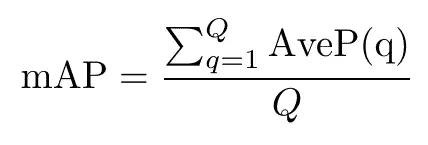
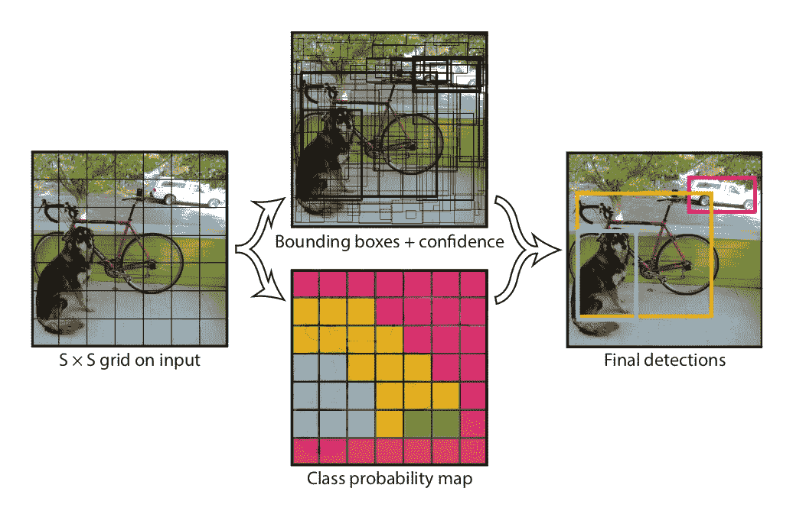
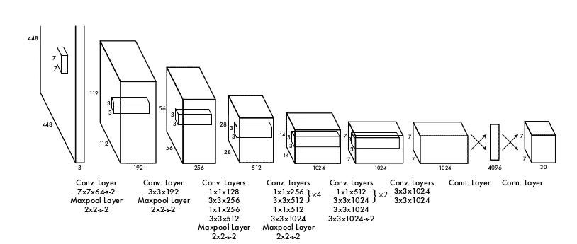
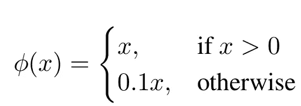
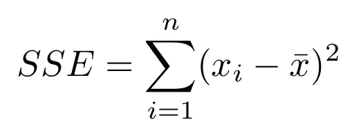
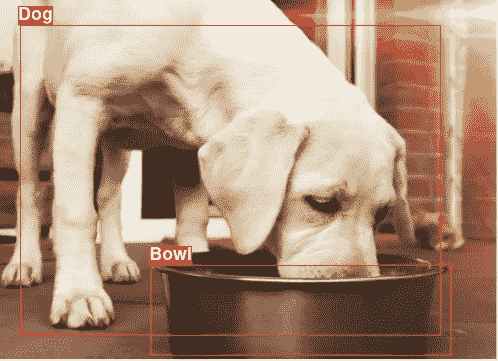
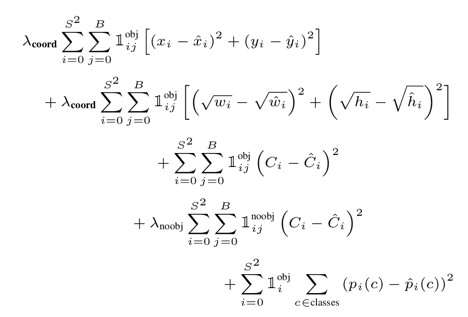

# 实时目标检测[PyTorch]||[YOLO]

> 原文：<https://towardsdatascience.com/real-time-object-detection-pytorch-yolo-f7fec35afb64?source=collection_archive---------34----------------------->

## Python-PyTorch

## 用 PyTorch 在 Python 上实现的 YOLO 统一实时目标检测

[亚历山大·奈特](https://unsplash.com/@agkdesign?utm_source=medium&utm_medium=referral)在 [Unsplash](https://unsplash.com?utm_source=medium&utm_medium=referral) 上拍照

计算机能理解它们看到的东西吗？他们能区分狗和猫、男人和女人或者汽车和自行车吗？让我们在这里找到它！

目标检测和识别是当今计算机视觉研究的前沿领域之一。研究人员正在寻找新的方法让计算机理解他们看到的东西。新的最先进的模式正在制定，以大幅度击败他们以前的模式。但是，计算机实际上还远远没有“看到”它们所看到的东西。

在这篇文章中，我将详细介绍 YOLO[你只看一次]——2016 年的一项研究工作，创下了实时对象检测的新高。这篇文章是对 YOLO 模型的简要描述和实现，让你开始进入计算机视觉和物体检测领域。

## YOLO:简介

YOLO 将对象检测重新构建为一个单一的回归问题，直接从图像像素到边界框坐标和类别概率。YOLO 使用单个卷积层来同时预测多个边界框和这些框的类别概率。因此，YOLO 的一个主要优点是我们可以用它来检测帧的速度。即使在这样的速度下，YOLO 也设法达到了其他实时系统平均精度(mAP)的两倍多*！*

> Mean Average precision 是每个类的平均精度的平均值。换句话说，平均精度是所有类的平均精度。

平均精度方程

## 侦查

YOLO 是一个统一的物体检测过程— *统一？* YOLO 将涉及物体检测的几项任务统一到一个单一的神经网络中。网络在进行边界框预测时会考虑整个图像。因此，它能够在同一时间*预测所有类的所有边界框。*

首先，图像被分成一个 *S* x *S* 网格。如果网格的中心落在网格单元中，则网格单元应该能够检测到对象。那么，我们所说的检测是什么意思呢？准确地说，网格单元预测 *B* 边界框，每个框的置信度得分告诉我们模型对该框包含一个对象有多少置信度，以及该框在覆盖该对象方面有多准确。因此，这个框给了我们 5 个预测— *x，y，w，h* 和*置信度得分*。网格单元因此给了我们 *B* 这样的预测。

除了边界框上的预测，网格单元还给出了我们 *C 个条件类概率*。假定网格单元包含一个对象，这些基本上给出了类的概率。换句话说，假设一个对象存在，条件类概率给我们这个对象可能属于哪个类的概率。每个格网像元仅预测一组类别概率-无论存在多少个边界框

模型功能概述—【https://arxiv.org/abs/1506.02640 

## 网络

该模型受 GoogleNet 图像分类模型的启发。它有 24 个卷积层，后面是 2 个全连接层。与 GoogLeNet 使用的 inception 模块不同，它使用 1 × 1 缩减层，然后是 3 × 3 卷积层。

模型架构概述—【https://arxiv.org/abs/1506.02640 

交替的 1 × 1 卷积层减少了来自前面层的特征空间。整个网络以一半的分辨率针对 ImageNet 分类问题进行预训练，然后分辨率加倍用于检测。

## 丢失和激活

最后一层使用线性激活函数，而所有其他层使用泄漏-ReLU 激活函数。Leaky-ReLU 激活可以表示为:

漏流激活

损失函数是简单的误差平方和，写为—

平方和误差

然而，如果我们像这样定义损失函数，它将把分类和定位误差结合在一起，并且从模型的观点来看，将同等重视这两者。

为了防止这种情况发生，增加边界框坐标预测的损失，并减少不包含对象的框的置信度预测的损失。两个参数λcoord 和λnoobj 用于实现这一点——λcoord 设置为 5，λnoobj 设置为 0.5(参见损失函数方程中关于这些超参数的更多信息)

SSE 还带来了大小包围盒权重误差相等的问题。为了形象化这个问题，请看下面的图片—

狗和碗的图片(仅供参考)——谷歌图片

这里我们可以看到，狗和碗已经被注释为图像中的对象。狗的边框尺寸较大，碗的尺寸较小。现在，如果狗和碗的边界框减少相同的正方形像素，它会觉得碗与框相比具有更差的注释。这是为什么呢？因为在位移和尺寸方面的边界框精度应该与边界框尺寸而不是图像尺寸相比较。

现在，来看我们的损失函数，我们可以看到，损失函数并没有特别注意边界框的大小。它没有考虑到这一点。为了克服这个障碍，网络不预测边界框的高度和宽度，而是预测其平方根。这有助于将差异保持在最小。

考虑到所有这些因素，多部分损失函数可以写成—

网络的总损失函数—[https://arxiv.org/abs/1506.02640](https://arxiv.org/abs/1506.02640)

既然我们已经完成了 YOLO 物体检测模型的基础，让我们开始研究代码吧！

## 建造它！

YOLO 网络简单易建。问题在于边界框。绘制边界框和保存图像、编写置信度得分和标签以及配置整个训练代码会使本文变得不必要的长。因此，我将直接实现这个模型。自己承担责任，在这个周末作为一个项目完成代码，并在评论区告诉我结果！*我将上传这篇文章的续集，以你的代码和你的结果为特色，并给予满分；)*

YOLO 网络模块

这是一个关于 yolov 3(YOLO 的最新即兴版本)结果的短片—

YOLOv3

很兴奋吧。嗯，你应该是因为计算机视觉突飞猛进！现在是开始的时候了。如果你被 YOLO 的实现卡住了，请在评论区告诉我。来帮忙了:)

查看我的博客以获得更快的更新，并订阅优质内容:D

 [## 卷积博客

### 克罗伊斯，吕底亚(小亚细亚)的国王，曾经问特尔斐的神谕，他是否应该对波斯开战…

www.theconvolvedblog.vision](https://www.theconvolvedblog.vision) 

*Hmrishav Bandyopadhyay 是印度 Jadavpur 大学电子与电信系的二年级学生。他的兴趣在于深度学习、计算机视觉和图像处理。可以在——hmrishavbandyopadhyay@gmail.com 找到他。*