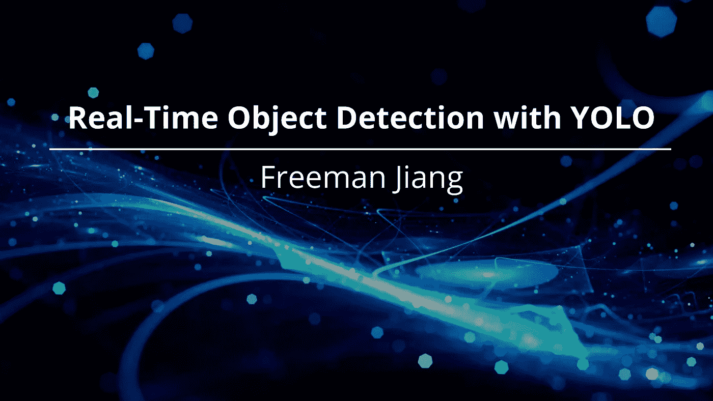
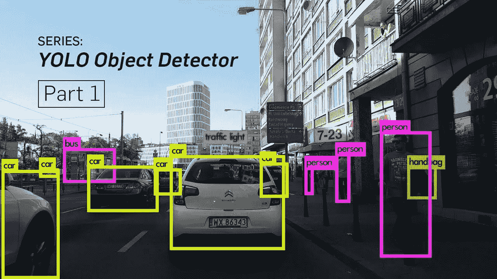
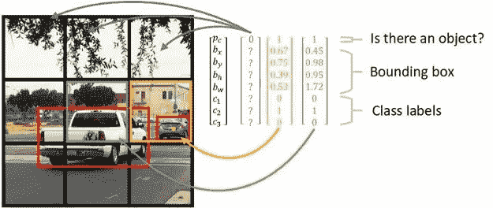
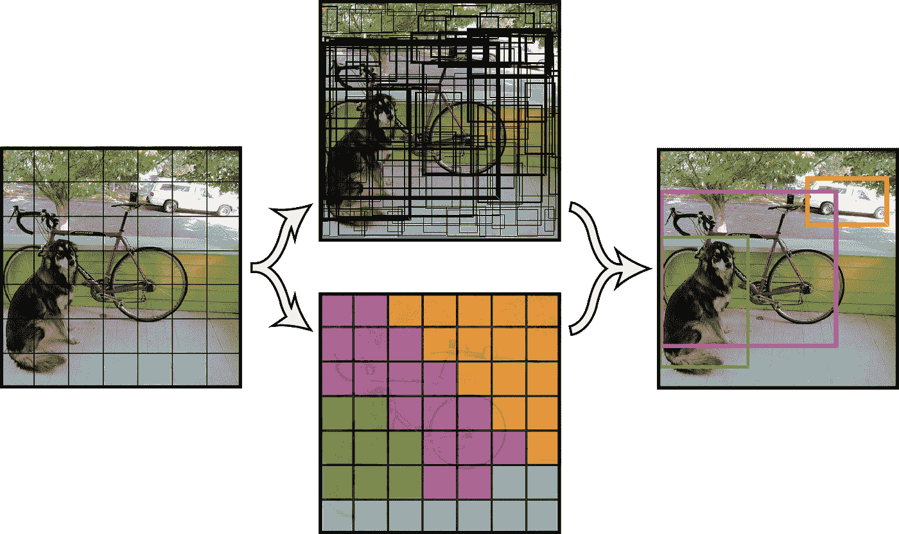
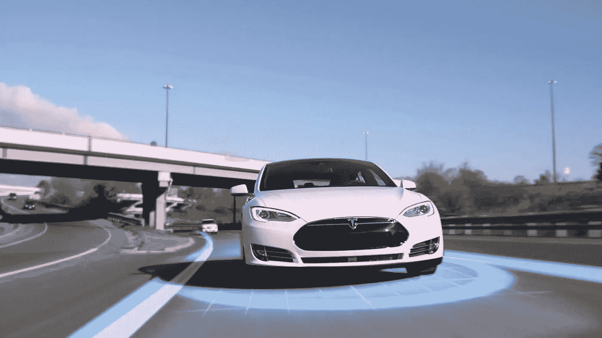

# 利用 YOLO 进行实时目标检测

> 原文：<https://towardsdatascience.com/real-time-object-detection-with-yolo-9dc039a2596b?source=collection_archive---------25----------------------->

# 这是特斯拉的自动驾驶 Model S。

现在，除了直到最近无人驾驶汽车的想法还闻所未闻这一事实之外，人们不得不怀疑无人驾驶汽车实际上是如何工作的？我的意思是，我们把自己的生命——以及我们的朋友和家人的生命——托付给了一堆金属和电路。不幸的是，答案非常复杂，包括各种组件，如雷达、激光雷达、GPS 定位等。然而，自动驾驶汽车大脑的核心是 YOLO 物体检测。

在我的[上一篇文章](/cnns-explained-giving-sight-to-artificial-intelligence-304f252346bc/)中，我谈到了卷积神经网络，以及它们如何让计算机对图像中的对象进行分类。然而，要像特斯拉的自动驾驶仪一样工作，汽车不仅需要识别它看到的*图像，还需要知道这些物体的确切位置*。对于这一点，分类器是不够的——这就是 YOLO 的用武之地。**

# **超快速、实时的物体检测**

**澄清一下，YOLO 物体检测并不代表“你只活一次”物体检测(我不想用那个软件上车)，而是**“你只看一次”**物体检测。传统的分类器需要在图像上滑动窗口多次来检测不同的类别，而 YOLO——正如所料——只需要看一次。这是一种非常快速的实时方法，不仅可以识别物体，还可以定位物体，速度高达惊人的每秒 155 帧。**

****

**YOLO 物体探测在行动**

## **边框和网格**

**YOLO 的工作原理是将一个*单*神经网络应用于完整的图像输入。网络将每个输入图像分成一个 S 乘 S 的网格，每个网格单元预测预定数量的边界框。这些框预测对象的 x 坐标、y 坐标、宽度和高度。这些框还包括一个置信度得分，以确定该对象属于所识别的类别。**

****

**YOLO 网格和边界框**

## **交集超过联合模型评估**

****

**为了评估模型的性能，YOLO 使用了一种叫做**交集超过并集** ( **IoU)，**的东西，计算方法是将预测边界框和地面真实之间的重叠面积除以两者之间的并集面积。IoU 是一种衡量 YOLO 网络在识别物体时准确性的指标，它将网络的输出与手动标记的数据进行比较。**

## **非最大抑制**

**最终，每个网格单元最终给我们一个**集合**数量的边界框，每个边界框都有一个置信度得分和分类。这些边界框中的大多数往往是无用的或不相关的，因此只有那些高于某个置信度阈值的边界框被保留作为 YOLO 网络的最终输出。**

****

# **YOLO 异议检测的优势**

**虽然在它之前有许多前辈，但在实时对象检测方面，没有任何计算机视觉算法像 YOLO 一样快速或有效。概括地说，YOLO 是:**

## **1.极快**

**现在，在这一点上，你可能厌倦了我用 YOLO 真的真的很快这个事实来打击你，但是这一点我怎么强调都不为过。将人工智能应用于现实生活的主要障碍之一是，在大多数情况下，计算机在现实世界中花费的时间太长。我们根本不能让无人驾驶汽车到处游荡，如果每次他们都需要停下来思考几秒钟，不管他们面前是一个孩子还是一个塑料袋！在大多数情况下，计算机视觉总是准确的，但由于其速度，YOLO 允许计算机视觉在现实生活中更加适用和实用。**

****

**由[卢卡斯·布拉塞克](https://unsplash.com/@goumbik?utm_source=unsplash&utm_medium=referral&utm_content=creditCopyText)在 [Unsplash](https://unsplash.com/s/photos/time?utm_source=unsplash&utm_medium=referral&utm_content=creditCopyText) 上拍摄**

## **2.情境感知**

**在训练过程中，YOLO 也接受了完整图像的训练，这意味着它不会孤立地看特定的物体。它不仅编码了关于类外观的信息，还编码了关于它的上下文信息。这样，YOLO 网络几乎不会被误认为物体的潜在背景噪音所困扰。该网络知道汽车经常被其他汽车和路面包围——所以影子看起来有点像森林中的汽车？很可能不是车。**

## **3.广义网络**

**最后，由于其架构和训练方式，YOLO 是一个高度通用的网络。YOLO 不仅学习如何识别孤立的物体，还学习它们的广义表示。当应用于意想不到的输入和不熟悉的情况时，它发生故障或失败的可能性要小得多——如果我必须说的话，这是无人驾驶汽车非常希望拥有的。**

****