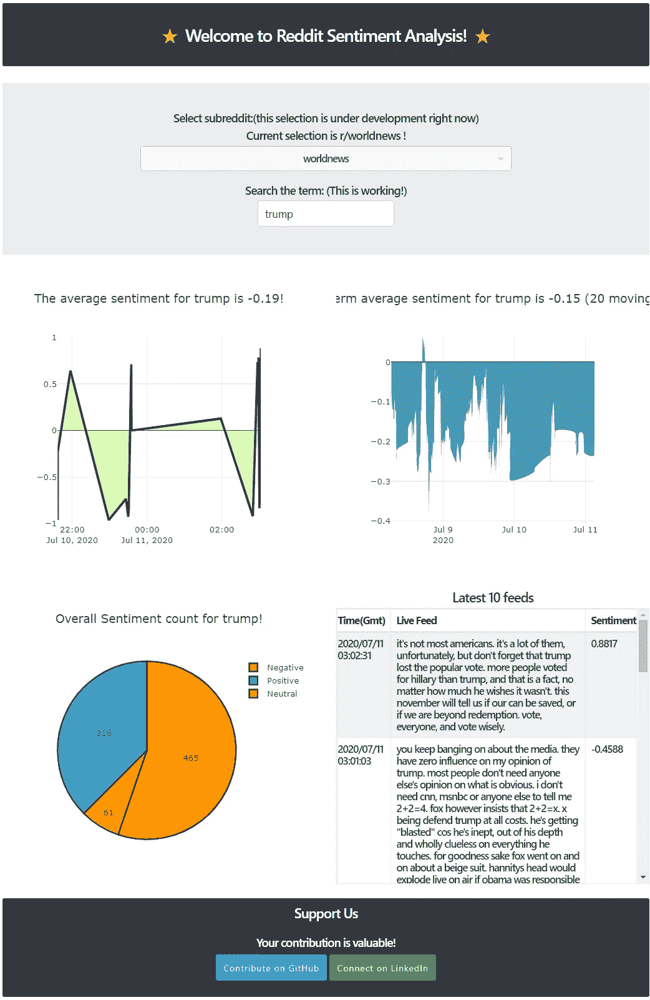

# 实时 Reddit VADER 情绪分析，用于“世界新闻”子编辑中的术语跟踪！

> 原文：<https://towardsdatascience.com/real-time-reddit-vader-sentiment-analysis-for-term-tracking-in-worldnews-subreddit-bbd366d477c0?source=collection_archive---------40----------------------->

## 使用流式 Reddit API 和 Python 中的 PRAW、POSTGRESQL 和 Dash 收集 Reddit 数据。


在这个简短的教程中，我们将学习如何使用 Python 中的 Reddit API 从 Reddit 中提取实时 7 流数据，并应用情感分析。Reddit 拥有庞大的用户群([近 4.5 亿](https://www.statista.com/statistics/272014/global-social-networks-ranked-by-number-of-users/))，其中最活跃的子编辑之一是“ [worldnews](https://www.reddit.com/r/worldnews/) ”。([近 2500 万用户](https://redditmetrics.com/top))。能知道这个大平台上的人都在说什么，挺好的。



[http://sentiment-reddit.herokuapp.com/](http://sentiment-reddit.herokuapp.com/)

你可以在你的电脑上试试这个 [**代码**](https://github.com/ZeroPanda/Reddit-Sentiment) **。**

**第一步:**

第一件事就是在你的 Reddit 账户上设置一个应用程序。Felippe Rodrigues 有一个很好的教程教你如何去做。一旦掌握了以下信息，就可以直接转向 python 了。

```
reddit = praw.Reddit(client_id='PERSONAL_USE_SCRIPT_14_CHARS', \
                     client_secret='SECRET_KEY_27_CHARS ', \
                     user_agent='YOUR_APP_NAME', \
                     username='YOUR_REDDIT_USER_NAME', \
                     password='YOUR_REDDIT_LOGIN_PASSWORD')
```

**第二步:**

如果你想在本地电脑上运行这个应用，你不需要这一步。是时候建立一个数据库帐户了。自从 Heroku 对 PostgreSQL 有了很大的支持，我就开始用 PostgreSQL 了。在 Heroku 上创建一个应用程序，并设置数据库。格雷戈里在这方面有很好的指导。一旦你有了凭证，你就可以填写`app.py`和`reddit_stream.py`。

`conn = psycopg2.connect(host = *****.compute-1.amazonaws.com, database = *********, password = ********)`

**第三步:**

安装`requirements.txt`中的所有要求

在`app.py`和`reddit_stream.py`中填入`conn`和`reddit`的值。在您的本地计算机上，在命令提示符下运行 Reddit 流应用程序，只需使用

`python reddit_stream.py`

上面的脚本从 Reddit 流直播线程，该线程的评论和回复，并使用 VADER 情绪分析器提供情绪得分。我们使用复合情感评分来存储和显示。

当脚本运行且数据库填满时，让我们现在显示我们的应用程序。为此，只需在服务器上运行应用程序。对此代码使用另一个命令提示符。

`python app.py runserver`

在应用程序中进行修改，以显示您想要的图表。Dash 有一些漂亮的图表、制作精良的文档和一个不错的社区来帮助你。

**结论**

我们从 Reddit 上搜集数据，对文本进行 VADER 情感分析。我们使用 PostgreSQL 保存数据，使用 Dash 应用程序显示和部署我们的应用程序。如果你认为你可以做得更好，请给它一个机会。

# **资源:**

 [## 实时 Reddit 监视器

### 编辑描述

sentiment-reddit.herokuapp.com](http://sentiment-reddit.herokuapp.com/) [](https://github.com/ZeroPanda/Reddit-Sentiment) [## zero panda/Reddit-情绪

### 第一个命令 pmt 类型- python Reddit_Stream.py 第二个命令 pmt 类型-python app . py runserver Live-streaming 情操…

github.co](https://github.com/ZeroPanda/Reddit-Sentiment)