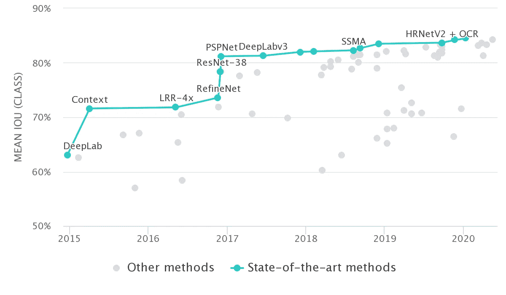
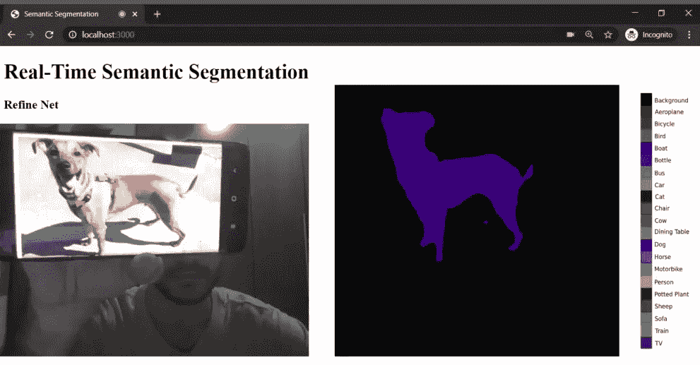

# 使用 TensorFlow.js 在浏览器中进行实时语义切分

> 原文：<https://towardsdatascience.com/real-time-semantic-segmentation-in-the-browser-using-tensorflow-js-e2e00a185139?source=collection_archive---------30----------------------->

## 直接从浏览器执行语义分段。不需要复杂的库或强大的计算机。

语义分割是检测和描绘图像中出现的每个感兴趣对象的问题。目前，有几种方法可以解决这个问题并产生如下结果。

图 1:语义分割示例([来源](http://host.robots.ox.ac.uk/pascal/VOC/)

这种分割是预测图像中的每个像素，也称为密集预测。需要注意的是，同一个类的实例没有被分开，模型只关心像素的类别。如图 1，方法可以说某些位置有椅子，但不能区分。

这项技术的主要应用之一是在自动驾驶汽车中，汽车需要了解他们的环境。语义分割能够为场景赋予一种意义，并将汽车置于上下文中，指示车道位置，如果有一些障碍物，如倒下的树木或行人穿过道路，并识别其他汽车。

视频 1:自动驾驶的语义分段示例

因此，在城市街道场景中应用语义分割算法是当今计算机视觉的主要挑战之一。评估模型性能的一个流行数据集是[城市景观](https://www.cityscapes-dataset.com/dataset-overview/)。它包括来自 50 个不同城市的 30 个班级，根据季节和天气情况而变化。

图 2 显示了随着时间的推移，不同的算法如何在这个数据集中达到最先进的水平。

图 Cityscapes 数据集上的语义分割([来源](https://paperswithcode.com/sota/semantic-segmentation-on-cityscapes))

在这个项目中，使用了一个中级模型，它可以提供合理的精度并实时运行。RefineNet [2]于 2016 年底首次从阿德莱德大学的研究中推出，并于 2018 年转换为轻量级模型[3]，允许实时推理。

# TensorFlow.js

TensorFlow 是一个开源库，广泛用于创建机器学习模型，主要在 python 项目中。Tensorflow.js 的出现使得同样的模型开发、训练和测试可以在浏览器中进行。

ML 在浏览器中运行意味着从用户的角度来看，不需要安装任何库或驱动程序。只要打开一个网页，程序就可以运行了。此外，它可以运行 GPU 加速。TensorFlow.js 自动支持 WebGL，在有 GPU 可用的情况下会在后台加速代码。用户也可以从移动设备打开你的网页，在这种情况下，你的模型可以利用传感器数据，比如来自陀螺仪或加速度计的数据。最后，所有数据都保留在客户端，这使得 TensorFlow.js 对于低延迟推理以及隐私保护应用程序非常有用[4]。

# 权重文件

TensorFlow.js layers 格式是一个目录，包含一个`model.json`文件和一组二进制格式的分片权重文件。`model.json`文件包含了模型拓扑(又名“架构”或“图形”:层的描述以及它们是如何连接的)和权重文件的清单[5]。

JSON 权重在轻量级 RefineNet 存储库中提供[6]，但是也可以将 PyTorch 或 Keras 模型转换为 TensorFlow.js 格式[7]。

# 服务 TensorFlow.js 模型

Tensorflow.js 模型必须通过一个 URL 提供服务，并以 javascript 加载。如前所述，该模型基于一个主 JSON 文件和二进制格式的分片权重文件。想法是创建一个 HTTP 服务器，它将使模型在一个允许请求的 URL 中可用，并作为 REST API 被线程化。加载模型时，TensorFlow.js 将执行以下请求:

可以使用以下命令安装 [http-server](https://www.npmjs.com/package/http-server) :

`npm-install http-server -g`

一旦安装了程序，您就可以进入您的 weights 文件夹并运行以下命令来服务您的模型:

`http-server -c1 --cors .`

然后，下面这段代码将加载 tensorflow.js 模型。

# 做预测

一旦模型加载完毕，进行预测的过程就相当简单了。你必须加载一个框架，并使用`model.predict(frame)`命令从模型中获得预测。返回的是一个 PASCAL VOC 格式的帧，必须进行转换和渲染，可以在[项目库](https://github.com/hugozanini/realtime-semantic-segmentation)中找到代码。

我决定创建一个简单的应用程序，从网络摄像头读取一帧，并生成语义分段，如下例所示:

图 3:细化网络——语义分割示例

为了在现实场景中测试该项目，我在手机上下载了一些图片来填充算法，下面的视频显示了应用程序在浏览器中实时运行:

视频 2:浏览器中的实时语义分割

该应用程序有一个小的延迟，主要是由于帧重建时间，但总体结果相当不错。TensorFlow.js 开启了许多可能性，允许需要强大计算机和复杂库的机器学习模型可以在浏览器中平稳运行，并使用少量计算资源。

运行项目的所有源代码和指令都可以在 [GitHub](https://github.com/hugozanini/realtime-semantic-segmentation) 找到。如果您有任何问题或建议，可以通过 [Linkedin](https://www.linkedin.com/in/hugozanini/?locale=en_US) 联系我。

感谢阅读:)

# 参考

[1] Romera-Paredes，Bernardino 和 Philip Hilaire Sean Torr。"循环实例分段."*欧洲计算机视觉会议*。施普林格，查姆，2016。

[2]林，，等.“Refinenet:面向高分辨率语义切分的多路径精化网络”IEEE 计算机视觉和模式识别会议论文集。2017.

[3]涅克拉索夫、弗拉迪米尔、沈春华和伊恩·里德。“轻量级 refinenet 用于实时语义分割。” *arXiv 预印本 arXiv:1810.03272* (2018)。

[4]中等。2020.*介绍 Tensorflow。js:Javascript 中的机器学习*。【在线】可在:<https://medium . com/tensor flow/introducing-tensor flow-js-machine-learning-in-JavaScript-BF 3 eab 376 db>【2020 年 6 月 3 日访问】。

[5][https://www . tensor flow . org/js/tutorials/conversion/import _ keras](https://www.tensorflow.org/js/tutorials/conversion/import_keras)

[https://github.com/DrSleep/light-weight-refinenet](https://github.com/DrSleep/light-weight-refinenet)

[https://www.tensorflow.org/js/guide/conversion](https://www.tensorflow.org/js/guide/conversion)