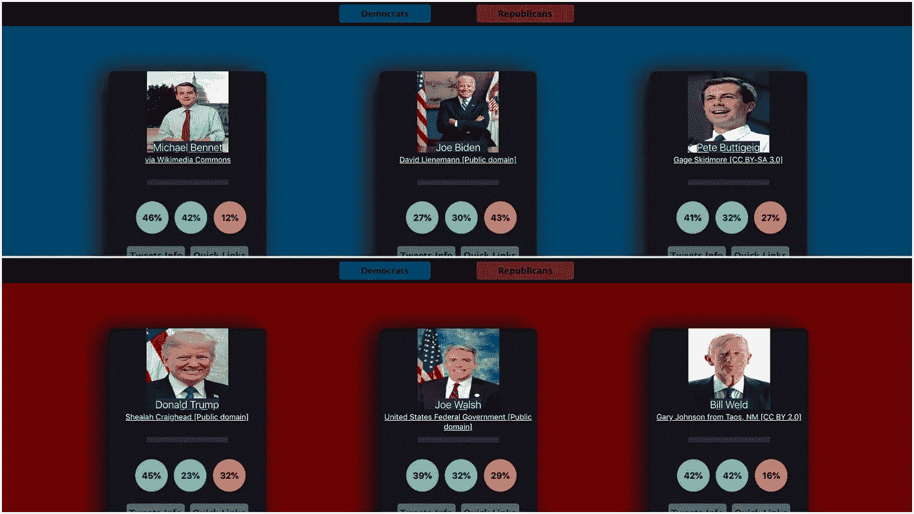
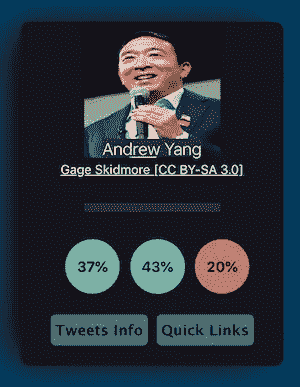
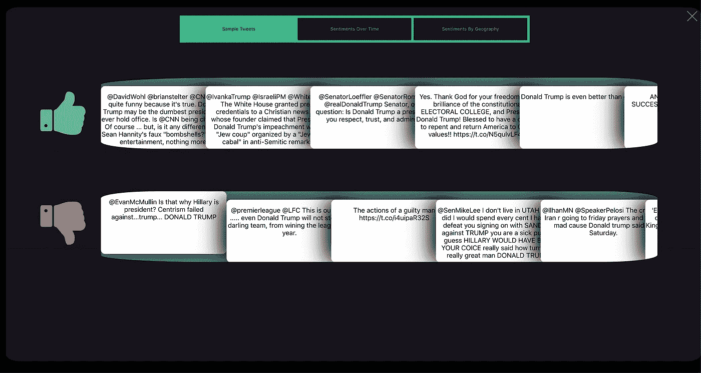
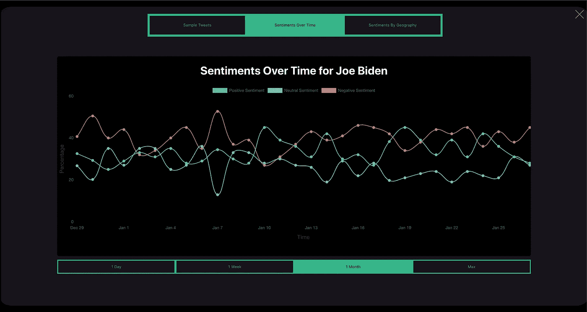
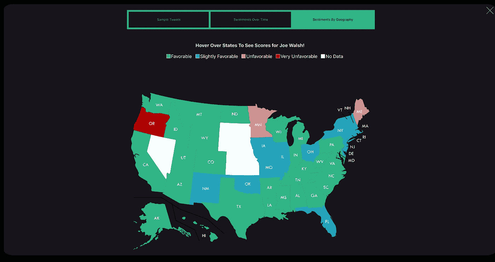
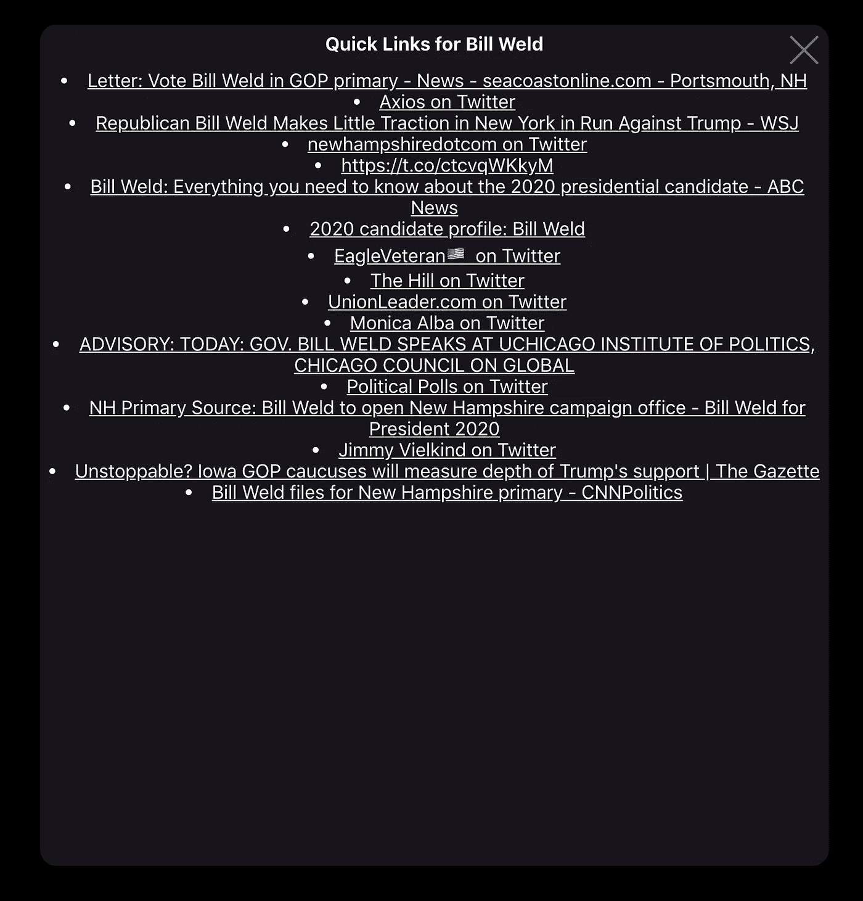
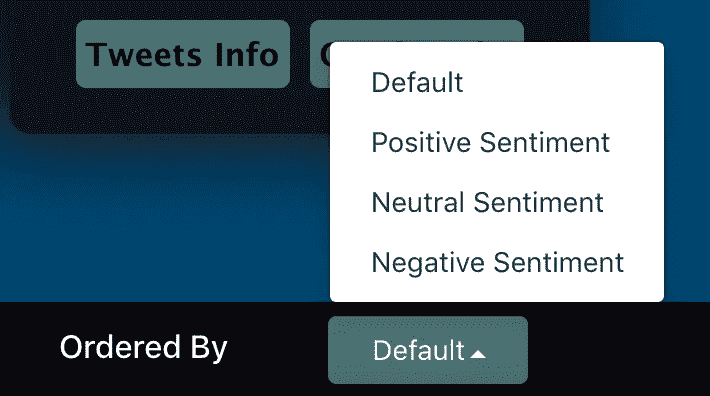

# 通过电子推板进行实时情绪分析和可视化

> 原文：<https://towardsdatascience.com/real-time-sentiment-analytics-and-visualization-via-electiontweetboard-43ff96d358d6?source=collection_archive---------29----------------------->

## 通过推特情感分析分析 2020 年总统选举

这篇文章将通过深入研究我最近开发的一个名为 election tweet board([https://www.electiontweetboard.com/](https://www.electiontweetboard.com/))的产品，来探索数据分析、可视化以及机器学习的各种形式和考虑因素。

## 电子推特背后的“为什么”

每一个数据科学或者 AI 相关的项目，背后都需要强大的驱动力。出于真正的好奇心，我开发了 ElectionTweetBoard，以了解更多关于公众对即将到来的总统选举中的顶级候选人的看法，以及这些看法与媒体对候选人的报道有多相关。

由于 Twitter 是收集实时用户生成数据的一个非常好的来源，我决定设计一个自动化的工作流程来获取推文，然后分析这些推文的情绪。从这个最初的起点，该产品已经发展到还包括一个“快速链接”部分，自动策划最相关的文章对每个候选人。

## 经由候选卡的情感分布数据可视化

该网站仪表板的第一个突出的主要组件是个人候选人卡片，这些卡片总结了从当前一组推文中提取的当前情绪分布。绿色、蓝色和红色圆圈分别代表阳性、中性和阴性的百分比。

这里主要考虑的是让代表每一类情感的颜色有清晰的含义。绿色和红色是显而易见的选择，因为它们出现在成功和错误消息中，以及像交通灯这样的常见设备中。另一方面，浅蓝色是一种中性色，整体饱和度较低。我试图在整个应用程序中保持这种配色方案。

每个候选卡还有两个按钮，链接到两个独立的弹出模式。Tweets Info 模式旨在以定性和定量的方式显示正在进行的 tweet 情感分析的结果，而 Quick Links 模式为每个候选人挑选最相关的链接。下面让我们更深入地探讨这两个组件:

# 推特模式

Tweets 模式由三个部分组成，每个部分侧重于显示特定类别的数据:

*   **样本推文**
*   **感情随时间推移**
*   **地理情感**

## 通过样本推文进行定性数据分析

Tweets 模式的 Sample Tweets 选项卡显示了每个候选人最新的正面和负面 Tweets 的示例。这样做的目的是让用户更好地了解人们在特定时间点对特定候选人的评价。

## 通过随时间推移的情感的时间序列数据可视化

现在，示例 Tweets 选项卡侧重于提供最相关的实时定性数据，而随着时间推移的情绪选项卡深入显示不同时间段不同类别的情绪趋势。这种分析通常被称为时间序列分析。

通过将前面提到的通过样本推文进行的定性数据分析与上面的时间序列情绪分析相结合，人们可以开始更好地了解某些事件/决策如何与公众情绪相关联。

## 基于地理情感的地理数据可视化

Tweets 模型的第三个也是最后一个部分——按地理划分的情感，重点是提供基于州的情感分析。目前，颜色编码是基于每个给定州的推文中表达的积极或中性情绪的百分比。

## 进一步探索的起点

ElectionTweetBoard 背后的主要目的是通过公众情绪的视角增加对选举最新发展的实时了解，然而，它也是通过其快速链接部分进行进一步探索的宝贵起点。

Quicks Links 是一个实时新闻聚合器，它根据公众的意见提醒用户最新和最相关的新闻文章、视频和照片。

## 根据各种指标进行排序

ElectionTweetBoard 还提供了一个易于访问的下拉列表，可以根据各种指标对候选人进行排序。目前，候选卡可以根据积极、中立和消极情绪进行分类，使用户能够挑选他们希望重点分析的特定顺序。这也是一种有效的方式，为用户第一次进入网站时看到的默认的、开箱即用的排序提供替代。

## 结论

随着预选会议即将开始，竞选活动日益升温，现在是查看 https://www.electiontweetboard.com/选举推板的好时机。它将帮助您了解最新发生的事情，并通过上面强调的数据科学和机器学习功能进一步分析这些事情！

## 相关链接

链接到选举推板:【https://www.electiontweetboard.com/ 