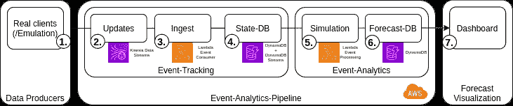
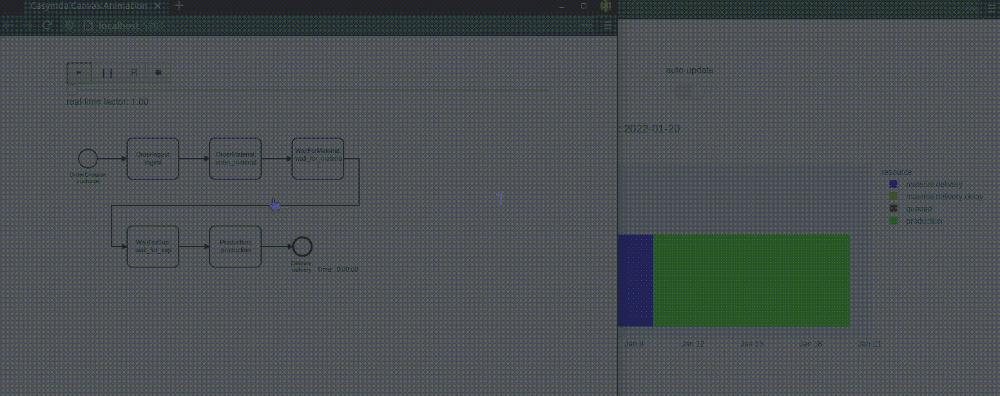
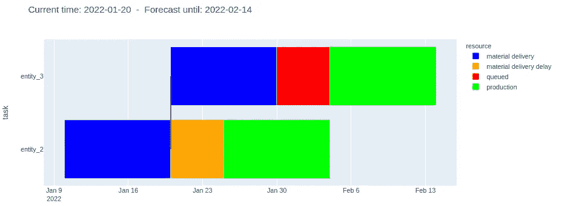

# 基于实时模拟的分析服务

> 原文：<https://towardsdatascience.com/real-time-simulation-based-analytics-services-3b1f722ebd14?source=collection_archive---------24----------------------->

## 在 AWS 上使用 SimPy 进行概念验证，英尺。Terraform 和本地堆栈


沃尔夫冈·哈塞尔曼的照片

在他最近发表的非常有趣的[博士论文(德语)](http://nbn-resolving.de/urn:nbn:de:bvb:29-opus4-145483)中，来自埃尔兰根-纽伦堡大学的 Toni Donhauser 给出了一个很好的例子，说明了生产同步数字双胞胎如何用于砖石工厂的自动化、基于模拟的订单调度。作为一项核心功能，开发的模拟允许初始化制造系统的*在制品*，以精确反映当前状态并创建准确的短期预测，作为在意外中断情况下比较替代方案和优化生产计划的基础。 [Tecnomatix Plant Simulation(西门子)](https://www.plm.automation.siemens.com/global/de/products/manufacturing-planning/plant-simulation-throughput-optimization.html)用于仿真模型的实现。

由于 *Plant Simulation* 以广泛的功能和广泛的许可费用而闻名，这篇博客文章将介绍这种生产同步数字双胞胎的替代实现，基于开源框架并建立在易于操作、按使用付费的 AWS 基础设施上。可以使用 *Docker* 、 *Terraform* 和 *LocalStack* 在本地部署和测试完整的设置(不需要 AWS 帐户)。

> *从 github 获取回购:*[*https://github . com/fladdimir/CsA-simulation-based-sc-forecast*](https://github.com/fladdimir/csa-simulation-based-sc-forecast)

# 场景和范围

下图显示了一个虚构的简化订单处理流程，并将作为一个最小的示例来说明如何实现系统的数字孪生。


简单的订单处理流程

创建后，公司接收并接受订单(*摄取*-步骤)，订购订单特定的原材料(*订单 _ 材料*)，让订单等待，直到相应的材料到达(*等待 _ 材料*)。物料交付后，订单进入缓冲队列( *wait_for_sop* )，等待在产能受限的*生产*步骤中处理，该步骤一次只能处理一个订单。最终，完成的订单被交付给客户并离开系统。

每当请求订单的物料时，会分配一个初始预计到达时间(ETA)。然而，意外的供应商特定流程偏差或其他交付问题可能会在任何时间点引入延迟，因此在订单等待材料交付时，ETA 更新是可能的。由于生产步骤使用受能力限制的资源，并代表系统的一个可能的瓶颈，这里任何计划外的利用不足都可能延迟每个即将到来的订单，并减少系统吞吐量(取决于时间表看起来有多紧)。因此，一旦订单的任何 ETA 更新发生，就希望能够量化任何时间偏移的影响。

# 同步数字孪生:概念和实现

下图显示了一个简单的事件处理管道，能够接收定义的事件并保持系统状态(*事件跟踪*)，这反过来又能够基于模拟创建对预期订单完成时间和延迟的预测(*事件分析*)。一个简单的网络仪表板将用于可视化的结果。



基于模拟的预测创建的处理流程(图标由 [AWS](https://aws.amazon.com/de/architecture/icons/) 提供)

## 1.数据生产者的发布事件

在生产系统中处理订单的过程中，数据生产者发布进度信息，例如订单处理步骤的开始或结束。虽然这些事件实际上会在物理制造系统中发生，但在开发过程中可能会使用模拟模型来创建数字双胞胎的测试数据(参见*虚拟调试* 上的这篇[帖子，了解物流模拟用例的另一个示例)。](https://fladdimir.github.io/post/csa-vcom/)

## 2.使用 AWS Kinesis 捕获事件

[Kinesis](https://docs.aws.amazon.com/streams/latest/dev/key-concepts.html) 是一个 AWS 服务，用于连续缓冲和实时处理流数据。Kinesis 流分离了数据生产者和消费者，由可配置数量的*碎片*组成，每个碎片每秒能够摄取高达 1 MB 或 1000 条记录的数据。每个记录根据其指定的*分区键*值放入一个碎片中，这变得很重要，因为记录的有序处理[只在分区键级别](https://aws.amazon.com/blogs/compute/new-aws-lambda-scaling-controls-for-kinesis-and-dynamodb-event-sources/)上得到保证。
在所描述的场景中，有序处理对于订单的 ETA 更新变得至关重要，因为预期延迟的消息不能在任何更早提交的更新之前处理。

## 3.用 AWS Lambda 处理事件

[Lambda](https://aws.amazon.com/lambda/?nc1=h_ls) 是 AWS 提供的功能即服务，允许按需运行代码，为调用次数和执行时间付费。Lambda 函数可以很容易地与其他服务耦合，比如 SQS 和 DynamoDB。由于 AWS 按需提供函数运行时，NodeJS 和 Python 的短冷启动时间使它们成为实现 lambdas 的流行选择。
为处理订单更新而实现的 lambda 很简单，只需用调用中提供的事件数据更新指定 DynamoDB 表中受影响订单的相应项目。

## 4.用 DynamoDB 保持系统状态

[DynamoDB](https://docs.aws.amazon.com/amazondynamodb/latest/developerguide/Introduction.html) 用作快速、灵活和可管理的 NoSQL 数据库。虽然这种类型的数据库在设计上缺乏关系数据库的一些便利性(例如在数据库级别上实施引用完整性的适当方法，或者复杂 ORM 和模式管理工具的可用性)，但它对于我们只涉及更新单个项目和基本查询的简单用例来说是很好的。DynamoDB 需要一个分区键和一个可选的范围键，两者结合使用可以唯一地标识一个存储项。对于订单，字符串 id 可用作分区键。DynamoDB 的一个很好的特性是启用*流*，自动提供表更新信息。这样，订单 ETA 更新可以触发新的预测。

## 5.模拟未来

AWS 允许使用 Lambda 函数作为 DynamoDB 流事件消费者，因此模拟运行可以预测每个状态变化的未来订单完成时间。对于每次运行，从 DynamoDB 中获取当前系统状态(这实际上可能需要多次请求，因为单次扫描只能返回一页最多 1 MB 的数据)。
基于注册的过程时间戳，可以识别每个订单的当前相关过程步骤。
使用 [Casymda](https://fladdimir.github.io/post/casymda/) 从上图所示的流程图生成仿真模型。为了概念证明的简单性，处理时间被假定为确定性的。实施模型块是为了说明*在制品*实体在模拟开始时已经经过的处理时间(初始化*在线模拟*模型的可能性之一，在 [Hanisch 和 Tolujew，2005](https://informs-sim.org/wsc05papers/222.pdf) 的经常引用的论文中讨论，并由 [Hotz，2007](https://d-nb.info/987148664/34) 进一步探讨)。在执行过程中，以预测流程步骤完成时间的形式收集预测指标。
目前，AWS 允许 Lambda 函数的执行时间长达 15 分钟，因此即使复杂的模型也可以这样运行。然而，频繁且长时间运行的计算可能会使创建专用服务更有吸引力。

## 6.+ 7.预测持久性和可视化

在每次运行结束时，收集的结果被保存在第二个 DynamoDB 表中，仪表板应用程序可以从这个表中访问和可视化数据。
[Plotly Dash](https://github.com/plotly/dash) 是一个流行的网络应用分析框架。只需编写 Python 代码，就可以快速创建动态仪表板。在引擎盖下，它使用[烧瓶](https://flask.palletsprojects.com/en/1.1.x/)将[带有](https://dash.plotly.com/react-for-python-developers)[图表](https://github.com/plotly/plotly.js/)的网站反应给浏览器。使用 Python 在后端完成数据查询和分析。实现的仪表板只包含一个简单的甘特图。使用 *interval* -callback 循环轮询数据库更新来实现自动仪表板刷新。dashboard 的 Docker 容器可以在 AWS 上运行(例如 ECS/Fargate，但是由于 LocalStack 的免费版本不包括这一点，所以它只是在本地运行以供演示)。

# 结果

要从克隆的存储库中本地运行设置，需要安装 Docker 和 Terraform。
尽管性能无法与实际的云服务相提并论， [LocalStack](https://github.com/localstack/localstack) 是在本地模拟众多 AWS 服务的绝佳选择，包括 Kinesis、Lambda 和 DynamoDB。LocalStack 可以在 Docker 容器中启动，根据需要生成更多的容器，例如用于执行 Lambdas:

```
docker-compose up localstack
```

在部署 Lambda 函数之前，需要打包函数代码及其依赖项:

```
docker-compose up package-ingest-lambda package-simulation-lambda
```

[Terraform](https://www.terraform.io/) 是一个伟大而广泛使用的工具，它可以自动提供配置文件中描述的基础设施资源(但是，请看一下[这篇文章](https://itnext.io/things-i-wish-i-knew-about-terraform-before-jumping-into-it-43ee92a9dd65)中更细致的分析)。要创建所有需要的资源，需要在相应的目录中使用两个 terraform 命令:

```
cd terraform
terraform init # (only required once)
terraform apply
# (enter 'yes' when prompted to confirm the changes,
# or use -auto-approve)
cd ../ # return to project root
```

(为了防止在没有调用`terraform destroy`的情况下重启 LocalStack 后调用`apply`时出现 404 错误，首先删除`main.tf`旁边的`terraform.tfstate`文件。)

成功创建后，可以启动另外两个容器，一个服务于仪表板，另一个运行模拟模型来模拟真实的事件生成器:

```
docker-compose up dashboard emulation
```

在(重新)开始任何试运行之前，需要清除 DynamoDB 表:

```
docker-compose up truncate-tables
```

[http://localhost:8050](http://localhost:8050/) 现在应该显示空的仪表板，而 [http://localhost:5001](http://localhost:5001/) 应该显示 Casymda web canvas 动画控件。

# 样品流

开始模拟时，订单将在源位置创建，并流经定义的流程。同时，仪表板应稍有延迟地更新，并显示系统(y 轴)中当前所有订单的相关流程步骤的完成时间(x 轴)。图表中的垂直线表示模拟运行开始和预测创建的时间点。



仿真模型和预测仪表板的截屏

当*订单-2* 的预期未来物料交付延迟发生时，会产生一个有趣的情况(橙色):



订单 2 的预期物料交付延迟(橙色)对订单 3 的预测影响(红色)

由生产步骤的能力限制引起(最大。一个订单并发)*订单-2* 的延迟(橙色)预计也会延迟*订单-3* 的开始生产(红色)。

虽然给出的例子很简单，但是可以想象出很多扩展。从商业角度来看，研究一个更复杂的过程是很有意思的，例如包括原材料库存和不同的补充策略。类似地，可以评估随机或计划的机器维护间隔的影响。这可能还要求自动确定最佳决策备选方案，例如考虑订单特定的到期日或吞吐量目标。有趣的技术扩展可能包括对摄取的事件数据进行初步分析，使用流处理解决方案，如 *AWS Kinesis 数据分析*，以便识别相关模式并仅在关键流程偏差的情况下触发预测/优化运行。