# 使用 SpaCy、Kafka 和 Seldon 核心的大规模实时机器学习

> 原文：<https://towardsdatascience.com/real-time-stream-processing-for-machine-learning-at-scale-with-spacy-kafka-seldon-core-6360f2fedbe?source=collection_archive---------14----------------------->

## 这是一个实践教程，讲述了如何使用 Reddit 评论审核数据集训练机器学习模型，并使用 Kafka 和 Seldon Core 将其部署在可扩展的基础架构中

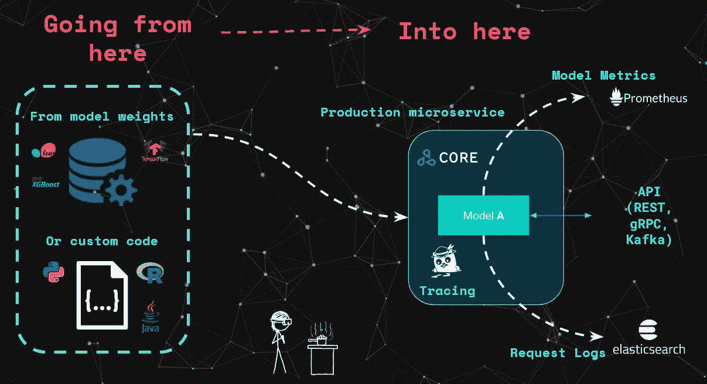

使用 Seldon Core 进行流处理的模型部署(图片由作者提供)

在本帖中，我们将介绍如何为自动文本预测用例训练和部署利用可扩展流处理架构的机器学习模型。我们将使用 [Sklearn](https://github.com/scikit-learn/scikit-learn) 和 [SpaCy](https://spacy.io/) 从 Reddit 内容审核数据集训练一个 ML 模型，我们将使用 Seldon Core 部署该模型，以实时处理来自 Kafka 实时流的文本数据。你还可以在这篇文章中找到视频形式的内容概述，在 NLP Summit 2020 上展示。

实时机器学习视频(NLP 峰会 2020)

您可以在以下链接中找到本文的完整代码:

*   [谢顿模型集装箱化笔记本](https://docs.seldon.io/projects/seldon-core/en/latest/examples/sklearn_spacy_text_classifier_example.html)
*   [Reddit 数据集探索性数据分析笔记本](https://github.com/axsaucedo/reddit-classification-exploration/)
*   [卡夫卡谢顿核心流处理部署笔记本](https://github.com/SeldonIO/seldon-core/blob/master/examples/kafka/sklearn_spacy/README.ipynb)

# 使用 SpaCy & Sklearn 进行模型训练

对于这个用例，我们将使用 [Reddit /r/science 内容审核数据集](https://www.kaggle.com/areeves87/rscience-popular-comment-removal/kernels)。这个数据集由超过 200，000 条 reddit 评论组成，主要根据评论是否被版主删除来标记。我们的任务是训练一个 ML 模型，它能够预测 reddit 版主已经删除的评论。

SpaCy 是用于生产文本处理用例的最受欢迎和最活跃的 NLP 库之一，它提供了“工业级”功能，包括标记化、NER、深度学习集成以及跨广泛语言模型的更多功能。同样，Sklearn 是 Python 中最流行的机器学习工具包。我们将使用这两个框架进行探索性数据(和模型)分析，以及训练我们的机器学习模型。

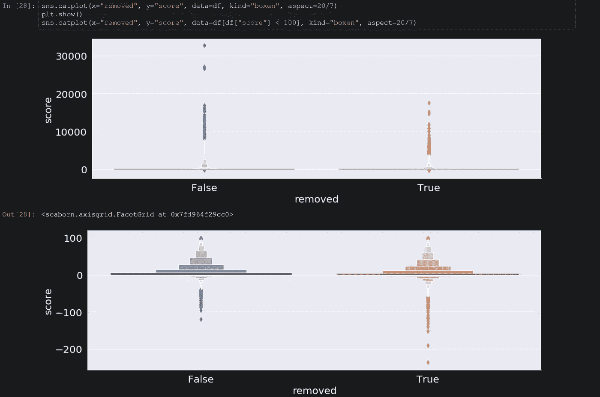

探索性数据分析笔记本(图片由作者提供)

当涉及到构建机器学习模型时——特别是当它被部署到生产系统时——使用[原则和最佳实践](https://ethical.institute/principles.html)来确保其负责任的设计、开发和运营是很重要的。

算法对比图(图片由作者提供)

您将能够在[模型培训](https://github.com/axsaucedo/reddit-classification-exploration/blob/master/Data%20Preprocessing.ipynb)笔记本中找到[探索性数据分析](https://github.com/axsaucedo/reddit-classification-exploration/blob/master/Exploratory%20Data%20Analysis.ipynb)的最佳实践和技术。这些包括特征工程、数据分布、数据不平衡、数据清理、算法性能比较、标记化方法、部分依赖图等。

这些技术使数据科学家和工程师能够为机器学习模型的培训、部署甚至生产监控确定特定领域的最佳实践。

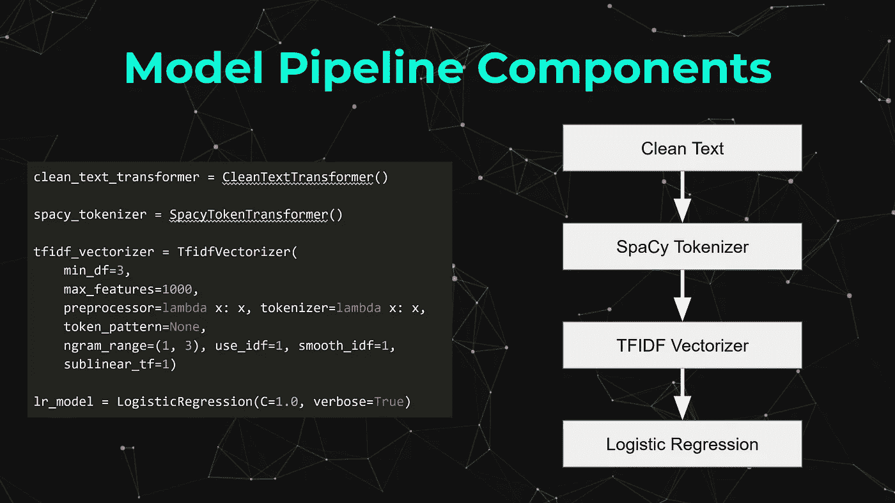

基本 NLP 管道(图片由作者提供)

在本教程中，我们将使用 [Sklearn](https://scikit-learn.org/stable/) 和 [SpaCy](https://spacy.io/) 构建机器学习管道。如上图所示，我们在管道中使用了以下组件:

*   `CleanTextTransformer` —通过删除相关字符、符号和重复短语来清除输入文本
*   `SpacyTokenTransformer` —使用 SpaCy 将输入文本转换为标记，并删除相关标记，如停用词
*   `TfidfVectorizer` —将令牌转换为模型可以处理的向量
*   `LogisticRegression` —在我们当前数据集上训练的逻辑回归模型

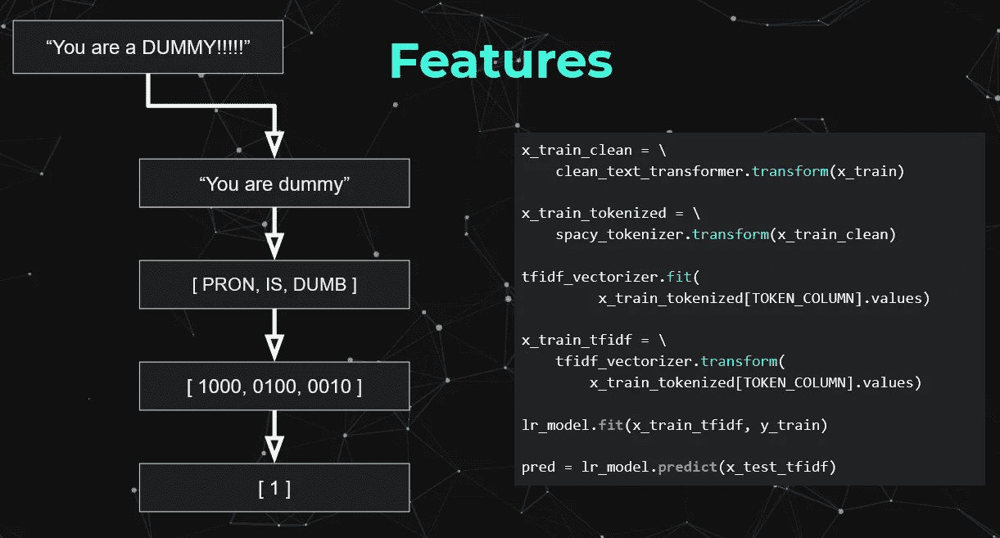

模型推理阶段(图片由作者提供)

为了更直观地了解我们的模型将如何处理数据，上图显示了文本数据输入实例在每个阶段是如何转换的。更具体地说，如果我们接收到一个短语，它将通过每个管道组件发送，直到我们能够接收到一个预测。

一旦我们训练了我们的模型，我们将能够使用用于管道的相同代码，并且我们将导出使用`pickle`训练的模型的工件，这样我们可以在部署模型时加载它们。

# 具有谢顿核心的集装箱化模型

Seldon Core 可用于将我们的模型转换为可扩展的微服务，并使用 Seldon cloud 原生 kubernetes 操作员将其部署到 Kubernetes。使用 Seldon Core 部署的模型支持 REST 和 GRPC 接口，但从 1.3 版本开始，它还支持原生 kafka 接口，我们将在本文中使用。

采用塞尔顿核心的模型部署(图片由作者提供)

Seldon 提供了几种生产机器学习模型的方法。最常见的方法是使用现有的 [**预打包模型服务器** s](https://docs.seldon.io/projects/seldon-core/en/latest/servers/overview.html) 中的一个。然而，在这种情况下，我们将通过扩展默认的 [**sklearn 预打包服务器**](https://docs.seldon.io/projects/seldon-core/en/latest/servers/sklearn.html) 来添加 SpaCy 及其各自的英语语言模型，从而构建我们自己的 [**定制模型服务器**](https://docs.seldon.io/projects/seldon-core/en/latest/servers/custom.html) 。

为了用 Seldon 封装我们的模型，我们将使用 [**Python 语言包装器**](https://docs.seldon.io/projects/seldon-core/en/latest/python/python_wrapping_s2i.html) 遵循标准的 Seldon 核心工作流程。如下图所示，将模型装箱所需的标准步骤如下:

*   创建一个 **Python 包装类**来公开模型逻辑
*   通过`requirements.txt`文件添加 **Python 依赖关系**
*   添加**协议、日志级别等环境参数**
*   可选地添加任何带有 Dockerfile 扩展名的**进一步依赖关系**

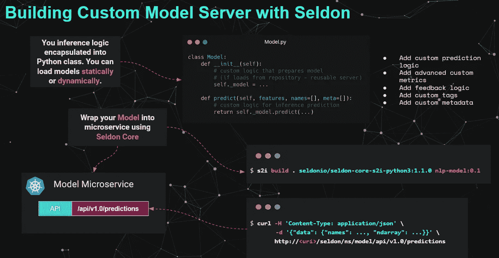

集装箱模型所需的标准步骤(图片由作者提供)

在我们的例子中，我们只需要定义一个 Python 包装器，它由以下部分组成:

*   导入本文培训部分使用的 ML 管道的代码
*   一个加载模型工件的`__init__`方法
*   每次发送请求时被调用的`predict`方法

包装器的代码可以在下图中找到，或者你可以找到完整的 [Jupyter 笔记本](https://docs.seldon.io/projects/seldon-core/en/latest/examples/sklearn_spacy_text_classifier_example.html)来训练、装箱和测试谢顿包装模型。

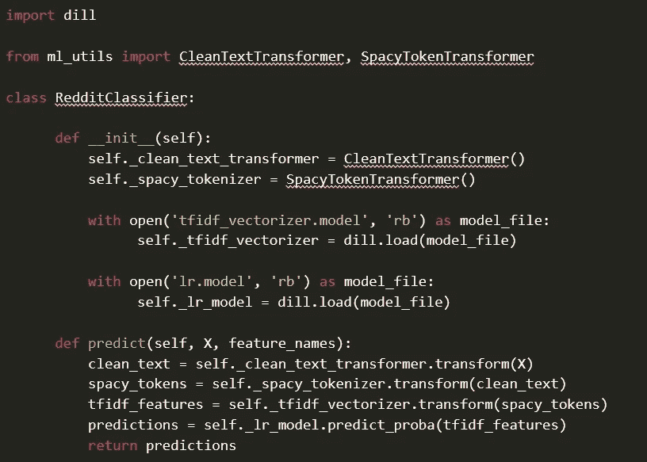

一旦有了包装器，我们就能够使用`s2i` CLI 简单地运行 Seldon 实用程序，即:

> `s2i build . seldonio/seldon-core-s2i-python3:1.3.0 nlp-model:0.1`

现在我们已经将我们的模型完全容器化为 image `nlp-model:0.1`,我们将能够在下一节中为流处理部署它。

# Kafka 流处理

谢顿模型支持 REST、GRPC 和 Kafka 协议——在本例中，我们将使用后者来支持流处理。

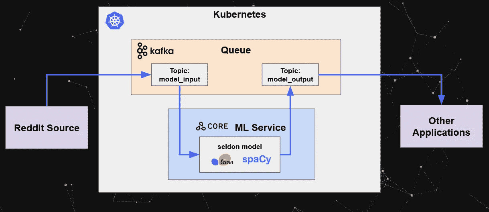

Kafka ML 处理架构(图片由作者提供)

您可以在示例中找到完整的 [jupyter 笔记本](https://github.com/SeldonIO/seldon-core/blob/master/examples/kafka/sklearn_spacy/README.ipynb)，其中包括部署文件以及请求工作流。

我们有以下组件:

*   **Kubernetes 集群** —我们所有组件将部署到的 Kubernetes 集群
*   **Reddit 源** —以 Reddit 评论流的形式产生输入数据的组件
*   **Kafka 队列**—Kafka 集群组件，将处理消费者和生产者提供的数据流
*   **Seldon ML 服务** —我们使用 Seldon 部署的容器化 reddit 分类器模型
*   **卡夫卡**
*   **卡夫卡** `**model_output**` **主题** —其他应用程序可以从中消费的输出主题
*   **其他应用程序** —在我们的例子中，这是一个单一用户应用程序，但是这可以包括任何其他想要使用`model_output`主题的应用程序

为了简单起见，我们将跳过设置 kubernetes 集群所需的步骤——包括设置 Kafka 代理和安装 Seldon Core——但是您可以在笔记本示例中找到完整的说明。

现在我们可以部署我们的模型了。为此，我们只需按照 SeldonDeployment 模式定义我们的部署配置文件:

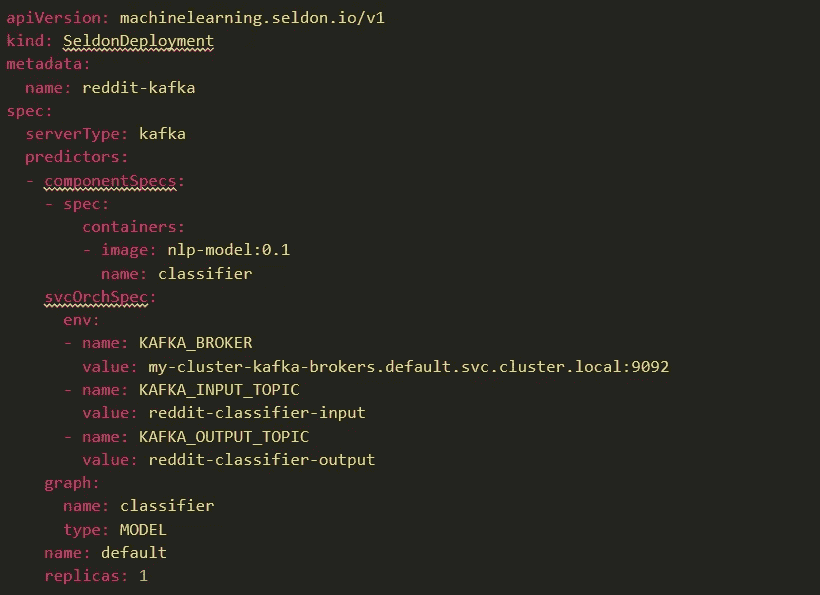

SeldonDeployment Kafka 配置文件(图片由作者提供)

正如您在配置 YAML 中看到的，该结构包含以下要点:

*   型号名称`name: reddit-kafka`
*   `graph.name: classifier`是我们将部署的型号
*   `serverType: kafka`使用 kafka 接口启用部署的微服务(与 REST 或 GRPC 协议相反)
*   `KAFKA_BROKER`卡夫卡经纪人的服务器
*   `KAFKA_INPUT_TOPIC`输入消费主题的名称
*   `KAFKA_OUTPUT_TOPIC`要生成的输出主题的名称

我们现在可以使用 kubectl 命令创建模型:

> `kubectl apply -f sdep_reddit_kafka.yaml`

一旦我们的模型被创建，我们现在可以将数据发送到输入主题中。我们可以通过使用`kafka-console-producer.sh`实用程序来实现。

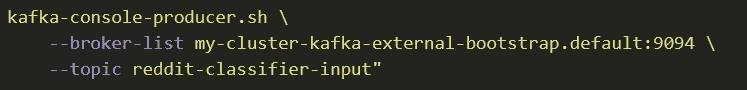

类似地，我们也可以监听模型产生的输出数据。

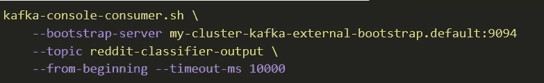

现在，当我们将输入数据发送到输入主题时:

> `{”data”: {”ndarray”: [”This is an input”]}}`

因此，我们会在输出主题流中看到预测:

> `{“data”:{“names”:[“t:0”,”t:1"],”ndarray”: [[0.6758450844706712, 0.32415491552932885]]},”meta”:{}}`

这样，我们现在有了一个部署在可扩展架构中的模型，用于实时机器学习处理——更具体地说，该架构允许每个相应组件的水平和垂直可扩展性。部署的模型可以扩展到可变数量的副本，以及基于 Kubernetes HPA 的自动扩展，后者可以根据资源使用情况进行水平扩展。类似地，Kafka 还可以通过代理的数量进行水平扩展，从而实现低延迟的大吞吐量。这可以在下图中更直观地看到。

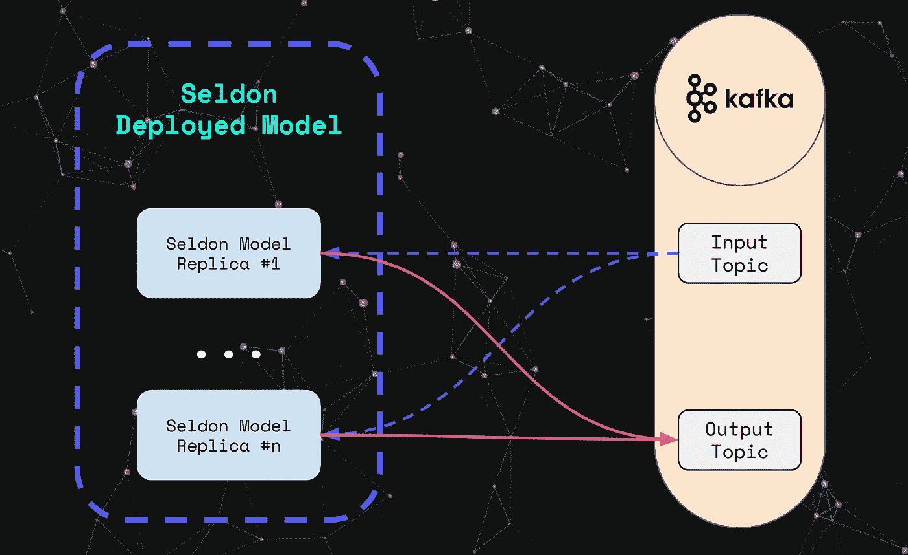

缩放副本和代理(图片由作者提供)

# 下一步是什么？

现在，您已经对核心架构组件有了直觉和理解，您现在能够深入研究实际的细节了。为此，您可以通过以下链接访问代码和资源:

*   [谢顿模型集装箱化笔记本](https://docs.seldon.io/projects/seldon-core/en/latest/examples/sklearn_spacy_text_classifier_example.html)
*   [Reddit 数据集探索性数据分析笔记本](https://github.com/axsaucedo/reddit-classification-exploration/)
*   [卡夫卡谢顿核心流处理部署笔记本](https://github.com/SeldonIO/seldon-core/blob/master/examples/kafka/sklearn_spacy/README.ipynb)

如果您有兴趣进一步了解机器学习模型的可扩展部署策略示例，您可以查看:

*   [利用 Argo 工作流程进行批处理](https://docs.seldon.io/projects/seldon-core/en/latest/examples/argo_workflows_batch.html)
*   [无服务器事件与 Knative](https://docs.seldon.io/projects/seldon-core/en/latest/streaming/knative_eventing.html)
*   [AI 用不在场证明解释模式](https://docs.seldon.io/projects/seldon-core/en/latest/analytics/explainers.html)