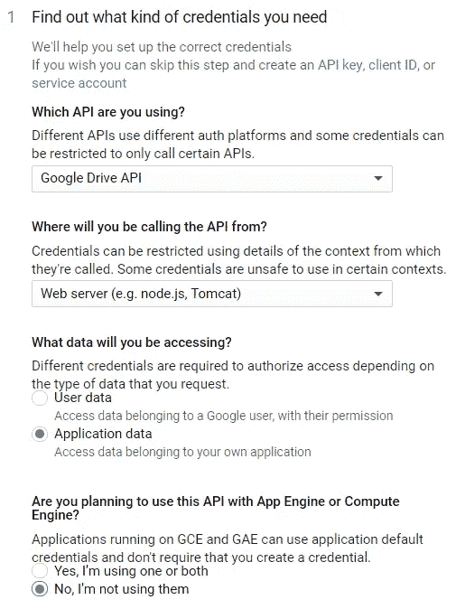

# 可定制的实时仪表板，以监控您的谷歌表单的反应

> 原文：<https://towardsdatascience.com/real-time-visualization-of-google-form-responses-in-streamlit-1e7fd20c6574?source=collection_archive---------26----------------------->

## 在 Streamlit dashboard 中可视化实时 Google 表单响应的分步指南

> 比方说，你的谷歌表单是共享给公众的。
> 
> 您希望在一个仪表板中监控响应的更新，该仪表板可以使用多个变量进行过滤，并显示在多变量图表中。
> 
> 此外，您希望它是实时的，并且可以与您的任何利益相关者共享。

很明显，你的谷歌表单中的“回复”部分不是这个场景的答案。在本文中，我将一步一步地介绍如何在 Streamlit dashboard 中可视化实时 Google 表单响应，从在 google sheets 中导入响应开始，直到部署仪表板。如上图所示，总共有 8 个步骤。

# 在 Google API 控制台中创建凭证

为了能够生成凭证，首先您必须在您的 [Google API 控制台中创建一个新项目。](https://console.developers.google.com/)

图 1:创建一个新项目

单击“新建项目”后，您必须指定项目的名称。保留默认位置。然后，单击“创建”来创建您的新项目。

图 2:给你的项目命名

完成创建新项目后，您将看到显示项目信息、API 请求信息等的仪表板。在仪表板的顶部，有一个 API 和服务的搜索栏。在搜索栏中，搜索 Google Drive API 并选择它。

图 3:您新创建的项目的仪表板

然后，您必须启用该 API，以便我们可以从新创建的项目的 Google Drive 访问资源。

图 4: Google Drive API

启用 API 后，您将看到 API 仪表板，现在您需要做的是创建凭证。

图 5: Google Drive API 仪表板

然后，为第一个问题选择 Google Drive API 选项，为第二个问题选择 Web 服务器选项。第三，选择应用程序数据，最后为最后一个问题选择“不，我没有使用它们”。

图 6:指定您需要哪种凭证

下一步是给出一个服务帐户名称并选择编辑者角色。您可以在“项目”类别下找到编辑角色。选择 JSON 作为键类型。单击 Continue 后，将会下载 JSON 文件。

图 7:创建一个服务帐户

用你最喜欢的文本编辑器打开 JSON 文件。这里，我使用 Sublime Text 3 打开 JSON 文件。在该文件中，您可以找到“client_email”键。你必须复制那个键的值，然后我们才能进入下一部分。

图 8:下载的 JSON 文件

除了启用 Google Drive API，您还必须启用 Google Sheets API。搜索“Google Drive API”时，只需在同一搜索栏中搜索“Google Sheets API”，然后单击“启用”。

图 9: Google Sheets API

# 与客户电子邮件分享您的 Google 表单回复

一旦您已经从 JSON 文件中复制了“client_email”值，您就可以简单地共享该邮件的 Google 表单响应(Google Sheets)。

图 10:分享 Google 表单对客户邮件的响应

# 安装依赖项

关于 UI 的设置已经足够了。先说代码吧！首先，您必须安装用于导入 Google 表单响应的依赖项。需要安装的软件包有 6 个: [gspread](https://pypi.org/project/gspread/) ， [OAuth2Client](https://pypi.org/project/oauth2client/) ， [pandas](https://pypi.org/project/pandas/) ， [time](https://pypi.org/project/time/) ， [streamlit](https://pypi.org/project/streamlit/) ，以及 [altair](https://pypi.org/project/altair/) 。我在本教程中使用的是 Python 3.6.7。

`pip install gspread==3.6.0 oauth2client==4.1.3 pandas==1.0.4 time streamlit==0.57.3 altair==4.1.0`

# 环境设置

现在，您必须创建一个 python 脚本来将 google 表单响应数据导入到您的计算机中。在本教程中，我将 python 脚本命名为`scrap_form_data.py`。请确保将下载的 JSON 文件移动到与 python 脚本相同的文件夹中。然后，您可以导入包并授权凭据。注意，您还必须根据您的文件名来更改 JSON 文件名。

# 导入 Google 表单响应数据

让我们假设你做了一项调查，以了解某人是否接受了新冠肺炎病毒测试。有两种类型的调查分布。第一种是询问是否使用聚合酶链式反应测试进行过测试，而第二种是使用快速测试。在本教程中，我为两种调查响应类型生成虚拟数据，并将其存储在 Google Sheets 中。下面是生成的虚拟数据片段和导入数据的脚本。

图 11:生成的虚拟数据

# 数据预处理

有时我们还必须在生成最终数据之前先做一些数据预处理。下面我给出一些可以做数据预处理的例子。

这里是`scrap_form_data.py`脚本的完整代码。

# 简化仪表板构建

> Streamlit 的开源应用框架是数据科学家和机器学习工程师在几个小时内创建漂亮、高性能应用的最简单方式！全是纯 Python。全部免费。

有许多很棒的文章([[1](/streamlit-101-an-in-depth-introduction-fc8aad9492f2)][[2](/quickly-build-and-deploy-an-application-with-streamlit-988ca08c7e83)][[3](https://medium.com/@ahmetemin.tek.66/build-a-data-science-web-app-with-streamlit-and-python-4a9bdba35449)])解释了如何使用 Streamlit 构建仪表板。我建议您在继续阅读本节之前，先阅读这些精彩的文章。在这里，我给出了仪表板的片段，以及构建仪表板的主要功能代码。你可以在本文最后附的回购中看到完整的代码。

# 部署

在本教程中，我使用 [AWS EC2](https://aws.amazon.com/ec2/) 来部署仪表板。要做到这一点，您可以简单地租用一个 AWS EC2 实例，并在`tmux`中运行下面的命令，这样仪表板就会一直在线。

`**streamlit run streamlit_dashboard.py**`

然后，您可以复制“外部 URL”链接，并在您最喜欢的浏览器中打开它。这里有一篇很棒的文章[解释了如何在 AWS EC2 Free 实例中部署 Streamlit Dashboard。](/how-to-deploy-a-streamlit-app-using-an-amazon-free-ec2-instance-416a41f69dc3)

因为我们希望我们的仪表板是一个实时仪表板，所以我们也必须实时导入数据，或者在这种情况下，我们可以说是接近实时。您需要做的是在`tmux`中运行这个 bash 脚本。它将每 10 分钟更新一次仪表板中的数据。

> 您可以在这里找到本文[中使用的所有代码。](https://github.com/louisowen6/gform_streamlit)

# 关于作者

Louis Owen 是一名数据科学爱好者，他总是渴望获得新知识。他在印度尼西亚顶尖大学[*Institut Teknologi Bandung*](https://www.itb.ac.id/)攻读数学专业，并获得了最后一年的全额奖学金。

Louis 曾在多个行业领域担任分析/机器学习实习生，包括 OTA(*)、电子商务( [*Tokopedia*](https://www.linkedin.com/company/pt--tokopedia/) )、FinTech ( [*Do-it*](https://www.linkedin.com/company/doitglotech/) )、智慧城市 App ( [*Qlue 智慧城市*](https://www.linkedin.com/company/qluesmartcity/) )，目前在 [*世界银行*](https://www.linkedin.com/company/the-world-bank/) 担任数据科学顾问。*

*去路易斯的网站了解更多关于他的信息吧！最后，如果您有任何疑问或需要讨论的话题，请通过 LinkedIn 联系 Louis。*

# *参考*

*[https://towards data science . com/access-Google-spread sheet-data-using-python-90 a5 BC 214 FD 2](/accessing-google-spreadsheet-data-using-python-90a5bc214fd2)*