# 现实世界的例子，网页刮硒和美丽的汤

> 原文：<https://towardsdatascience.com/real-world-example-on-web-scraping-with-selenium-and-beautiful-soup-3e615dbc1fa1?source=collection_archive---------15----------------------->


美国宇航局在 [Unsplash](https://unsplash.com?utm_source=medium&utm_medium=referral) 拍摄的照片

**53.9 亿。**

这就是万维网的页数。

数据方面？

**价值超过 1,200。**

这相当于 1，200，000 TB 和 1，200，000，000 GB。


Giphy 的 GIF，2013 年 7 月 12 日([来源](https://giphy.com/gifs/confused-frustrated-mind-blown-UQB2MBJ3NzHsQ))

我想说的是，网络上有大量的非结构化数据。

只是坐在那里…

等待被刮擦和分析。😉

在这篇文章中，我将讲述如何用硒和美丽的汤来抓取网页的代码片段。

我将先介绍这些技术，然后再介绍一个真实的例子。

我也将提出我在这个刮擦项目中遇到的问题，这样你就知道如何在你自己的工作中减轻这些问题。

我们开始吧！

# **硒美汤简介**

对于外行来说，让我们先简单介绍一下我们将要使用的技术。

## 硒

Selenium 诞生于 2004 年，是一个开源的自动化测试框架，用于验证跨不同浏览器和平台的 web 应用程序。

这些测试脚本可以使用不同的编程语言构建，如 Java、C#、PHP、Python、Ruby 和 Perl。

在本文中，我们将使用 Selenium Python 包( [Selenium Web Driver](https://selenium-python.readthedocs.io/api.html) )来创建测试脚本。

作为对其工作原理的快速介绍，这里有一张我在 Jupyter 笔记本上使用 Selenium 的 GIF 图片。

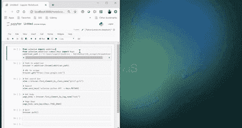

硒简介

在 GIF 中，我开始导入相关的包并初始化一个 chrome 浏览器。同时我告诉浏览器得到“http://www.google.com”。

接下来，我触发了一个命令，在退出之前在 Google 搜索栏中搜索“Selenium python API”。

如果你想尝试一下，那就开始使用你当地的 Jupyter 笔记本吧。

您需要做的第一件事是安装 selenium。

```
pip install selenium
```

你还需要在这里安装 chrome 驱动程序。

然后逐步运行下面的代码。

注意第 13 行，类名是“gLFyf.gsfi”？

我怎么知道谷歌搜索栏使用这个标签？

要找出一个 HTML 页面的不同标签，你需要做的就是右键点击页面，用“inspect”进入开发者模式。

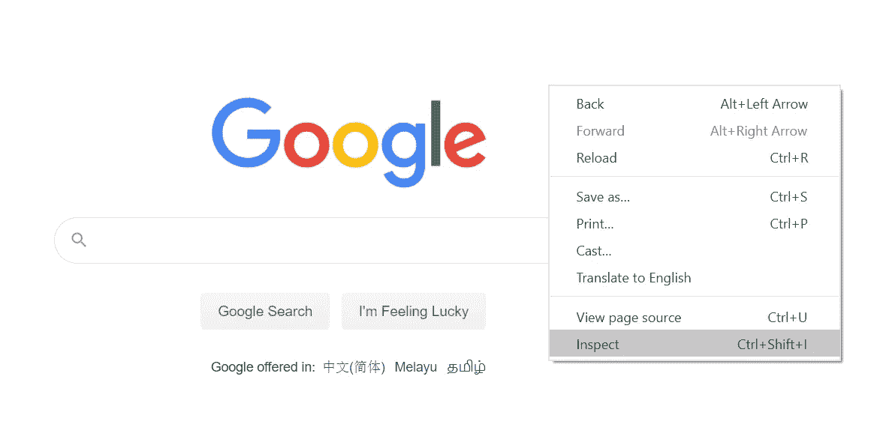

如何从网页进入开发者模式

接下来，点击左上角的图标。这将使您能够选择页面上的元素。

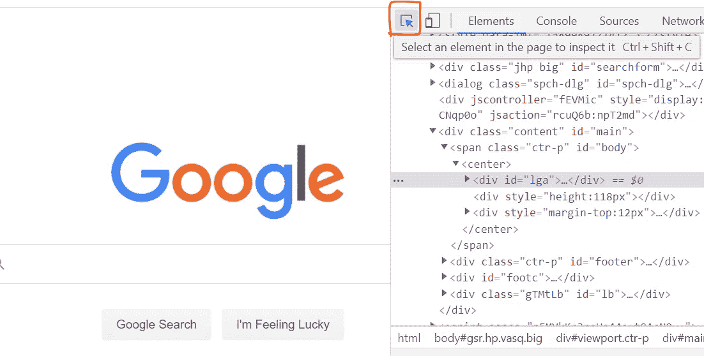

用于选择页面上元素的图标

要查看搜索栏的标签，只需将鼠标悬停在搜索栏上。

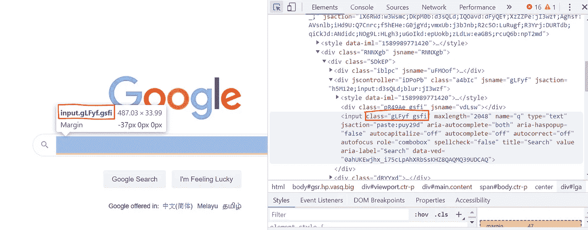

如何找到相关标签的示例

一旦找到感兴趣的相关类标签，就可以告诉 Selenium 用代码获取它

```
elem = browser.find_element_by_class_name("gLFyf.gsfi")
```

不过，这里需要注意一点。

根据这个特殊的抓取项目的经验，我注意到了“find_element_by_class_name”函数中的一个错误。

如果类名太长，空格太多，**该功能将无法工作。**

我在谷歌上搜索了大量的解决方案。即使您将这些句点放在标记之间，即“gLFyf <period>gsfi”</period>

**这并不总是有效……**

这方面很不靠谱。

过滤掉类标签的更好方法是使用 Beautiful Soup。

所以如果硒元素让我如此痛苦…

**为什么是硒？**

我不得不在这个项目中使用硒的原因是由于在美丽的汤方面的限制。

当 Beautiful Soup 解析一个 HTML 页面时，它**不会**解析页面中需要 java script 加载的部分。

有时，在加载网页的新部分之前，有些网页需要用户向下滚动——加载通常由 java 脚本完成。

因此，如果您的 web 页面要求您向下滚动来加载页面的片段，漂亮的 Soup 解析器将**永远不会**解析完整的 HTML。

为了缓解这个问题，您应该在解析整个 HTML 页面之前使用 Selenium 来自动化滚动过程。

这样，您可以灵活地使用硒或美丽的汤来开始您的信息提取过程。

我两个都用，因为他们每个人都有自己的优点，在一起，他们就像一对强大的夫妇。😃

## 美味的汤

创建于 2004 年的 [Beautiful Soup](https://www.crummy.com/software/BeautifulSoup/bs4/doc/) 是一个用于无缝解析 HTML 和 XML 文件的 Python 库。

我这么说是什么意思？

好吧，让我们来看看他们的[文档](https://www.crummy.com/software/BeautifulSoup/bs4/doc/)中的例子的修改版本。

我修改了这个例子，让事情变得更清楚一些。

首先要做的就是装美汤。

```
pip install beautifulsoup4
```

以下是代码:

正如你所看到的，美丽的汤是非常容易和直观的使用。

如果你有时间，我建议你亲自尝试一下。

那好吧。

既然介绍已经结束了，那么文章的核心部分就来了！

我们开始吧！

# 真正的网络抓取项目


照片由[戴恩·托普金](https://unsplash.com/@dtopkin1?utm_source=medium&utm_medium=referral)在 [Unsplash](https://unsplash.com?utm_source=medium&utm_medium=referral) 上拍摄

如果您已经完成了上面的介绍步骤，那么做得很好！

但是这就是网络抓取变得有点复杂的地方。

整个抓取项目是从 TDS 作者那里抓取文章标题。

我想分析 TDS 作者写的是什么主题，并通过每篇帖子获得的掌声数量来估计读者的兴趣。

我不会在这篇文章中讨论结果，但会在另一篇文章中讨论。

然而，我将介绍用于完成抓取任务的代码。

这花了我大约 2 天的时间让它工作，因为我一路上遇到了很多不同的 bug。

开始了。

## 用硒和美丽的汤刮网-两步过程

我分两步完成了这件事。

**第一步——定义需要抓取的网页，并找到不同网页中使用的通用标签。**

这一步需要一段时间，因为您需要找到所有相关的标签，并将它们与其他页面进行交叉引用，以确定它们是否指向您想要抓取的相同元素。

我通过打开不同页面的多个选项卡并进入开发者模式(即右键单击“Inspect”或按 F12)来手动完成此操作。

然后，我将鼠标悬停在我想要提取的元素上，并搜索所有这些元素使用的公共标签。

就拿我的简介来说吧。

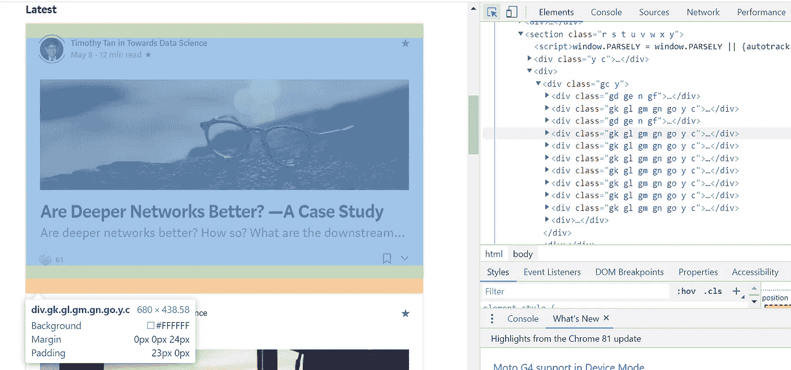

要刮的东西的例子

我感兴趣的信息有:

*   发布者名称
*   发布日期
*   读出时间
*   职位名称
*   鼓掌次数

我要找的是“div”标签，它包含我想要提取的信息。

在这里，我找到了我需要的“div”标签，还注意到它有“class”标签！

完美！

注意上面有 7 个相同的“类”标签吗？

这是因为我的个人资料页面中的每个帖子都有相同的标签名称。

```
<div class = "gk gl gm gn go y c">...</div>
```

这是你想要寻找的东西。

**但问题是，其他用户资料是否遵循相同的标签？**

让我们把这一发现和另一份资料对照一下。

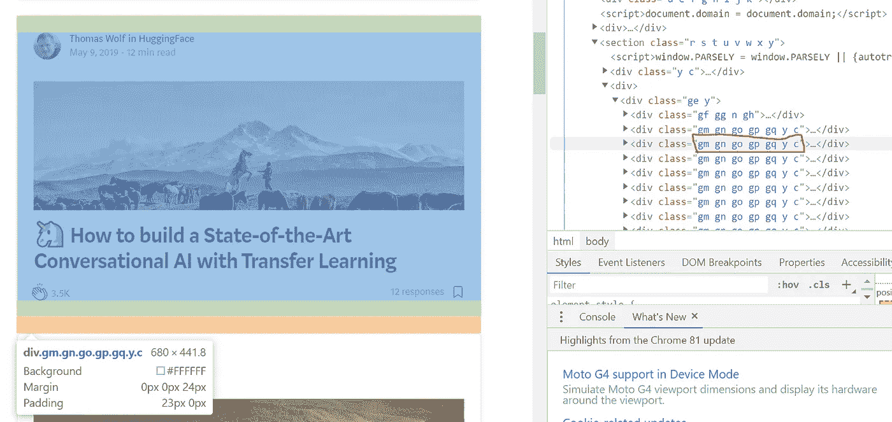

另一个概要文件的类标签示例

事实证明，并不尽然。

```
<div class = "gm gn go gp gq y c">...</div>
```

但是在看了另一个简介之后…

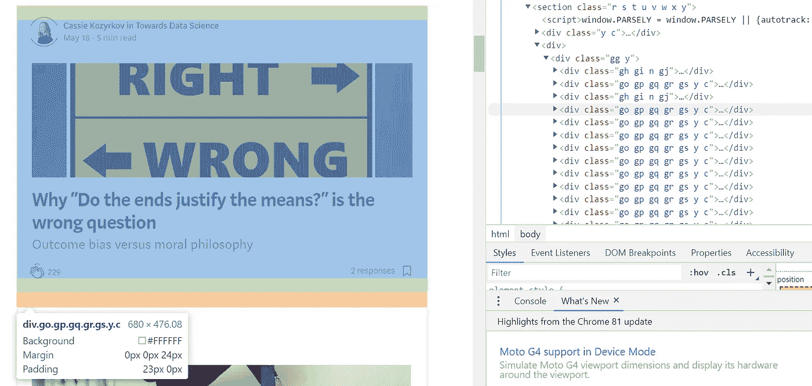

具有不同配置文件的另一个类标签的示例

**有格局。**

```
<div class = "go gp gp gr gs y c">...</div>
```

我需要的所有“div”标签的模式都遵循以下正则表达式模式:

```
re.compile(r'(..\s){5}y c')
```

在英语中，会有一个 2 字符后跟一个恰好出现 5 次的空格。在此旁边，将出现字符“y c”。

因此，这就是我在抓取过程中使用的正则表达式模式。

我不会去经历所有需要的模式，但你得到的想法。

> 网络抓取有点粗糙，充满了硬编码的标签。

无论如何，我冲洗和重复上述步骤，我需要提取的一切。

让我们进入下一步。

**步骤 2——定义脚本将遵循的逻辑流程**

回想一下，我们的目标是让**获得所有** TDS 职位头衔。

从第一步*我们知道我们想要提取什么*，以及*如何提取*。

我们现在需要的是知道如何从**所有**作者简介页面中**动态**提取帖子标题。

这意味着加载*每个*编写者的档案并启动抓取过程。

关键字“*各*”。

我们该如何着手呢？

这是一个分为三步的过程:

1.  我们首先运行一个抓取作业来提取所有 TDS writer 配置文件链接。
2.  然后使用每个链接进入他们的个人资料页面，提取他们之前写的所有帖子标题。
3.  作为(2)的子任务，对于每个 post“div ”,为基本数据帧创建一个新条目，并将该行追加到该条目。

下面是应用所有 3 个步骤后的代码。

让我们来分析一下你在上面的代码片段中看到了什么。

首先，我调用了一个定义“get_profile_urls(…)”，它接受指向所有 TDS 作者个人资料的链接。

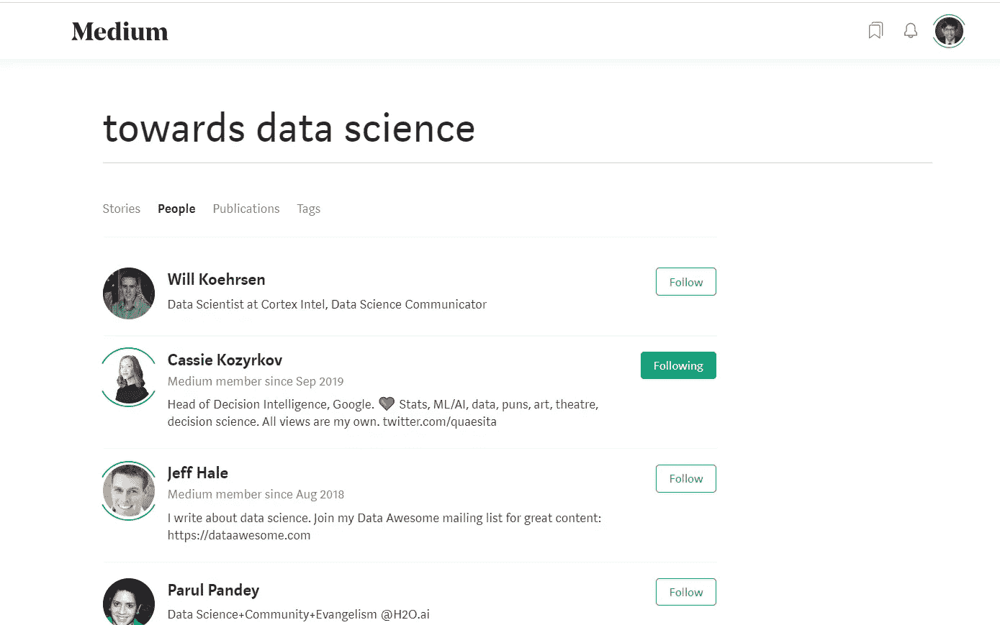

所有 TDS 作者简介的链接示例

一旦定义抓取了每个作者的 URL 链接，它就返回一个它们的 python 列表。

```
url_list =['[https://medium.com/@kozyrkov','https://medium.com/@ssrosa','https://medium.com/@neha_mangal','https://medium.com/@parulnith'](https://medium.com/@kozyrkov','https://medium.com/@ssrosa','https://medium.com/@neha_mangal','https://medium.com/@parulnith'), ...]
```

这些链接中的每一个都被循环，并被用作另一个名为“extract_information(…)”的定义的输入。

在 gist 中，这个定义为每个 URL 初始化一个 Selenium 浏览器，并使用 Selenium 一直向下滚动到概要文件的末尾，然后启动两个子任务:“get_post(…)”和“get_writer_profile(…)”。

下面是 extract_information(…)的定义:

请注意第 21 行到第 37 行:

```
# Path to webdriver
    browser = webdriver.Chrome(webdriver_path)# URL to scrape
    browser.get(pub_url)
    time.sleep(1)# Get body
    elem = browser.find_element_by_tag_name("body")# No. of times to scroll
    no_of_pagedowns = 100while no_of_pagedowns:
        elem.send_keys(Keys.PAGE_DOWN)
        time.sleep(0.5)
        no_of_pagedowns-=1
```

这是 Selenium 为每个配置文件启动一个浏览器，定义页面的“主体”,每 0.5 秒向下滚动页面 100 次。

是的，100 是硬编码的。我以为你会在 100 卷内看完每一页。

如果没有，只要增加到 150 滚动，这应该做的把戏。

继续，请注意我是如何跟踪错误计数的。

说到网络抓取，会有很多意想不到的事情发生。

在这种情况下，我面临着以下问题:

*   没有掌声的帖子。因此，我必须说明这一点。
*   没有 H1 标题标签的帖子。
*   帖子 H4 标签在所有帖子中不相等。
*   还有更多…

对于所有这些小错误，我使用“try and except”来记录错误计数，并允许程序即使有错误也能继续运行。

如果帖子不符合数据框列，这将是一个错误，我记录了计数。

我总共刮了 5524 篇文章，其中有 435 个错误。

呀。

不过还好，我凑合用 5524。😏

现在让我们看看“get_posts(…)”和“get_writer_profiles(…)”是什么样子的。

## “get_posts(…)”定义

该定义从每个帖子中提取所有相关信息，并为基本数据框创建一个新条目，并将该新条目附加到该数据框中。

此外，任何未通过提取过程的帖子都会被忽略，并保留一个错误计数器。

下面是代码的样子:

注意第 25 行和第 26 行:

```
ends_with_yc = re.compile(r'(..\s){5}y c')    
for row in page_content.find_all('div', class_=ends_with_yc):
```

回想一下，我使用正则表达式匹配来查找每个帖子的位置。

我使用 Beautiful Soup 而不是 Selenium 进行提取的原因是因为类标签的匹配。

如前所述，Selenium 中似乎有一个 bug，即类标签的匹配没有正常工作。

在这个项目中，使用 class 标签来定位相关的“div”标签是至关重要的。

接下来我想提醒大家注意的是第 63 行:

```
dp_rt_tag = row.find_all('span')[3].find('div')
```

有时候找到一个父标签来搜索它的子标签真的很有帮助。

在第 63 行，父标签是“ *span* ”，子标签是“ *div* ”。

你看，网页本质上是有层次的，知道了父标签，有时候提取东西会更容易。

这里有一个我提到的等级的例子。

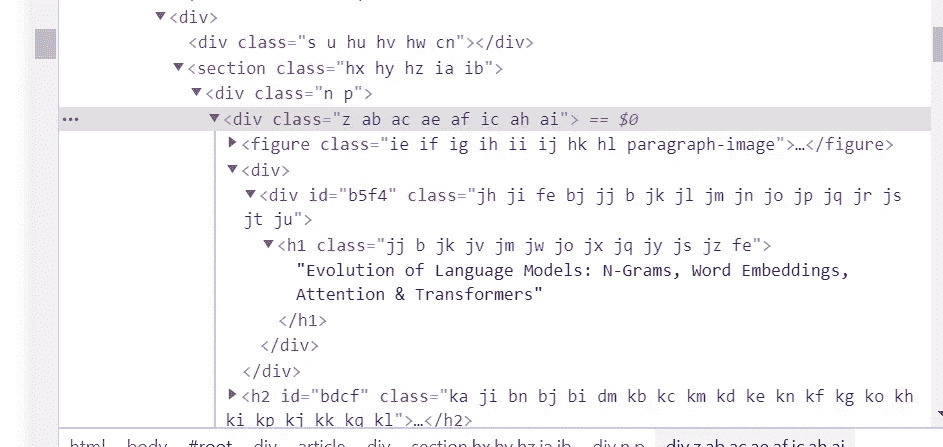

网页中的层次结构示例

在上图中，父标签可以是“*部分*，它有很多子标签——“*div*”、“*图*”、“ *h1* ”、“ *h2* ”等。

## “get_writer_profiles(…)”定义

除了提取文章标题，我还随意提取了作者的名字，以及他们是否是顶级作家。

这就是这个定义的本质。相当直接。

我用硒来提取。

注意不同的语法。

注意，对于 Selenium，要找到一个标记，您需要运行:

```
match_tag = browser.find_element_by_tag_name("p")
OR
match_tag = browser.find_elements_by_tag_name("p")
```

单词“*元素*”与“*元素*”之间的细微差别。

在《美丽的汤》中，相当于:

```
match_tag = browser.find("p")
OR
match_tag = browser.find_all("p")
```

要在 Selenium 中找到一个类，您可以写:

```
match_tag = browser.find_element_by_class_name("go.gp.gp.gr.gs.y.c")
```

在美丽的汤里:

```
match_tag = browser.find('div', class_="go gp gp gr gs y c")
```

但是在 Selenium 中找到“class”标签并不总是有效的。

奇怪的是，它对某些类标签有效，但对其他类标签无效。😅

它对介绍中的 Google 示例有效，不是吗？

确实非常奇怪…

# 最终结果

运行您看到的代码后，最终提取的结果将如下所示:

我以出版商的身份过滤了 TDS。

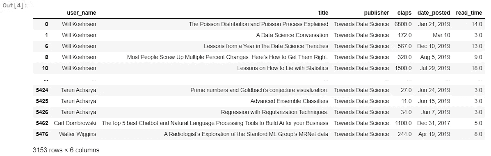

抓取文章标题的结果

对于作者简介:

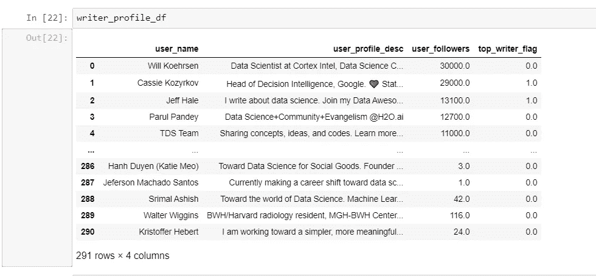

抓取作者个人资料的结果

## 偷偷摸摸的时刻

如果您一直在关注，请注意我是如何跳过一个定义的？😉

我没有提到任何关于“get_profile_url(…)”的定义。

我跳过了这个定义，所以你可以自己尝试一下。

与我分享的其他定义相比，这非常简单。

自己试一试，看看硒或美丽的汤是如何工作的！

如果所有这些都失败了，我的脚本和笔记本在下面的 GitHub 页面上。

一旦你亲自尝试了提取过程，你就可以检查它们。

这篇文章的 GitHub 链接:

[](https://github.com/timtan-github/Selenium-Web-Scraper) [## timtan-github/Selenium-Web-刮刀

### 这个 Selenium web scraper 用于一个大型项目的数据收集阶段，以分析作者和读者…

github.com](https://github.com/timtan-github/Selenium-Web-Scraper) 

# 结尾注释

嗯，就这样吧！

在这篇文章中，我已经向你介绍了硒和美丽的汤是如何通过简单的练习发挥作用的。

然后我给了你代码，让你在一组更真实的数据上尝试网络抓取。即 TDS 网页

注意，这个抓取器可以在任何出版物上工作，不仅仅是 TDS，在某种意义上，它可以是你得到的其他 web 抓取项目的基础。

希望这篇文章能让你对网络抓取有所了解。

说完了，下一篇帖子再见！

再见！

领英简介:[谭震霆](https://www.linkedin.com/in/timothy-tan-97587190/)