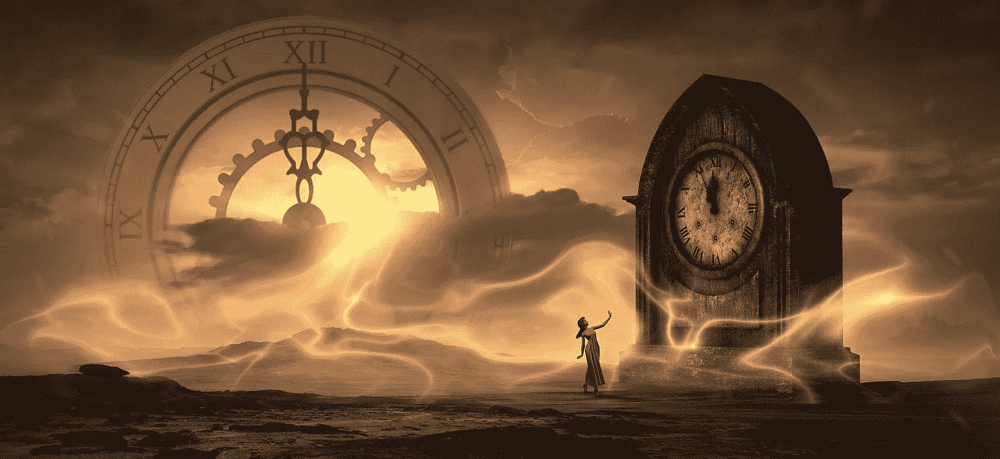
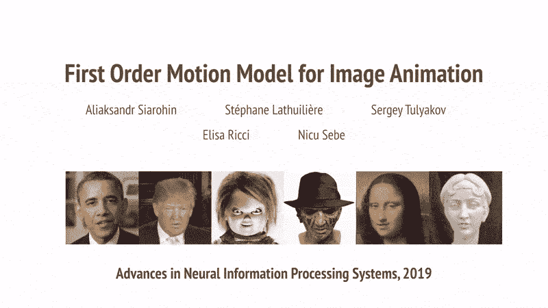
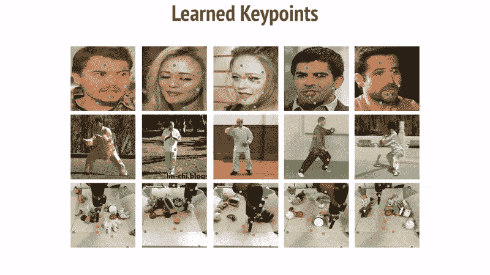
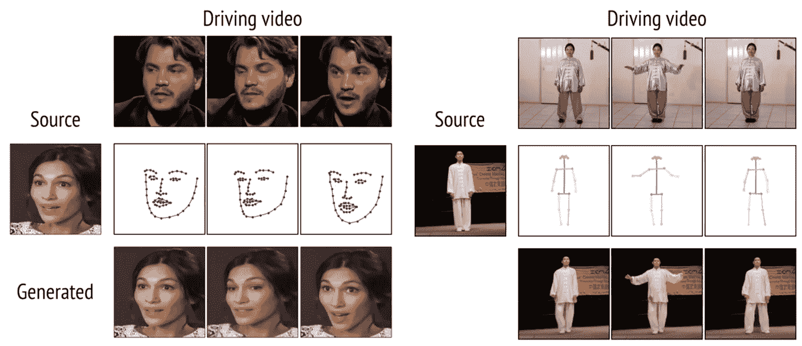
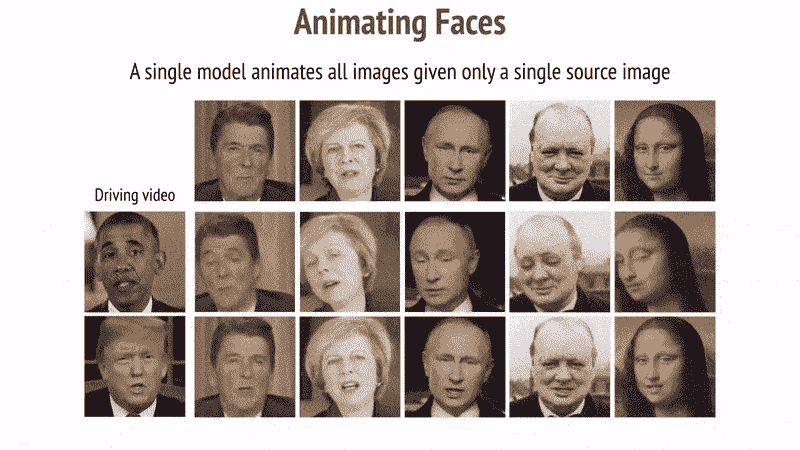
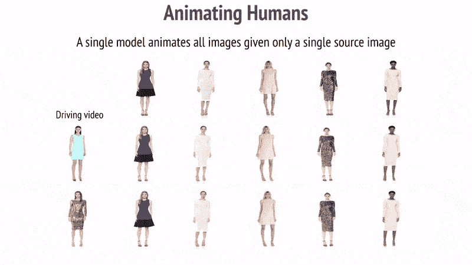
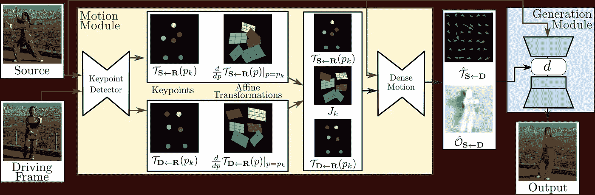

# 在 Colab 上 5 分钟内实现真实的深度伪造

> 原文：<https://towardsdatascience.com/realistic-deepfakes-colab-e13ef7b2bba7?source=collection_archive---------2----------------------->

## 以及为什么我们应该教育公众这种技术的存在

图片由来自 [Pixabay](https://pixabay.com/?utm_source=link-attribution&utm_medium=referral&utm_campaign=image&utm_content=3517206) 的[斯蒂芬·凯勒](https://pixabay.com/users/KELLEPICS-4893063/?utm_source=link-attribution&utm_medium=referral&utm_campaign=image&utm_content=3517206)拍摄

女士们先生们，Deepfake 视频非常容易制作，任何人都可以制作。你不需要博士学位，你也不需要花几个小时训练模型，你甚至不需要上一门关于生成对抗网络的课程。

你所要做的就是，录制一段你自己的视频，并选择一张你想模仿的人的照片。机器学习将按照你在视频中想要的方式给图片中的人添加动画。

# 用单个图像生成 Deepfakes

图像动画旨在生成视频序列，以便根据视频的运动来动画化源图像中的人。

这项技术属于计算机视觉领域，人工智能研究人员一直致力于制作更逼真的视频。它利用机器学习来操纵和生成视觉图像或视频，以他人代替一个人。

图像动画的一阶运动模型【作者[阿利亚克山大](https://aliaksandrsiarohin.github.io/first-order-model-website/)

出于对科学的热爱，从研究的角度来看，阿利亚克山大的工作确实令人印象深刻。它已经发表在 [NeurIPS](http://papers.nips.cc/paper/8935-first-order-motion-model-for-image-animation) 上，[源代码](https://github.com/AliaksandrSiarohin/first-order-model)可以在网上获得。

他的工作在所有基准上都超过了最先进的水平，并且可以在各种图像上工作(人脸、身体、卡通和机器人)。这个模型是如此的灵活，以至于你可以用一张目标物体的图片来创建高质量的 Deepfakes。

## 不需要事先信息

它学习面部动作的能力令人难以置信。你可以看到它可以识别脸上的关键点，并且它很好地跟随这些关键点到视频中的动作。

模型学习识别关键点[通过 [Aliaksandr](https://aliaksandrsiarohin.github.io/first-order-model-website/)

在以前的工作中，我们需要额外的信息，如面部标志来绘制头部运动，姿势估计来绘制全身运动。

过去的工作需要面部标志和姿势估计

在这部作品中，它**可以不使用任何注释或关于特定对象的先验信息**来制作动画。一旦模型已经在面部上训练，模型可以将任何运动转移到任何面部上。

## 漂亮的头部运动

您可以录制自己的视频，并为照片中的人制作动画。是的，甚至还有一幅蒙娜丽莎的画像。

你可以抬头，转头。你会说话，嘴部动作看起来很棒。你可以转动你的眼睛，它将眼球运动很好地映射到目标视频上。

生成头部运动[由[阿利亚克山大](https://aliaksandrsiarohin.github.io/first-order-model-website/) ]

## 全身运动也是

它也适用于全身运动的视频！理论上，这意味着你可以拍下比莉·珍的视频，让唐纳德·特朗普像迈克尔·杰克逊一样跳太空步。

生成全身动作[由 [Aliaksandr](https://aliaksandrsiarohin.github.io/first-order-model-website/) ]

## 它产生背景

由于人覆盖了图像的一部分，算法需要找出人背后的背景。在这个作品中，**自动生成被移动的人覆盖的背景**——绝对精彩。

# 它是如何工作的？

Aliaksandr 的工作包括运动提取器，它学习提取关键点及其局部仿射变换。有一个生成器网络，它对目标运动中的遮挡进行建模，并将从源图像中提取的外观和从驾驶视频中导出的运动进行组合。

一阶运动模型[来自[论文](http://papers.nips.cc/paper/8935-first-order-motion-model-for-image-animation)

要了解它是如何工作的，我建议你访问 [GitHub 页面](https://aliaksandrsiarohin.github.io/first-order-model-website/)并查看[研究论文](http://papers.nips.cc/paper/8935-first-order-motion-model-for-image-animation)。你也可以看他的[视频](https://www.youtube.com/watch?v=u-0cQ-grXBQ)解释它是如何工作的。很酷的东西。

想自己做吗？看看这个 [Colab 笔记本](https://colab.research.google.com/github/AliaksandrSiarohin/first-order-model/blob/master/demo.ipynb)。

# 深度造假的负面后果

Deepfakes 因其在假新闻、欺诈、诈骗和许多其他非法活动中的使用而获得了广泛关注。

人们过去常常在 subreddit、 [*r/deepfakes*](https://www.reddit.com/r/deepfakes) 分享他们创作的 Deepfakes 视频。许多这样的视频将名人的脸，如盖尔·加朵和泰勒·斯威夫特，交换到色情表演者的身体上。

许多 Deepfakes 视频也被分享，描绘了政治家。它通过独裁政府传播虚假信息、仇恨和恐惧来影响政治。

这项技术已经引起了行业和政府的关注，以控制和限制 Deepfakes 的使用。2018 年 2 月， [Reddit 因违反政策暂停 r/deepfakes](https://www.vice.com/en_us/article/neqb98/reddit-shuts-down-deepfakes) 。2019 年 6 月，它[引起了政府](https://www.congress.gov/bill/116th-congress/house-bill/3230)的关注，以通过限制 Deepfakes 视频更改技术来打击虚假信息的传播。

# 和我一起告知它的存在

知道世界上有人会滥用这项技术。你可能会问，我为什么要写这个？为什么我要传播这些知识？

由于在当今这个时代，任何人都可以很容易地制作假视频，这样的生成模型不再是科幻小说了。我的目标是教育公众，让人们知道这种技术的存在。**通过了解它的存在，人们可以有所觉察，更加注重辨别真假。**

假新闻是当今互联网结构的一部分，现在假新闻很容易被发现；这使得虚假信息达到了一个全新的水平。它通过传播虚假信息影响了政治。它导致人们被骗子利用，利用它在网上骗钱。

由于冠状病毒，世界现在已经一片混乱；我不确定在这种时候人们会如何滥用这项技术。Deepfakes，作为一种虚假信息，是危险的。我们需要对人们进行技术教育，人们需要辨别真相，而不仅仅是相信我们所看到的。

 [## 从 Google 联合实验室看它的实际应用

### 一阶运动模型

colab.research.google.com](https://colab.research.google.com/github/AliaksandrSiarohin/first-order-model/blob/master/demo.ipynb)  [## 数据科学家:21 世纪最肮脏的工作

### 40%的吸尘器，40%的看门人，20%的算命师。

towardsdatascience.com](/data-scientist-the-dirtiest-job-of-the-21st-century-7f0c8215e845)  [## 人工智能和神经科学之间的迷人关系

### 他们如何相互激励、共同进步、相互受益

towardsdatascience.com](/the-fascinating-relationship-between-ai-and-neuroscience-89189218bb05) 

图像动画的一阶运动模型。*神经信息处理系统的进展*。2019.

*插图属于* [*阿利亚克山大*](https://aliaksandrsiarohin.github.io/first-order-model-website/) *，经允许使用。*