# 使用 TensorFlow2.x 的实时多人 2D 姿态估计

> 原文：<https://towardsdatascience.com/realtime-multiple-person-2d-pose-estimation-using-tensorflow2-x-93e4c156d45f?source=collection_archive---------4----------------------->


图片来源:左:Bailarine[Eugenia Delgrossi](https://www.instagram.com/eugenia_delgrossi/)—右: [OpenPose — IEEE-2019](https://arxiv.org/pdf/1812.08008.pdf)

# 介绍

正如 Zhe Cao 在他的 [2017 论文](https://arxiv.org/pdf/1611.08050.pdf)中所描述的，实时多人 2D 姿势估计对于让机器理解图像和视频中的人至关重要。

## 然而，什么是姿态估计呢？

顾名思义，它是一种用于估计一个人身体位置的技术，例如站、坐或躺。获得这种估计的一种方法是找到 18 个“身体的关节”，或者如人工智能领域中所命名的:“关键点”下图显示了我们的目标，即在图像中找到这些点:

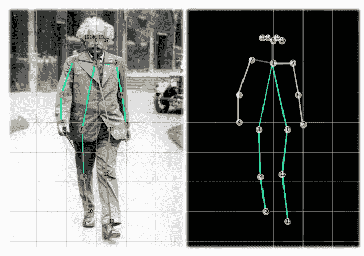

图片来源:[物理世界——爱因斯坦在牛津(1933)](https://physicsworld.com/a/einstein-in-oxford/)

关键点从*点#0* (顶颈)向下到身体关节，回到头部，以*点#17* (右耳)结束。

使用基于人工智能的方法出现的第一项重要工作是谷歌的 Toshev 和 Zegedy 在 2014 年发表的论文 [DeepPose](https://arxiv.org/pdf/1312.4659.pdf) 。提出了一种基于深度神经网络(DNNs)的人体姿态估计方法，其中姿态估计被表述为一个基于 DNN 的针对身体关节的回归问题。

该模型由一个 AlexNet 后端(7 层)和一个输出 2k 关节坐标的额外最终层组成。这种方法的显著问题是，首先，必须检测单个人(经典的对象检测),随后是模型应用。因此，在图像上发现的每个人体必须分别处理，这大大增加了处理图像的时间。这种方法被称为“自上而下”,因为首先要找到身体，然后找到与之相关的关节。

## 姿态估计的挑战

有几个与姿态估计相关的问题，如:

1.  每个图像可能包含未知数量的人，这些人可能出现在任何位置或比例。
2.  由于接触、闭塞或肢体关节，人与人之间的交互会导致复杂的空间干扰，使各部分的关联变得困难。
3.  运行时的复杂性往往会随着图像中人数的增加而增加，这使得实时性能成为一个挑战。

为了解决这些问题，一种更令人兴奋的方法(这就是这个项目使用的方法)是 *OpenPose* ，这是 ZheCao 和他来自卡内基梅隆大学机器人研究所的同事在 2016 年推出的。

## 开放姿势

提出的 OpenPose 方法使用非参数表示，称为部分亲和场(PAF ),以“连接”每个在图像上找到的身体关节，将它们与个人相关联。换句话说，OpenPose 与 DeepPose 相反，首先找到图像上的所有关节，然后“向上”寻找最有可能包含该关节的身体，而不使用任何人探测器(“自下而上”的方法)。OpenPose 查找图像上的关键点，而不管图像上有多少人。下面的图片是从 ILSVRC 和 COCO workshop 2016 上的 [OpenPose 演示中获取的，让我们了解一下这个过程。](http://image-net.org/challenges/talks/2016/Multi-person%20pose%20estimation-CMU.pdf)

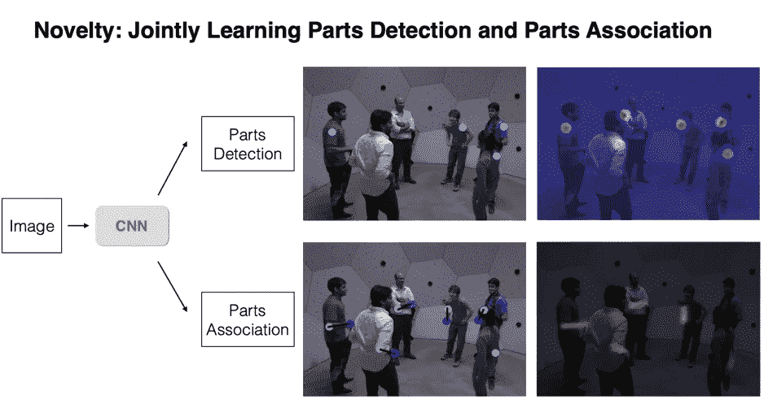

图片来源:[ILSVRC 和 COCO workshop 2016](http://image-net.org/challenges/talks/2016/Multi-person%20pose%20estimation-CMU.pdf) 上的 OpenPose 演示

下图显示了用于训练的双分支多级 CNN 模型的架构。首先，前馈网络同时预测身体部位位置的一组 2D 置信图(S )(来自(dataset/COCO/annotations/)的关键点注释)和一组部位亲和力的 2D 矢量场(L ),其对部位之间的关联程度进行编码。在每个阶段之后，两个分支的预测以及图像特征被连接起来用于下一阶段。最后，通过贪婪推理来解析置信图和亲和域，以输出图像中所有人的 2D 关键点。

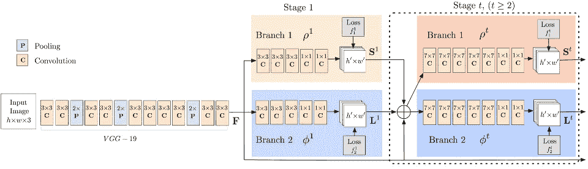

图片来源: [2017 OpenPose 论文](https://arxiv.org/pdf/1611.08050.pdf)

在项目的执行过程中，我们将回到这些概念中的一些来进行澄清。然而，强烈建议关注 OpenPose [ILSVRC 和 COCO workshop 2016](http://image-net.org/challenges/talks/2016/Multi-person%20pose%20estimation-CMU.pdf) 演示和 CVPR 2017 的[视频录制](https://www.youtube.com/watch?v=OgQLDEAjAZ8&list=PLvsYSxrlO0Cl4J_fgMhj2ElVmGR5UWKpB)，以便更好地理解。

## TensorFlow 2 开放姿态安装(tf 姿态估计)

最初的 OpenPose 是使用基于模型的 VGG 预训练网络和使用 [Caffe 框架](https://github.com/CMU-Perceptual-Computing-Lab/openpose)开发的。然而，对于这次安装，我们将遵循[伊尔杜·金](https://github.com/ildoonet)张量流方法，详见他的 [tf 姿态估计 GitHub](https://github.com/ildoonet/tf-pose-estimation) 。

## 什么是 tf 姿态估计？

tf-pose-estimation 是“Openpose”，一种使用 Tensorflow 实现的人体姿态估计算法。它还提供了几个变体，对网络结构进行了一些更改，以便在 CPU 或低功耗嵌入式设备上进行实时处理。

tf-pose-estimation GitHub 显示了使用不同模型的几个实验，如下所示:

*   **cmu:** 原论文中描述的基于模型的 VGG 预训练网络，将 Caffe 格式的权重转换为 TensorFlow 中使用。
*   **dsconv** :与 cmu 版本的架构相同，除了 mobilenet 的深度方向可分离卷积。
*   **mobilenet** :基于 mobilenet V1 论文，使用 12 个卷积层作为特征提取层。
*   **mobilenet v2** :类似于 mobilenet，但是使用了它的改进版本。

本文中的研究是使用 mobilenet V1(“mobilenet _ thin”)完成的，它在计算预算和延迟方面的性能居中:

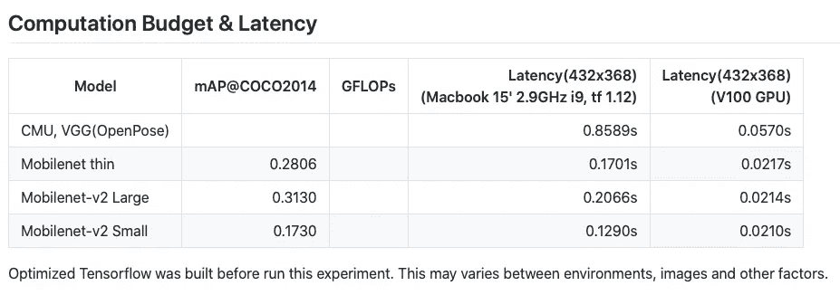

[https://github . com/ildoonet/TF-pose-estimation/blob/master/ETCS/experiments . MD](https://github.com/ildoonet/tf-pose-estimation/blob/master/etcs/experiments.md)

# 第 1 部分—安装 tf 姿态估计

我们在这里跟随，优秀的 [Gunjan Seth](https://medium.com/@gsethi2409) 文章[用 TensorFlow 2.0 进行姿态估计](https://medium.com/@gsethi2409/pose-estimation-with-tensorflow-2-0-a51162c095ba)。

*   转到终端并创建一个工作目录(例如，“Pose_Estimation”)，移动到该目录:

```
mkdir Pose_Estimation
cd Pose_Estimation
```

*   创建一个虚拟环境(例如 Tf2_Py37)

```
conda create --name Tf2_Py37 python=3.7.6 -y 
conda activate Tf2_Py37
```

*   安装 TF2

```
pip install --upgrade pip
pip install tensorflow
```

*   安装将在开发期间使用的基本包:

```
conda install -c anaconda numpy
conda install -c conda-forge matplotlib
conda install -c conda-forge opencv
```

*   克隆 tf 姿态估计库；

```
git clone https://github.com/gsethi2409/tf-pose-estimation.git
```

*   转到 tf-pose-estimation 文件夹并安装需求

```
cd tf-pose-estimation/
pip install -r requirements.txt
```

下一步，安装 [SWIG](http://www.swig.org/exec.html) ，这是一个接口编译器，将 C 和 C++编写的程序与 Python 等脚本语言连接起来。它的工作原理是获取 C/C++头文件中的声明，并使用它们来生成脚本语言访问底层 C/C++代码所需的包装器代码。

```
conda install swig
```

*   使用 Swig，构建 C++库进行后处理。

```
cd tf_pose/pafprocess
swig -python -c++ pafprocess.i && python3 setup.py build_ext --inplace
```

现在，安装 [*tf-slim*](https://github.com/adrianc-a/tf-slim) 库，这是一个轻量级的库，用于定义、训练和评估 TensorFlow 中的复杂模型。

```
pip install git+https://github.com/adrianc-a/tf-slim.git@remove_contrib
```

就是这样！现在，有必要进行一个快速测试。以便返回到主 tf 姿态估计目录。

> 如果你按照顺序，你必须在 tf_pose/pafprocess 里面。否则，使用相应的命令来更改目录。

```
cd ../..
```

在 tf-pose-estimation 目录中有一个 python 脚本 *run.py* ，让我们运行它，参数为:

*   model=mobilenet_thin
*   resize=432x368(预处理时图像的大小)
*   图像=。/images/ski.jpg(图像目录中的示例图像)

```
python run.py --model=mobilenet_thin --resize=432x368 --image=./images/ski.jpg
```

请注意，在几秒钟内，什么也不会发生，但大约一分钟后，终端应该会显示类似下图的内容:

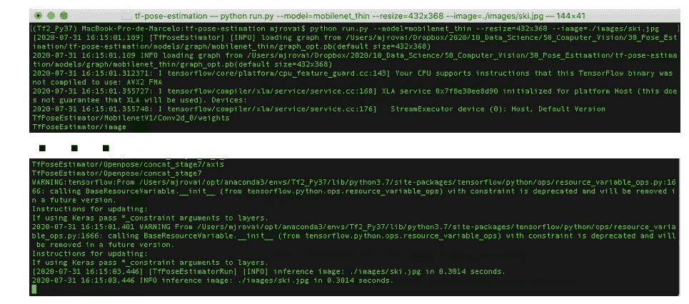

然而，更重要的是，图像将出现在一个独立的 OpenCV 窗口中:

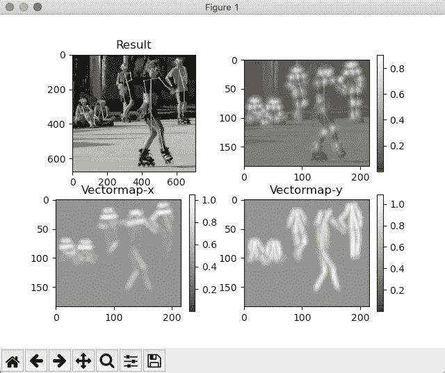

太好了！这些图像证明了一切都已正确安装并运行良好！我们将在下一节详细介绍。然而，为了快速解释这四个图像的含义，左上角(“结果”)是以原始图像(在这种情况下，是 ski.jpg)作为背景绘制的姿态检测骨架。右上角的图像是“热图”，其中显示了“检测到的零件”(Ss)，底部的两个图像显示了零件关联(Ls)。“结果”是将个人的 S 和 L 联系起来。

接下来的测试是现场视频:

> 如果计算机只安装了一个摄像头，请使用:camera=0

```
python run_webcam.py --model=mobilenet_thin --resize=432x368 --camera=1
```

如果一切顺利，将会出现一个窗口，显示真实的实时视频，如下图所示:

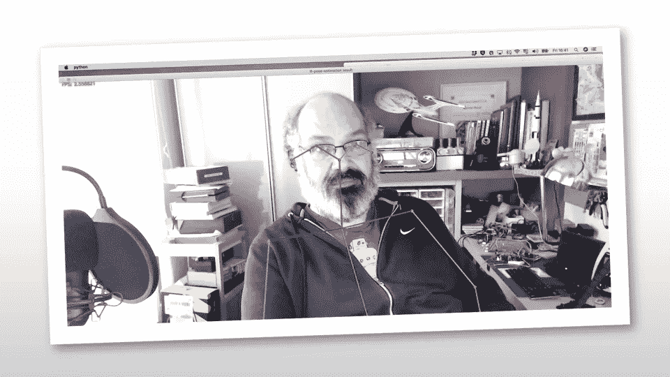

图片来源:PrintScreen 作者的网络摄像头

# 第 2 部分——深入研究图像中的姿态估计

在本节中，我们将更深入地研究 TensorFlow 姿态估计的实现。建议跟随文章，尝试重现 Jupyter 笔记本:[10 _ Pose _ Estimation _ Images](https://github.com/Mjrovai/TF2_Pose_Estimation/blob/master/10_Pose_Estimation_Images.ipynb)，可从 Project GitHub 下载。

> 作为参考，这个项目是 100%在 MacPro (2.9Hhz 四核 i7 16GB 2133Mhz RAM)上开发的。

## 导入库

```
import sys
import time
import logging
import numpy as np
import matplotlib.pyplot as plt
import cv2from tf_pose import common
from tf_pose.estimator import TfPoseEstimator
from tf_pose.networks import get_graph_path, model_wh
```

## 模型定义和目标估计器创建

可以使用位于模型/图形子目录中的模型，如 mobilenet_v2_large 或 cmu (VGG 预训练模型)。

> 对于 cmu，*。pb 文件在安装过程中没有下载，因为它们非常大。要使用它，运行位于/cmu 子目录中的 bash 脚本 *download.sh* 。

这个项目使用 mobilenet_thin (MobilenetV1)，考虑到使用的所有图像都要整形为 432x368。

参数:

```
model='mobilenet_thin'
resize='432x368'
w, h = model_wh(resize)
```

创建评估者:

```
e = TfPoseEstimator(get_graph_path(model), target_size=(w, h))
```

为了便于分析，让我们加载一个简单的人类图像。OpenCV 用于读取图像。图像以 RGB 格式存储，但在内部，OpenCV 支持 BGR。使用 OpenCV 显示图像没有任何问题，因为在图像显示在特定的窗口之前，图像将从 BGR 转换为 RGB(如前一节中的 ski.jpg 所示)。

一旦在 Jupyter 单元格上绘制图像，将使用 Matplotlib 代替 OpenCV。因此，图像应该在显示前进行转换，如下所示:

```
image_path = ‘./images/human.png’
image = cv2.imread(image_path)
image = cv2.cvtColor(image, cv2.COLOR_BGR2RGB)
plt.imshow(image)
plt.grid();
```

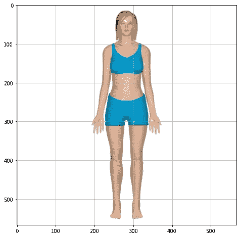

请注意，此图像的形状为 567x567。OpenCV 在读取图像时，自动将其转换为数组，其中每个值从 0 到 255，其中 0=白色，255=黑色。

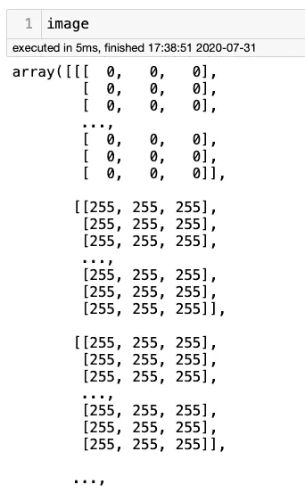

一旦图像是一个数组，就很容易使用 shape 来验证它的大小:

```
image.shape
```

结果将是(567，567，3)，其中形状是(宽度，高度，颜色通道)。

尽管可以使用 OpenCV 读取图像；我们将使用 tf_pose.common 库中的函数 read_imgfile(image_path)来防止颜色通道出现任何问题。

```
image = common.read_imgfile(image_path, None, None)
```

一旦我们将图像作为一个数组，我们就可以将方法推理应用于估计器(e)，将图像数组作为输入(图像将使用原则上定义的参数 w 和 h 来调整大小)。

```
humans = e.inference(image, resize_to_default=(w > 0 and h > 0), upsample_size=4.0)
```

运行上述命令后，让我们检查数组 e.heatmap。该数组的形状为(184，216，19)，其中 184 是 h/2，216 是 w/2，19 与特定像素属于 18 个关节之一的概率相关(0 到 17)+1(18:无)。例如，检查左上角的像素，应该会得到“无”的结果:

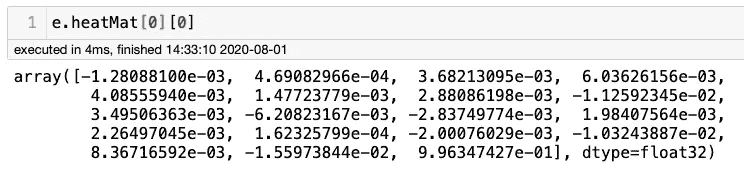

可以验证该数组的最后一个值

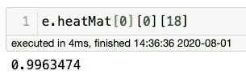

这是所有价值中最高的；可以理解的是，有 99.6%的几率，这个像素不属于 18 个关节中的任何一个。

让我们试着找到颈部的底部(两肩之间的中点)。它位于原始图片上大约半宽(0.5 *宽= 108)和大约 20%高的位置，从上/下开始(0.2 *高= 37)。因此，让我们检查这个特定的像素:

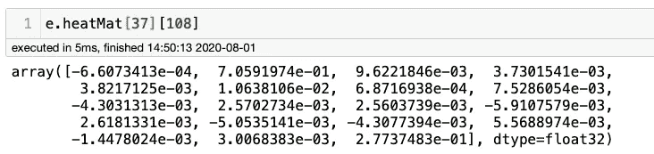

很容易实现位置 **1** 的最大值为 0.7059……(或者通过计算 *e.heatMat[37][108】)。max()* )，这意味着该特定像素有 70%的概率是“基颈”。下图显示了所有 18 个 COCO 关键点(或“身体关节”)，显示“1”对应于“基础颈部”。

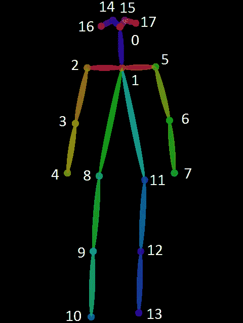

人体姿态骨骼的 COCO 关键点格式。

可以为每个像素绘制代表其最大值的颜色。这样，显示关键点的热图就会神奇地出现:

```
max_prob = np.amax(e.heatMat[:, :, :-1], axis=2)
plt.imshow(max_prob)
plt.grid();
```

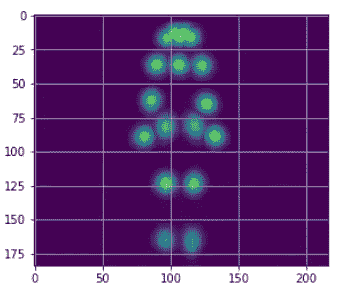

现在，让我们在重塑的原始图像上绘制关键点:

```
plt.figure(figsize=(15,8))
bgimg = cv2.cvtColor(image.astype(np.uint8), cv2.COLOR_BGR2RGB)
bgimg = cv2.resize(bgimg, (e.heatMat.shape[1], e.heatMat.shape[0]), interpolation=cv2.INTER_AREA)
plt.imshow(bgimg, alpha=0.5)
plt.imshow(max_prob, alpha=0.5)
plt.colorbar()
plt.grid();
```

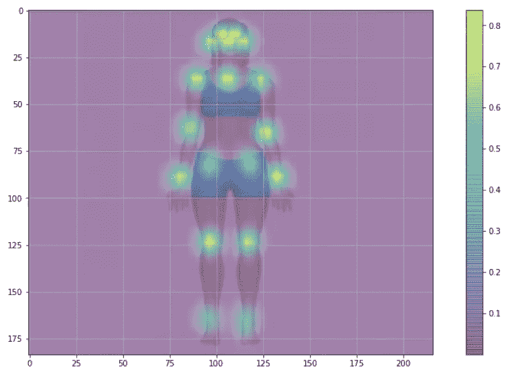

因此，可以在图像上看到关键点，颜色条上显示的值意味着黄色越多，可能性越大。

要获得关键点(或“关节”)之间最可能的连接(或“骨骼”)，我们可以使用 e.pafMat 的结果数组。该数组的形状为(184，216，38)，其中 38 (2 x 19)与该像素成为 18 个特定关节+ nones 之一的水平(x)或垂直(y)连接的一部分的概率相关。

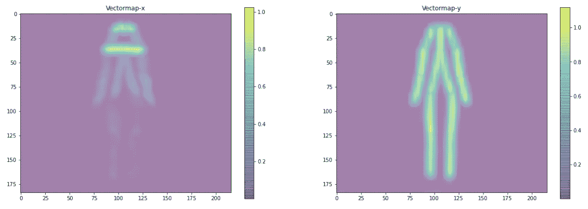

绘制上述图形的函数在笔记本中。

## 使用 draw_human 方法绘制骨骼

使用列表 *human* ，e.inference()方法的结果，可以使用 draw_human 方法绘制骨架:

```
image = TfPoseEstimator.draw_humans(image, humans, imgcopy=False)
```

结果如下图所示:

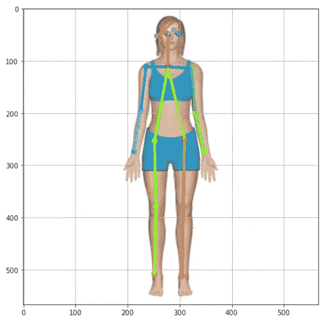

如果需要的话，可以只绘制骨架，如下所示(让我们重新运行所有代码来回顾一下):

```
image = common.read_imgfile(image_path, None, None)
humans = e.inference(image, resize_to_default=(w > 0 and h > 0), upsample_size=4.0)
black_background = np.zeros(image.shape)
skeleton = TfPoseEstimator.draw_humans(black_background, humans, imgcopy=False)
plt.figure(figsize=(15,8))
plt.imshow(skeleton);
plt.grid(); 
plt.axis(‘off’);
```

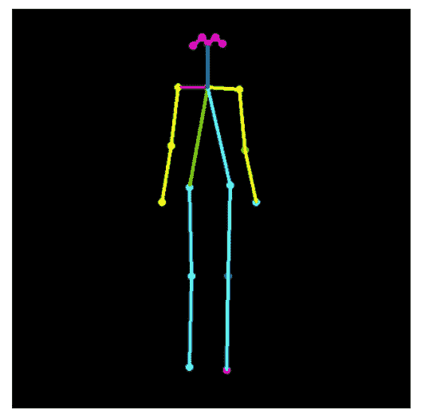

## 获取关键点(关节)坐标

姿态估计可用于机器人、游戏或医学等一系列应用。为此，从图像中获取物理关键点坐标以供其他应用程序使用可能会很有趣。

查看 e.inference()产生的*人类*列表，可以验证这是一个只有一个元素的列表，一个字符串。在这个字符串中，每个关键点都以其相对坐标和关联概率出现。例如，对于目前使用的人类图像，我们有:

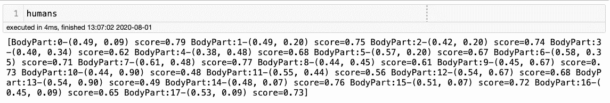

例如:

```
BodyPart:0-(0.49, 0.09) score=0.79
BodyPart:1-(0.49, 0.20) score=0.75
...
BodyPart:17-(0.53, 0.09) score=0.73
```

我们可以从这个列表中提取一个数组(大小为 18 ),其中包含与原始图像形状相关的实际坐标:

```
keypoints = str(str(str(humans[0]).split('BodyPart:')[1:]).split('-')).split(' score=')keypts_array = np.array(keypoints_list)
keypts_array = keypts_array*(image.shape[1],image.shape[0])
keypts_array = keypts_array.astype(int)
```

让我们在原始图像上绘制这个数组(因为数组的索引是关键点)。结果如下:

```
plt.figure(figsize=(10,10))
plt.axis([0, image.shape[1], 0, image.shape[0]])  
plt.scatter(*zip(*keypts_array), s=200, color='orange', alpha=0.6)
img = cv2.cvtColor(image, cv2.COLOR_BGR2RGB)
plt.imshow(img)
ax=plt.gca() 
ax.set_ylim(ax.get_ylim()[::-1]) 
ax.xaxis.tick_top() 
plt.grid();for i, txt in enumerate(keypts_array):
    ax.annotate(i, (keypts_array[i][0]-5, keypts_array[i][1]+5)
```

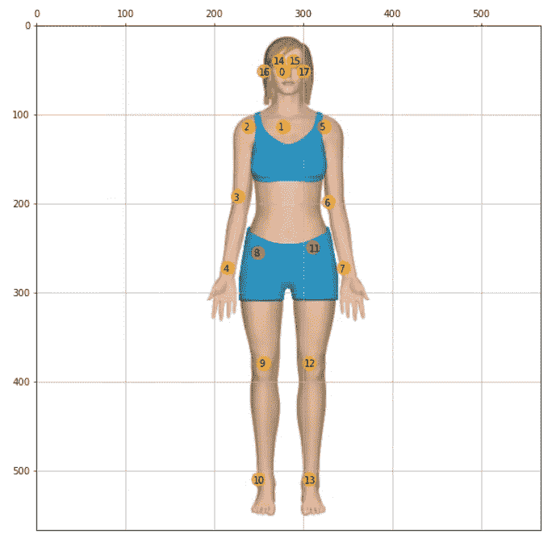

## 创建功能以快速再现对普通图像的研究:

笔记本显示了迄今为止开发的所有代码，“封装”成函数。例如，让我们看另一个图像:

```
image_path = '../images/einstein_oxford.jpg'
img, hum = get_human_pose(image_path)
keypoints = show_keypoints(img, hum, color='orange')
```

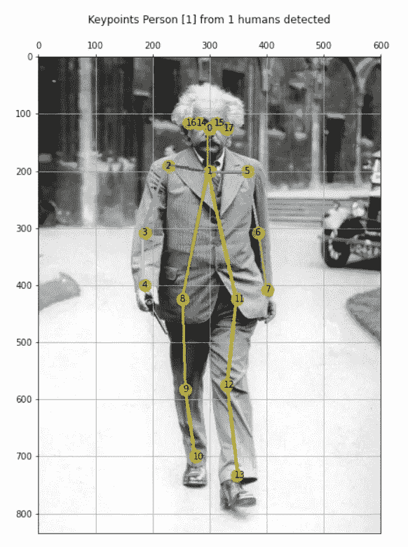

图片来源:[物理世界——爱因斯坦在牛津(1933)](https://physicsworld.com/a/einstein-in-oxford/)

```
img, hum = get_human_pose(image_path, showBG=False)
keypoints = show_keypoints(img, hum, color='white', showBG=False)
```

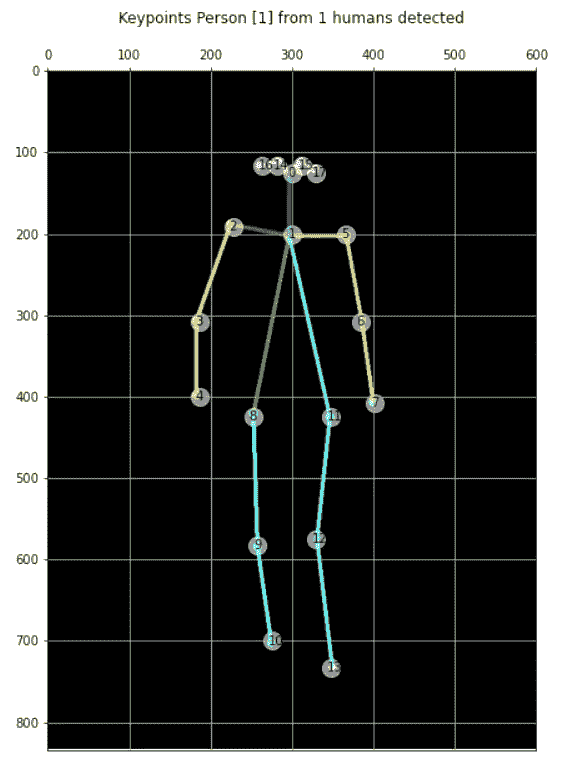

## 与多人一起研究图像

到目前为止，只探索了包含一个人的图像。一旦算法被开发来同时从图像中捕获所有关节(S)和 PAFs ),寻找最可能的连接只是为了简单。所以，得到结果的代码是一样的；例如，只有当我们得到结果(“人类”)时，列表才会具有与图像中的人数相兼容的大小。

例如，让我们使用一个上面有五个人的“忙碌图像”:

```
image_path = './images/ski.jpg'
img, hum = get_human_pose(image_path)
plot_img(img, axis=False)
```

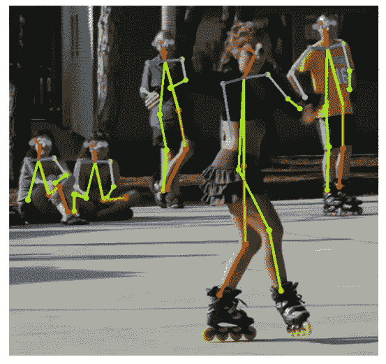

图片来源: [OpenPose — IEEE-2019](https://arxiv.org/pdf/1812.08008.pdf)

该算法找到了将他们与这五个人相关联的所有 Ss 和 Ls。成绩优秀！

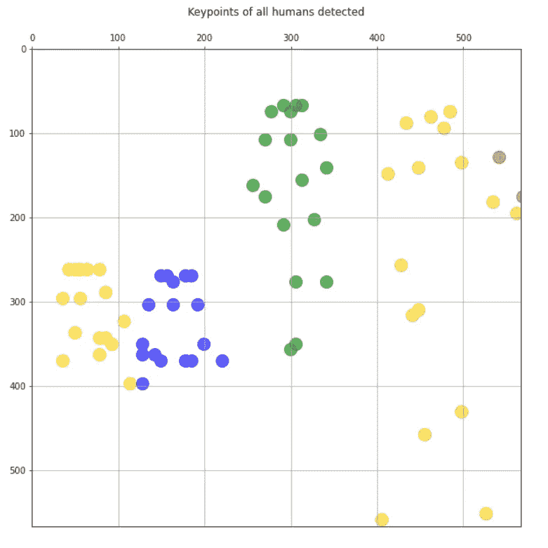

> 从读取图像路径到绘制结果，整个过程不到 0.5s，与图像中找到的人数无关。

让我们把它复杂化，看一个图像，当一对夫妇跳舞时，人们更加“混杂”:

```
image_path = '../images/figure-836178_1920.jpg
img, hum = get_human_pose(image_path)
plot_img(img, axis=False)
```

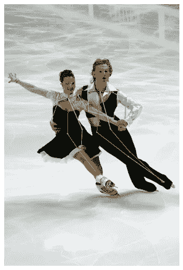

图片来源: [Pixabay](https://pixabay.com/es/photos/figura-patinaje-campeonatos-836178/)

结果似乎也很好。让我们只画关键点，每个人用不同的颜色:

```
plt.figure(figsize=(10,10))
plt.axis([0, img.shape[1], 0, img.shape[0]])  
plt.scatter(*zip(*keypoints_1), s=200, color='green', alpha=0.6)
plt.scatter(*zip(*keypoints_2), s=200, color='yellow', alpha=0.6)
ax=plt.gca() 
ax.set_ylim(ax.get_ylim()[::-1]) 
ax.xaxis.tick_top() 
plt.title('Keypoints of all humans detected\n')
plt.grid();
```

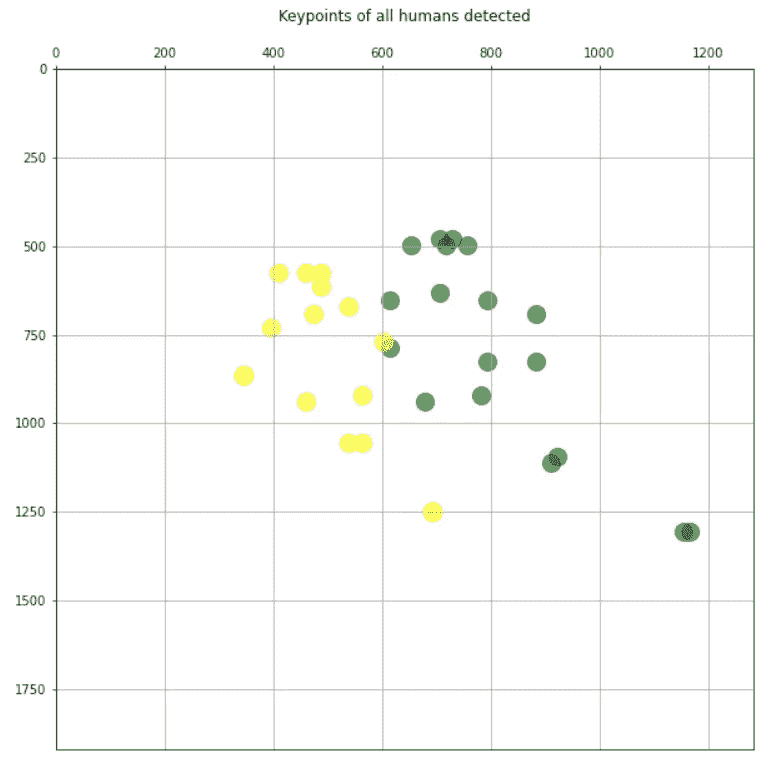

# 第 3 部分:视频和现场摄像机中的姿态估计

在视频中获取姿态估计的过程与我们处理图像的过程相同，因为视频可以被视为一系列图像(帧)。建议跟着小节走，尽量重现 Jupyter 笔记本: [20_Pose_Estimation_Video](https://github.com/Mjrovai/TF2_Pose_Estimation/blob/master/20_Pose_Estimation_Video.ipynb) 可从 Project GitHub 下载。

OpenCV 在处理视频方面做得非常出色。

因此，让我们获取一个. mp4 视频，并通知 OpenCV 我们将捕获它的帧:

```
video_path = '../videos/dance.mp4
cap = cv2.VideoCapture(video_path)
```

现在让我们创建一个捕捉每一帧的循环。有了框架，我们将应用 e.inference()，从结果中，我们将绘制骨架，就像我们对图像所做的一样。结尾包含了一段代码，用于在按下某个键(例如“q”)时停止播放视频。

下面是必要的代码:

```
fps_time = 0while True:
    ret_val, image = cap.read() humans = e.inference(image,
                         resize_to_default=(w > 0 and h > 0),
                         upsample_size=4.0)
    if not showBG:
        image = np.zeros(image.shape)
        image = TfPoseEstimator.draw_humans(image, humans, imgcopy=False) cv2.putText(image, "FPS: %f" % (1.0 / (time.time() - fps_time)), (10, 10),
                cv2.FONT_HERSHEY_SIMPLEX, 0.5, (0, 255, 0), 2)
    cv2.imshow('tf-pose-estimation result', image)
    fps_time = time.time()
    if cv2.waitKey(1) & 0xFF == ord('q'):
        breakcap.release()
cv2.destroyAllWindows()
```

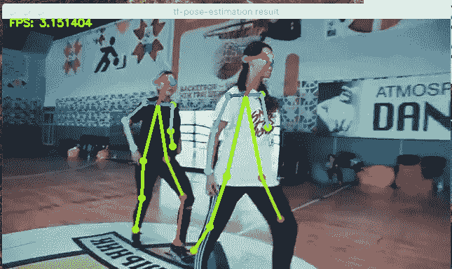

图片来源: [tf-pose-estimation GitHub](https://github.com/ildoonet/tf-pose-estimation/tree/master/etcs) 上的视频截图

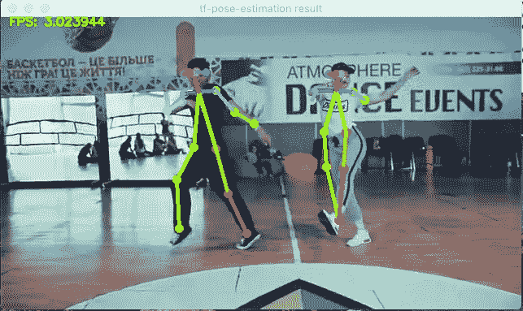

图片来源:截图自 [tf-pose-estimation GitHub](https://github.com/ildoonet/tf-pose-estimation/tree/master/etcs) 上的视频样本

结果很棒，但是有点慢。最初大约 30 FPS(每秒帧数)的电影将在“慢速相机”中运行，大约 3 FPS。

这是另一个经历，电影放了两次，记录了有背景视频和没有背景视频的姿态估计骨架。视频是手动同步的，但如果结果不完美，那就太棒了。我剪掉了 1928 年卓别林电影《马戏团》的最后一个场景，流浪汉走路的方式很经典。

## 用现场摄像机测试

建议按照小节，尝试重现 Jupyter 笔记本:[30 _ Pose _ Estimation _ Camera](https://github.com/Mjrovai/TF2_Pose_Estimation/blob/master/30_Pose_Estimation_Camera.ipynb)可从 Project GitHub 下载。

运行现场摄像机所需的代码与视频使用的代码几乎相同，只是 OpenCV videoCapture()方法将接收一个整数作为输入参数，该整数表示使用的是什么真实摄像机。例如，内置摄像头使用“0”，外置摄像头使用“1”。此外，相机应设置为捕捉模型使用的“432x368”帧。

参数初始化:

```
camera = 1
resize = '432x368'     # resize images before they are processed
resize_out_ratio = 4.0 # resize heatmaps before they are post-processed
model = 'mobilenet_thin'
show_process = False
tensorrt = False       # for tensorrt processcam = cv2.VideoCapture(camera)
cam.set(3, w)
cam.set(4, h)
```

代码的循环部分应该与视频中使用的非常相似:

```
while True:
    ret_val, image = cam.read() humans = e.inference(image,
                         resize_to_default=(w > 0 and h > 0),
                         upsample_size=resize_out_ratio)
    image = TfPoseEstimator.draw_humans(image, humans, imgcopy=False)
    cv2.putText(image, "FPS: %f" % (1.0 / (time.time() - fps_time)), (10, 10),
                cv2.FONT_HERSHEY_SIMPLEX, 0.5, (0, 255, 0), 2)
    cv2.imshow('tf-pose-estimation result', image)
    fps_time = time.time()
    if cv2.waitKey(1) & 0xFF == ord('q'):
        breakcam.release()
cv2.destroyAllWindows()
```

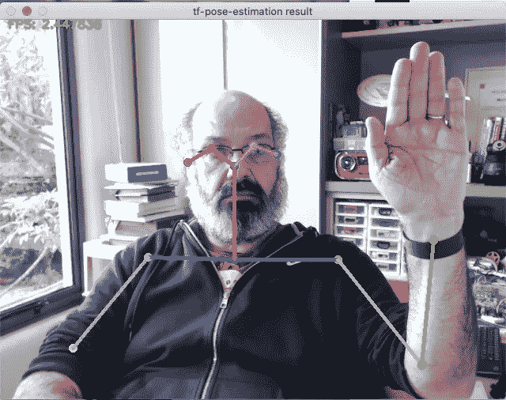

图片来源:PrintScreen 作者的网络摄像头

同样，当使用该算法时，30 FPS 的标准视频捕获减少到大约 10%。这里有一个完整的视频，可以更好地观察到延迟。然而结果却是极好的！

# 结论

一如既往，我希望这篇文章可以激励其他人在 AI 的奇幻世界中找到自己的路！

本文中使用的所有代码都可以从 GitHub 项目下载:[TF2 _ 姿势 _ 估计](https://github.com/Mjrovai/TF2_Pose_Estimation)

来自世界南方的问候！

我的下一篇文章再见！

谢谢你

马塞洛

