# 使用模块化神经网络进行推理

> 原文：<https://towardsdatascience.com/reasoning-using-modular-neural-networks-f003cb6109a2?source=collection_archive---------55----------------------->

## 一种解决人工智能问题的创新解决方案

模块化背后的基本思想是:应对复杂挑战的最佳方法不是执行一个巨大的任务，而是一个由独立且基本独立的子任务组成的系统，这些子任务朝着一个大目标共同工作。这个概念有一个**生物学基础**。大脑中有专门的功能区域，它们是不同认知过程的特定领域。外侧膝状体(LGN)位于大脑的丘脑部分，分为几层，分别处理颜色和对比度:这两个视觉的主要组成部分。**模块化神经网络**利用这种思想解决**复杂** **人工智能问题**。几个**独立的**神经网络被同时训练用于特定的子任务，并且它们的结果在最后被组合以执行单个任务。模块化神经网络的优势包括:

*   简单
*   技术组合
*   可量测性
*   效率

众所周知，人工智能天生没有语言，所以我们的工作就是训练我们的模型对给定的文本进行推理。所谓推理，我们指的是算术、排序、比较和计数等任务。

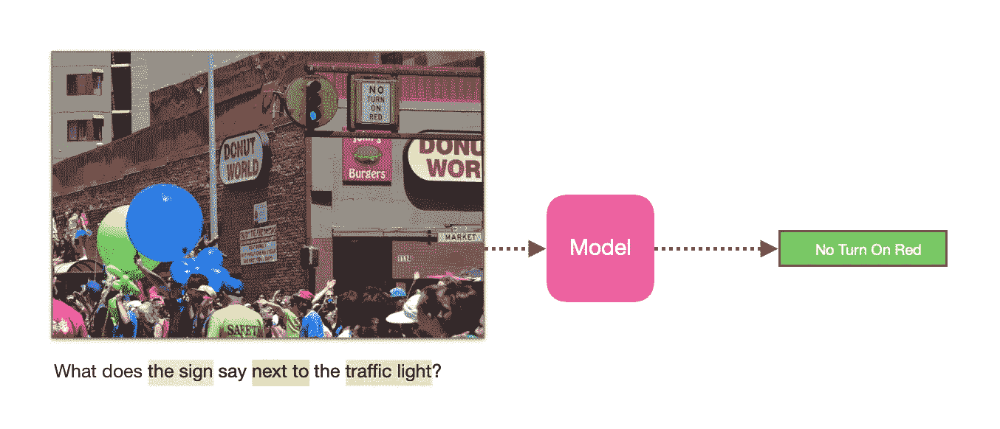

图 1:视觉问答是回答关于图像的问题的任务，以表明系统理解图像。

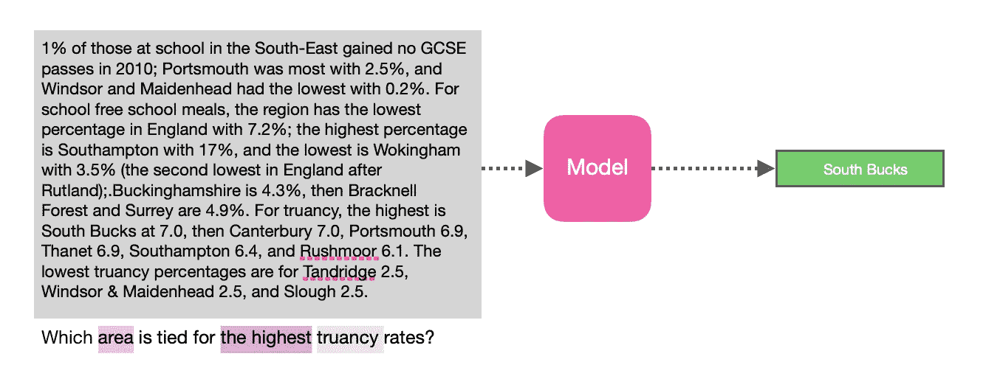

图 2:阅读理解是回答关于一段文字的问题，以表明系统理解了这段文字。

假设我们要创建一个**问答系统**，图 1 和图 2 说明了 QA 模型是如何工作的！

考虑这个问题“交通灯旁边的标志说什么？”在图 1 中。**回答这样一个问题需要多个推理**步骤:找到图像中的所有“标志”，找到“红绿灯”，选择“红绿灯旁边”的标志，然后找到“它说的是什么”。或者图 2 中的问题:首先我们需要找出给定文本中所有的逃课率，挑出最高的一个，然后找出“并列哪个区域”。我们希望开发能够理解此类复杂问题的**组合语义**的模型，以便提供**正确答案**。

NMNs 能够提供这样的推理。使用给定的问题，模型组装一个具体的网络架构，然后执行组装的神经模块网络以输出答案，如图 3 和图 4 所示。

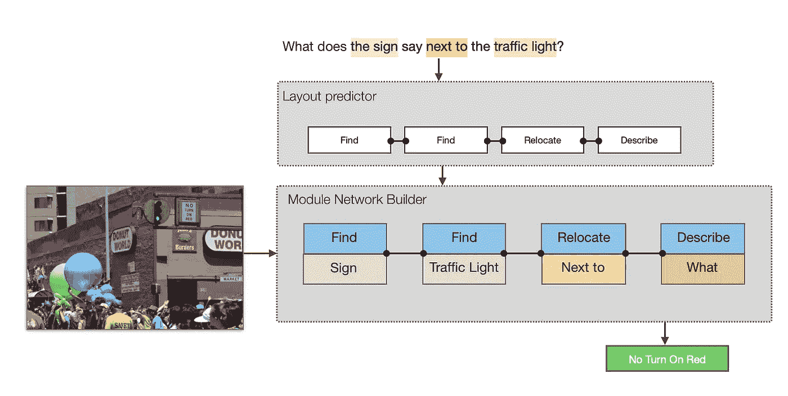

图 3:对于每个实例，模型首先预测布局，然后使用图像特征，它执行组装的神经模块网络来输出答案。

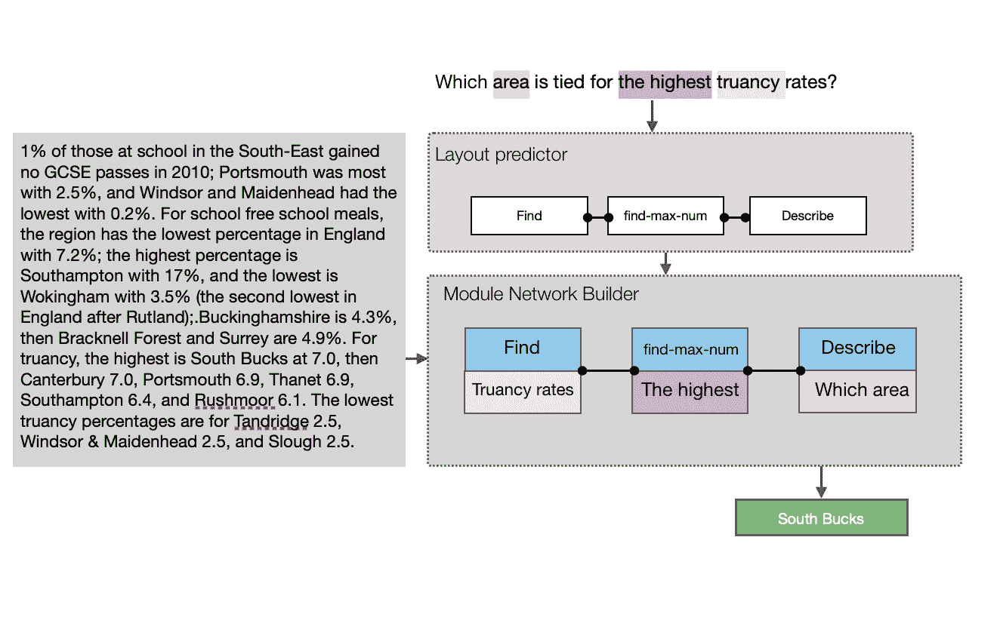

图 4:对于每个实例，模型首先预测布局，然后使用文本特征，它执行组装的神经模块网络来输出答案。

# 布局预测器

为了解决质量保证问题，制作了许多不同的模型布局。最近一篇关于这一主题的文献综述发现，他们中的大多数在特定形式的问题上表现突出。创建灵活布局组件是为了利用所有这些不同的模型。为了找到特定问题 ***q*** 的最佳布局 ***l*** ，需要先计算概率分布 p(***l***|**|*q***)，然后使用**波束搜索**，**最大概率布局**将在后面定义。假设每一层都是一系列模块:

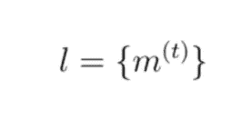

由于我们有一个序列形式的模块，注意 LSTM 模型可以用来寻找每个可能的布局的概率分布。首先，我们把问题特征 fQ(q)交给 LSTM 模型来生成一个隐藏状态:

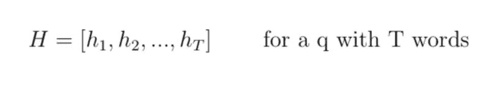

输入问题单词的注意权重被预测为:

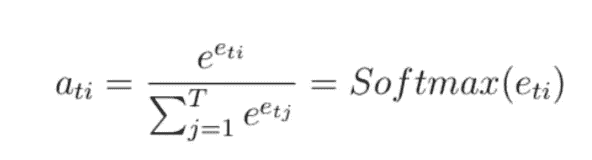

其中 ***e_ti*** 为对准模型，其定义为

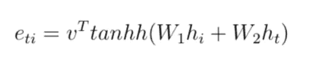

其中 ***h_i*** 和 ***h_t*** 分别是编码器和解码器的 LSTM 输出。则上下文向量被计算为

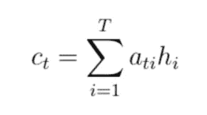

该上下文向量将用于计算下一个模块的概率

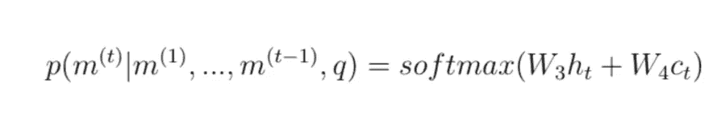

最后， ***l*** 的概率分布定义如下

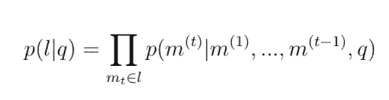

# 模块

创建模块是为了独立执行基本的推理任务。把它们想象成接受注意力向量、文本或图像特征的函数，它们有一些内部参数来执行某种计算。让我们来看一些例子:

## 查找[x]

***VQA 的*** 模块**将输入图像中的每个位置与一个权重向量**进行卷积(对每个 x 都不同)以产生一个关注。

## 查找最大数量

给定一段话，这个模块首先计算一个数字**记号分布 T** ，然后用这个来计算每个数字记号是具有最大值的那个的概率**。**

**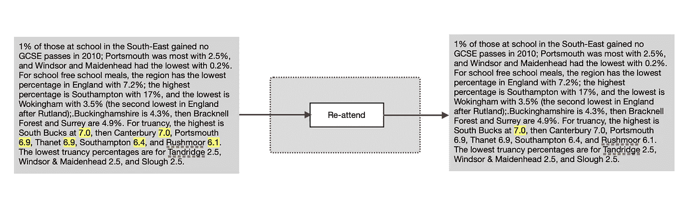**

## ****和/或****

*****和*** 和 ***或*** *模块*以两幅图像注意力为输入，分别返回它们的**交集**或**并集**。**

****

## **重新安置**

**重定位模块将输入图像映射改变为**新的注意力映射**，这对于**空间关系**是有用的。**

**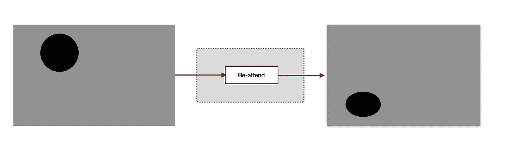**

# **端到端培训**

**像其他神经网络一样，在训练过程中，目标是最小化损失。但这里不同的是，模型**共同学习****预测布局** p(l|q)和各个模块中的**参数**。**

# **参考资料:**

**Hu R，Andreas J，Rohrbach M，Darrell T，Saenko K .学习推理:用于视觉问题回答的端到端模块网络。IEEE 2017 年计算机视觉国际会议论文集(第 804–813 页)。**

**用于文本推理的神经模块网络。arXiv 预印本 arXiv:1912.049712019 年 12 月 10 日。**

**[Andreas J，Rohrbach M，Darrell T，Klein D .神经模块网络。2016 年 IEEE 计算机视觉和模式识别会议论文集(第 39–48 页)。](https://arxiv.org/pdf/1511.02799.pdf)**

**[Hubel DH，Livingstone MS .猕猴外侧膝状体和初级视皮层的颜色和对比敏感度。神经科学杂志。1990 年 7 月 1 日；10(7):2223–37.](https://www.jneurosci.org/content/jneuro/10/7/2223.full.pdf)**