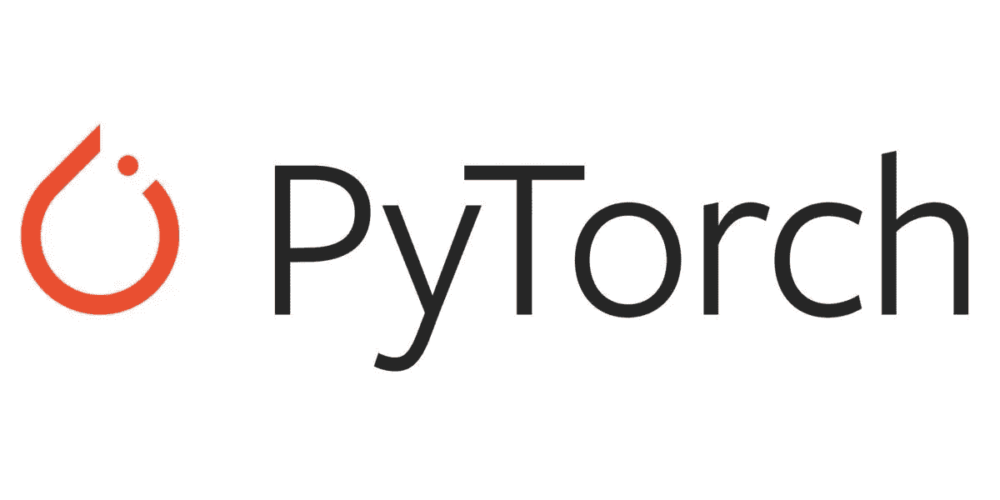
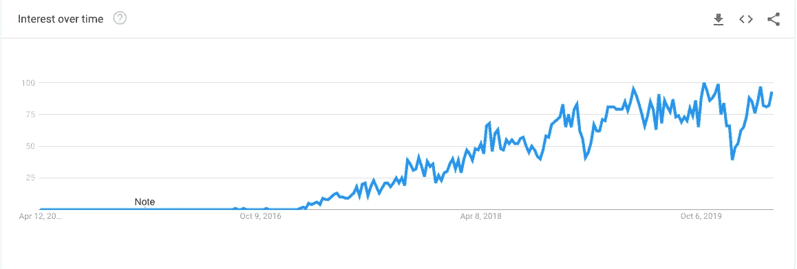
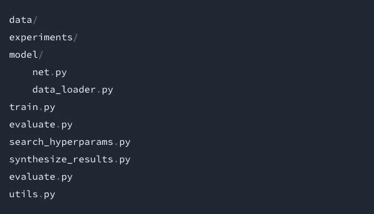
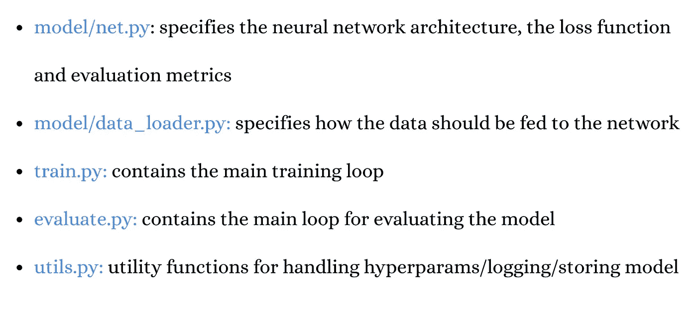
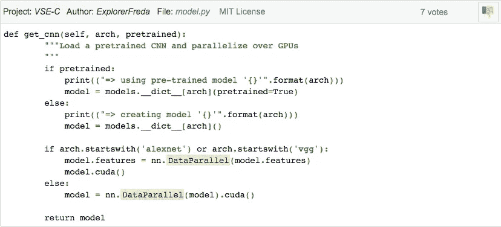
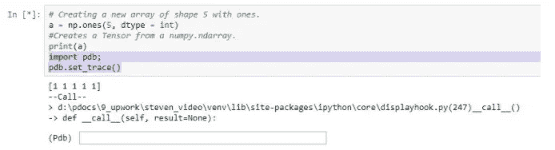
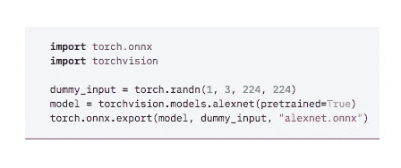

# 选择 PyTorch 进行深度学习的理由

> 原文：<https://towardsdatascience.com/reasons-to-choose-pytorch-for-deep-learning-c087e031eaca?source=collection_archive---------31----------------------->

## PyTorch 可以为深度学习程序员提供很多东西

> 在过去的几年里，深度学习和**机器学习**一直是每个人最热门的词汇，对此有一个完美的解释。

机器学习使系统能够从经验中学习，而深度学习通过使用扩展的数据集将机器学习带到了更大的规模。ML 和 DL 中的这种提升导致了各种编程语言******s**和库的出现，并使**程序员****研究人员**和**数据科学家**实现了不可想象的事情。最佳深度倾斜库的一些最强有力的竞争者是**和 [**PyTorch**](https://pytorch.org/) 。现在，我们将更多地关注 PyTorch。******

# ****PyTorch****

> ****[**脸书在 **2016** 发布了针对编程场景的 PyTorch**](https://ai.facebook.com/tools/pytorch/) ，基于 **Lua 的 Torch 库**。****

****PyTorch 是一个**免费开源的机器学习库**，目前是[**1.4**](https://pytorch.org/blog/pytorch-1-dot-4-released-and-domain-libraries-updated/)。PyTorch 已经出局快三年了，已经经历了大量的改进，现在处于一个更好的位置。PyTorch 被创造出来是为了感觉比其他对手更快、更敏捷。还包括**对 C、C++和张量计算的支持**。****

******谷歌趋势— PyTorch 兴趣随时间变化******

********

****谷歌趋势([来源)](https://trends.google.com/trends/explore?date=today%205-y&geo=US&q=pytorch)****

# ****选择 PyTorch 进行深度学习的理由****

****在解释为什么不应该尝试 PyTorch 之前，下面是一些**独特而令人兴奋的深度学习项目和库** PyTorch 已经帮助诞生了:****

****● **CheXNet:** 利用深度学习对胸部 x 光片进行放射科医生级别的肺炎检测。****

****● **地平线:**应用强化学习(Applied RL)的平台****

****● **PYRO** : Pyro 是用 Python 编写的通用概率编程语言(PPL)，后端由 PyTorch 支持。****

****● **高岭土**由 **NVIDIA** 作为 PyTorch 库，用于加速 3D 深度学习****

****● **TorchCV** 用于在您的项目中实施计算机视觉****

****● **PyDLT** 作为一套深度学习的工具****

****● **fastai** 库优化您的神经网络训练过程****

****● **还有很多。******

****这是一些构建在 TensorFlow 和 PyTorch 之上的框架和项目。你可以在 Github 以及 TF 和 PyTorch 的官网上找到更多。****

****PyTorch:一个开源的 ML 框架****

****在一个张量流的世界里， **PyTorch** 凭借自己的优势能够独当一面。以下是一些亮点，解释了 PyTorch 为什么适合您的**深度学习项目:******

# ******1。** **PyTorch 更是蟒******

> ****PyTorch **是**一个 go to 框架，它让我们以更****python 式**的方式编写代码。此外，它支持使用简单的 python 代码**的那种动态性**是显著的。******

****与其他库相比，PyTorch 更倾向于 Python。这是因为 PyTorch 相对来说**容易理解**，而且感觉更**自然**，**原生**和**符合 Python 代码**。对于任何使用过 Python 的人来说，他们会对 PyTorch 的一切如鱼得水，比如损失函数、优化器、转换、数据加载器和更多的类。****

> ****每个 PyTorch 示例(Vision 和 NLP)的代码共享一个公共结构:****

********

****PyTorch 示例([来源](https://cs230.stanford.edu/blog/pytorch/))****

********

****PyTorch 示例([来源](https://cs230.stanford.edu/blog/pytorch/))****

# ******2。** **好用******

****与 PyTorch 相比，TensorFlow 的学习曲线相对较陡。Python 程序员将需要更少的时间来适应 PyTorch，因为对他们来说，它更像是 Python 框架的扩展。简单的调试和一套简单的 API 在让程序员更容易掌握 PyTorch 的过程中起到了关键的作用。****

****塞斯·梅耶斯 Boom GIF By [深夜与塞斯·梅耶斯](https://www.nbc.com/late-night-with-seth-meyers)****

# ****3.有用的库****

****巨大的社区支持带来了对社区的巨大热情和贡献。使用 PyTorch，程序员们已经创建了一些项目，任何有兴趣的人都可以一睹为快。下面是这些项目在不同领域的综合列表，如**计算机视觉**、**自然语言处理**和生成库:****

****● pro_gan_pytorch 利用 ProGAN 功能****

****●使用贝叶斯优化的 BoTorch****

****● ParlAI 用于共享、培训和测试对话模型****

****● OpenNMT-py 用于实现神经机器翻译系统****

****● MUSE 用于多语言单词嵌入****

****● skorch 用于将 scikit-learn 代码与 PyTorch 融合****

# ****4.轻松的数据并行****

****PyTorch 中的数据并行是高效的，并允许您**将数据分成批次**，然后发送到多个 GPU 进行处理。使用这种技术，PyTorch 可以将大量工作负载从 CPU 转移到 GPU。对于[数据并行](https://pytorch.org/tutorials/beginner/blitz/data_parallel_tutorial.html)，它使用 torch.nn.DataParallel 类。****

******分布式数据并行**是 PyTorch 的一项功能，您可以将它与数据并行相结合，以处理需要大型数据集和模型的用例，这些数据集和模型对于单个 GPU 来说足够大。当 GPU 池中的所有任务都完成后，结果会被收集、合并并通过数据并行发送给您。****

********

****Pytorch 数据并行([来源](https://www.programcreek.com/python/example/107676/torch.nn.DataParallel))****

# ****5.**优秀的研究人员******

****PyTorch 是研究人员的天赐之物，因为它被证明被至少 70%从事框架工作的研究人员所使用。尽管 TensorFlow 是开发应用程序的行业领先选择，但在这方面还没有赶上 PyTorch。这背后的一个原因可能是 PyTorch 必须提供更好的性能的简单易用性。****

****做得好竖起大拇指 GIF 由[新希望俱乐部](http://www.newhopeclub.lnk.to/)****

# ****6.**移动就绪******

****[**从 v1.3**](https://pytorch.org/blog/pytorch-1-dot-3-adds-mobile-privacy-quantization-and-named-tensors/) 开始，PyTorch 增加了**对 Android 和 iOS 设备上部署的支持**。该特性将 PyTorch 的所有优势带到了边缘设备，以满足要求更低延迟的应用。PyTorch mobile 的目标是通过支持移动平台的基础 API 来缩短开发周期，消除导出到 Caffe2 等移动框架的需要。这可以显著减少设备占用空间。为了更好的控制，还增加了对构建脚本精确微调的支持。****

****【PyTorch 手机入门:****

> ****开始使用 [Android](https://pytorch.org/mobile/android)****
> 
> ****开始使用 [iOS](https://pytorch.org/mobile/ios)****

**** [## PyTorch

### 随着应用继续要求更低的延迟，在边缘设备上运行 ML 变得越来越重要。这也是一个…

pytorch.org](https://pytorch.org/mobile/home/) 

# 7.**简单调试**

PyTorch 很容易调试，因为你可以选择访问每一行，并在每一行之后打印。锦上添花的是 PyTorch 中的对象和操作包含了[实际数据](https://blog.digitalogy.co/data-breaches-what-you-need-to-know-about-this-threat-now/)而不是符号引用，这使得程序员的生活更加轻松。PyTorch 的一些标准调试器是:

● [ipdb](https://pypi.org/project/ipdb/)

● [pdb](https://docs.python.org/3/library/pdb.html)

● PyCharm

**比如说**你可以使用 pdb 的“pdb.set_trace()”函数在你的代码中放置断点，向下钻取错误的根源。此外，PyTorch 的动态计算图允许在代码执行时进行动态修改和快速调试。

使用 pdb 进行 PyTorch 调试([来源](https://heartbeat.fritz.ai/10-reasons-why-pytorch-is-the-deep-learning-framework-of-future-6788bd6b5cc2))

# 8.**支持 ONNX**

[**开放神经网络交换**](https://pytorch.org/docs/master/onnx.html) 作为[人工智能](https://becominghuman.ai/10-artificial-intelligence-applications-that-can-generate-code-themselves-3eb9791c995e)的**开源生态系统**，为 AI 程序员提供了一个可互换地在各种框架、工具和库上工作的公共基础。ONNX 通过提供一种跨多种框架和硬件工作的标准文件格式来做到这一点。

说到 PyTorch，ONNX 自带了对 PyTorch 的内置支持，以及一系列其他框架，比如 Caffe2、MXNet、TensorFlow 等等。ONNX 使得人工智能程序员更容易将他们的 PyTorch 模型导出和迁移到其他框架可以集成的开放格式。

PyTorch 原生 ONNX 支持([来源](https://pytorch.org/features/))

# 9.**支持动态计算图形**

PyTorch 将每个模型视为有向无环图，提供了一种定义计算图的动态方法。虽然其他框架允许静态图定义，但是 PyTorch 支持创建一个动态计算图[,您可以在其中自由地操作它。从 PyTorch 的动态特性中获益最多的一个元素是递归神经网络。](https://medium.com/intuitionmachine/pytorch-dynamic-computational-graphs-and-modular-deep-learning-7e7f89f18d1)

# 10.强大的社区支持

PyTorch 还提供**出色的社区支持**。PyTorch 的**主页有**关于它每个特性的详细文档**。库的所有最新更新都有很好的解释。随着每一个新的加入， [**支持性教程**](https://pytorch.org/tutorials/) 以及相关资源也可以找到，以获得那种宝贵的动手感受。**

PyTorch 论坛是一个非常棒的地方，强烈推荐新手发表他们的问题，老手与其他程序员分享他们的想法。每天有一百多个帖子，这个社区非常活跃，鼓励人们加入 PyTorch。

这里有一些 **PyTorch 开发人员社区**、**资源**和**教程**来贡献、学习和回答您的问题——

> ● [PyTorch 讨论表](https://discuss.pytorch.org/)
> 
> ● [PyTorch Slack 社区](https://docs.google.com/forms/d/e/1FAIpQLSeADnUNW36fjKjYzyHDOzEB_abKQE9b6gqqW9NXse6O0MWh0A/viewform)
> 
> ● [PyTorch 示例](https://github.com/pytorch/examples/)
> 
> ● [PyTorch Docs](https://pytorch.org/docs/stable/index.html)
> 
> ● [Github Pytorch 教程](https://github.com/pytorch/tutorials)
> 
> ● [PyTorch 初学者备忘单](https://pytorch.org/tutorials/beginner/ptcheat.html)
> 
> ● [PyTorch 发行说明](https://github.com/pytorch/pytorch/releases)
> 
> ●[py torch 深度学习:60 分钟闪电战](https://pytorch.org/tutorials/beginner/deep_learning_60min_blitz.html)
> 
> ● [使用 Colab 中 Google Drive 的教程数据](https://pytorch.org/tutorials/beginner/colab.html)
> 
> ● [中文文档和教程](https://pytorch.apachecn.org/)
> 
> ● [韩语教程](https://tutorials.pytorch.kr/)**** 

# **结论**

**PyTorch 为深度学习程序员提供了大量直观的功能，可以为各种技能水平的人提供很多东西。尽管 PyTorch 提供了一个简单的入口点，但也不能掉以轻心，因为它提供的特性不仅在某些方面提供了更好的性能，而且还提供了额外的独特特性。我们讨论了 PyTorch 的一些最常被谈论的特性，以帮助您实现向 PyTorch 的转变，而您对此一直持怀疑态度。**

# **更多有趣的阅读—**

**我希望这篇文章对你有用！下面是一些有趣的读物，希望你也喜欢**

** [## 机器学习和深度学习的最佳 Python 库

### 现代机器学习模型和项目的 Python 库

towardsdatascience.com](/best-python-libraries-for-machine-learning-and-deep-learning-b0bd40c7e8c)  [## 面向所有人的顶级谷歌人工智能工具

### 使用谷歌人工智能中心将想法变为现实

towardsdatascience.com](/top-google-ai-tools-for-everyone-60346ab7e08)  [## 2020 年人工智能工程师的顶级编程语言

### 从几种编程语言中，人工智能工程师和科学家可以挑选出适合他们需要的语言

towardsdatascience.com](/top-programming-languages-for-ai-engineers-in-2020-33a9f16a80b0)  [## 哪个深度学习框架发展最快？

### TensorFlow 与 PyTorch

towardsdatascience.com](/which-deep-learning-framework-is-growing-fastest-3f77f14aa318) 

> **关于作者**
> 
> **克莱尔 D** 。是[**Digitalogy**](https://www.digitalogy.co/)**—**的内容制作者和营销人员，这是一个技术采购和定制匹配市场，根据全球各地的特定需求，将人们与预先筛选的&顶尖开发人员和设计师联系起来。在[**Linkedin**](https://www.linkedin.com/company/digitalogy)[**Twitter**](https://twitter.com/DigitalogyCorp)[**insta gram**](https://www.instagram.com/digitalogycorp)上连接 **Digitalogy** 。**