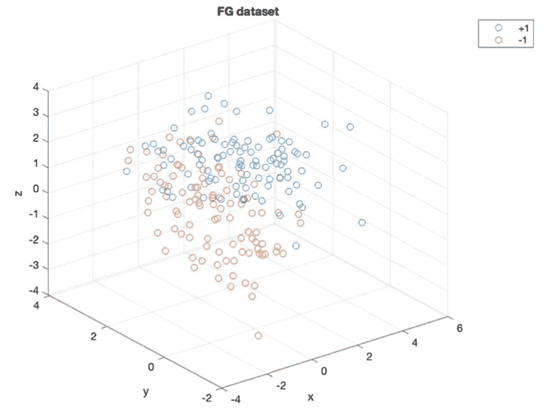
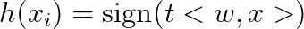
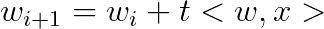
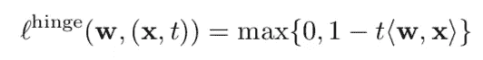
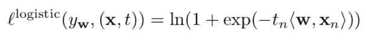
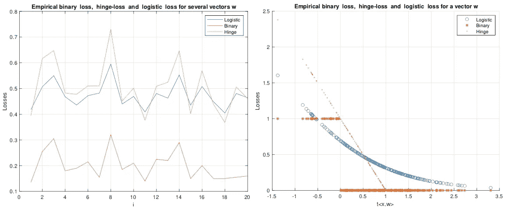
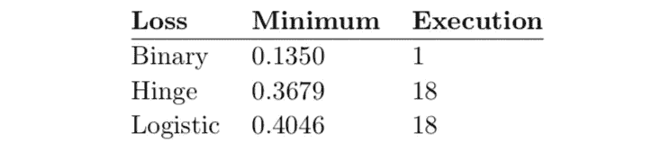
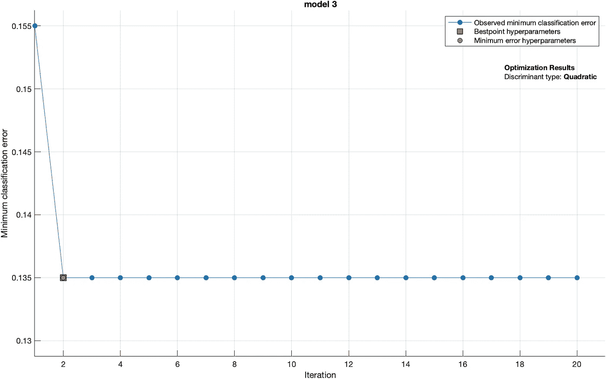

# 代理损失函数对机器学习中的分类至关重要的原因

> 原文：<https://towardsdatascience.com/reasons-why-surrogate-loss-functions-are-pivotal-for-classification-in-machine-learning-e33974ce6d29?source=collection_archive---------30----------------------->

作者图片—巴西卡诺阿·克夫拉达

这篇文章将深入探究机器学习中分类的铰链损失、逻辑损失和二进制损失背后的概念和理论。我们将在 MATLAB 上实现感知器算法，看看如何基于代理损失函数选择最佳分类器。

在这篇文章结束时，你将知道如何使用感知器进行分类，以及每个损失函数的优缺点。

# 资料组

我们将使用 N = 200 个数据点的三维数据集。这个数据集最初是由 Ruth Urner 博士在她的一次机器学习课程作业中提出的。在下面的库中，你会发现两个 TXT 文件: [fg_inputs.txt](https://github.com/jaimedantas/perceptron-classification/blob/main/dataset/fg_inputs.txt) 和 [fg_outputs.txt](https://github.com/jaimedantas/perceptron-classification/blob/main/dataset/fg_outputs.txt) 。

 [## jaimedantas/感知器-分类

### 感知器算法用于机器学习中的线性分类。感知器在 MATLAB 上实现…

github.com](https://github.com/jaimedantas/perceptron-classification) 

这些文件包含输入和输出向量。使用 MATLAB，我们可以在 Home > Import Data 中导入它们。现在，让我们绘制这个数据集。

数据集 FG

# 感知器

感知器算法是最古老的机器学习算法之一，至今仍被广泛使用。它用于不同类型数据集的线性分类。感知器是用于二进制分类的许多算法之一，它非常容易理解。我推荐阅读这篇简短的[文章](https://en.wikipedia.org/wiki/Perceptron)，这样你可以详细了解它是如何工作的。如果你真的想学习背后的数学，这些[讲座](https://www.cs.cornell.edu/courses/cs4780/2018fa/lectures/lecturenote03.html)可能会帮助你。

长话短说，感知器的工作方式是通过分析 **x** 和 **w** 乘以其标签 **t** 之间的点积信号。

每次 ***h(x)*** 小于或等于 **0** ，我们就用一个新值更新 **w** 。

说的够多了，还是在 MATLAB 上实现吧！我在 MATLAB 上创建了一个实现感知器算法的函数。它接收输入矩阵 **x** 和标签向量 **t** 。我做的第一件事是在**x**【4】中添加一列 1。

然后，我将 **x** 和 **t** 连接起来。这样做的原因是因为这样会更容易打乱数据。我使用了 MATLAB 的函数 *randperm()* 对数据集进行混洗。之后，我用零初始化了向量 **w** 。由于我们正在添加术语 *b* ，即 *w0* ，我将用*b = 0*【2】*进行初始化。*

我还在变量*更新*中跟踪算法在数据集上运行的次数。最后，在算法的最后，我执行了向量**w**【3】的欧几里德归一化。算法如下所示。

为了运行我们的函数，我们必须在 MATLAB 的命令窗口中执行命令**【w，updates】=感知器(输入，输出)**。

感知器函数将返回标准化向量 **w** 和执行的更新次数。

# 替代损失函数分析

为了计算损失，我执行感知器函数 20 次，每次用存储向量**。我还在矩阵中添加了一列 1**

让我们首先计算预测值的经验**二进制损失**，并在向量*二进制损失*中对它们进行平均。这个损失函数由下面的等式给出[4]。

对**铰链损失**进行相同的处理。然而，这一次的损失由下式给出:

最后，我计算了**物流损失**。

为了分析这个数据集的训练损失，我创建了[compare _ loss . m](https://github.com/jaimedantas/perceptron-classification/blob/main/code/compare_losses.m)脚本来绘制 20 次执行的三次损失。

下图的左图显示了 20 次执行的损失。从那里，我们可以注意到，二进制损失是所有三个损失中最小的。此外，替代损失是一个更加明确的指标，现在我们的分类器的“好”。当我们看一看执行 *i = 17* 和 *i = 18* 时，我们就能明白其中的原因。虽然它们的二进制损失大致相同，但后者的铰链和逻辑损失明显小于前者。这是因为替代损失是分类器与其在两个类中最接近的数据点之间的距离的指示器。因此，位于错误一侧的数据点会造成很大的枢纽和逻辑损失。如果数据点被正确分类，但它非常接近线，则替代损失不像二进制损失一样为零。所以， *i = 18* 的分级机比 *i = 17* 的分级机好。

左边是感知器算法的 20 次执行的二进制损失、铰链损失和逻辑损失，以及感知器算法在 200 个数据点上的一次执行(w1)的二进制损失、铰链损失和逻辑损失。根据[compare _ loss . m](https://github.com/jaimedantas/perceptron-classification/blob/main/code/compare_losses.m)脚本绘制。

当我们观察点 *i = 4* 和 *i = 5* 时，可以进行另一个很好的比较。前者具有较小的二进制损失，而后者具有较小的铰链和逻辑损失。所以，从这个分析来看， *i = 5* 中的分类器可能比 *i = 4* 更好。这使我们得出结论，物流**和铰链**和**损失**是独立于**和**损失的**。我们也可以说这两个替代损失是相互独立的。当我们观察他们在点 *i = 12* 和 *i = 13* 所采取的相反方向时，这一点可以得到证明。**

转到上图的右图，我们可以看到，当我们对一个数据点进行错误分类时，后勤损失和枢纽损失都给了我们很大的损失，当我们正确分类时，后勤损失接近于零，枢纽损失接近于零(当 t⟨ **w** ， **x** ⟩ ≥ 1 时)。另外，我们可以得出结论，当 t⟨ **w** ， **x** ⟩在 0 和 1 之间时，铰链不为零。这是因为数据点太靠近分类这两类的线[5]。

另外，当数据点分类正确但离线太近时，铰链损耗给我们一个小值。类似地，当数据点被错误地分类并且它位于离线太远的位置时，铰链和逻辑损耗给我们一个非常大的值。事实上，对于 t⟨ **w** 、 **x** ⟩的大负值，两个损失都变成平行线[5]。

对于错误分类的数据点，逻辑损失遵循铰链损失的趋势。然而，对于正确分类的数据点来说，它永远不会为零，如上图右侧的图表所示。类似地，对于太靠近线的数据点，逻辑损失分配接近 1 的误差。

最后，铰链损耗是二元损耗的上界，它比二元损耗更能证明真实损耗。下面我们可以看到每种损失类型的最小损失值。

最小损失

结果显示，二进制损失确实是最小的损失，而且是在执行中发现的 *i = 1* 。然而，最小的铰链和后勤损失是在执行 18 中发现的。这突出了使用代理函数进行二元分类的重要性。因此，给我们最小二进制损失的分类器并不总是理想的分类器。

## 使用 MATLAB

出于好奇，我决定将我们的结果与 MATLAB 上的一个现成实现进行比较。我在 MATLAB 上运行这个数据集，并使用[分类线性模块拟合一个具有 20 个交互的线性分类器。](https://www.mathworks.com/help/stats/classificationlearner-app.html)下图显示了学习者的分类错误。

MATLAB 在数据集 FG 中进行 20 次交互的线性分类的最小分类误差。

正如我们所见，MATLAB 拟合了一个误差为 **0.135** 的分类器，这恰好与运行我们的感知器算法相同。重要的是要记住，在 MATLAB 上进行比较时使用的学习算法不是感知器。我只是想说明我们的感知器实现为这个数据集估计了一个非常好的分类器。

# 结论

我们看到，与铰链和逻辑损失不同，当我们正确分类所有数据点时，二进制损失总是 **0** 。逻辑和枢纽损失表明预测者实际上“有多正确”或“有多错误”。这就是为什么最挑剔的数据点和分类器线之间的距离会影响整体损失。

因此，当选择最佳分类器时，分析替代函数被证明是最重要的，特别是当二元损失不是 **0** 时。

最后，我们看到了如何在 MATLAB 上实现 *D+ 1* 维空间的感知器算法。

# 关于我

我是约克大学的一名硕士研究生，骨子里是一名软件工程师。在过去的十年里，我一直在软件开发、云计算和系统工程等领域的几个行业工作。目前，我正在研究云计算和分布式系统。

如果你愿意，可以在我的[网站](http://jaimedantas.com/)上查看我的作品。

感谢阅读！

# 参考

[1]约西·凯舍特。多类分类。2014.网址:[https://u . cs . biu . AC . il/~ JK eshet/teaching/AML 2016/multi class . pdf](https://u.cs.biu.ac.il/~jkeshet/teaching/aml2016/multiclass.pdf)

[2]道林·耶戈。感知器:解释，实现和一个可视化的例子。2020.网址:[https://towardsdatascience . com/perceptron-explain-implementation-and-a-visual-example-3c 8e 76 B4 e 2d 1](https: //towardsdatascience.com/perceptron-explanation-implementation-and-a-visual-example- 3c8e76b4e2d1)

[3]玛丽娜·桑蒂尼。语言技术的机器学习第 9 讲:感知器。2014.网址:【http://santini.se/teaching/ml/2014/Lecture09_Perceptron.pdf 

[4] Shai Shalev-Shwartz 和 Ben-David。理解机器学习:从理论到算法。剑桥大学出版社，2014 年。DOI: 10.1017/CBO9781107298019。网址:【https://www . cs . huji . AC . il/~ shais/understanding machine learning/understanding—机器学习—理论—algorithms.pdf。

[5]基利安·温伯格。经验风险最小化-康奈尔大学。2020.网址:[https://www . cs . Cornell . edu/courses/cs 4780/2018 fa/lectures/lessons note 10 . html](https://www.cs.cornell.edu/courses/cs4780/2018fa/lectures/lecturenote10.html)