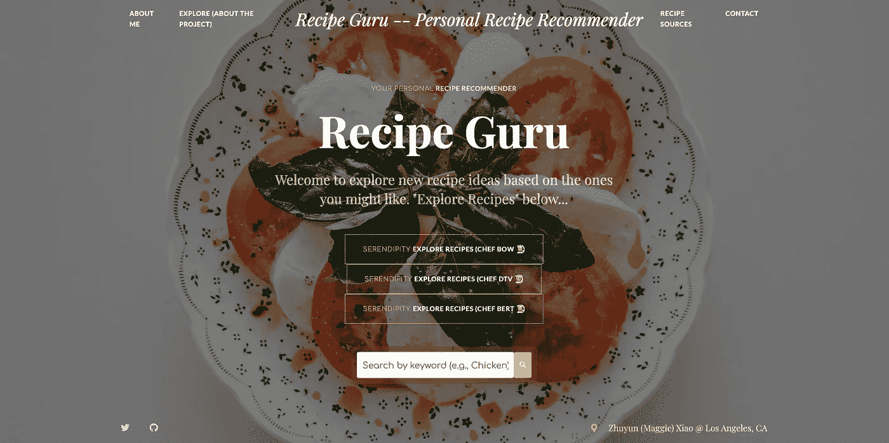
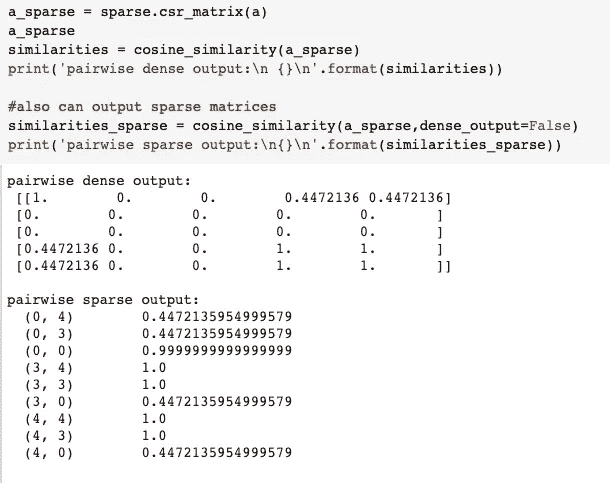
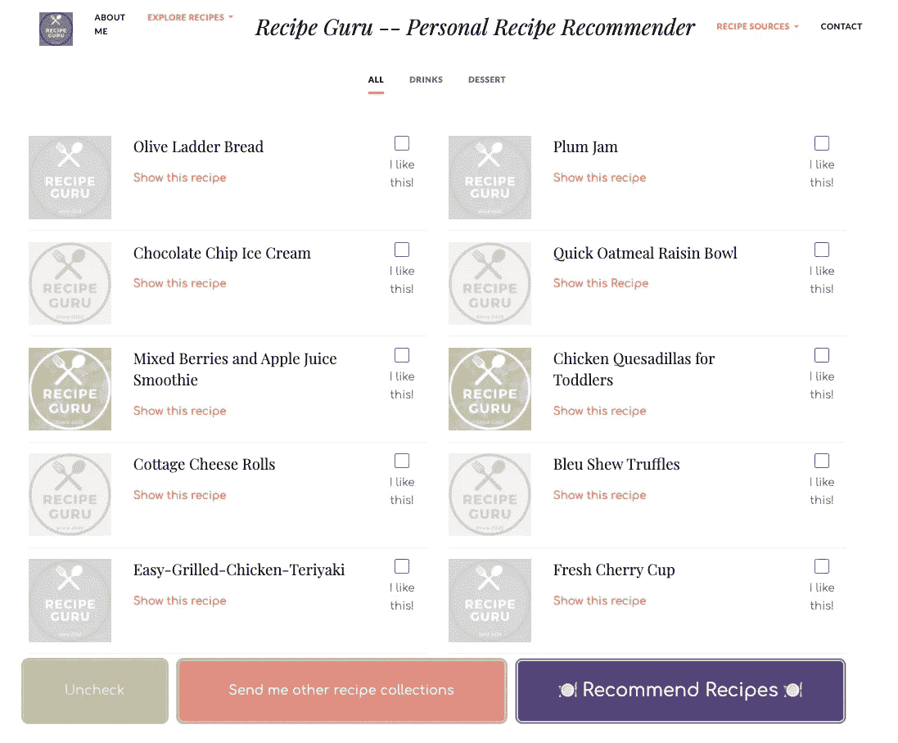
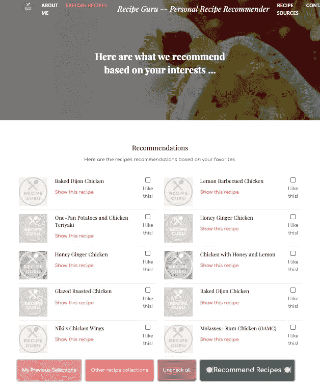
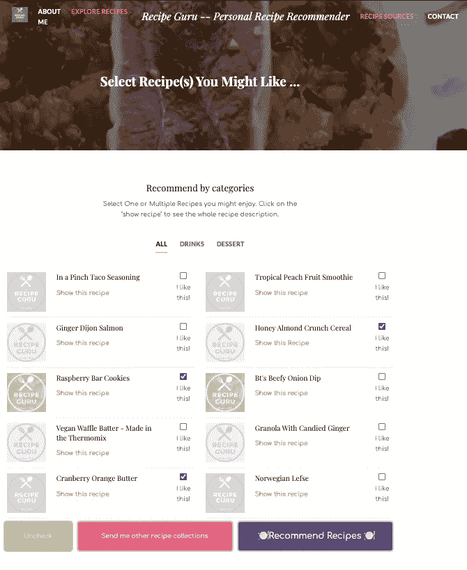
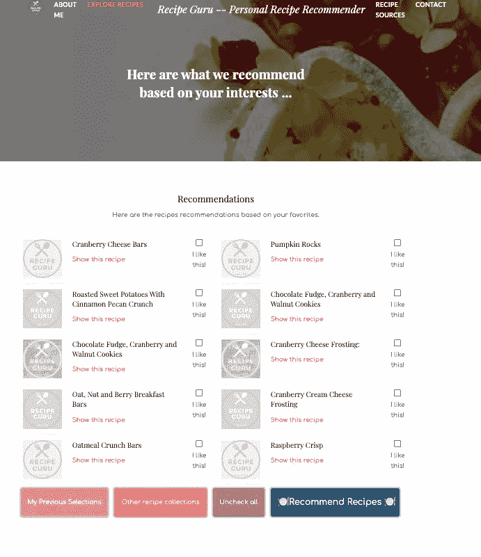
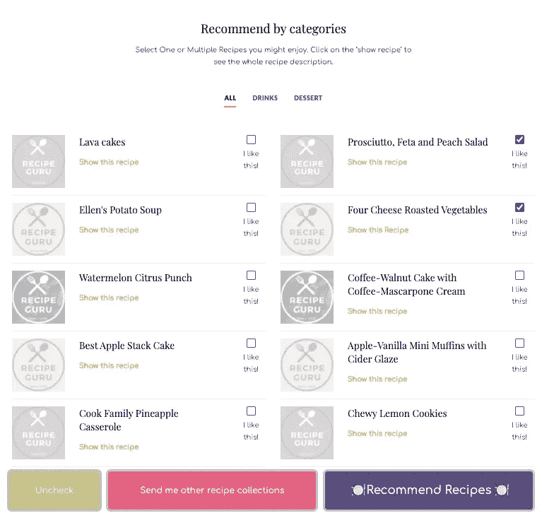
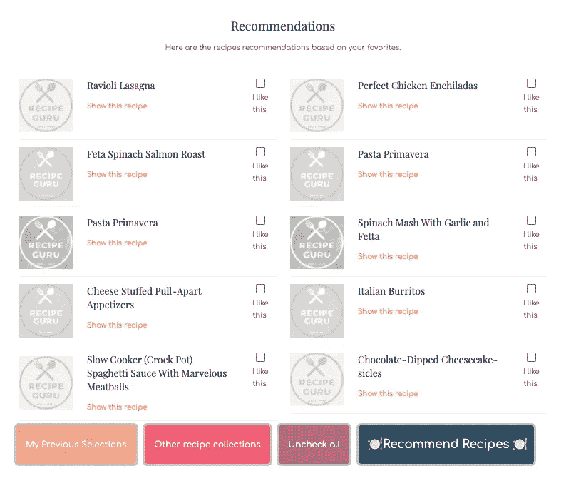
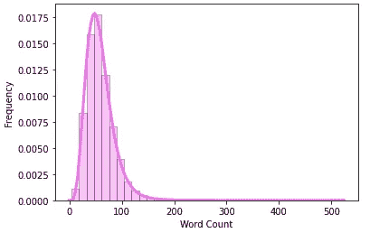
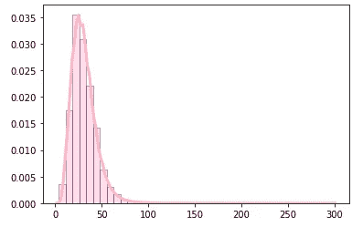

# 食谱大师，一个基于自然语言处理的食谱推荐网站

> 原文：<https://towardsdatascience.com/recipe-guru-a-recipe-recommendation-web-app-based-on-nlp-a3290d79da2f?source=collection_archive---------35----------------------->

## 在这篇博文中，我将回顾一下我的食谱推荐网络应用[“食谱大师”](https://recipe-guru-rec.herokuapp.com/main)的流程和技术细节，以及一些代码片段。


[贝卡·泰普特](https://unsplash.com/@beccatapert?utm_source=medium&utm_medium=referral)在 [Unsplash](https://unsplash.com?utm_source=medium&utm_medium=referral) 上拍摄的照片

“食谱大师”使用 NLP 技术来推荐人们可能喜欢的相似食谱，目前基于食谱 1M+中的 18000 个食谱。在引擎盖下，这个网络应用程序使用 Recipe 1M+数据和自然语言处理(NLP)模型，根据用户喜欢的食谱推荐食谱。

它使用相似性矩阵来记录基于标题、成分和说明的食谱之间的相似性。单词袋(BoW)、Doc2Vec 和 BERT(来自变压器的双向编码器表示)模型用于估计配方之间的相似度，并提供配方推荐。(这是我的[中型博客文章](https://medium.com/@zxiao2015/understanding-language-using-xlnet-with-autoregressive-pre-training-9c86e5bea443)，谈论 BERT 和其他最近的 NLP 技术，包括 XLNet。)



“食谱大师”的主页，基于三种 NLP 技术提供不同的厨师推荐选项。

# 关于数据集

对于这个项目，我使用了来自麻省理工学院研究人员的 [Recipe 1M+数据集](http://pic2recipe.csail.mit.edu/):一个新的大规模结构化语料库，包含超过 100 万份烹饪食谱和 1300 万张食物图片。数据集可用于 NLP 和 CV 项目。这里，我们将重点放在包含以下信息的文本菜谱(来自 JSON)上:菜谱 URL、标题、id、配料和说明。

预处理步骤将 1M+食谱中的每一个的标题、配料和指令组合成一个字符串，并且在干净的数据集上应用不同的自然语言处理技术来生成嵌入和余弦相似性矩阵。

# 余弦相似矩阵

由于余弦相似性矩阵的大小很大，我没有使用 sklearn 函数“metrics.pairwise_distances”和 scipy 的“spatial.distance.cosine”来获得成对余弦相似性，而是使用 TensorFlow 和 GPU 来加速余弦相似性矩阵计算，并尝试使用 Spark 分布式计算。

## **1。用张量流得到余弦相似矩阵:**

关于存储大的余弦相似性矩阵(对于具有 20k 食谱信息的 20k * 20k 矩阵来说需要几个 GB)，有效存储它的一种方式是通过将矩阵转换成稀疏矩阵来保持非零条目的索引。您可以在 [SciPy 文档](https://docs.scipy.org/doc/scipy/reference/sparse.html#usage-information)中查看更多关于处理稀疏矩阵的信息。



保存稀疏矩阵的一个例子

由于我将部署 web 应用程序以及腌余弦相似性矩阵，我担心大文件大小(1–2gb)。因此，在转换为 csr_matrix 之前，如果得分不在前 10 名，我将菜谱与目标菜谱的相似性得分设置为 0。那么我们只需要 pickle ~recipe_num * 10 个压缩稀疏行格式化矩阵中的元素。文件大小从 1.67 GB 到 2 MB :D。顺便说一下，我今天在他处理大型 NLP 数据文件的旅程中遇到了这个[中型帖子](/deploying-an-nlp-web-app-with-heroku-the-pickle-problem-f50113ed2367)，希望它也可以帮助你，如果你正面临类似的部署问题。

```
sparse.csr_matrix(sim_matrix)
# <18000x18000 sparse matrix of type '<class 'numpy.float32'>'  with 202073252 stored elements in Compressed Sparse Row format># Let's keep top 10 elements of each row whose indices are of the recipes to be recommended.for i in range(len(sim_matrix)): row = sim_matrix[i] # cos sim of top 10th element threshold = heapq.nlargest(10, row)[-1]
    row[row < threshold] = 0sparse.csr_matrix(sim_matrix)
# <18000x18000 sparse matrix of type '<class 'numpy.float32'>'  with 202070 stored elements in Compressed Sparse Row format>
```

## **2。使用 PySpark 计算余弦相似度:**

在 Colab 中使用 PySpark 进行分布式计算，使用以下代码:

为了获得相似性矩阵，使用三种不同的 NLP 方法来表示配方:

1.  一堆话。
2.  Doc2Vec。
3.  伯特。

我们将在下一节讨论这三种方法。

首先，我们先来看看“食谱大师”的主要功能:

主应用首先提供从 Recipe 1M+数据集中随机选择的 10 个食谱。用户可以选择一个或多个食谱并要求推荐。他或她也可以要求其他食谱收藏，直到看到那些有趣的。



在这里，如果我们选择“红烧鸡肉”，单词包模型将为我们带来以下选择，您可以继续选择，基于这些，web 应用程序将推送新的食谱推荐。如你所见，建议的食谱与最初的选择相似。



基于词汇袋模型的建议

在下面的例子中，我将挑选 3 个我喜欢的食谱，看看我们会得到什么:



不错，推荐的食谱也大多是甜点。BoW 在使用 BoW 向量表示来测量来自不同食谱的短文本的相似性方面是简单且有效的。特别地，计数矢量器方法用于表示配方。然而，BoW 的一个缺点是它丢失了关于词序的信息。由于数据稀疏和高维数，我没有使用可以帮助捕获局部词序的 n-grams 模型的包。

[Doc2Vec](https://cs.stanford.edu/~quocle/paragraph_vector.pdf) 是使用无监督学习来测量两个文档之间的相似性的另一个选项。它将每个文档表示为一个向量，并提供文本文档的数字表示。与表示单词概念的 word2vec 不同，doc2vec 为每个文档生成试图使用固定长度向量来表示文档概念的向量。这里，使用的配方 1M+数据子集不同于 Doc2Vec 使用的子集，也包括 18k 配方。该方法也相当简单。我使用 [Gensim 的 Doc2Vec 类](https://radimrehurek.com/gensim/models/doc2vec.html#gensim.models.doc2vec.Doc2Vec)在数据集上训练并获得嵌入，训练期间隐藏层大小为 512。得到的矩阵具有 1028702 * 512 的维度。对于这个项目，我从矩阵中取出前 18k 行，作为 Doc2Vec 食谱推荐器中包含的食谱的嵌入。

不像 BoW 的推荐在菜谱名称中显示相似或相同的单词，Doc2Vec 的推荐更加多样化。这里有一个例子:



由 Doc2Vec 提供支持

以下是基于“火腿、羊乳酪和桃子沙拉”和“四种奶酪烤蔬菜”的推荐。我们可以在食谱上下文/语义方面找到更多的相似之处。



更多关于伯特来，而我正在完成应用程序:D..

## 工作流程的一些注意事项

下面的标准 Lang 类用于根据原始食谱创建单词字典。这在预处理配方语句数据时很有用。

对于这个项目，使用来自 Recipe 1M+的 Layer1.json 文件。初步探索性分析显示有 1029720 个食谱，下图显示了食谱字数的直方图。



为了便于分析，在下游处理中使用了 1029662 个小于 300 字的食谱。



“det_ingrs.json”提供了 51213 个食谱的营养信息，我将在 web 应用程序的下一步中加入这些信息，因此用户可以根据营养要求筛选食谱。

“食谱大师”网络应用程序是使用 Flask 构建的。